

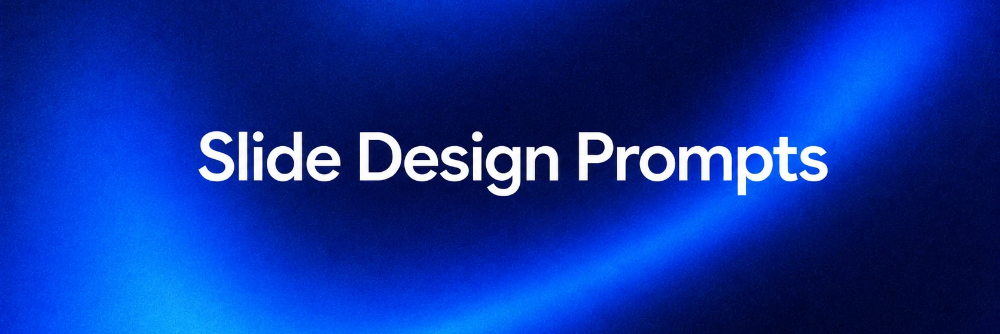

# Slide Design Prompts

Free presentation design systems you paste into ChatGPT or Claude.

[**Browse all prompts**](prompts/README.md) &nbsp;·&nbsp; [**Live site**](https://slidespeak.co/slide-design-prompts)

---

## What this is

AI chat tools write decent slide content. Design is where they fall apart: clip-art, clashing colors, bullet walls. A sharper prompt fixes that.

Each theme here is **one prompt** that carries a full design system: a color palette pinned to hex values, named Google Fonts, a layout grammar, and an avoid-list that stops the model from decorating. Paste it into ChatGPT or Claude, say what your talk covers, and every slide matches.

**128 themes** across **9 use-case categories** and **10 visual styles**.

## How to use

1. **Find a theme below** and open its page. Each has the full prompt, a palette, fonts, and slide previews.
2. **Copy the prompt** (or grab the theme's `PROMPT.md`) and paste it into a new ChatGPT or Claude chat. Answer the one question it asks, then generate and refine slide by slide.
3. **Or generate a finished deck with [SlideSpeak](https://app.slidespeak.co/presentation?utm_source=github&utm_medium=referral&utm_campaign=slide-design-prompts).** The same themes power SlideSpeak's generator, which exports to PowerPoint and Google Slides.

Every prompt pins colors and fonts as values you can edit. Swap the hex codes for your brand colors before you send it, and the layout rules still hold.

## What's in a theme

Each theme is a self-contained folder under [`prompts/`](prompts/README.md):

| File | What it holds |
| --- | --- |
| `README.md` | The theme page: preview thumbnails, the prompt, palette, fonts, and notes on what it's for. |
| `PROMPT.md` | Just the prompt, ready to paste into a chat. |
| `previews/*.webp` | Rendered previews of each example slide. |

## Gallery

Pick by what the deck is for. Click any theme for its full prompt, palette, fonts, and previews — or scan the [plain index](prompts/README.md).

### Pitch decks

Pitch deck designs for your next raise, from Midnight Pitch and Demo Day to the Sequoia, Airbnb and Uber pitch deck formats investors know.

<table>
  <tr>
    <td align="center" width="33%" valign="top">
       
      <a href="prompts/10-20-30-rule/"><b>10/20/30 Rule</b></a> 
      Ten slides, twenty minutes, thirty points 
      <i>Bold · Minimal</i>
    </td>
    <td align="center" width="33%" valign="top">
      <a href="prompts/airbnb-pitch-deck/">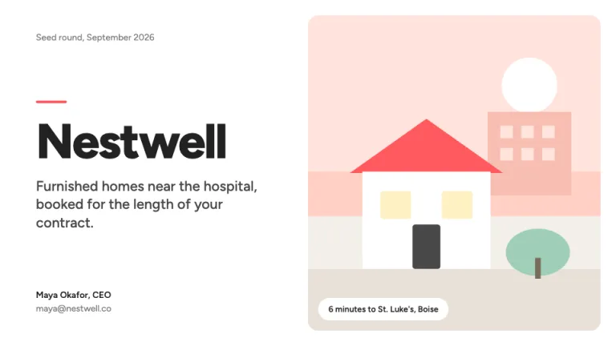</a> 
      <a href="prompts/airbnb-pitch-deck/"><b>Airbnb Pitch Deck</b></a> 
      The seed deck everyone copies, in coral 
      <i>Warm · Minimal</i>
    </td>
    <td align="center" width="33%" valign="top">
       
      <a href="prompts/aurora/"><b>Aurora</b></a> 
      Gradient pitch deck for SaaS 
      <i>Bold · Tech</i>
    </td>
  </tr>
  <tr>
    <td align="center" width="33%" valign="top">
      <a href="prompts/demo-day/">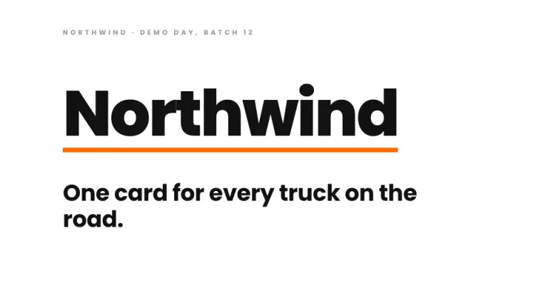</a> 
      <a href="prompts/demo-day/"><b>Demo Day</b></a> 
      Three minutes, one idea per slide 
      <i>Bold · Minimal</i>
    </td>
    <td align="center" width="33%" valign="top">
       
      <a href="prompts/hearth/"><b>Hearth</b></a> 
      Warm, story-led brand pitch 
      <i>Warm · Minimal</i>
    </td>
    <td align="center" width="33%" valign="top">
      <a href="prompts/holo/">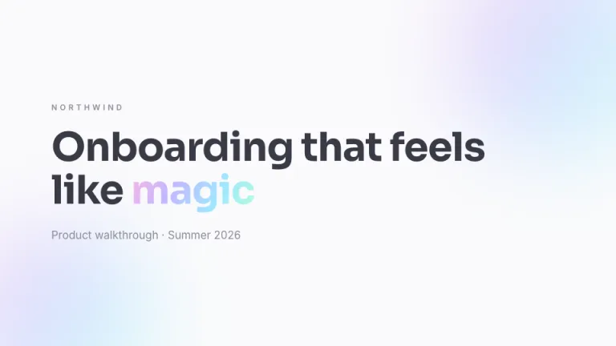</a> 
      <a href="prompts/holo/"><b>Holo</b></a> 
      Iridescent, but disciplined 
      <i>Playful · Calm</i>
    </td>
  </tr>
  <tr>
    <td align="center" width="33%" valign="top">
      <a href="prompts/keynote-minimal/">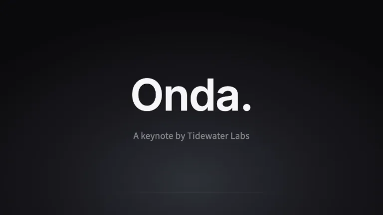</a> 
      <a href="prompts/keynote-minimal/"><b>Keynote Minimal</b></a> 
      One slide, one idea, zero clutter 
      <i>Minimal · Dark · Bold</i>
    </td>
    <td align="center" width="33%" valign="top">
      <a href="prompts/linkedin-pitch-deck/">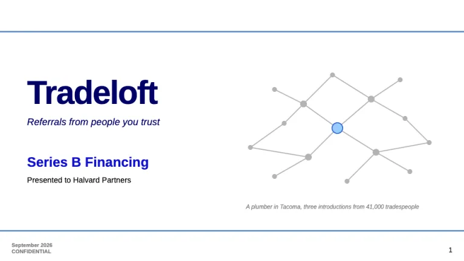</a> 
      <a href="prompts/linkedin-pitch-deck/"><b>LinkedIn Pitch Deck</b></a> 
      Reid Hoffman's 2004 Series B deck as a prompt 
      <i>Minimal · Corporate</i>
    </td>
    <td align="center" width="33%" valign="top">
      <a href="prompts/midnight-pitch/">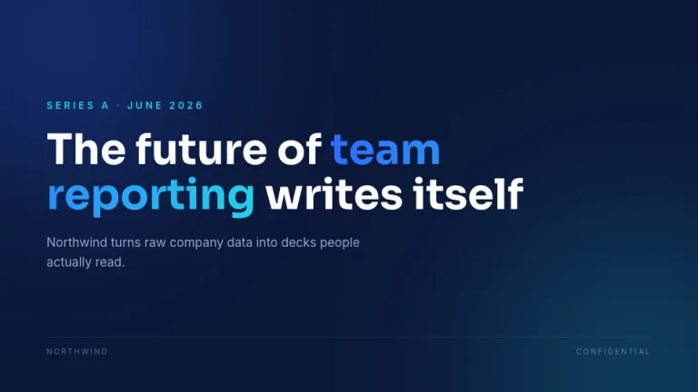</a> 
      <a href="prompts/midnight-pitch/"><b>Midnight Pitch</b></a> 
      Make investors lean in 
      <i>Dark · Bold</i>
    </td>
  </tr>
  <tr>
    <td align="center" width="33%" valign="top">
      <a href="prompts/monolith/">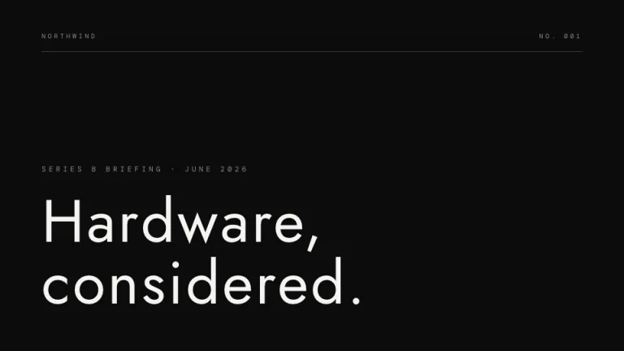</a> 
      <a href="prompts/monolith/"><b>Monolith</b></a> 
      Expensive silence 
      <i>Minimal · Dark</i>
    </td>
    <td align="center" width="33%" valign="top">
       
      <a href="prompts/runway/"><b>Runway</b></a> 
      Clean, light investor pitch deck 
      <i>Minimal · Corporate</i>
    </td>
    <td align="center" width="33%" valign="top">
      <a href="prompts/sequoia-pitch-deck/">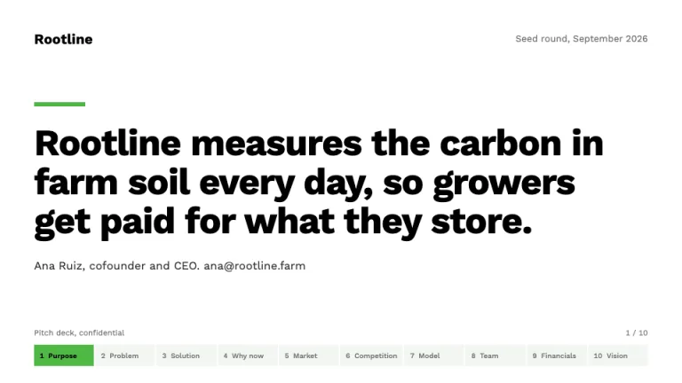</a> 
      <a href="prompts/sequoia-pitch-deck/"><b>Sequoia Pitch Deck</b></a> 
      Ten questions, in order, on every slide 
      <i>Minimal · Corporate</i>
    </td>
  </tr>
  <tr>
    <td align="center" width="33%" valign="top">
       
      <a href="prompts/spark/"><b>Spark</b></a> 
      Bold pink pitch for consumer apps 
      <i>Bold · Playful</i>
    </td>
    <td align="center" width="33%" valign="top">
       
      <a href="prompts/term-sheet/"><b>Term Sheet</b></a> 
      The institutional VC framework deck 
      <i>Corporate · Minimal</i>
    </td>
    <td align="center" width="33%" valign="top">
       
      <a href="prompts/traction/"><b>Traction</b></a> 
      Let the numbers pitch 
      <i>Minimal · Tech</i>
    </td>
  </tr>
  <tr>
    <td align="center" width="33%" valign="top">
       
      <a href="prompts/uber-pitch-deck/"><b>Uber Pitch Deck</b></a> 
      Black and white, pickup to drop-off 
      <i>Bold · Minimal</i>
    </td>
  </tr>
</table>

### Business & strategy

Business presentation designs for QBRs, OKR reviews, strategy decks and all-hands, plus the Netflix culture deck and Amazon six-pager formats.

<table>
  <tr>
    <td align="center" width="33%" valign="top">
      <a href="prompts/atlas/">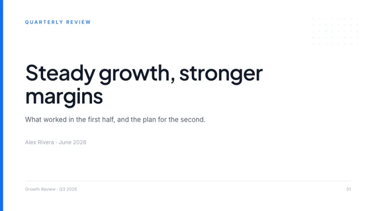</a> 
      <a href="prompts/atlas/"><b>Atlas</b></a> 
      The dependable one 
      <i>Corporate · Minimal</i>
    </td>
    <td align="center" width="33%" valign="top">
      <a href="prompts/atlassian-style/">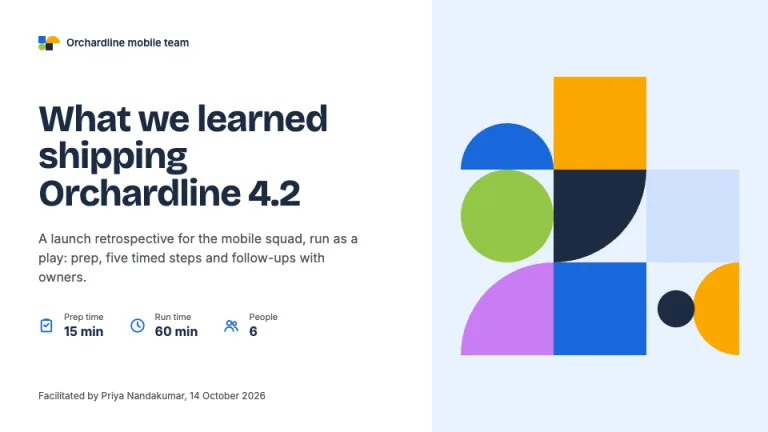</a> 
      <a href="prompts/atlassian-style/"><b>Atlassian Style</b></a> 
      Run the meeting like a play 
      <i>Playful · Corporate</i>
    </td>
    <td align="center" width="33%" valign="top">
      <a href="prompts/benchmark/">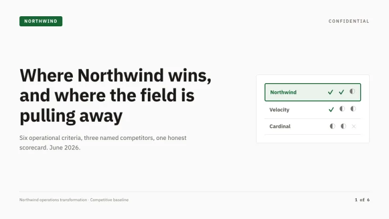</a> 
      <a href="prompts/benchmark/"><b>Benchmark</b></a> 
      Us versus the field 
      <i>Corporate · Minimal</i>
    </td>
  </tr>
  <tr>
    <td align="center" width="33%" valign="top">
      <a href="prompts/boardroom/">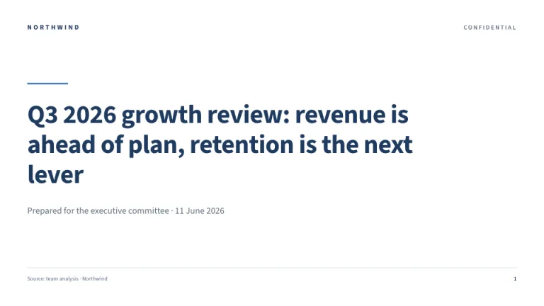</a> 
      <a href="prompts/boardroom/"><b>Boardroom</b></a> 
      The slide is the argument 
      <i>Corporate · Minimal</i>
    </td>
    <td align="center" width="33%" valign="top">
       
      <a href="prompts/business-model-canvas/"><b>Business Model Canvas</b></a> 
      Nine blocks, one sticky color per segment 
      <i>Minimal · Playful</i>
    </td>
    <td align="center" width="33%" valign="top">
      <a href="prompts/chevron/">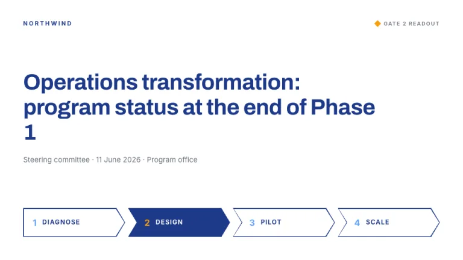</a> 
      <a href="prompts/chevron/"><b>Chevron</b></a> 
      Four phases, one direction 
      <i>Corporate · Bold</i>
    </td>
  </tr>
  <tr>
    <td align="center" width="33%" valign="top">
      <a href="prompts/harvey/">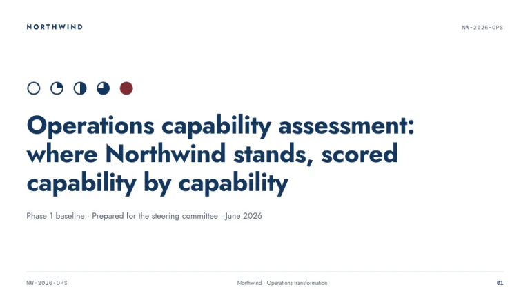</a> 
      <a href="prompts/harvey/"><b>Harvey</b></a> 
      Maturity in quarter turns 
      <i>Corporate · Minimal</i>
    </td>
    <td align="center" width="33%" valign="top">
       
      <a href="prompts/internet-trends/"><b>Internet Trends</b></a> 
      Subject = takeaway titles over sourced charts 
      <i>Minimal · Tech</i>
    </td>
    <td align="center" width="33%" valign="top">
      <a href="prompts/memo/">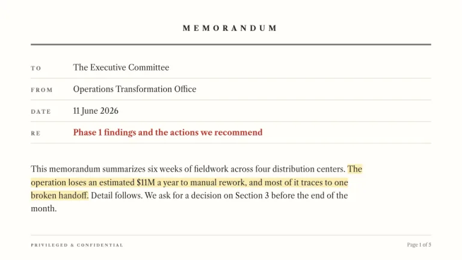</a> 
      <a href="prompts/memo/"><b>Memo</b></a> 
      Per my last memo 
      <i>Minimal · Corporate</i>
    </td>
  </tr>
  <tr>
    <td align="center" width="33%" valign="top">
      <a href="prompts/metro/">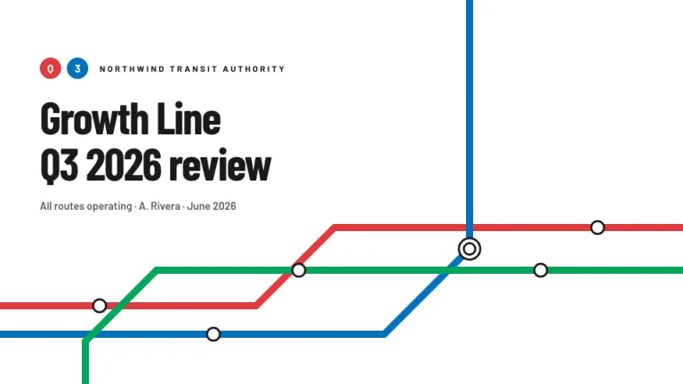</a> 
      <a href="prompts/metro/"><b>Metro</b></a> 
      Mind the gap analysis 
      <i>Playful · Minimal</i>
    </td>
    <td align="center" width="33%" valign="top">
      <a href="prompts/netflix-culture-deck/">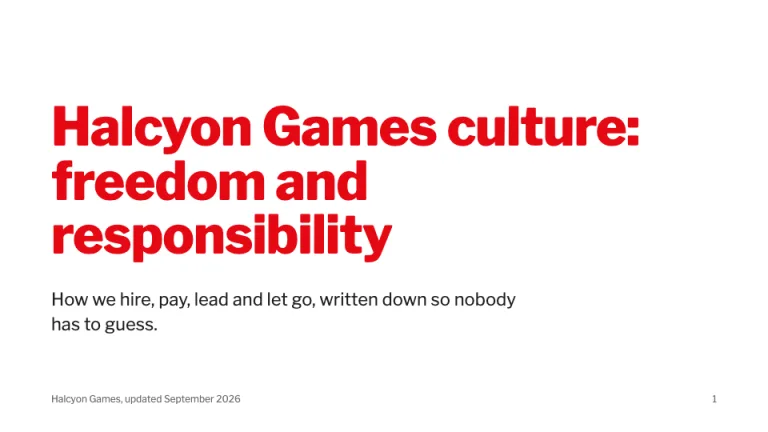</a> 
      <a href="prompts/netflix-culture-deck/"><b>Netflix Culture Deck</b></a> 
      Freedom, responsibility and nothing else on the slide 
      <i>Minimal · Bold</i>
    </td>
    <td align="center" width="33%" valign="top">
       
      <a href="prompts/okr-deck/"><b>OKR Deck</b></a> 
      Every key result, graded from 0.0 to 1.0 
      <i>Minimal · Corporate</i>
    </td>
  </tr>
  <tr>
    <td align="center" width="33%" valign="top">
      <a href="prompts/operator/">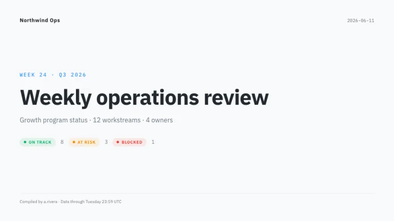</a> 
      <a href="prompts/operator/"><b>Operator</b></a> 
      Status, not stories 
      <i>Corporate · Tech</i>
    </td>
    <td align="center" width="33%" valign="top">
      <a href="prompts/qbr/">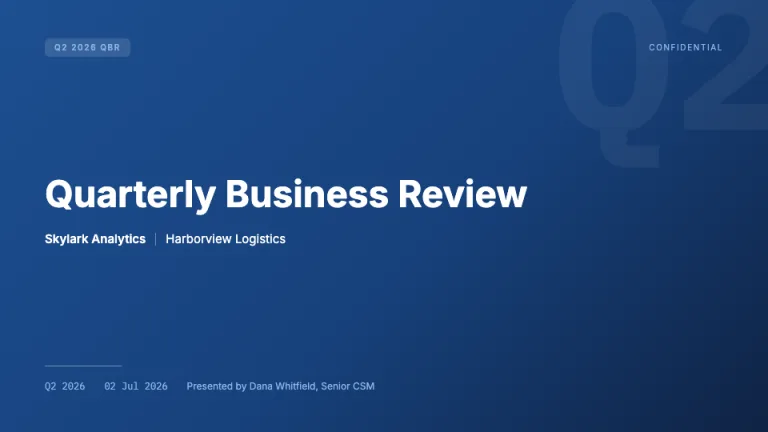</a> 
      <a href="prompts/qbr/"><b>QBR</b></a> 
      Targets, actuals, and the renewal story 
      <i>Corporate · Minimal</i>
    </td>
    <td align="center" width="33%" valign="top">
      <a href="prompts/six-pager/">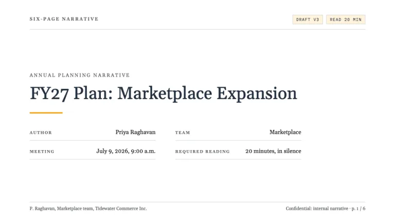</a> 
      <a href="prompts/six-pager/"><b>Six-Pager</b></a> 
      The memo that runs the meeting 
      <i>Minimal · Corporate</i>
    </td>
  </tr>
  <tr>
    <td align="center" width="33%" valign="top">
      <a href="prompts/whiteboard/">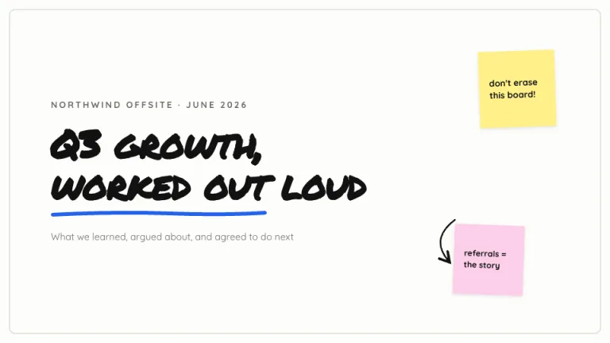</a> 
      <a href="prompts/whiteboard/"><b>Whiteboard</b></a> 
      Fresh from the workshop 
      <i>Playful · Warm</i>
    </td>
  </tr>
</table>

### Consulting

Unofficial homages to the deck styles of McKinsey, BCG, Accenture, KPMG and more firms, plus magic quadrant and Forrester Wave slides.

<table>
  <tr>
    <td align="center" width="33%" valign="top">
      <a href="prompts/accenture-style/">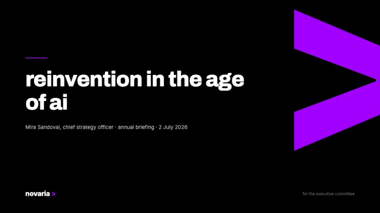</a> 
      <a href="prompts/accenture-style/"><b>Accenture Style</b></a> 
      Purple, black, and greater than 
      <i>Corporate · Bold</i>
    </td>
    <td align="center" width="33%" valign="top">
      <a href="prompts/alvarez-marsal-style/">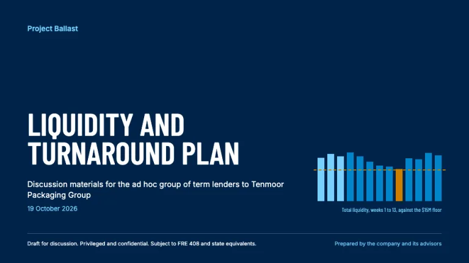</a> 
      <a href="prompts/alvarez-marsal-style/"><b>Alvarez & Marsal Style</b></a> 
      13-week cash flow and liquidity slides in navy and amber 
      <i>Corporate · Bold</i>
    </td>
    <td align="center" width="33%" valign="top">
       
      <a href="prompts/arthur-d-little-style/"><b>Arthur D. Little Style</b></a> 
      Technology strategy on a radar, in indigo and cyan 
      <i>Corporate · Elegant</i>
    </td>
  </tr>
  <tr>
    <td align="center" width="33%" valign="top">
      <a href="prompts/bain-style/">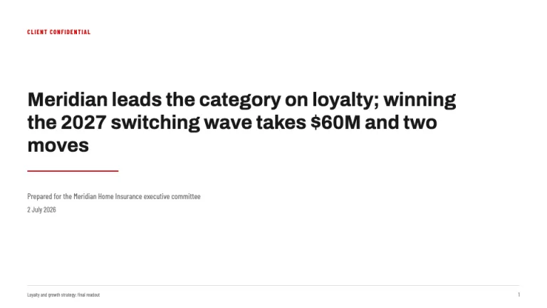</a> 
      <a href="prompts/bain-style/"><b>Bain Style</b></a> 
      Answer first, red where it counts 
      <i>Corporate · Bold</i>
    </td>
    <td align="center" width="33%" valign="top">
      <a href="prompts/bcg-style/">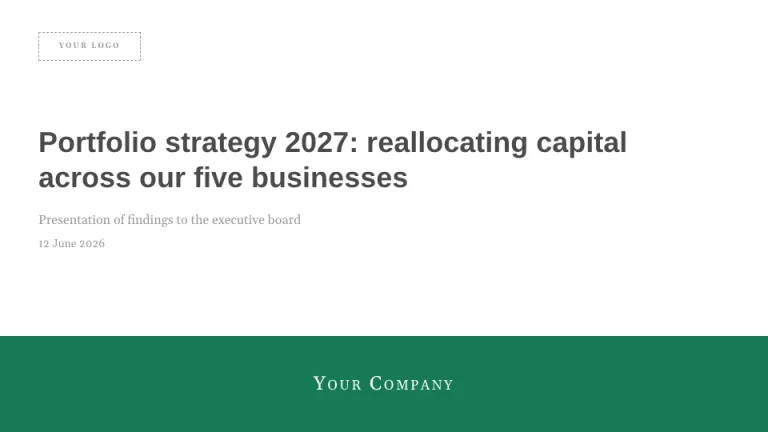</a> 
      <a href="prompts/bcg-style/"><b>BCG Style</b></a> 
      Strategy lives in a 2x2 
      <i>Corporate · Bold</i>
    </td>
    <td align="center" width="33%" valign="top">
       
      <a href="prompts/booz-allen-style/"><b>Booz Allen Style</b></a> 
      Federal program briefings with fiscal-year timelines 
      <i>Corporate · Minimal</i>
    </td>
  </tr>
  <tr>
    <td align="center" width="33%" valign="top">
       
      <a href="prompts/capgemini-style/"><b>Capgemini Style</b></a> 
      Maturity grids and roadmaps in two blues 
      <i>Corporate · Bold</i>
    </td>
    <td align="center" width="33%" valign="top">
      <a href="prompts/deloitte-style/">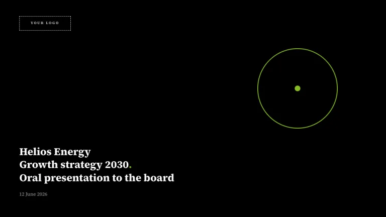</a> 
      <a href="prompts/deloitte-style/"><b>Deloitte Style</b></a> 
      Black, white and one green dot 
      <i>Corporate · Bold</i>
    </td>
    <td align="center" width="33%" valign="top">
      <a href="prompts/ey-style/">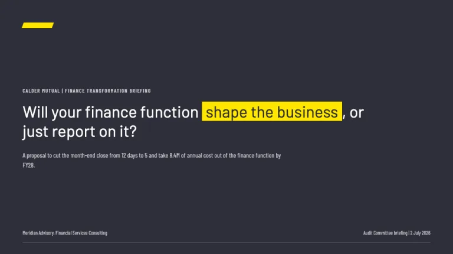</a> 
      <a href="prompts/ey-style/"><b>EY Style</b></a> 
      Dark slate, one decisive yellow beam 
      <i>Corporate · Dark · Bold</i>
    </td>
  </tr>
  <tr>
    <td align="center" width="33%" valign="top">
       
      <a href="prompts/forrester-style/"><b>Forrester Style</b></a> 
      Vendor rankings in green wave bands 
      <i>Corporate · Tech</i>
    </td>
    <td align="center" width="33%" valign="top">
      <a href="prompts/gartner-style/">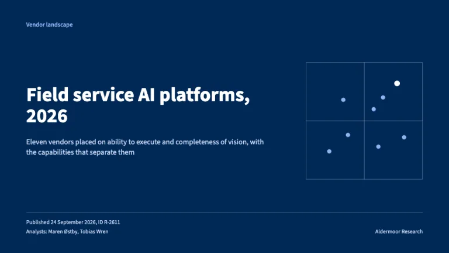</a> 
      <a href="prompts/gartner-style/"><b>Gartner Style</b></a> 
      Research note grammar, quadrant and curve included 
      <i>Corporate · Tech</i>
    </td>
    <td align="center" width="33%" valign="top">
      <a href="prompts/kearney-style/">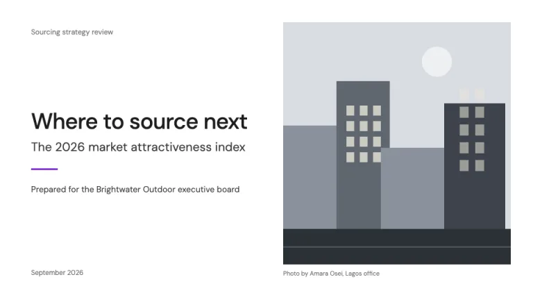</a> 
      <a href="prompts/kearney-style/"><b>Kearney Style</b></a> 
      White, slate and one purple row 
      <i>Corporate · Minimal</i>
    </td>
  </tr>
  <tr>
    <td align="center" width="33%" valign="top">
      <a href="prompts/kpmg-style/">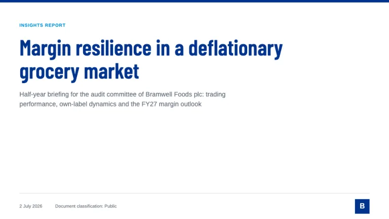</a> 
      <a href="prompts/kpmg-style/"><b>KPMG Style</b></a> 
      Audit-grade clarity in KPMG blue 
      <i>Corporate · Minimal</i>
    </td>
    <td align="center" width="33%" valign="top">
      <a href="prompts/lek-style/">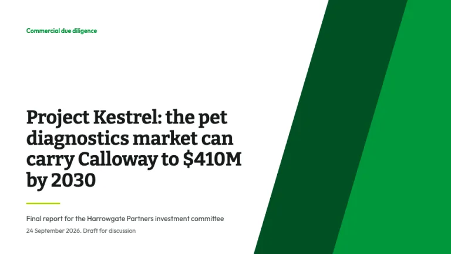</a> 
      <a href="prompts/lek-style/"><b>L.E.K. Style</b></a> 
      Diligence answers, cut like an arrow 
      <i>Corporate · Minimal</i>
    </td>
    <td align="center" width="33%" valign="top">
      <a href="prompts/mckinsey-style/">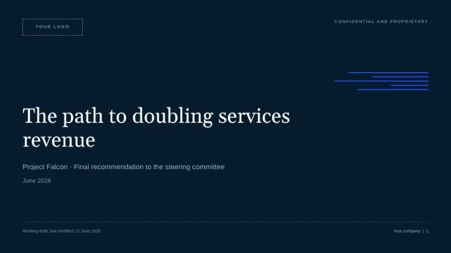</a> 
      <a href="prompts/mckinsey-style/"><b>McKinsey Style</b></a> 
      Answer first, always 
      <i>Corporate · Minimal</i>
    </td>
  </tr>
  <tr>
    <td align="center" width="33%" valign="top">
      <a href="prompts/oliver-wyman-style/">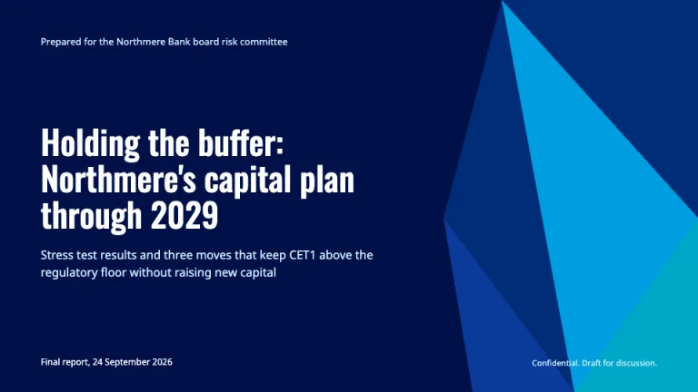</a> 
      <a href="prompts/oliver-wyman-style/"><b>Oliver Wyman Style</b></a> 
      Action title on top, the so-what in a bumper below 
      <i>Corporate · Bold</i>
    </td>
    <td align="center" width="33%" valign="top">
      <a href="prompts/pwc-style/">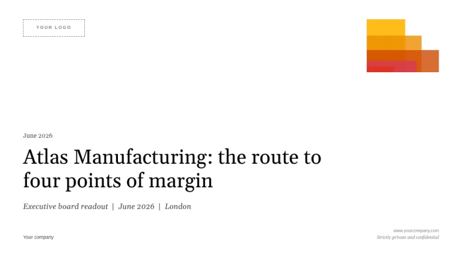</a> 
      <a href="prompts/pwc-style/"><b>PwC Style</b></a> 
      Serif headlines, five warm colors 
      <i>Corporate · Warm</i>
    </td>
    <td align="center" width="33%" valign="top">
      <a href="prompts/roland-berger-style/">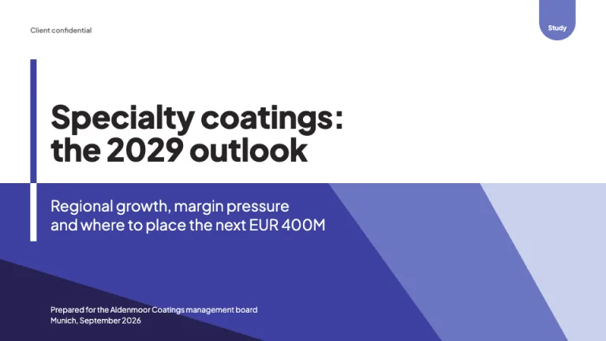</a> 
      <a href="prompts/roland-berger-style/"><b>Roland Berger Style</b></a> 
      One indigo ramp, lettered exhibits 
      <i>Corporate · Elegant</i>
    </td>
  </tr>
</table>

### Marketing & brand

Bold designs for campaign plans, brand decks and creative reviews, from Memphis and Billboard to a brand guidelines deck with logo clear space.

<table>
  <tr>
    <td align="center" width="33%" valign="top">
      <a href="prompts/billboard/">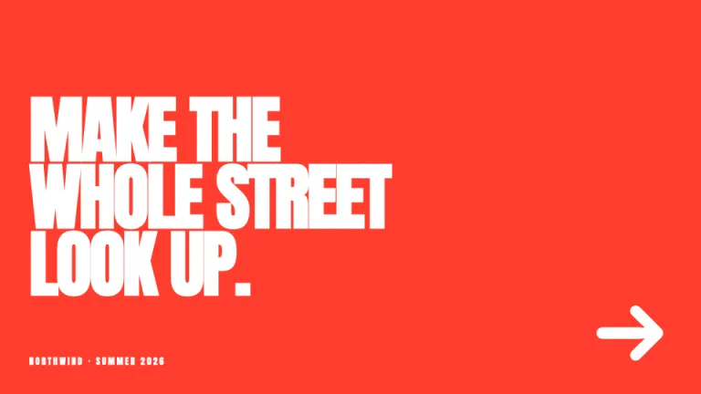</a> 
      <a href="prompts/billboard/"><b>Billboard</b></a> 
      One color, one line 
      <i>Bold · Playful</i>
    </td>
    <td align="center" width="33%" valign="top">
      <a href="prompts/brand-guidelines/">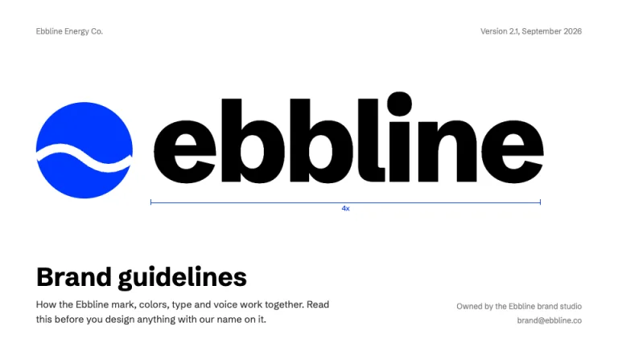</a> 
      <a href="prompts/brand-guidelines/"><b>Brand Guidelines</b></a> 
      Brand rules, drawn to scale 
      <i>Minimal · Bold</i>
    </td>
    <td align="center" width="33%" valign="top">
      <a href="prompts/bubblegum/">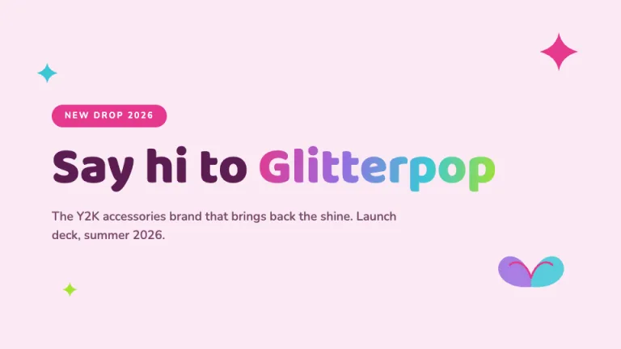</a> 
      <a href="prompts/bubblegum/"><b>Bubblegum</b></a> 
      Y2K sparkle with a system 
      <i>Playful · Bold</i>
    </td>
  </tr>
  <tr>
    <td align="center" width="33%" valign="top">
      <a href="prompts/memphis/">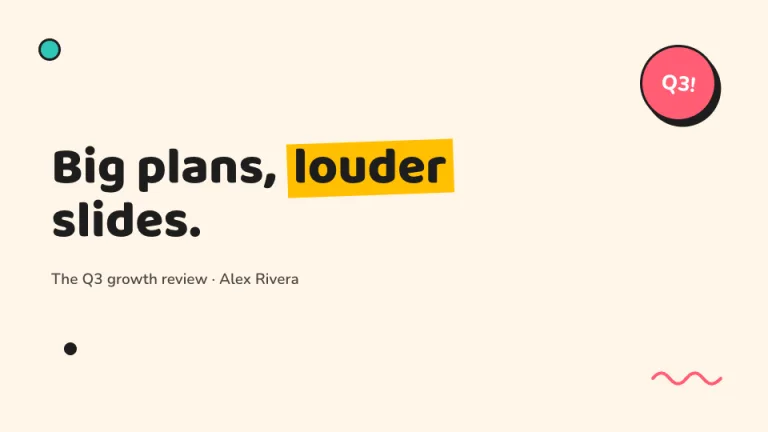</a> 
      <a href="prompts/memphis/"><b>Memphis</b></a> 
      Serious work, unserious style 
      <i>Playful · Bold · Retro</i>
    </td>
    <td align="center" width="33%" valign="top">
      <a href="prompts/outrun/">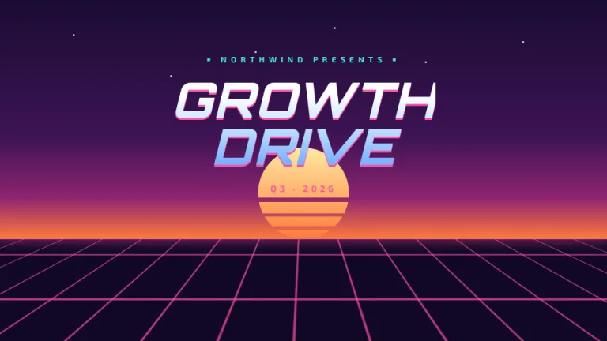</a> 
      <a href="prompts/outrun/"><b>Outrun</b></a> 
      Straight out of 1986 
      <i>Playful · Dark · Retro</i>
    </td>
    <td align="center" width="33%" valign="top">
      <a href="prompts/polaroid/">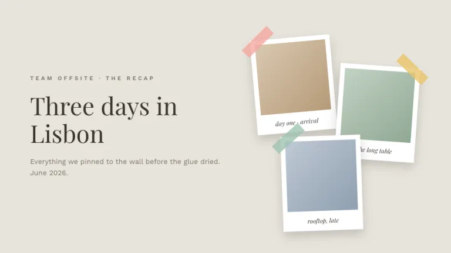</a> 
      <a href="prompts/polaroid/"><b>Polaroid</b></a> 
      Pinned to the wall 
      <i>Warm · Playful · Retro</i>
    </td>
  </tr>
  <tr>
    <td align="center" width="33%" valign="top">
       
      <a href="prompts/sorbet/"><b>Sorbet</b></a> 
      Soft pastels, kept tasteful 
      <i>Playful · Calm</i>
    </td>
  </tr>
</table>

### Tech & product

Tech and product presentation designs for launches, roadmaps and engineering reviews, including a16z, Stripe, Notion and Linear style decks.

<table>
  <tr>
    <td align="center" width="33%" valign="top">
       
      <a href="prompts/a16z-style/"><b>a16z Style</b></a> 
      Pastel takeaway panels beside footnoted charts 
      <i>Tech · Bold</i>
    </td>
    <td align="center" width="33%" valign="top">
      <a href="prompts/arcade/">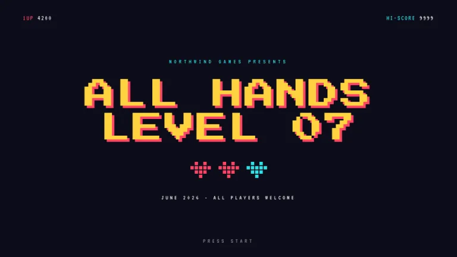</a> 
      <a href="prompts/arcade/"><b>Arcade</b></a> 
      Insert coin 
      <i>Playful · Dark · Retro</i>
    </td>
    <td align="center" width="33%" valign="top">
      <a href="prompts/bento/">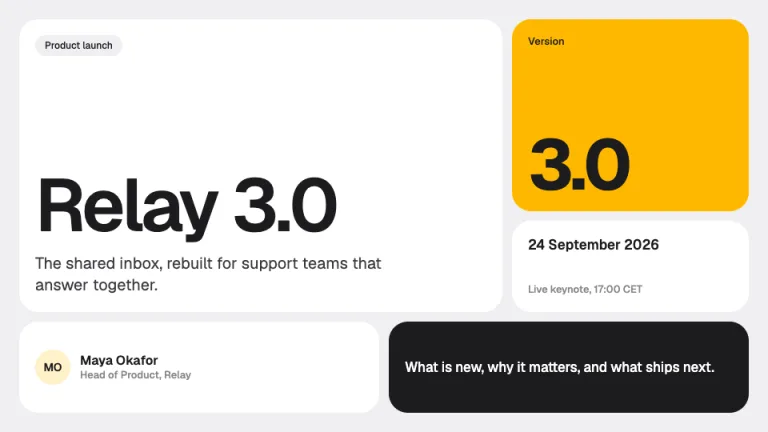</a> 
      <a href="prompts/bento/"><b>Bento</b></a> 
      Big tiles for big news 
      <i>Minimal · Tech</i>
    </td>
  </tr>
  <tr>
    <td align="center" width="33%" valign="top">
      <a href="prompts/circuit/">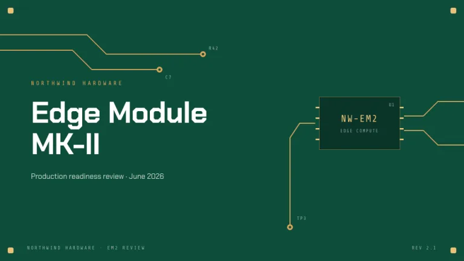</a> 
      <a href="prompts/circuit/"><b>Circuit</b></a> 
      Follow the traces 
      <i>Tech · Dark</i>
    </td>
    <td align="center" width="33%" valign="top">
      <a href="prompts/drafting-room/">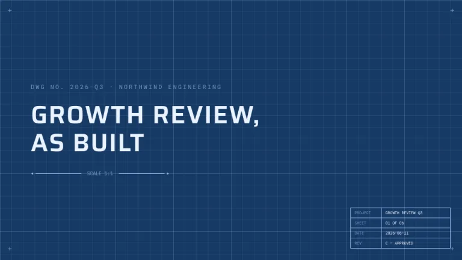</a> 
      <a href="prompts/drafting-room/"><b>Drafting Room</b></a> 
      Measure twice, present once 
      <i>Tech · Minimal</i>
    </td>
    <td align="center" width="33%" valign="top">
      <a href="prompts/fluent-style/">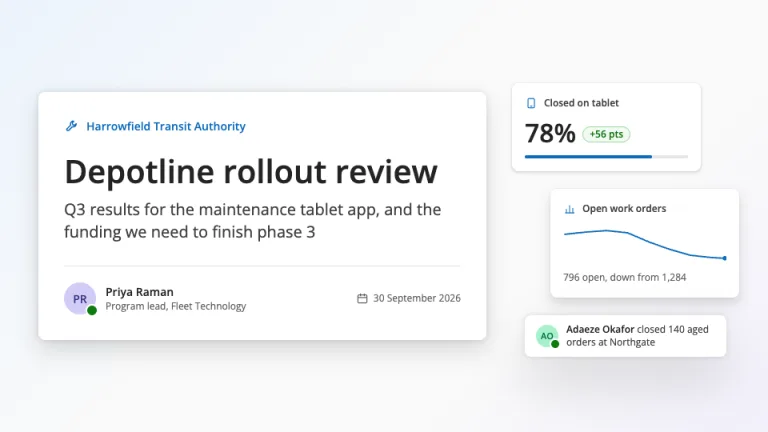</a> 
      <a href="prompts/fluent-style/"><b>Fluent Style</b></a> 
      Layered surfaces and Microsoft 365 data cards 
      <i>Calm · Minimal</i>
    </td>
  </tr>
  <tr>
    <td align="center" width="33%" valign="top">
      <a href="prompts/ibm-style/">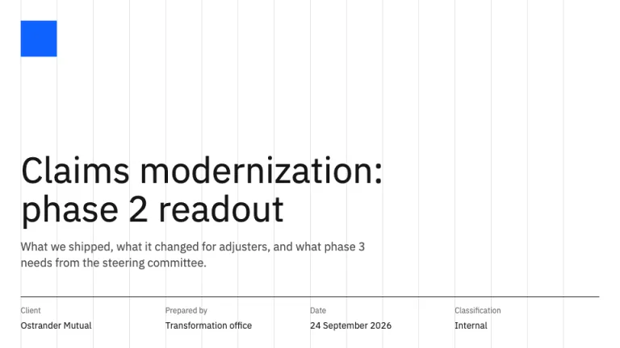</a> 
      <a href="prompts/ibm-style/"><b>IBM Style</b></a> 
      The Carbon design system, set as slides 
      <i>Corporate · Tech</i>
    </td>
    <td align="center" width="33%" valign="top">
       
      <a href="prompts/linear-style/"><b>Linear Style</b></a> 
      Your deck as a cycle view 
      <i>Dark · Minimal</i>
    </td>
    <td align="center" width="33%" valign="top">
      <a href="prompts/mainframe/">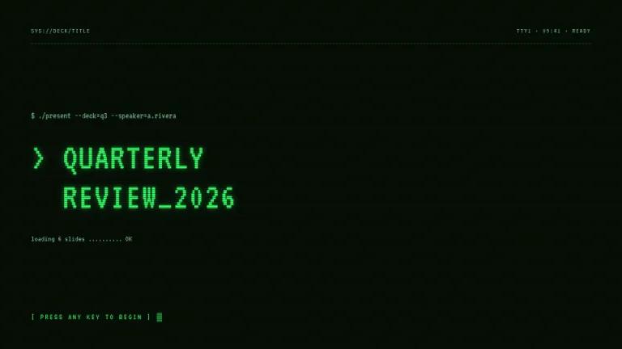</a> 
      <a href="prompts/mainframe/"><b>Mainframe</b></a> 
      Straight from the machine room 
      <i>Tech · Dark · Retro</i>
    </td>
  </tr>
  <tr>
    <td align="center" width="33%" valign="top">
      <a href="prompts/material-style/">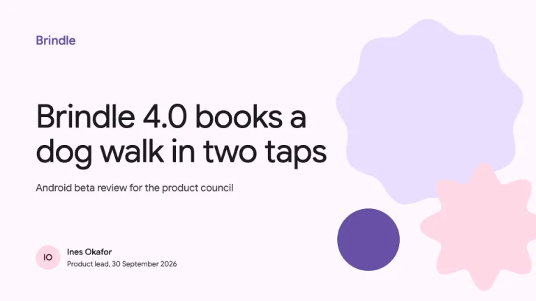</a> 
      <a href="prompts/material-style/"><b>Material Style</b></a> 
      Tonal surfaces and expressive shapes from one seed color 
      <i>Playful · Calm</i>
    </td>
    <td align="center" width="33%" valign="top">
      <a href="prompts/notion-style/">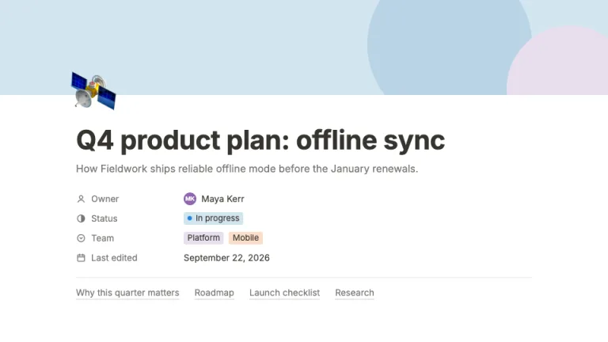</a> 
      <a href="prompts/notion-style/"><b>Notion Style</b></a> 
      Your deck, written like a doc 
      <i>Minimal · Calm</i>
    </td>
    <td align="center" width="33%" valign="top">
      <a href="prompts/stripe-style/">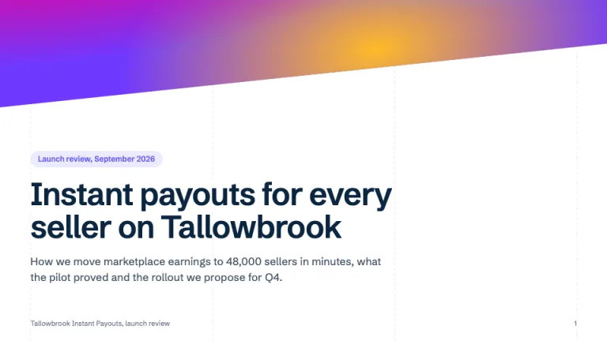</a> 
      <a href="prompts/stripe-style/"><b>Stripe Style</b></a> 
      Blurple, navy and one bright slant 
      <i>Bold · Tech</i>
    </td>
  </tr>
  <tr>
    <td align="center" width="33%" valign="top">
      <a href="prompts/telemetry/">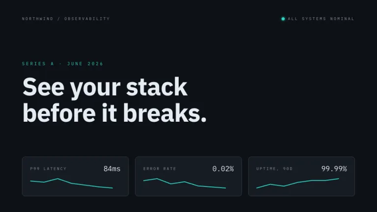</a> 
      <a href="prompts/telemetry/"><b>Telemetry</b></a> 
      Your deck as a dashboard 
      <i>Tech · Dark</i>
    </td>
    <td align="center" width="33%" valign="top">
      <a href="prompts/wireframe/">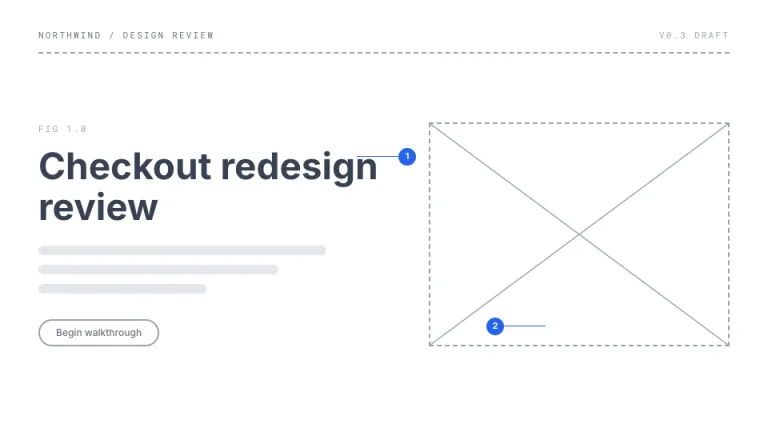</a> 
      <a href="prompts/wireframe/"><b>Wireframe</b></a> 
      Shipped before the visual design 
      <i>Minimal · Tech</i>
    </td>
  </tr>
</table>

### Creative & portfolio

Typography-first designs for portfolios, film pitches and lookbooks, from Basel's Swiss grid and Bauhaus geometry to art deco and Y2K.

<table>
  <tr>
    <td align="center" width="33%" valign="top">
      <a href="prompts/art-deco/">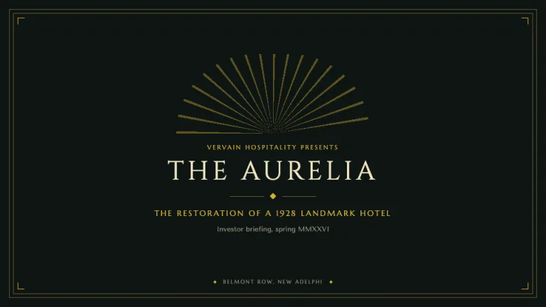</a> 
      <a href="prompts/art-deco/"><b>Art Deco</b></a> 
      Gold geometry for the modern jazz age 
      <i>Elegant · Bold · Retro</i>
    </td>
    <td align="center" width="33%" valign="top">
       
      <a href="prompts/atelier/"><b>Atelier</b></a> 
      Built like a blueprint 
      <i>Minimal · Elegant</i>
    </td>
    <td align="center" width="33%" valign="top">
      <a href="prompts/basel/">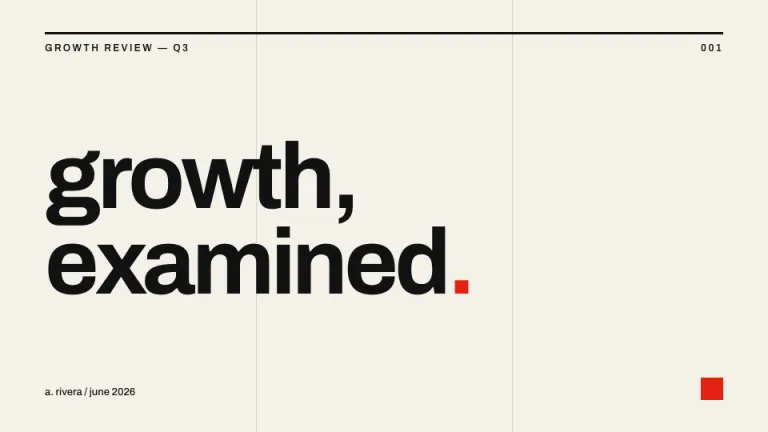</a> 
      <a href="prompts/basel/"><b>Basel</b></a> 
      Loud type, nothing else 
      <i>Bold · Minimal</i>
    </td>
  </tr>
  <tr>
    <td align="center" width="33%" valign="top">
      <a href="prompts/bauhaus/">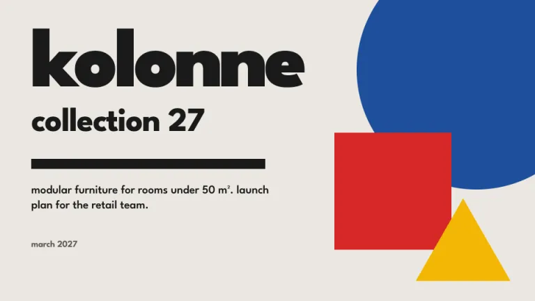</a> 
      <a href="prompts/bauhaus/"><b>Bauhaus</b></a> 
      Circle, square, triangle, and nothing else 
      <i>Bold · Retro</i>
    </td>
    <td align="center" width="33%" valign="top">
      <a href="prompts/cinema/">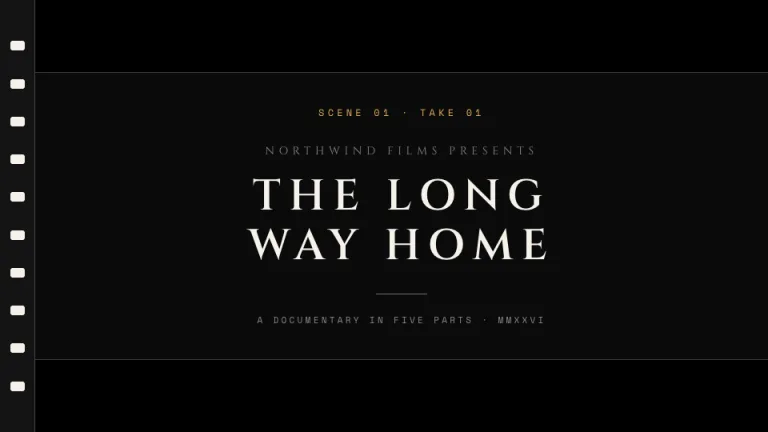</a> 
      <a href="prompts/cinema/"><b>Cinema</b></a> 
      Quiet on set 
      <i>Elegant · Dark</i>
    </td>
    <td align="center" width="33%" valign="top">
      <a href="prompts/collage/">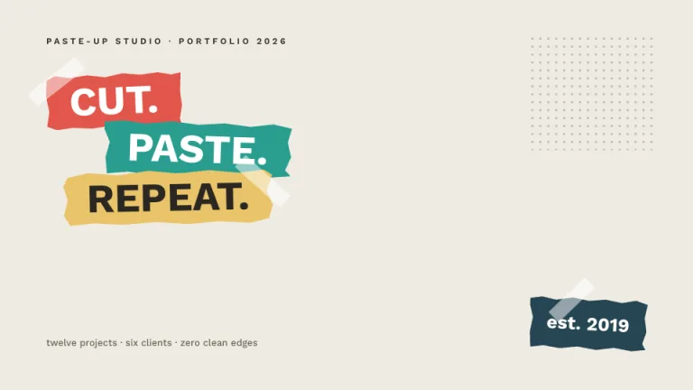</a> 
      <a href="prompts/collage/"><b>Collage</b></a> 
      Scissors first, layout second 
      <i>Playful · Warm</i>
    </td>
  </tr>
  <tr>
    <td align="center" width="33%" valign="top">
      <a href="prompts/coquette/">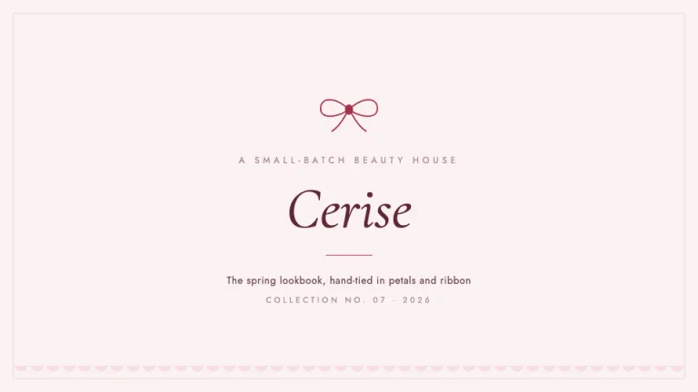</a> 
      <a href="prompts/coquette/"><b>Coquette</b></a> 
      Ribbons, blush and a cherry kiss 
      <i>Elegant · Playful</i>
    </td>
    <td align="center" width="33%" valign="top">
      <a href="prompts/dark-academia/">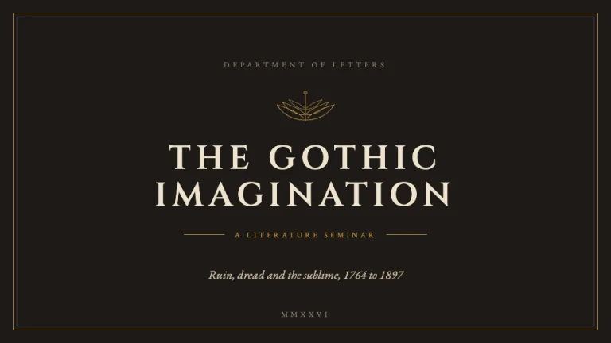</a> 
      <a href="prompts/dark-academia/"><b>Dark Academia</b></a> 
      Candlelit library, rare-books society 
      <i>Elegant · Dark</i>
    </td>
    <td align="center" width="33%" valign="top">
       
      <a href="prompts/logline/"><b>Logline</b></a> 
      The pitch in one page 
      <i>Minimal · Elegant</i>
    </td>
  </tr>
  <tr>
    <td align="center" width="33%" valign="top">
       
      <a href="prompts/lookbook/"><b>Lookbook</b></a> 
      Mood, tone and frame 
      <i>Elegant · Dark</i>
    </td>
    <td align="center" width="33%" valign="top">
      <a href="prompts/manuscript/">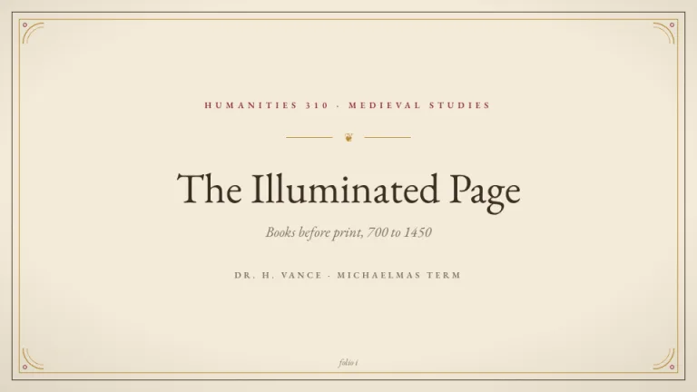</a> 
      <a href="prompts/manuscript/"><b>Manuscript</b></a> 
      Slides before print 
      <i>Elegant · Warm</i>
    </td>
    <td align="center" width="33%" valign="top">
      <a href="prompts/marquee/">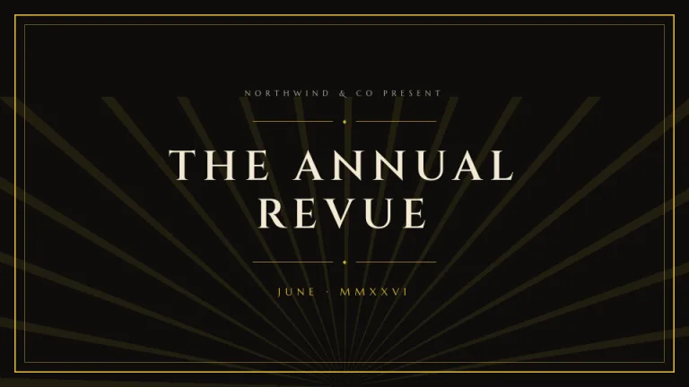</a> 
      <a href="prompts/marquee/"><b>Marquee</b></a> 
      Make it an occasion 
      <i>Elegant · Dark</i>
    </td>
  </tr>
  <tr>
    <td align="center" width="33%" valign="top">
      <a href="prompts/oat/">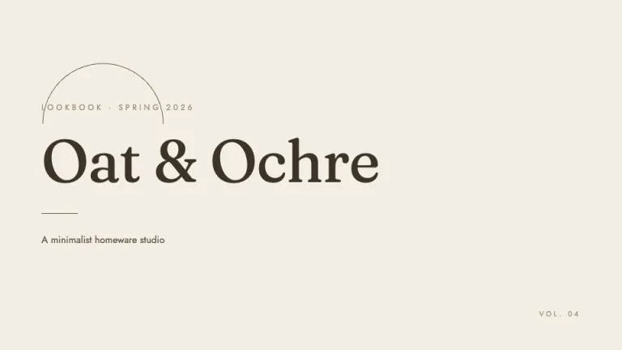</a> 
      <a href="prompts/oat/"><b>Oat</b></a> 
      Warm neutrals, quiet arches, expensive calm 
      <i>Minimal · Calm</i>
    </td>
    <td align="center" width="33%" valign="top">
       
      <a href="prompts/one-sheet/"><b>One Sheet</b></a> 
      Top of the billing 
      <i>Bold · Dark</i>
    </td>
    <td align="center" width="33%" valign="top">
      <a href="prompts/origami/">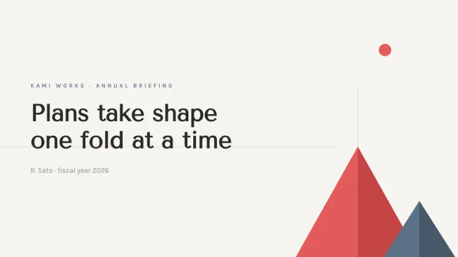</a> 
      <a href="prompts/origami/"><b>Origami</b></a> 
      Folded, not decorated 
      <i>Minimal · Calm</i>
    </td>
  </tr>
  <tr>
    <td align="center" width="33%" valign="top">
       
      <a href="prompts/passepartout/"><b>Passepartout</b></a> 
      A gallery on every slide 
      <i>Elegant · Calm</i>
    </td>
    <td align="center" width="33%" valign="top">
      <a href="prompts/scrapbook/">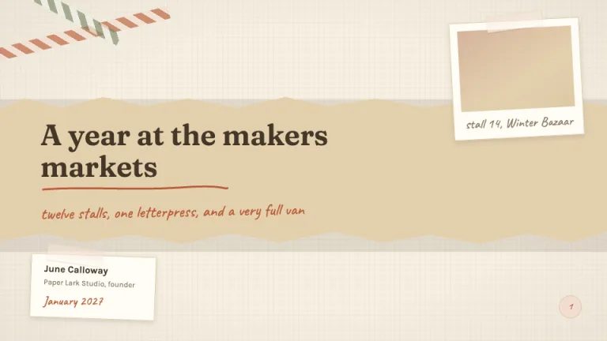</a> 
      <a href="prompts/scrapbook/"><b>Scrapbook</b></a> 
      Paper, tape, and handwritten charm 
      <i>Playful · Warm</i>
    </td>
    <td align="center" width="33%" valign="top">
      <a href="prompts/y2k/">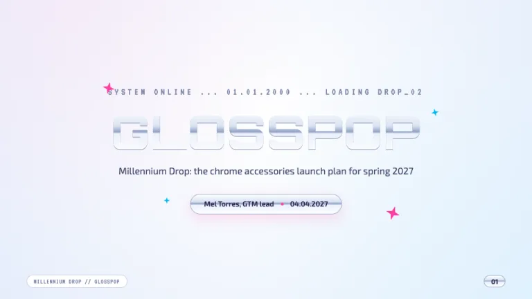</a> 
      <a href="prompts/y2k/"><b>Y2K</b></a> 
      Chrome dreams from the year 2000 
      <i>Playful · Bold · Retro</i>
    </td>
  </tr>
</table>

### Education & research

Classroom and academic presentation designs, from TED-style talks and lesson plans to thesis defense, journal club and grand rounds slides.

<table>
  <tr>
    <td align="center" width="33%" valign="top">
      <a href="prompts/atrium/">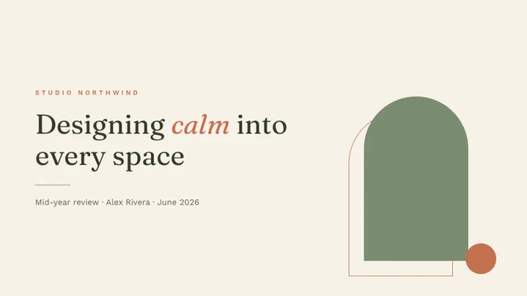</a> 
      <a href="prompts/atrium/"><b>Atrium</b></a> 
      Calm, like a courtyard 
      <i>Calm · Warm</i>
    </td>
    <td align="center" width="33%" valign="top">
      <a href="prompts/chalkboard/">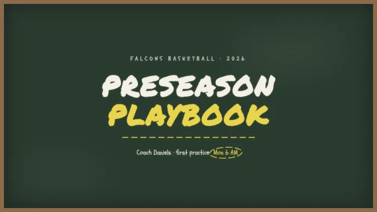</a> 
      <a href="prompts/chalkboard/"><b>Chalkboard</b></a> 
      Drawn up at halftime 
      <i>Playful · Dark</i>
    </td>
    <td align="center" width="33%" valign="top">
      <a href="prompts/expedition/">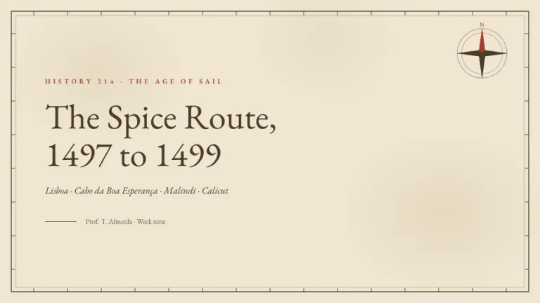</a> 
      <a href="prompts/expedition/"><b>Expedition</b></a> 
      Here be agenda items 
      <i>Warm · Elegant</i>
    </td>
  </tr>
  <tr>
    <td align="center" width="33%" valign="top">
      <a href="prompts/field-notes/">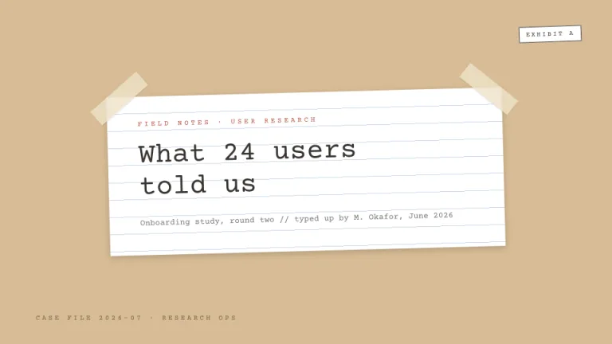</a> 
      <a href="prompts/field-notes/"><b>Field Notes</b></a> 
      Taped to the folder 
      <i>Warm · Minimal</i>
    </td>
    <td align="center" width="33%" valign="top">
      <a href="prompts/grand-rounds/">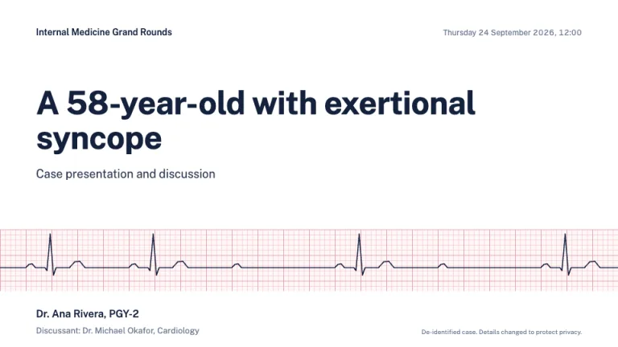</a> 
      <a href="prompts/grand-rounds/"><b>Grand Rounds</b></a> 
      Red means abnormal, nothing else 
      <i>Calm · Corporate</i>
    </td>
    <td align="center" width="33%" valign="top">
      <a href="prompts/harvard-style/">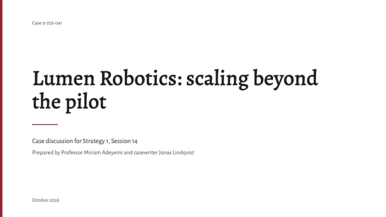</a> 
      <a href="prompts/harvard-style/"><b>Harvard Style</b></a> 
      The case method, one exhibit at a time 
      <i>Elegant · Corporate</i>
    </td>
  </tr>
  <tr>
    <td align="center" width="33%" valign="top">
      <a href="prompts/herbarium/">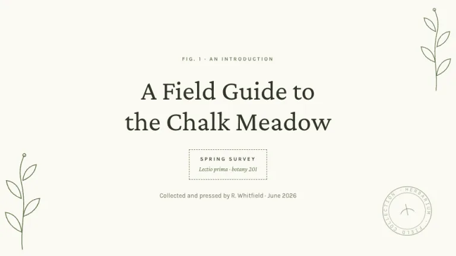</a> 
      <a href="prompts/herbarium/"><b>Herbarium</b></a> 
      Pressed, labeled, filed 
      <i>Calm · Elegant</i>
    </td>
    <td align="center" width="33%" valign="top">
      <a href="prompts/lesson-plan/">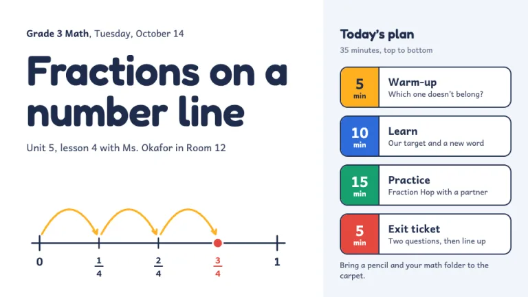</a> 
      <a href="prompts/lesson-plan/"><b>Lesson Plan</b></a> 
      Warm-up, target, timer, exit ticket 
      <i>Playful · Warm</i>
    </td>
    <td align="center" width="33%" valign="top">
      <a href="prompts/level-up/">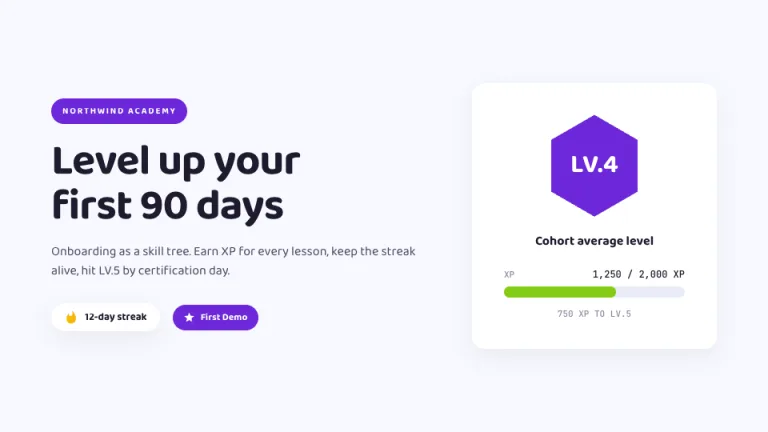</a> 
      <a href="prompts/level-up/"><b>Level Up</b></a> 
      Earn the XP 
      <i>Playful · Tech</i>
    </td>
  </tr>
  <tr>
    <td align="center" width="33%" valign="top">
      <a href="prompts/notebook/">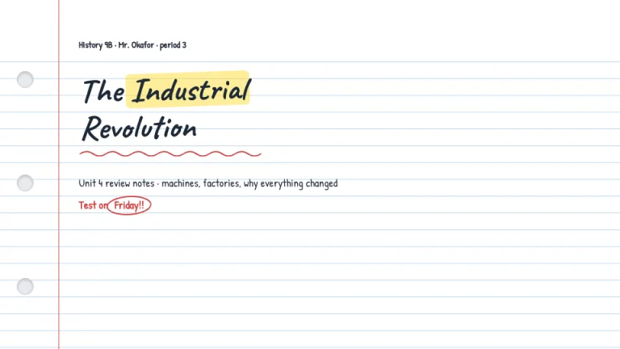</a> 
      <a href="prompts/notebook/"><b>Notebook</b></a> 
      Margins included 
      <i>Playful · Warm</i>
    </td>
    <td align="center" width="33%" valign="top">
       
      <a href="prompts/observatory/"><b>Observatory</b></a> 
      Data as constellations 
      <i>Calm · Dark</i>
    </td>
    <td align="center" width="33%" valign="top">
       
      <a href="prompts/oxford-style/"><b>Oxford Style</b></a> 
      The lecture handout, glossed in the margin 
      <i>Elegant · Calm</i>
    </td>
  </tr>
  <tr>
    <td align="center" width="33%" valign="top">
       
      <a href="prompts/research-paper/"><b>Research Paper</b></a> 
      The paper in ink, your reading in red pen 
      <i>Minimal · Calm</i>
    </td>
    <td align="center" width="33%" valign="top">
      <a href="prompts/seminar/">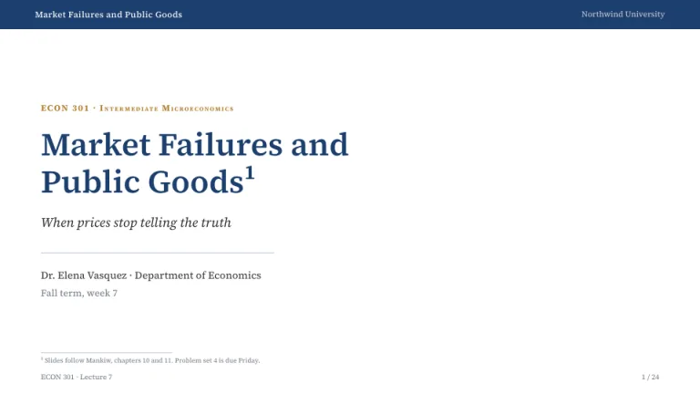</a> 
      <a href="prompts/seminar/"><b>Seminar</b></a> 
      Beamer, but nicer 
      <i>Minimal · Corporate</i>
    </td>
    <td align="center" width="33%" valign="top">
      <a href="prompts/stanford-style/">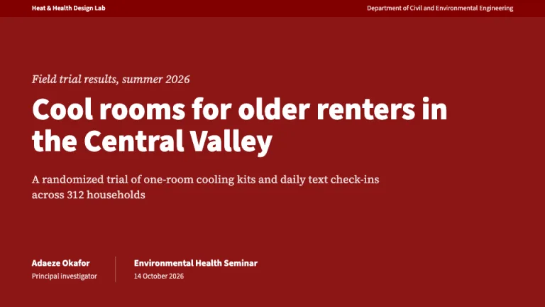</a> 
      <a href="prompts/stanford-style/"><b>Stanford Style</b></a> 
      Cardinal red lab talks, null results included 
      <i>Corporate · Bold</i>
    </td>
  </tr>
  <tr>
    <td align="center" width="33%" valign="top">
      <a href="prompts/syllabus/">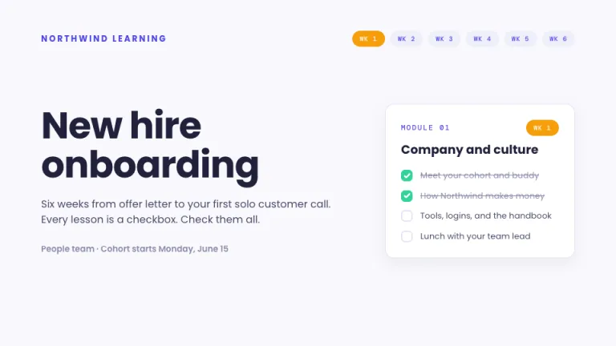</a> 
      <a href="prompts/syllabus/"><b>Syllabus</b></a> 
      The outline is the design 
      <i>Calm · Playful</i>
    </td>
    <td align="center" width="33%" valign="top">
      <a href="prompts/ted-style/">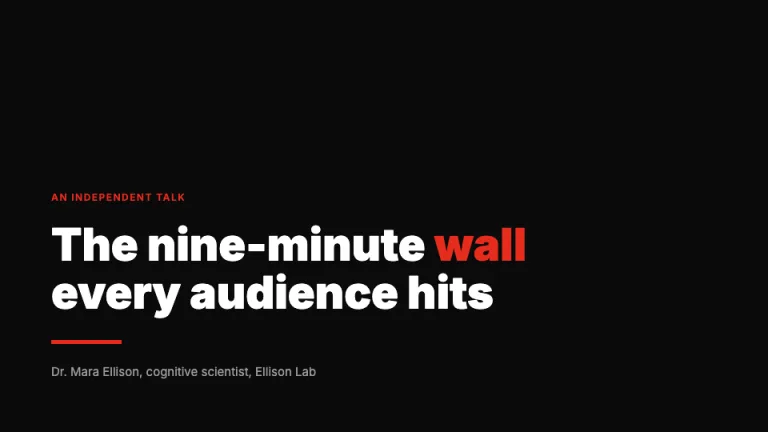</a> 
      <a href="prompts/ted-style/"><b>TED Style</b></a> 
      Say it huge, keep it dark 
      <i>Bold · Dark</i>
    </td>
    <td align="center" width="33%" valign="top">
      <a href="prompts/thesis-defense/">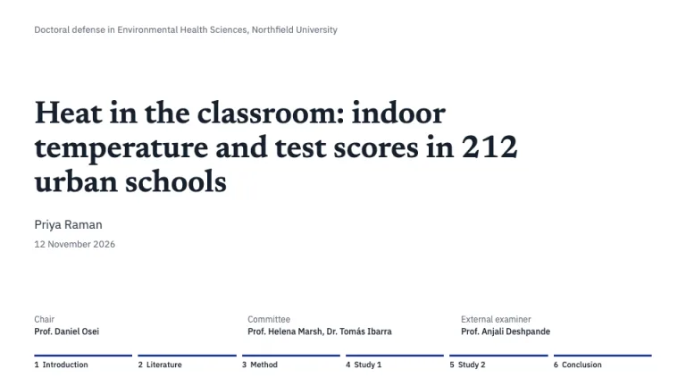</a> 
      <a href="prompts/thesis-defense/"><b>Thesis Defense</b></a> 
      Your chapters, one rail, every answer tagged 
      <i>Calm · Minimal</i>
    </td>
  </tr>
  <tr>
    <td align="center" width="33%" valign="top">
      <a href="prompts/trailhead/">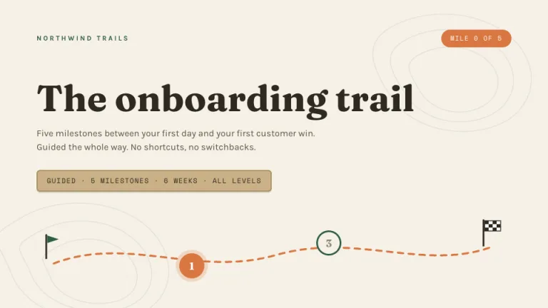</a> 
      <a href="prompts/trailhead/"><b>Trailhead</b></a> 
      Learning, one mile at a time 
      <i>Warm · Calm</i>
    </td>
    <td align="center" width="33%" valign="top">
      <a href="prompts/wildflower/">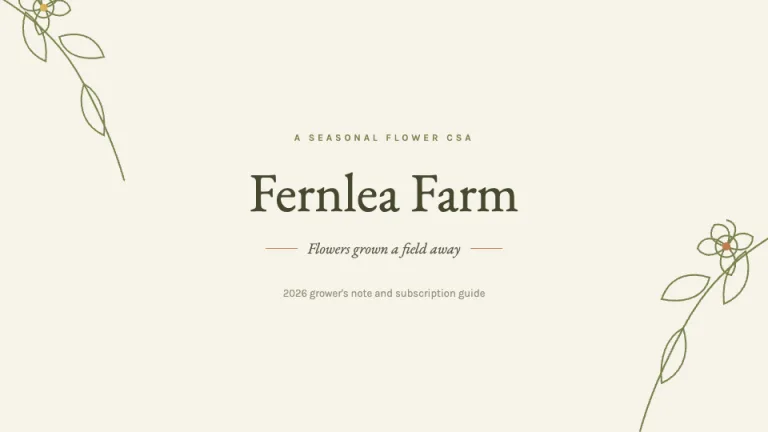</a> 
      <a href="prompts/wildflower/"><b>Wildflower</b></a> 
      Hand-gathered, loosely arranged 
      <i>Warm · Calm</i>
    </td>
  </tr>
</table>

### Events & seasonal

Decks with a date on them: a Spotify Wrapped-style year in review, your sales kickoff, Thanksgiving, Christmas, quiz nights and sermons.

<table>
  <tr>
    <td align="center" width="33%" valign="top">
      <a href="prompts/christmas/">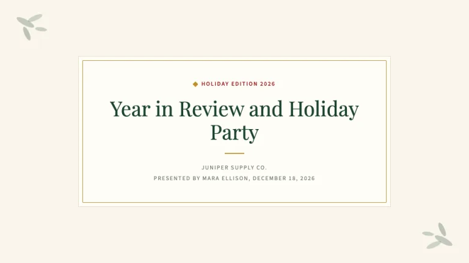</a> 
      <a href="prompts/christmas/"><b>Christmas</b></a> 
      Festive polish, zero clipart kitsch 
      <i>Warm · Playful</i>
    </td>
    <td align="center" width="33%" valign="top">
      <a href="prompts/halloween/">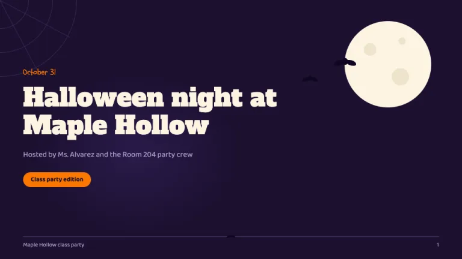</a> 
      <a href="prompts/halloween/"><b>Halloween</b></a> 
      Spooky season, classroom approved 
      <i>Playful · Dark</i>
    </td>
    <td align="center" width="33%" valign="top">
      <a href="prompts/quiz-night/">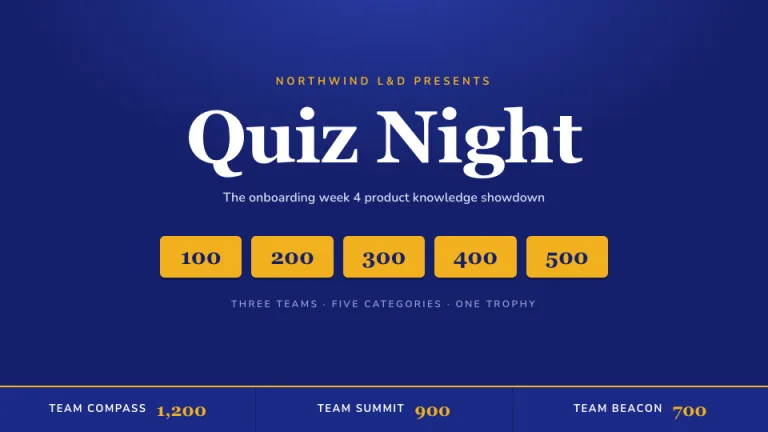</a> 
      <a href="prompts/quiz-night/"><b>Quiz Night</b></a> 
      Training, but with buzzers 
      <i>Playful · Bold</i>
    </td>
  </tr>
  <tr>
    <td align="center" width="33%" valign="top">
      <a href="prompts/sales-kickoff/">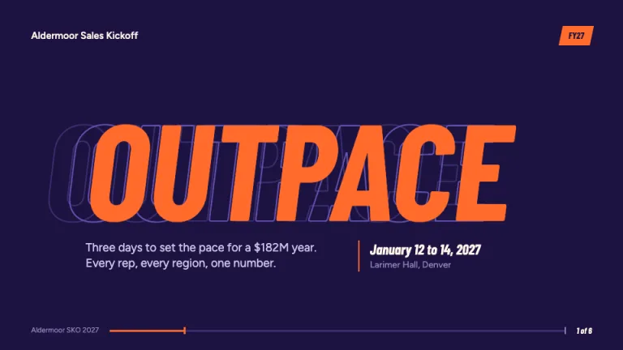</a> 
      <a href="prompts/sales-kickoff/"><b>Sales Kickoff</b></a> 
      From theme reveal to President's Club 
      <i>Bold · Dark</i>
    </td>
    <td align="center" width="33%" valign="top">
      <a href="prompts/sermon/">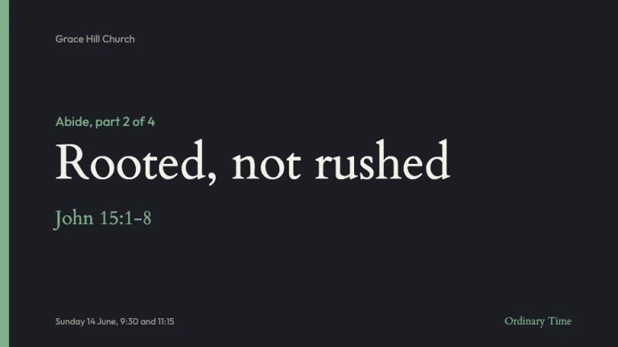</a> 
      <a href="prompts/sermon/"><b>Sermon</b></a> 
      Scripture first, readable from the back row 
      <i>Calm · Dark · Elegant</i>
    </td>
    <td align="center" width="33%" valign="top">
       
      <a href="prompts/thanksgiving/"><b>Thanksgiving</b></a> 
      Pull up a chair, bring a dish 
      <i>Warm · Playful</i>
    </td>
  </tr>
  <tr>
    <td align="center" width="33%" valign="top">
      <a href="prompts/varsity/">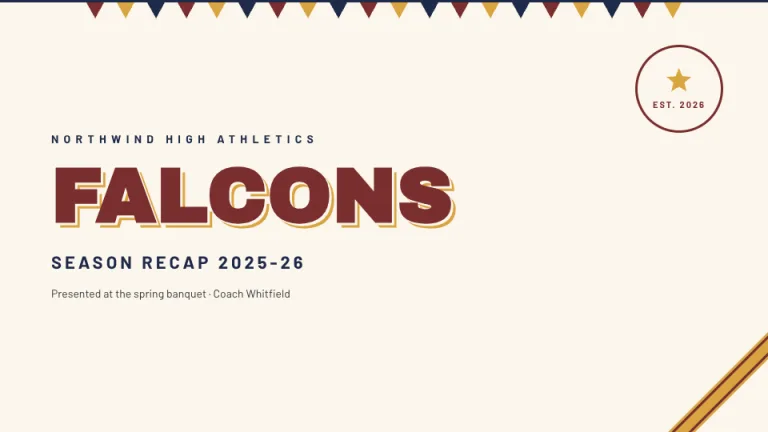</a> 
      <a href="prompts/varsity/"><b>Varsity</b></a> 
      Wear the colors 
      <i>Bold · Warm · Retro</i>
    </td>
    <td align="center" width="33%" valign="top">
      <a href="prompts/wrapped/">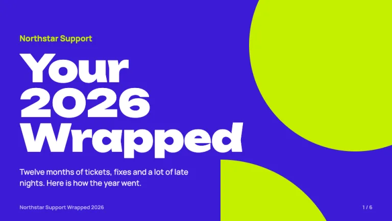</a> 
      <a href="prompts/wrapped/"><b>Wrapped</b></a> 
      Your year, one stat at a time 
      <i>Bold · Playful</i>
    </td>
  </tr>
</table>

### Finance

Designs for market outlooks, banking decks and annual reports, including Economist-style charts, a BlackRock outlook and a Goldman Sachs pitch book.

<table>
  <tr>
    <td align="center" width="33%" valign="top">
      <a href="prompts/annual-report/">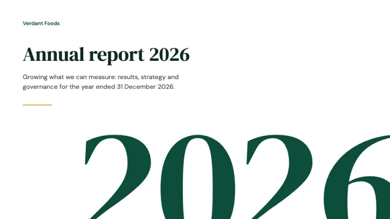</a> 
      <a href="prompts/annual-report/"><b>Annual Report</b></a> 
      The year, printed large 
      <i>Corporate · Elegant</i>
    </td>
    <td align="center" width="33%" valign="top">
       
      <a href="prompts/blackrock-outlook/"><b>BlackRock Outlook</b></a> 
      The house view, tabbed by section 
      <i>Corporate · Bold</i>
    </td>
    <td align="center" width="33%" valign="top">
      <a href="prompts/broadsheet/">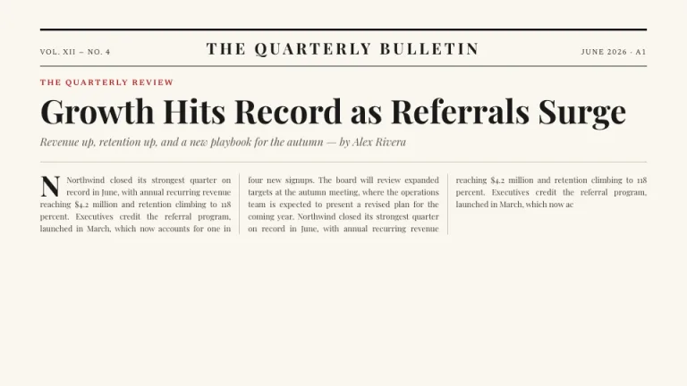</a> 
      <a href="prompts/broadsheet/"><b>Broadsheet</b></a> 
      Read all about it 
      <i>Elegant · Corporate</i>
    </td>
  </tr>
  <tr>
    <td align="center" width="33%" valign="top">
      <a href="prompts/economist-style/">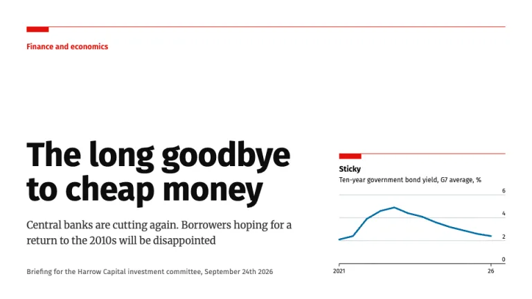</a> 
      <a href="prompts/economist-style/"><b>Economist Style</b></a> 
      Charts with a red tag and the axis on the right 
      <i>Corporate · Minimal</i>
    </td>
    <td align="center" width="33%" valign="top">
      <a href="prompts/goldman-sachs-style/">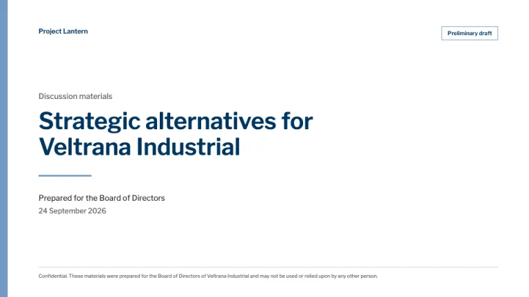</a> 
      <a href="prompts/goldman-sachs-style/"><b>Goldman Sachs Style</b></a> 
      The board book, in light blue and navy 
      <i>Corporate · Elegant</i>
    </td>
    <td align="center" width="33%" valign="top">
       
      <a href="prompts/guide-to-the-markets/"><b>Guide to the Markets</b></a> 
      One chart per page, footnotes included 
      <i>Corporate · Minimal</i>
    </td>
  </tr>
  <tr>
    <td align="center" width="33%" valign="top">
      <a href="prompts/ledger/">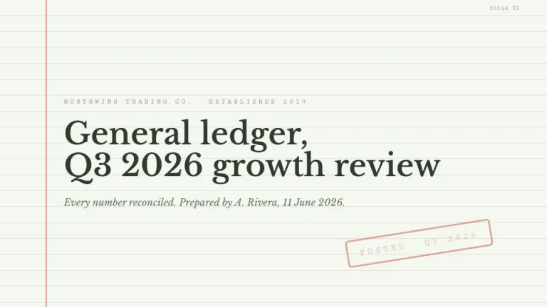</a> 
      <a href="prompts/ledger/"><b>Ledger</b></a> 
      Every number reconciled 
      <i>Elegant · Calm</i>
    </td>
    <td align="center" width="33%" valign="top">
      <a href="prompts/letterhead/">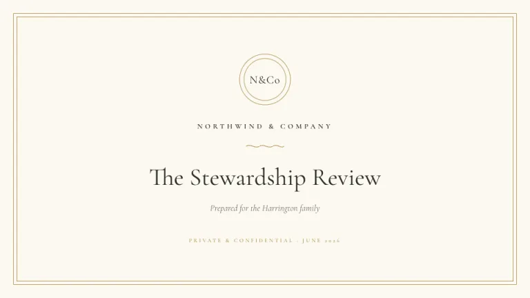</a> 
      <a href="prompts/letterhead/"><b>Letterhead</b></a> 
      Engraved, not printed 
      <i>Elegant · Minimal</i>
    </td>
    <td align="center" width="33%" valign="top">
       
      <a href="prompts/morgan-stanley-style/"><b>Morgan Stanley Style</b></a> 
      The client review, in deep blue and black 
      <i>Elegant · Corporate</i>
    </td>
  </tr>
  <tr>
    <td align="center" width="33%" valign="top">
      <a href="prompts/pitch-book/">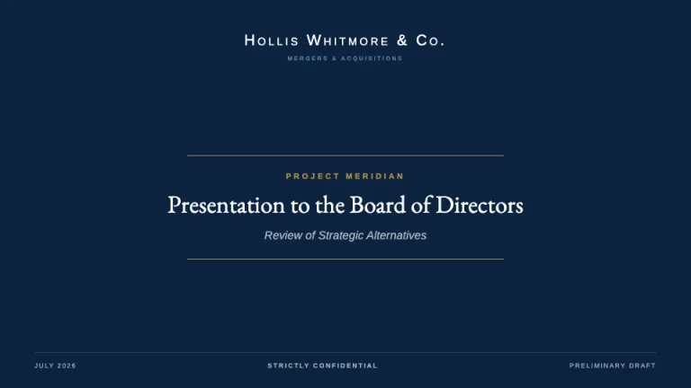</a> 
      <a href="prompts/pitch-book/"><b>Pitch Book</b></a> 
      Navy rigor, gold rules, dense conviction 
      <i>Corporate · Elegant</i>
    </td>
    <td align="center" width="33%" valign="top">
      <a href="prompts/ticker/">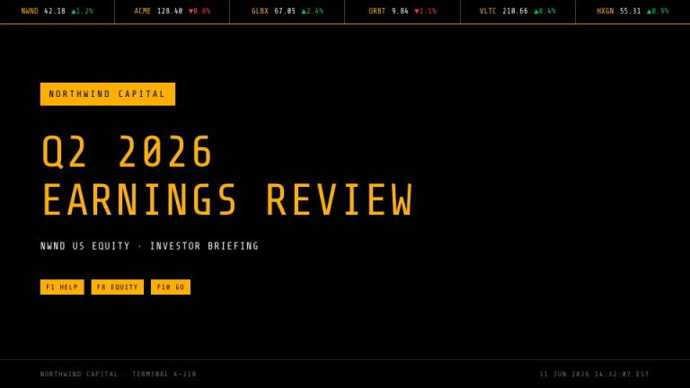</a> 
      <a href="prompts/ticker/"><b>Ticker</b></a> 
      Amber on black 
      <i>Tech · Dark</i>
    </td>
  </tr>
</table>

## Categories and styles

Themes sit on two axes. Categories say what a deck is for: pitch, business, consulting, marketing, tech, creative, education, events, finance. Styles say what it looks like: minimal, bold, elegant, playful, corporate, calm, warm, dark, tech, retro. A theme can carry more than one style.

## Contributing

A theme is a folder with a prompt, a short page, and slide previews, so new themes and fixes are easy to send. See [CONTRIBUTING.md](CONTRIBUTING.md) for the format and the quality bar.

## License

[MIT](LICENSE). Use the prompts and previews for anything, commercial work included. Credit to SlideSpeak is optional but welcome.

The brand-style themes (the consulting firm styles, TED Style, Keynote Minimal, Six-Pager, Airbnb Pitch Deck, Netflix Culture Deck, Notion Style, Economist Style, Harvard Style, Wrapped, Goldman Sachs Style, Sequoia Pitch Deck, Stripe Style, IBM Style, and the Forrester, Capgemini, Booz Allen, Arthur D. Little, Alvarez & Marsal, Morgan Stanley, a16z, Material, Fluent, Linear, Atlassian, Oxford and Stanford styles, plus Guide to the Markets, BlackRock Outlook, Internet Trends, LinkedIn Pitch Deck, Uber Pitch Deck and the 10/20/30 Rule) are **unofficial homages** built from publicly documented conventions. They are not affiliated with, endorsed by, or produced by those companies, and claim no rights to their trademarks. Magic Quadrant and Hype Cycle are trademarks of Gartner, Inc. Forrester Wave is a trademark of Forrester Research, Inc. The Business Model Canvas is by Strategyzer AG under CC BY-SA 3.0.

## About SlideSpeak

[SlideSpeak](https://slidespeak.co) turns a prompt, document, or topic into a finished, on-brand deck and exports to PowerPoint and Google Slides. This collection is the open-source companion to our [Slide Design Prompts](https://slidespeak.co/slide-design-prompts) gallery.

Made by the team at <a href="https://slidespeak.co">SlideSpeak</a>.

