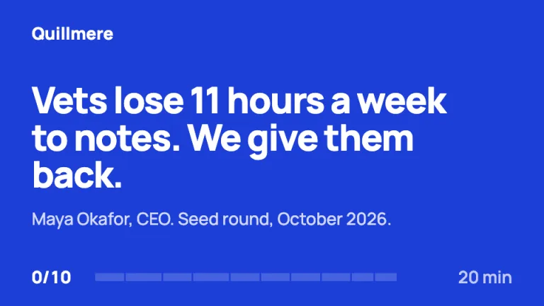
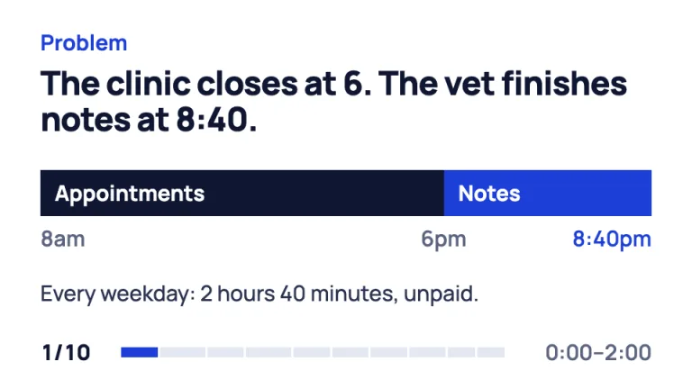
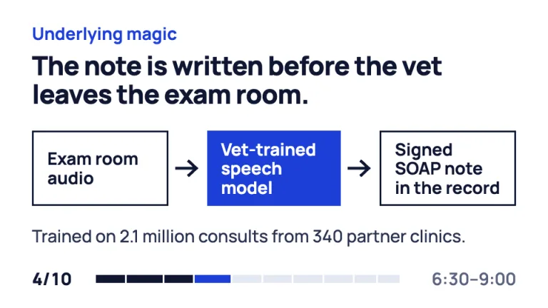
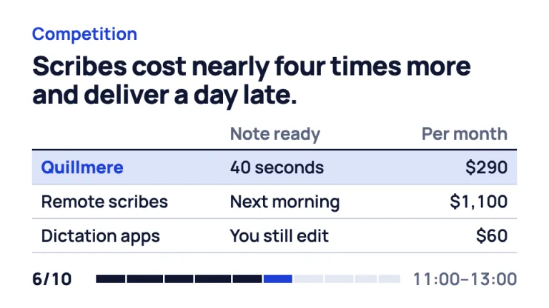
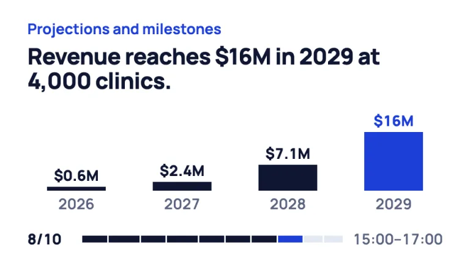
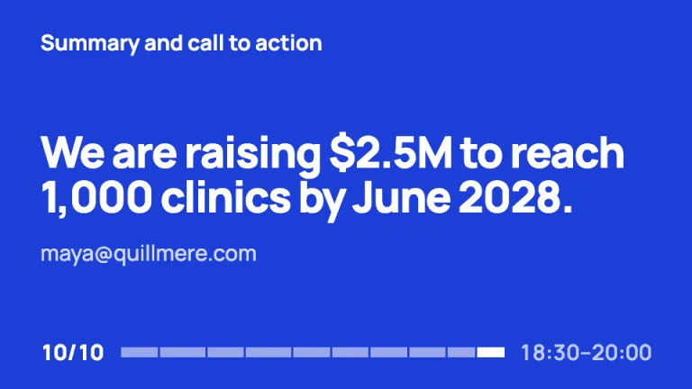

[← All prompts](../README.md) · [Live site](https://slidespeak.co/slide-design-prompts) · [SlideSpeak](https://slidespeak.co)

# 10/20/30 Rule

> Ten slides, twenty minutes, thirty points

A Guy Kawasaki 10/20/30 rule template for pitch decks: his ten slides in order, a footer clock for the 20-minute budget and no text under 30pt. An unofficial homage to the rule Kawasaki published in 2005. Not affiliated with, endorsed by, or connected to Guy Kawasaki.

**Category:** Pitch decks &nbsp;·&nbsp; **Style:** Bold, Minimal &nbsp;·&nbsp; **Mode:** Light &nbsp;·&nbsp; **Fonts:** Manrope

<table>
    <tr>
      <td align="center" width="33%"><br><sub>Cover</sub></td>
      <td align="center" width="33%"><br><sub>Problem</sub></td>
      <td align="center" width="33%"><br><sub>Underlying magic</sub></td>
    </tr>
    <tr>
      <td align="center" width="33%"><br><sub>Competition</sub></td>
      <td align="center" width="33%"><br><sub>Projections and milestones</sub></td>
      <td align="center" width="33%"><br><sub>Call to action</sub></td>
    </tr>
</table>

## The prompt

Copy the prompt below into **ChatGPT**, **Claude**, or any AI chat — or grab the raw [`PROMPT.md`](./PROMPT.md). It asks what your presentation is about first, then applies the design to every slide.

```text
Create a presentation in the '10/20/30 Rule' theme, a pitch deck built on Guy Kawasaki's rule: ten slides, twenty minutes, no type smaller than 30 points. Make exactly ten content slides plus a cover, in Kawasaki's order: 1 Problem, 2 Solution, 3 Business model, 4 Underlying magic, 5 Marketing and sales, 6 Competition, 7 Team, 8 Projections and milestones, 9 Status and timeline, 10 Summary and call to action. Treat the 16:9 slide as 960 by 540 points, so 30pt is the floor for every piece of text, footers and chart labels included. Palette: white #ffffff content slides, cobalt #1d3fd8 as the one accent, cobalt tint #dce3fb, navy ink #0f1733 for headlines and past progress, body #2a3350, muted #5b6480, track gray #e3e8f2, rules #c9d0dc. Typography: 'Manrope' (Google Fonts) only. Headlines 800 at 46 to 50pt with -0.02em tracking, cover and closing 60 to 64pt; body, labels and footer at 30pt in 500 to 700; tabular figures. Every content slide opens with its Kawasaki slide name in 30pt bold cobalt, sentence case, then a navy headline of 12 words or fewer that states the point. Below that sits one exhibit and at most two lines of body. The signature is the clock footer on every slide: '4/10' in 30pt 800 navy at left, then a 14px track of ten segments with 3px gaps, each segment's width set by its minutes (Problem 2, Solution 2.5, Business model 2, Underlying magic 2.5, Marketing and sales 2, Competition 2, Team 2, Projections 2, Status 1.5, Summary 1.5, total 20). Past segments navy, the current one cobalt, future ones #e3e8f2. At right, the slide's time window in 30pt muted, such as '6:30–9:00'. Cover: full-bleed cobalt, company name top-left in 30pt white, a 64pt white sentence naming the pain and the fix, founder and round in 30pt white at 80% opacity, the clock at '0/10' with an empty track and '20 min'. Problem: one day drawn as a horizontal bar, working hours navy, unpaid overtime cobalt, times below in 30pt. Underlying magic: three steps joined by thick navy arrows, the proprietary step filled cobalt, the others outlined in 3px navy. Competition: three rows and two columns at most, a 3px navy header rule, 2px gray row rules, the company row tinted #dce3fb with a cobalt name. Projections: four flat bars, navy with the target year cobalt, 30pt values on top, years below, no axis. Summary and call to action: full cobalt again, the ask in 60pt white, one contact line, the track fully spent. Strictly avoid: any text under 30pt, more than ten content slides, bullet lists over three lines, footnotes and source lines in small type, legends, gridlines, tables wider than three columns, gradients, drop shadows, rounded cards, icons, stock photos, a second accent color, centered body text, and implying Guy Kawasaki wrote or endorsed the deck.

Use this theme for my slides. Ask me what the presentation is about first, then apply the theme to every slide.
```

**[Open ChatGPT ↗](https://chatgpt.com/)** &nbsp;·&nbsp; **[Open Claude ↗](https://claude.ai/new)** &nbsp;·&nbsp; **[Generate a finished deck with SlideSpeak ↗](https://app.slidespeak.co/presentation?utm_source=github&utm_medium=referral&utm_campaign=slide-design-prompts)**

## Palette

| Role | Hex |
| --- | --- |
| Background | `#ffffff` |
| Surface / panel | `#e3e8f2` |
| Border | `#c9d0dc` |
| Primary accent | `#1d3fd8` |
| Primary (soft tint) | `#dce3fb` |
| Text on primary | `#ffffff` |
| Heading text | `#0f1733` |
| Body text | `#2a3350` |
| Muted text | `#5b6480` |

**Chart series:** `#1d3fd8` `#0f1733` `#9aa3b8` `#dce3fb`

## Fonts

- **Manrope** (heading, Google Fonts)

---

<sub>Part of [SlideSpeak Slide Design Prompts](../../README.md) · MIT licensed</sub>
