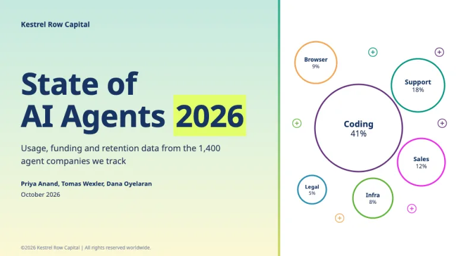
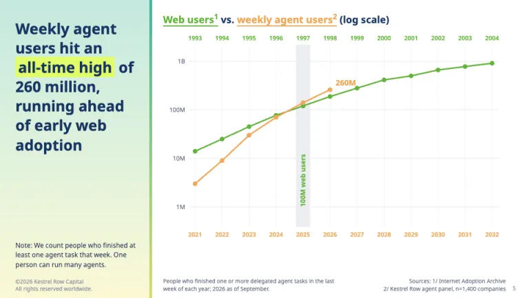
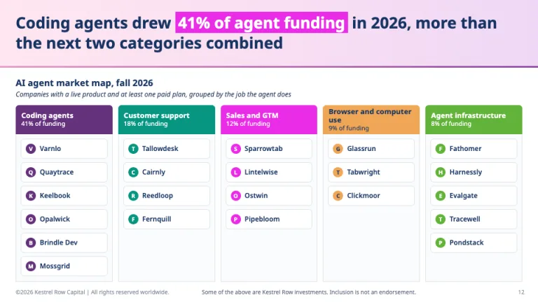
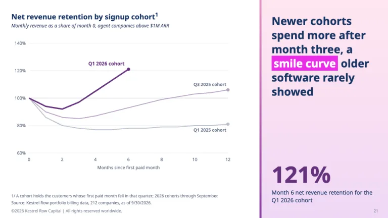
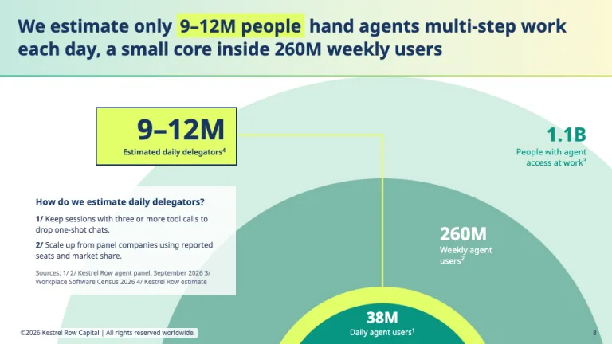
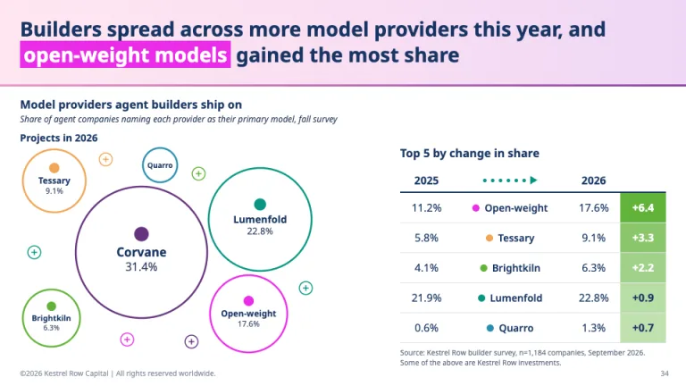

[← All prompts](../README.md) · [Live site](https://slidespeak.co/slide-design-prompts) · [SlideSpeak](https://slidespeak.co)

# a16z Style

> Pastel takeaway panels beside footnoted charts

An a16z presentation style for State of Crypto slides: navy takeaways on pastel panels with one highlighted phrase, market maps and cohort curves. An unofficial homage to the Andreessen Horowitz research report format. Not affiliated with, endorsed by, or connected to Andreessen Horowitz.

**Category:** Tech & product &nbsp;·&nbsp; **Style:** Tech, Bold &nbsp;·&nbsp; **Mode:** Light &nbsp;·&nbsp; **Fonts:** Noto Sans

<table>
    <tr>
      <td align="center" width="33%"><br><sub>Cover</sub></td>
      <td align="center" width="33%"><br><sub>Adoption overlay</sub></td>
      <td align="center" width="33%"><br><sub>Market map</sub></td>
    </tr>
    <tr>
      <td align="center" width="33%"><br><sub>Cohort curves</sub></td>
      <td align="center" width="33%"><br><sub>Usage estimate</sub></td>
      <td align="center" width="33%"><br><sub>Share shift</sub></td>
    </tr>
</table>

## The prompt

Copy the prompt below into **ChatGPT**, **Claude**, or any AI chat — or grab the raw [`PROMPT.md`](./PROMPT.md). It asks what your presentation is about first, then applies the design to every slide.

```text
Create a presentation in the 'a16z Style' theme, an unofficial homage to the State of Crypto report slides. Canvas: white #ffffff. Typography: 'Noto Sans' (Google Fonts) for everything: takeaway headlines 700 at 27 to 30px, cover title 700 at 64px, chart titles 700 at 18px, subtitles 400 italic 12px, body 400 at 12 to 14px, axis labels 11px, footnotes 10px. Text: navy #173462 headlines, #2a3b5c body, #5f6b80 notes. The signature: each content slide splits into a takeaway panel and an exhibit. The panel is a left or right column about 300px wide or a top band about 118px tall, filled with a soft gradient: mint #c5e9df to butter #fcf8d5 for growth, orchid #ffe6f1 to #efd8f6 for markets. A 3 to 5px gradient edge separates panel from exhibit (#3fb59a to #d6dc6c on mint, #e596c3 to #8a3fa0 on orchid). The panel holds one full-sentence takeaway in bold navy with one phrase on a highlighter block: lime #e2fe6b with navy text on mint, magenta #ea2ce8 with white text on orchid. One highlight per headline. Chart titles double as the legend: series names in the title take the series color plus an underline, like 'Web users¹ vs. weekly agent users² (log scale)'. Series colors in order: purple #65327d, teal #089582, green #62b33a, orange #f0a656; context series gray #b8bfcb and lilac #b5a0bf; gridlines #e6e9ee; direct labels at line ends. Superscript footnote numbers on sourced labels, then 'Sources: 1/ ... 2/ ...' in 10px at bottom-right and notes at bottom-left. Slide types: cover with the mint panel on the left, the title with the year highlighted, authors and date, and a cluster of ringed category bubbles on the white side; adoption overlay comparing two eras on a log scale with twin year axes colored per series and a gray milestone band; market map with five category columns, colored headers carrying funding share, and plain named tiles with a colored monogram dot where a logo would sit; cohort retention curves with older cohorts in gray and lilac, the newest in thick purple, and a 56px purple stat in the panel; nested semicircles rising from the bottom edge (#d3efe3, #7cb9a9, a lime ring, teal #089582 core) with a lime callout box; packed provider bubbles beside a 'Top 5 by change' table with a dotted teal arrow between the years and green #62b33a delta cells shaded by gain. Footer: '©2026 [Firm] | All rights reserved worldwide.' in 10px #8a93a3 bottom-left, page number bottom-right, and an investments disclosure line where companies appear. Strictly avoid: real company logos or wordmarks, the Andreessen Horowitz or a16z name or logo, claiming affiliation with Andreessen Horowitz, dark backgrounds, drop shadows, boxed legends, more than one highlight per headline, topic titles like 'Market Overview', stock photos, exhibits without a source line.

Use this theme for my slides. Ask me what the presentation is about first, then apply the theme to every slide.
```

**[Open ChatGPT ↗](https://chatgpt.com/)** &nbsp;·&nbsp; **[Open Claude ↗](https://claude.ai/new)** &nbsp;·&nbsp; **[Generate a finished deck with SlideSpeak ↗](https://app.slidespeak.co/presentation?utm_source=github&utm_medium=referral&utm_campaign=slide-design-prompts)**

## Palette

| Role | Hex |
| --- | --- |
| Background | `#ffffff` |
| Surface / panel | `#e9f5ef` |
| Border | `#dfe3ea` |
| Primary accent | `#ea2ce8` |
| Primary (soft tint) | `#fbe3fb` |
| Text on primary | `#ffffff` |
| Heading text | `#173462` |
| Body text | `#2a3b5c` |
| Muted text | `#5f6b80` |

**Chart series:** `#65327d` `#089582` `#62b33a` `#f0a656`

## Fonts

- **Noto Sans** (heading, Google Fonts)

---

<sub>Part of [SlideSpeak Slide Design Prompts](../../README.md) · MIT licensed</sub>
