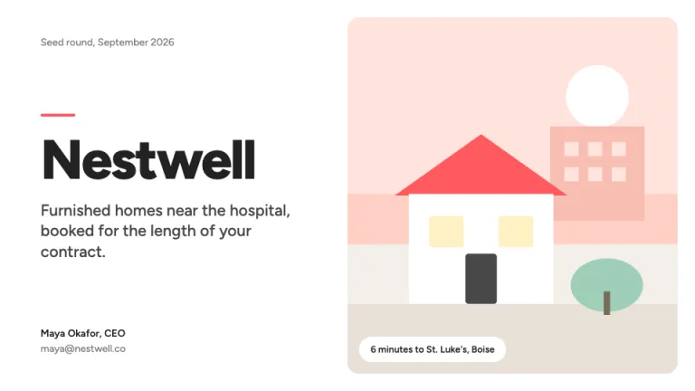
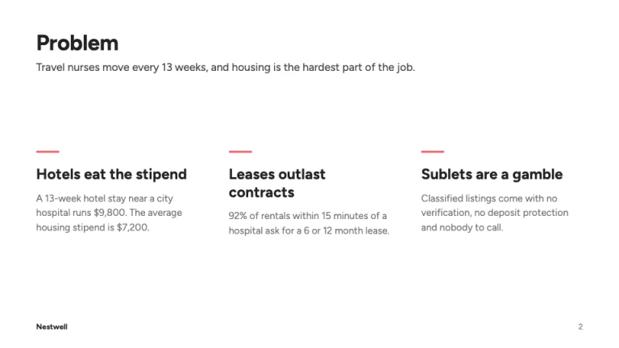
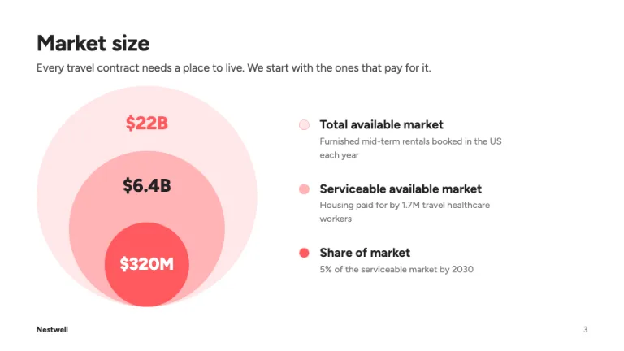
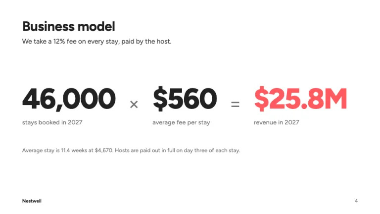
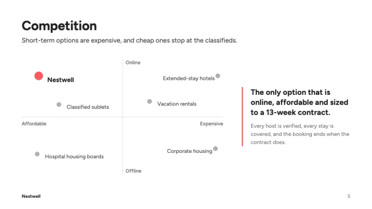
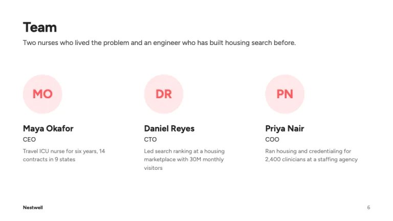

[← All prompts](../README.md) · [Live site](https://slidespeak.co/slide-design-prompts) · [SlideSpeak](https://slidespeak.co)

# Airbnb Pitch Deck

> The seed deck everyone copies, in coral

An Airbnb pitch deck template prompt built on the famous 2009 seed deck's slide order: plain two-word titles, nested market-size circles, a one-line business model equation and the affordable versus online competition 2x2, all on white with one coral accent. An unofficial homage to the Airbnb pitch deck. Not affiliated with, endorsed by, or connected to Airbnb, Inc.

**Category:** Pitch decks &nbsp;·&nbsp; **Style:** Warm, Minimal &nbsp;·&nbsp; **Mode:** Light &nbsp;·&nbsp; **Fonts:** Figtree

<table>
    <tr>
      <td align="center" width="33%"><br><sub>Title</sub></td>
      <td align="center" width="33%"><br><sub>Problem</sub></td>
      <td align="center" width="33%"><br><sub>Market size</sub></td>
    </tr>
    <tr>
      <td align="center" width="33%"><br><sub>Business model</sub></td>
      <td align="center" width="33%"><br><sub>Competition</sub></td>
      <td align="center" width="33%"><br><sub>Team</sub></td>
    </tr>
</table>

## The prompt

Copy the prompt below into **ChatGPT**, **Claude**, or any AI chat — or grab the raw [`PROMPT.md`](./PROMPT.md). It asks what your presentation is about first, then applies the design to every slide.

```text
Create a presentation in the 'Airbnb Pitch Deck' theme, an unofficial homage to the famous 2009 seed deck and its slide order. Background: white (#ffffff) on every slide; light panels in #f7f7f7 with 1px #dddddd borders only when a table needs them. Typography: 'Figtree' (Google Fonts) throughout. Slide titles are one or two words ('Problem', 'Market size', 'Business model') in Figtree 700 at 34px, #222222, top-left, followed by one plain sentence subtitle in Figtree 400 at 17px, #484848, that states the point of the slide. Body text 15 to 16px #484848, captions 13 to 14px #767676. Coral #ff5a5f is the one accent: short rounded rules (36 to 48px wide, 3 to 4px tall), the number that matters, the company's dot on a chart. Soft coral #ffe8e8 and #ffb3b5 are tints, never a background wash. Follow the classic order, one idea per slide: Title, Problem, Solution, Market validation, Market size, Product, Business model, Adoption strategy, Competition, Competitive advantages, Team. Title slide: company name at 72 to 80px Figtree 800 with tight tracking, a short coral rule above it, a one-line pitch at 22px ('Book rooms with locals, rather than hotels' in spirit), the round and date in #767676, and a large photo on the right with 16px rounded corners and a white pill caption like a listing card. Problem and solution: three short statements side by side, each under a coral rule, with one line of evidence in #767676; never bullets. Market size, the signature slide: three nested circles aligned at the bottom (total available, serviceable available, share of market) filled #ffe8e8, #ffb3b5 and #ff5a5f, with the dollar figure inside each circle and a legend on the right giving each circle's name and a one-line definition of what it counts. Business model: one equation in Figtree 800 at 64 to 72px, such as '46,000 stays x $560 average fee = $25.8M revenue', with operators in light #767676, labels under each term, and only the result in coral. Competition: a 2x2 on thin #dddddd axes (affordable to expensive, offline to online), competitors as 12px #b0b0b0 dots with plain labels, the company as one larger coral dot with a bold label, and a one-sentence verdict beside it behind a 3px coral left border. Team: circular avatars or initials on #ffe8e8, name at 21px bold, role, and one line of proof. Photos are real, bright and warm, always rounded 16px. Footer: company name in 12px bold #222222 bottom-left and page number in #767676 bottom-right on every slide except the title. Strictly avoid: dark backgrounds, gradients, drop shadows, stock-photo collages, bullet lists, more than one coral focal point per slide, icons in every column, centered body paragraphs, charts with gridlines or legends where labels fit, more than 12 slides of content, the Airbnb Belo logo or wordmark, and claiming affiliation with Airbnb, Inc.

Use this theme for my slides. Ask me what the presentation is about first, then apply the theme to every slide.
```

**[Open ChatGPT ↗](https://chatgpt.com/)** &nbsp;·&nbsp; **[Open Claude ↗](https://claude.ai/new)** &nbsp;·&nbsp; **[Generate a finished deck with SlideSpeak ↗](https://app.slidespeak.co/presentation?utm_source=github&utm_medium=referral&utm_campaign=slide-design-prompts)**

## Palette

| Role | Hex |
| --- | --- |
| Background | `#ffffff` |
| Surface / panel | `#f7f7f7` |
| Border | `#dddddd` |
| Primary accent | `#ff5a5f` |
| Primary (soft tint) | `#ffe8e8` |
| Text on primary | `#ffffff` |
| Heading text | `#222222` |
| Body text | `#484848` |
| Muted text | `#767676` |

**Chart series:** `#ff5a5f` `#00a699` `#fc642d` `#484848`

## Fonts

- **Figtree** (heading, Google Fonts)

---

<sub>Part of [SlideSpeak Slide Design Prompts](../../README.md) · MIT licensed</sub>
