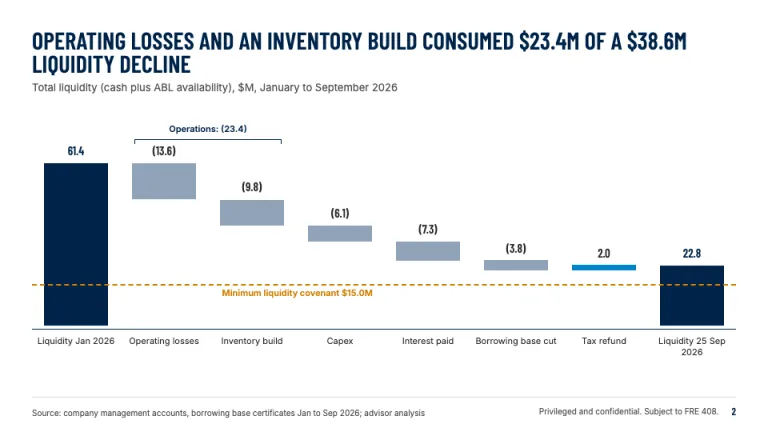
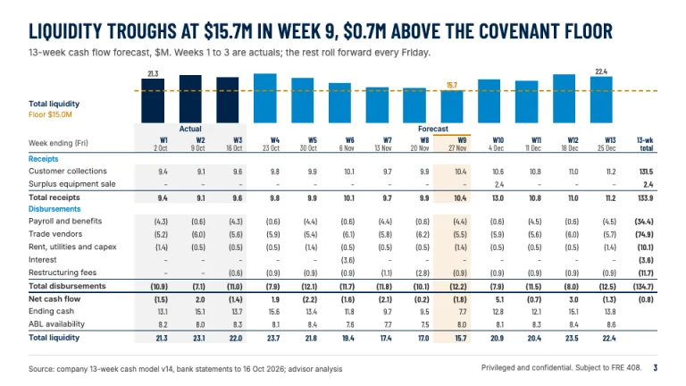
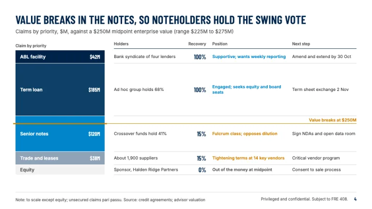
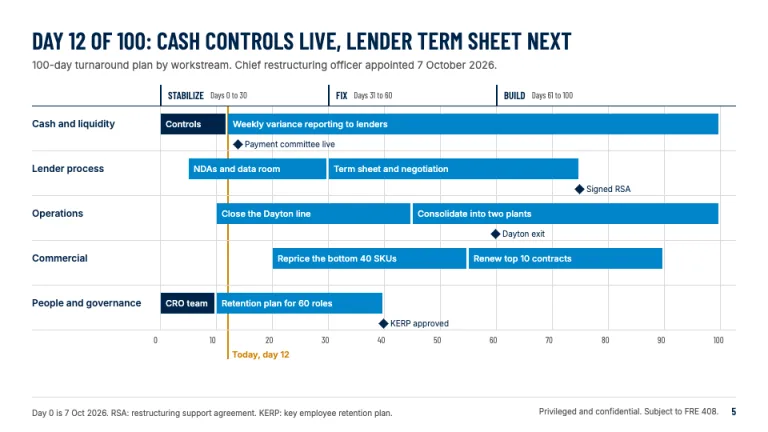
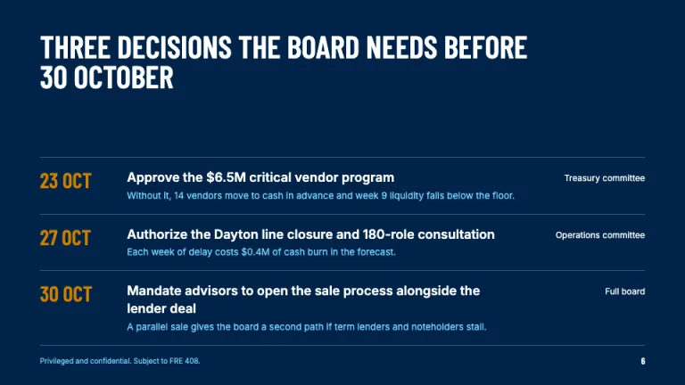

[← All prompts](../README.md) · [Live site](https://slidespeak.co/slide-design-prompts) · [SlideSpeak](https://slidespeak.co)

# Alvarez & Marsal Style

> 13-week cash flow and liquidity slides in navy and amber

A restructuring presentation template with a 13-week cash flow forecast, liquidity bridge, stakeholder map and 100-day plan in navy and amber. An unofficial homage to the Alvarez & Marsal presentation style. Not affiliated with, endorsed by, or connected to Alvarez & Marsal.

**Category:** Consulting &nbsp;·&nbsp; **Style:** Corporate, Bold &nbsp;·&nbsp; **Mode:** Light &nbsp;·&nbsp; **Fonts:** Barlow Condensed + Inter

<table>
    <tr>
      <td align="center" width="33%"><br><sub>Title</sub></td>
      <td align="center" width="33%"><br><sub>Liquidity bridge</sub></td>
      <td align="center" width="33%"><br><sub>13-week cash flow</sub></td>
    </tr>
    <tr>
      <td align="center" width="33%"><br><sub>Stakeholder map</sub></td>
      <td align="center" width="33%"><br><sub>100-day plan</sub></td>
      <td align="center" width="33%"><br><sub>Board decisions</sub></td>
    </tr>
</table>

## The prompt

Copy the prompt below into **ChatGPT**, **Claude**, or any AI chat — or grab the raw [`PROMPT.md`](./PROMPT.md). It asks what your presentation is about first, then applies the design to every slide.

```text
Create a presentation in the 'Alvarez & Marsal Style' theme, an unofficial homage to the turnaround and restructuring deck. Background: white (#ffffff) on content slides; full-bleed navy (#00244a) on the cover and the closing decisions slide. Typography (Google Fonts): titles in 'Barlow Condensed' 600, uppercase, 30px on content slides and 44 to 64px on navy slides, line-height 0.95, navy #00244a, each one a full-sentence takeaway of 14 words or fewer; body, labels and tables in 'Inter' 400/600 at 11 to 18px in #292929. Every number sits in Barlow Condensed, negatives in accounting parentheses such as (12.4), units stated as $M. Under each title runs a one-line 13px sub-line in #525252 naming scope, units and period. Color roles: navy #00244a for totals, actuals and structure; blue #0085ca for forecasts and inflows; slate #8fa3b8 for outflows; #f2f2f2 shading for actual-period columns; #d9d9d9 hairlines; light blue #78d1ff for secondary text on navy. The signature rule: amber #cf7f00 marks the constraint and nothing else, meaning the minimum liquidity covenant as a 2px dashed line, the trough week, the point where enterprise value runs out, the today line on a plan, and decision deadlines. Signature slide: the 13-week cash flow forecast, a total-liquidity bar strip on the same column grid as the table below it; columns W1 to W13 with week-ending dates plus a 13-week total; 'Actual' and 'Forecast' header spans; rows for receipts, disbursements, net cash flow, ending cash, ABL availability and total liquidity; bold totals over 1px navy rules; the trough column tinted #faf0e0 with a 2px amber top. Liquidity bridge: a waterfall with navy totals, slate decreases, blue increases, direct labels, a bracket grouping related drivers and the amber dashed covenant floor. Stakeholder map: the capital structure as a priority stack whose block heights set each stakeholder row (holders, recovery %, position, next step), with an amber line where value breaks. 100-day plan: workstream rows on a day 0 to 100 grid split into Stabilize, Fix and Build phases; completed bars navy, planned bars blue, rotated-square milestones, one amber today line. Closing slide: navy, three dated board decisions with amber Barlow Condensed dates, the approving body and the cash cost of delay. Footer on content slides: a 1px #d9d9d9 rule, a Source or Note line bottom-left in 10px #525252, 'Privileged and confidential. Subject to FRE 408.' and a navy page number bottom-right. Strictly avoid: logos or wordmarks of Alvarez & Marsal, claiming affiliation with the firm, amber as decoration, gradients, drop shadows, rounded cards, rainbow charts, sentence-case or centered titles, minus signs for negatives, stock photos, icons, and data slides without a source line.

Use this theme for my slides. Ask me what the presentation is about first, then apply the theme to every slide.
```

**[Open ChatGPT ↗](https://chatgpt.com/)** &nbsp;·&nbsp; **[Open Claude ↗](https://claude.ai/new)** &nbsp;·&nbsp; **[Generate a finished deck with SlideSpeak ↗](https://app.slidespeak.co/presentation?utm_source=github&utm_medium=referral&utm_campaign=slide-design-prompts)**

## Palette

| Role | Hex |
| --- | --- |
| Background | `#ffffff` |
| Surface / panel | `#f2f2f2` |
| Border | `#d9d9d9` |
| Primary accent | `#00244a` |
| Primary (soft tint) | `#e0f0f9` |
| Text on primary | `#ffffff` |
| Heading text | `#00244a` |
| Body text | `#292929` |
| Muted text | `#525252` |

**Chart series:** `#0085ca` `#00244a` `#cf7f00` `#8fa3b8`

## Fonts

- **Barlow Condensed** (heading, Google Fonts)
- **Inter** (supporting, Google Fonts)

---

<sub>Part of [SlideSpeak Slide Design Prompts](../../README.md) · MIT licensed</sub>
