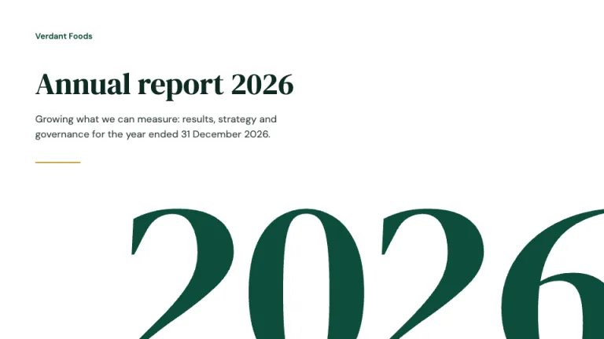
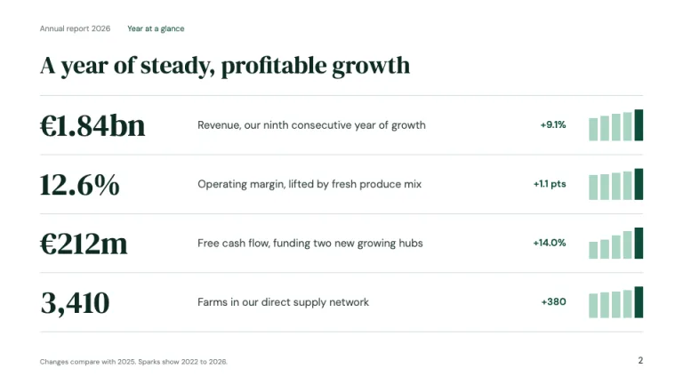
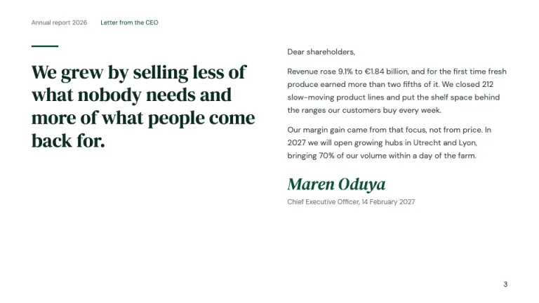
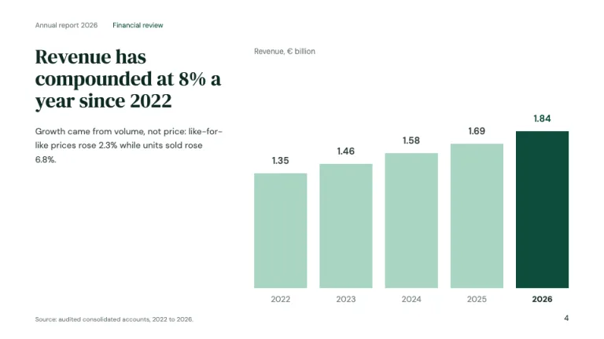
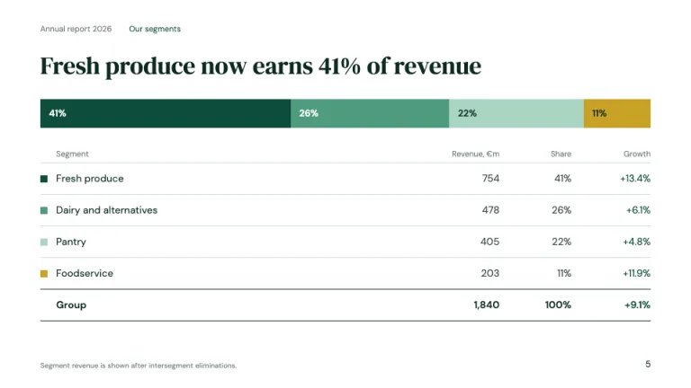
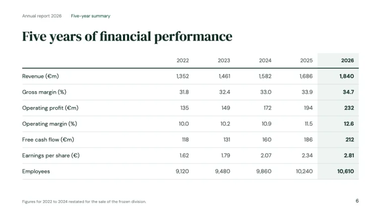

[← All prompts](../README.md) · [Live site](https://slidespeak.co/slide-design-prompts) · [SlideSpeak](https://slidespeak.co)

# Annual Report

> The year, printed large

An annual report presentation built like the printed book: a giant cropped year numeral on the cover, KPI sentences with five-year spark bars, a CEO letter with a signature, and five-year charts and tables that always put the current year in evergreen. Use it as an annual report template prompt for results decks, shareholder meetings and impact reviews.

**Category:** Finance &nbsp;·&nbsp; **Style:** Corporate, Elegant &nbsp;·&nbsp; **Mode:** Light &nbsp;·&nbsp; **Fonts:** DM Serif Display + DM Sans

<table>
    <tr>
      <td align="center" width="33%"><br><sub>Cover</sub></td>
      <td align="center" width="33%"><br><sub>Year at a glance</sub></td>
      <td align="center" width="33%"><br><sub>Letter from the CEO</sub></td>
    </tr>
    <tr>
      <td align="center" width="33%"><br><sub>Five-year revenue</sub></td>
      <td align="center" width="33%"><br><sub>Segment breakdown</sub></td>
      <td align="center" width="33%"><br><sub>Five-year summary</sub></td>
    </tr>
</table>

## The prompt

Copy the prompt below into **ChatGPT**, **Claude**, or any AI chat — or grab the raw [`PROMPT.md`](./PROMPT.md). It asks what your presentation is about first, then applies the design to every slide.

```text
Create a presentation in the 'Annual Report' theme, a printed annual report translated to slides. Background: white (#ffffff) on every slide; the only tinted surface is a pale mint (#eef4f1) used to shade the current year. Typography: 'DM Serif Display' (Google Fonts) for headlines at 34 to 40px and for every large figure; 'DM Sans' 400/600 for body text at 14 to 16px, labels, tables and chart text, with tabular numerals. Headlines are sentence case, left-aligned, in deep green-black #0e2a22; body text is #33443e and notes are #6e7f78. The signature is the year as a graphic: on the cover and section openers, the reporting year set in DM Serif Display at 360 to 420px in evergreen #0e4d3c, cropped by the bottom and right slide edges like cover type bleeding off a printed page. The second rule: every multi-year comparison shows the reporting year in evergreen #0e4d3c and all prior years in pale #a8d5c2, and every table shades the current-year column #eef4f1 with bold figures. Running header top-left on content slides: 'Annual report [year]' in 11px #6e7f78 followed by the section name in #0e4d3c; page number bottom-right in 12px #0e2a22; a one-line note or source bottom-left in 10px #6e7f78. Cover: company name small in evergreen, 'Annual report [year]' at 48px, a one-sentence standfirst, a 72px gold (#c9a227) keyline, and the cropped giant year. Year at a glance: four ruled rows, not cards, each with a 40px serif figure, a plain one-line label, the change on last year in #0e4d3c, and a five-bar spark chart. Letter from the CEO: a large serif pull quote on the left under a short evergreen rule; two or three short paragraphs on the right; the signature in DM Serif Display italic at 30px in #0e4d3c with name, title and date beneath. Financial charts: vertical bars with values printed above each bar, year labels below, a unit line such as 'Revenue, € billion' top-left, no axis, no gridlines. Segment slides: one 100% horizontal bar in the chart order #0e4d3c, #4f9c7f, #a8d5c2, #c9a227, then a ruled table of revenue, share and growth with a bold group total over a dark rule. Five-year summary: a table with a 2px #0e2a22 header rule, 1px #cfded7 row rules, right-aligned figures, the current-year column shaded. Strictly avoid: KPI card grids, stock photos of handshakes or skylines, gradients, drop shadows, 3D or pie charts, more than two highlight colors in a chart, gold as a text color, centered body text, clip-art icons, all-caps labels, and dark backgrounds.

Use this theme for my slides. Ask me what the presentation is about first, then apply the theme to every slide.
```

**[Open ChatGPT ↗](https://chatgpt.com/)** &nbsp;·&nbsp; **[Open Claude ↗](https://claude.ai/new)** &nbsp;·&nbsp; **[Generate a finished deck with SlideSpeak ↗](https://app.slidespeak.co/presentation?utm_source=github&utm_medium=referral&utm_campaign=slide-design-prompts)**

## Palette

| Role | Hex |
| --- | --- |
| Background | `#ffffff` |
| Surface / panel | `#eef4f1` |
| Border | `#cfded7` |
| Primary accent | `#0e4d3c` |
| Primary (soft tint) | `#dcebe4` |
| Text on primary | `#ffffff` |
| Heading text | `#0e2a22` |
| Body text | `#33443e` |
| Muted text | `#6e7f78` |

**Chart series:** `#0e4d3c` `#4f9c7f` `#a8d5c2` `#c9a227`

## Fonts

- **DM Serif Display** (heading, Google Fonts)
- **DM Sans** (supporting, Google Fonts)

---

<sub>Part of [SlideSpeak Slide Design Prompts](../../README.md) · MIT licensed</sub>
