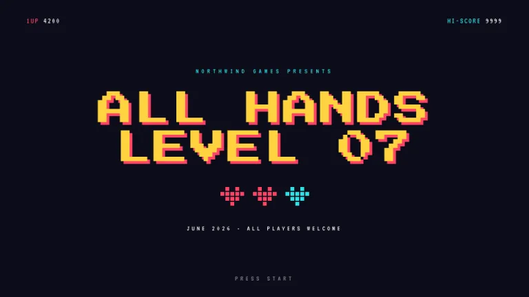
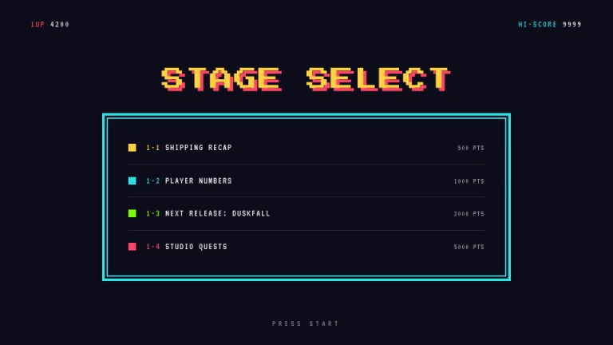
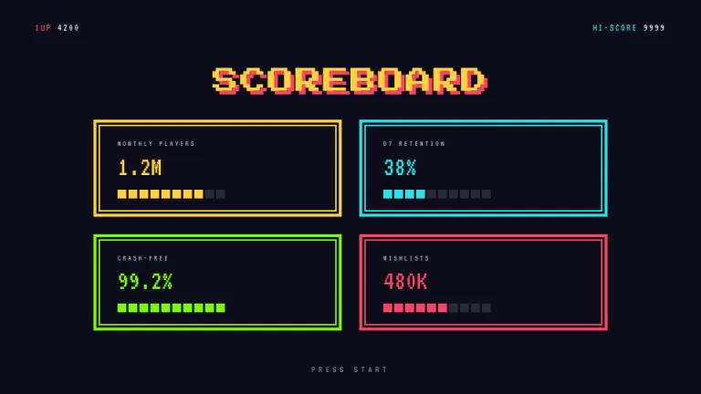
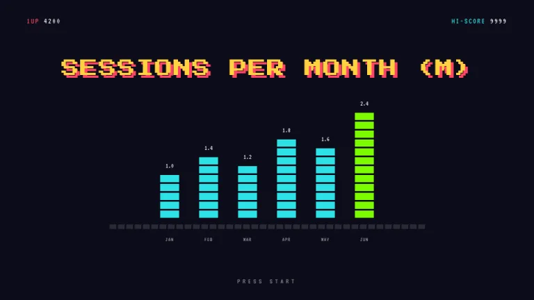
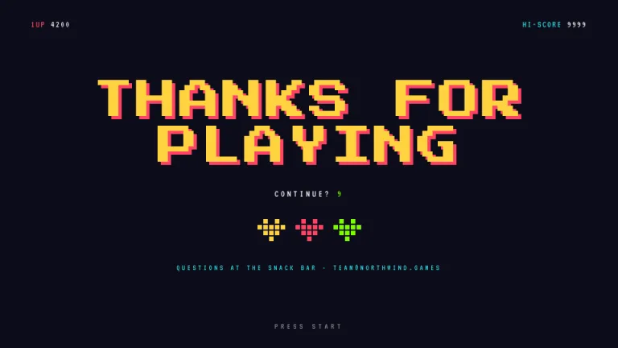

[← All prompts](../README.md) · [Live site](https://slidespeak.co/slide-design-prompts) · [SlideSpeak](https://slidespeak.co)

# Arcade

> Insert coin

An 8-bit cabinet screen with a HUD score row on every slide. Panels get double borders, hearts are built from pixels and the chart is stacked blocks.

**Category:** Tech & product &nbsp;·&nbsp; **Style:** Playful, Dark &nbsp;·&nbsp; **Mode:** Dark &nbsp;·&nbsp; **Fonts:** Press Start 2P + VT323

<table>
    <tr>
      <td align="center" width="33%"><br><sub>Title</sub></td>
      <td align="center" width="33%"><br><sub>Agenda</sub></td>
      <td align="center" width="33%"><br><sub>Key metrics</sub></td>
    </tr>
    <tr>
      <td align="center" width="33%"><br><sub>Chart & insight</sub></td>
      <td align="center" width="33%"><br><sub>Closing</sub></td>
    </tr>
</table>

## The prompt

Copy the prompt below into **ChatGPT**, **Claude**, or any AI chat — or grab the raw [`PROMPT.md`](./PROMPT.md). It asks what your presentation is about first, then applies the design to every slide.

```text
Create a presentation in the 'Arcade' theme, an 8-bit arcade cabinet screen. Background: deep navy black #0D0D1A. Palette: yellow #FFD23F, pink-red #FF4365, cyan #2DE2E6, green #7CFC00 and white. Typography: headlines in 'Press Start 2P' and all other text, including the HUD, in the monospaced 'VT323' (both Google Fonts); uppercase, headlines 36 to 64px in #FFD23F with a hard offset shadow of 5px 5px 0 #FF4365, no blur. Signature motifs: (1) a HUD row at the top of every slide, '1UP 4200' left in #FF4365 and 'HI-SCORE 9999' right in #2DE2E6, scores in white; (2) double-border panels, a 4px solid border, a 3px gap, then an inner 2px border in the same color; (3) bars, icons and charts built from 12px square blocks with 3px gaps like pixel art, including 5x4-grid pixel hearts in #FF4365; (4) a centered 'PRESS START' footer in white at 50 percent opacity. Strictly avoid: gradients, rounded corners, blur or glow effects, photographs, serif fonts, smooth curves.

Use this theme for my slides. Ask me what the presentation is about first, then apply the theme to every slide.
```

**[Open ChatGPT ↗](https://chatgpt.com/)** &nbsp;·&nbsp; **[Open Claude ↗](https://claude.ai/new)** &nbsp;·&nbsp; **[Generate a finished deck with SlideSpeak ↗](https://app.slidespeak.co/presentation?utm_source=github&utm_medium=referral&utm_campaign=slide-design-prompts)**

## Palette

| Role | Hex |
| --- | --- |
| Background | `#0D0D1A` |
| Surface / panel | `#1A1A2E` |
| Border | `#2C2C4A` |
| Primary accent | `#FFD23F` |
| Primary (soft tint) | `#4A3D14` |
| Text on primary | `#0D0D1A` |
| Heading text | `#FFFFFF` |
| Body text | `#C9C9E0` |
| Muted text | `#76769A` |

**Chart series:** `#FFD23F` `#FF4365` `#2DE2E6` `#7CFC00`

## Fonts

- **Press Start 2P** (heading, Google Fonts)
- **VT323** (supporting, Google Fonts)

---

<sub>Part of [SlideSpeak Slide Design Prompts](../../README.md) · MIT licensed</sub>
