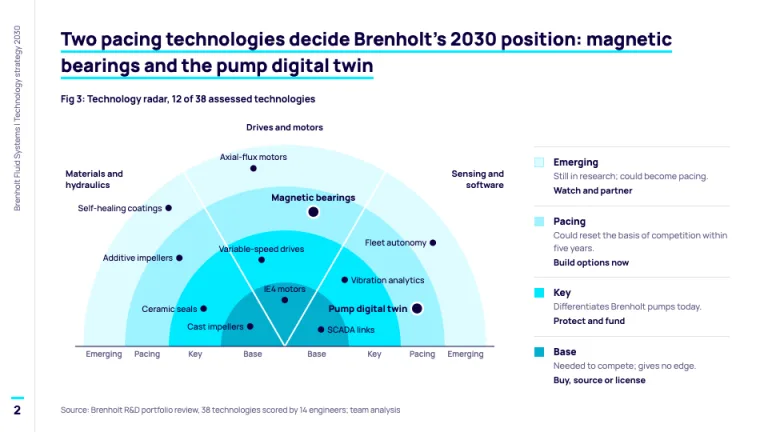
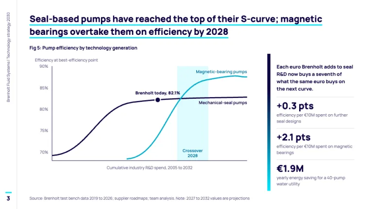
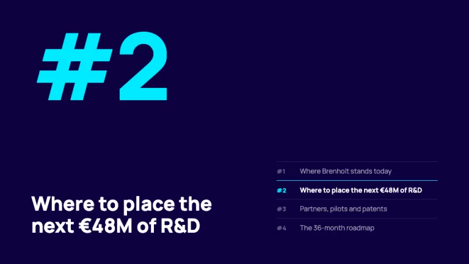
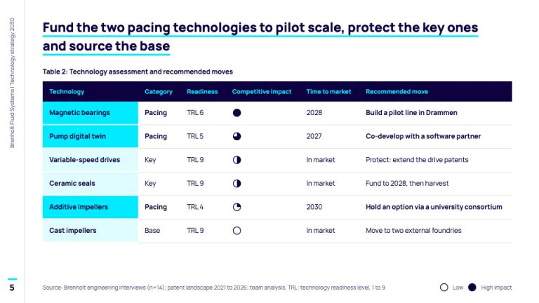
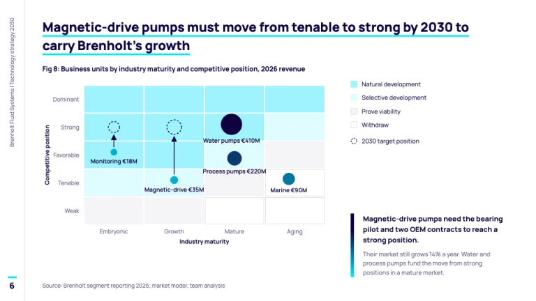

[← All prompts](../README.md) · [Live site](https://slidespeak.co/slide-design-prompts) · [SlideSpeak](https://slidespeak.co)

# Arthur D. Little Style

> Technology strategy on a radar, in indigo and cyan

An Arthur D. Little presentation style for technology strategy: a base, key, pacing and emerging technology radar, S-curves and a maturity matrix. An unofficial homage to the Arthur D. Little report look. Not affiliated with, endorsed by, or connected to Arthur D. Little.

**Category:** Consulting &nbsp;·&nbsp; **Style:** Corporate, Elegant &nbsp;·&nbsp; **Mode:** Light &nbsp;·&nbsp; **Fonts:** Manrope

<table>
    <tr>
      <td align="center" width="33%"><br><sub>Cover</sub></td>
      <td align="center" width="33%"><br><sub>Technology radar</sub></td>
      <td align="center" width="33%"><br><sub>S-curve</sub></td>
    </tr>
    <tr>
      <td align="center" width="33%"><br><sub>Chapter divider</sub></td>
      <td align="center" width="33%"><br><sub>Technology assessment</sub></td>
      <td align="center" width="33%"><br><sub>Maturity matrix</sub></td>
    </tr>
</table>

## The prompt

Copy the prompt below into **ChatGPT**, **Claude**, or any AI chat — or grab the raw [`PROMPT.md`](./PROMPT.md). It asks what your presentation is about first, then applies the design to every slide.

```text
Create a presentation in the 'Arthur D. Little Style' theme, an unofficial homage to Arthur D. Little's technology strategy reports. Palette: white #ffffff content slides; indigo #0d003f for all text, axes and table headers; electric cyan #00eaff for fields, underlines and fills, never for text on white; a blue shift chart ramp of #093a6f, #06749e, #03afce and #00eaff; pale cyan #dffcff for bands and highlights; muted #686087 for sources and axis labels; rules #e2e0e8; panels #f5f4f7. Typography: 'Manrope' (Google Fonts) throughout. Content titles 800 weight at 22 to 24px, sentence case, a full-sentence takeaway, two lines max, underlined with a 3px #00eaff line offset 6px; body 400 to 500 at 12 to 14px, stats 800 at 24px. A 44px left rail with a 1px #e2e0e8 border holds the client and study name vertical in 10px #686087, and the page number in 15px 800 indigo under a short cyan bar at its foot. Exhibits carry a bold 12px 'Fig 3: ...' label above and a 10px 'Source: ...' line below. Cover: full-bleed #00eaff field, study title in 50px 800 indigo, subtitle, authors, city and date; faint indigo radar arcs in one corner; a 140px indigo band on the right with the report type set vertically in 76px cyan capitals. Signature slide, the technology radar: a half circle split into three domain sectors by white lines, four rings from the center out, Base #03afce, Key #00eaff, Pacing #9ff3ff, Emerging #dffcff, indigo blips with direct labels, and pacing bets drawn larger with a white halo and bold labels; a side legend gives each ring's meaning and move (buy, protect, build options, watch). S-curve slide: two S-curves on one axis, the incumbent in 3px indigo flattening, the successor in 3px #03afce overtaking it inside a pale cyan crossover band, 'today' as a haloed dot; beside it an 8px vertical gradient bar from #0d003f to #00eaff next to three stats. Chapter dividers: full-bleed indigo, a 190px cyan hash chapter number (#2), a white title, and a contents list where only the current chapter turns cyan and white. Tables: indigo header row with 11px bold cyan labels, first-column cells filled cyan (pacing rows) or #dffcff with bold indigo names, 1px #e2e0e8 row rules, TRL readiness, Harvey balls for impact. Maturity matrix: industry maturity (embryonic to aging) by competitive position (dominant to weak), zones tinted #9ff3ff, #dffcff, #f5f4f7 and white, units as bubbles sized by revenue, dashed circles and arrows for targets. Strictly avoid: logos, wordmarks or a stylized raised D, claiming affiliation with Arthur D. Little, cyan text on white, rainbow charts, red or orange accents, drop shadows, rounded cards, stock photos, 3D charts, gridlines, legends where direct labels fit, topic-only titles, centered body text, all-caps titles on content slides.

Use this theme for my slides. Ask me what the presentation is about first, then apply the theme to every slide.
```

**[Open ChatGPT ↗](https://chatgpt.com/)** &nbsp;·&nbsp; **[Open Claude ↗](https://claude.ai/new)** &nbsp;·&nbsp; **[Generate a finished deck with SlideSpeak ↗](https://app.slidespeak.co/presentation?utm_source=github&utm_medium=referral&utm_campaign=slide-design-prompts)**

## Palette

| Role | Hex |
| --- | --- |
| Background | `#ffffff` |
| Surface / panel | `#f5f4f7` |
| Border | `#e2e0e8` |
| Primary accent | `#0d003f` |
| Primary (soft tint) | `#dffcff` |
| Text on primary | `#00eaff` |
| Heading text | `#0d003f` |
| Body text | `#0d003f` |
| Muted text | `#686087` |

**Chart series:** `#0d003f` `#06749e` `#03afce` `#00eaff`

## Fonts

- **Manrope** (heading, Google Fonts)

---

<sub>Part of [SlideSpeak Slide Design Prompts](../../README.md) · MIT licensed</sub>
