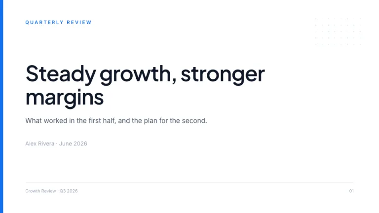
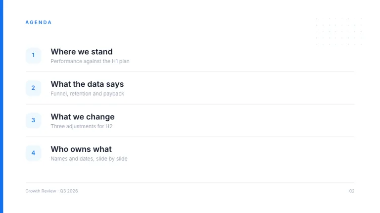
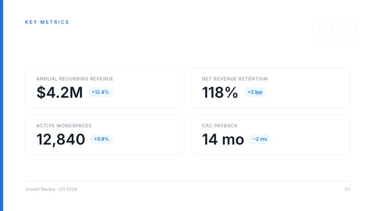
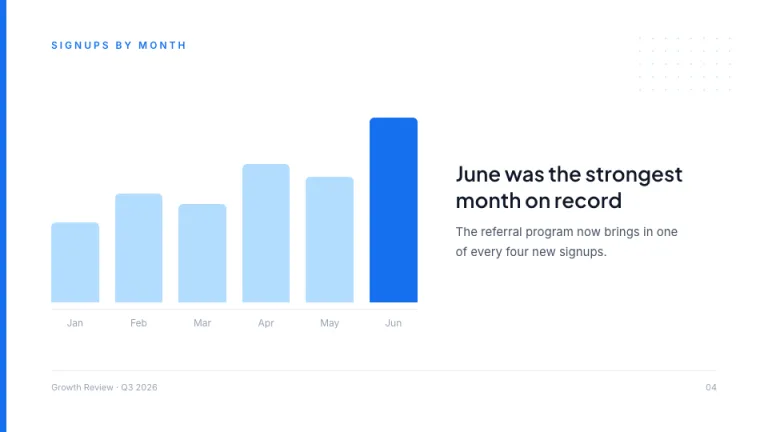
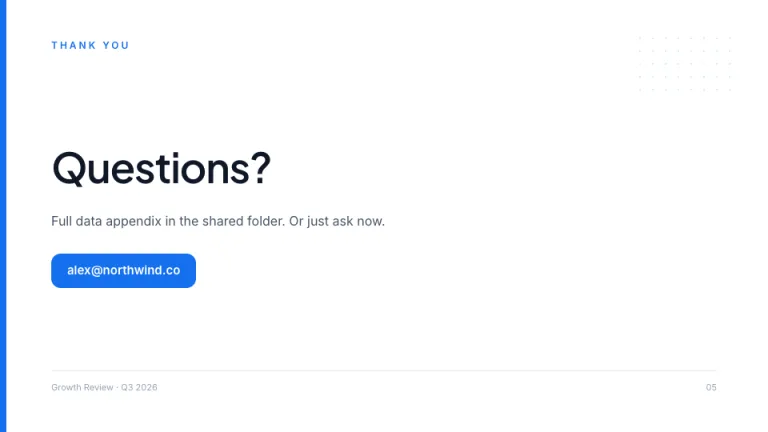

[← All prompts](../README.md) · [Live site](https://slidespeak.co/slide-design-prompts) · [SlideSpeak](https://slidespeak.co)

# Atlas

> The dependable one

Clean corporate blue with a brand bar on every slide. The theme you reach for when the work should speak first and the design should just hold the door.

**Category:** Business & strategy &nbsp;·&nbsp; **Style:** Corporate, Minimal &nbsp;·&nbsp; **Mode:** Light &nbsp;·&nbsp; **Fonts:** Plus Jakarta Sans + Inter

<table>
    <tr>
      <td align="center" width="33%"><br><sub>Title</sub></td>
      <td align="center" width="33%"><br><sub>Agenda</sub></td>
      <td align="center" width="33%"><br><sub>Key metrics</sub></td>
    </tr>
    <tr>
      <td align="center" width="33%"><br><sub>Chart & insight</sub></td>
      <td align="center" width="33%"><br><sub>Closing</sub></td>
    </tr>
</table>

## The prompt

Copy the prompt below into **ChatGPT**, **Claude**, or any AI chat — or grab the raw [`PROMPT.md`](./PROMPT.md). It asks what your presentation is about first, then applies the design to every slide.

```text
Create a presentation using the 'Atlas' theme. Background: white. A solid 8px vertical blue (#1570EF) bar runs down the entire left edge of every slide, and a small dotted pattern of light blue dots sits in the top-right corner at low opacity. Typography: headings in 'Plus Jakarta Sans' and body in 'Inter' (both Google Fonts), a clean geometric sans pairing; near-black headings (#101828), gray body (#475467). Every slide opens with a small blue uppercase kicker label above the headline, and closes with a thin gray footer rule carrying the deck name on the left and the page number on the right. Content sits in rounded cards (16px radius) with hairline #E5E9F2 borders and no shadows; key figures get a light blue chip (#EFF8FF background, blue text). Charts use blue tints (#1570EF for the key series, #B2DDFF for the rest) with no gridlines. Strictly avoid: more than one accent color, heavy shadows, decorative imagery.

Use this theme for my slides. Ask me what the presentation is about first, then apply the theme to every slide.
```

**[Open ChatGPT ↗](https://chatgpt.com/)** &nbsp;·&nbsp; **[Open Claude ↗](https://claude.ai/new)** &nbsp;·&nbsp; **[Generate a finished deck with SlideSpeak ↗](https://app.slidespeak.co/presentation?utm_source=github&utm_medium=referral&utm_campaign=slide-design-prompts)**

## Palette

| Role | Hex |
| --- | --- |
| Background | `#FFFFFF` |
| Surface / panel | `#FCFCFD` |
| Border | `#E5E9F2` |
| Primary accent | `#1570EF` |
| Primary (soft tint) | `#EFF8FF` |
| Text on primary | `#FFFFFF` |
| Heading text | `#101828` |
| Body text | `#475467` |
| Muted text | `#98A2B3` |

**Chart series:** `#1570EF` `#53B1FD` `#B2DDFF` `#EBEEF5`

## Fonts

- **Plus Jakarta Sans** (heading, Google Fonts)
- **Inter** (supporting, Google Fonts)

---

<sub>Part of [SlideSpeak Slide Design Prompts](../../README.md) · MIT licensed</sub>
