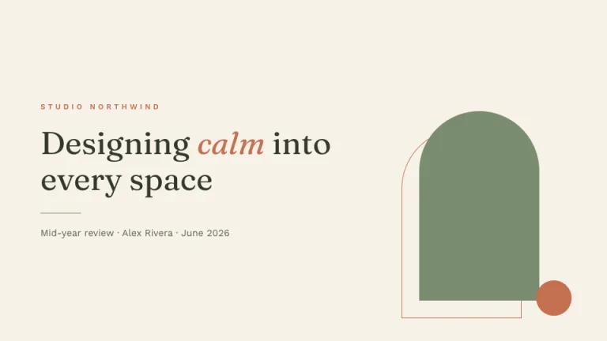
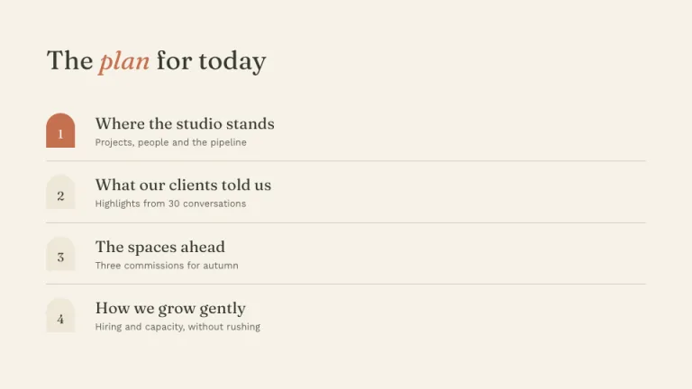
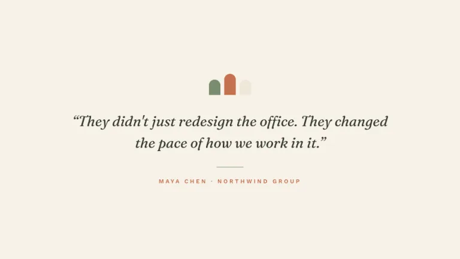
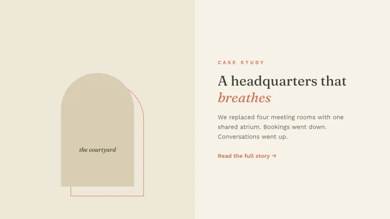
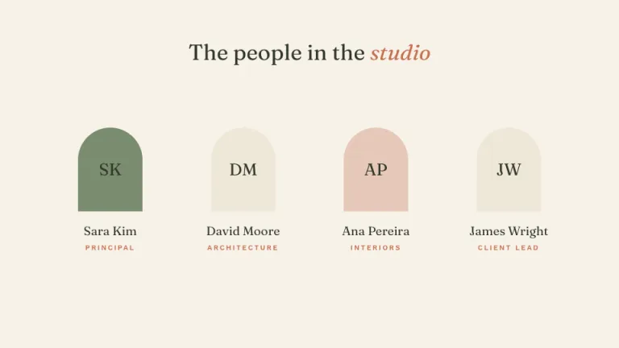
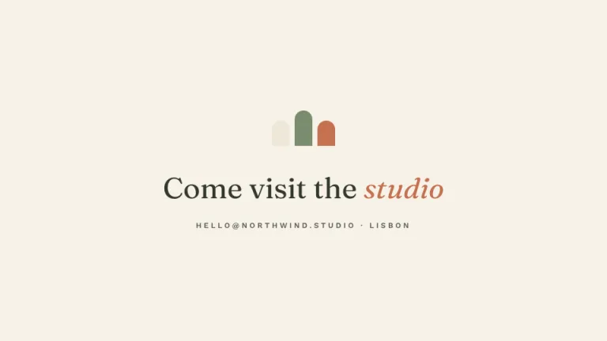

[← All prompts](../README.md) · [Live site](https://slidespeak.co/slide-design-prompts) · [SlideSpeak](https://slidespeak.co)

# Atrium

> Calm, like a courtyard

Cream, sage and terracotta built around arch shapes. An organic, architectural theme for studios, interiors and brands that take their time.

**Category:** Education & research &nbsp;·&nbsp; **Style:** Calm, Warm &nbsp;·&nbsp; **Mode:** Light &nbsp;·&nbsp; **Fonts:** Fraunces + Work Sans

<table>
    <tr>
      <td align="center" width="33%"><br><sub>Title</sub></td>
      <td align="center" width="33%"><br><sub>Agenda</sub></td>
      <td align="center" width="33%"><br><sub>Quote</sub></td>
    </tr>
    <tr>
      <td align="center" width="33%"><br><sub>Image + text</sub></td>
      <td align="center" width="33%"><br><sub>Team</sub></td>
      <td align="center" width="33%"><br><sub>Closing</sub></td>
    </tr>
</table>

## The prompt

Copy the prompt below into **ChatGPT**, **Claude**, or any AI chat — or grab the raw [`PROMPT.md`](./PROMPT.md). It asks what your presentation is about first, then applies the design to every slide.

```text
Create a presentation using the 'Atrium' theme. Background: warm cream (#F7F2E9). Palette: sage green (#7A8C6F), terracotta (#C4704F), soft sand (#EFE7D8) and deep olive ink (#33392B). The signature motif is the arch: a shape with a fully rounded top and a square bottom, used for image areas, portrait frames, number tokens and decorative elements. Behind each filled arch, draw a thin terracotta outline arch offset a few pixels as an echo. Headlines: 'Fraunces', with exactly one word set in italic terracotta. Body and kickers: 'Work Sans' (both are Google Fonts); kickers are small terracotta uppercase with wide letter-spacing. Rules are 1px olive lines at low opacity. Decorative ornaments are small trios of arches in sage, terracotta and sand. Charts: bars with fully rounded tops like arch windows, in sage and terracotta. Compositions are asymmetric but quiet, with generous margins. Strictly avoid: pure white, pure black, sharp-cornered imagery, neon or saturated colors, dense layouts.

Use this theme for my slides. Ask me what the presentation is about first, then apply the theme to every slide.
```

**[Open ChatGPT ↗](https://chatgpt.com/)** &nbsp;·&nbsp; **[Open Claude ↗](https://claude.ai/new)** &nbsp;·&nbsp; **[Generate a finished deck with SlideSpeak ↗](https://app.slidespeak.co/presentation?utm_source=github&utm_medium=referral&utm_campaign=slide-design-prompts)**

## Palette

| Role | Hex |
| --- | --- |
| Background | `#F7F2E9` |
| Surface / panel | `#EFE7D8` |
| Border | `#DCD2BC` |
| Primary accent | `#C4704F` |
| Primary (soft tint) | `#F2E0D6` |
| Text on primary | `#FFF8F0` |
| Heading text | `#33392B` |
| Body text | `#5C604E` |
| Muted text | `#98987F` |

**Chart series:** `#7A8C6F` `#C4704F` `#D9CBA8` `#E9E1CE`

## Fonts

- **Fraunces** (heading, Google Fonts)
- **Work Sans** (supporting, Google Fonts)

---

<sub>Part of [SlideSpeak Slide Design Prompts](../../README.md) · MIT licensed</sub>
