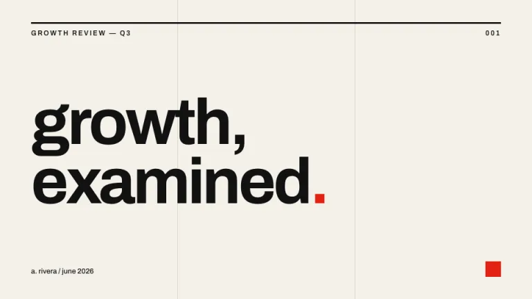
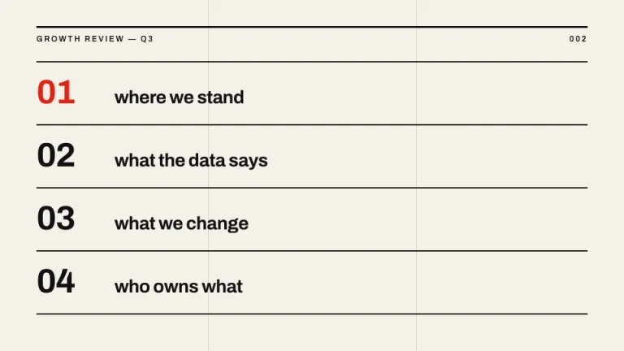
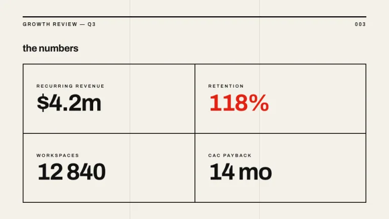
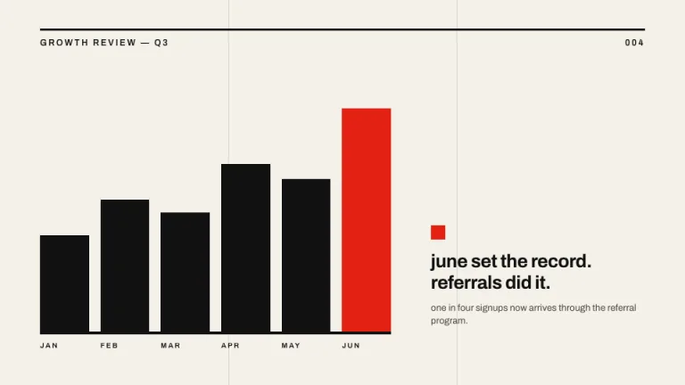
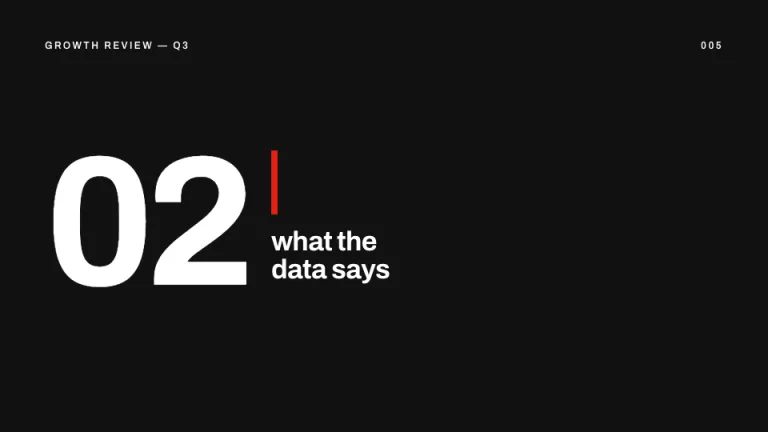
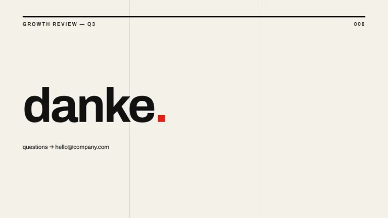

[← All prompts](../README.md) · [Live site](https://slidespeak.co/slide-design-prompts) · [SlideSpeak](https://slidespeak.co)

# Basel

> Loud type, nothing else

A Swiss poster turned into slides. Massive lowercase type on a visible grid, hard black rules and exactly one shot of red. There are no rounded corners anywhere.

**Category:** Creative & portfolio &nbsp;·&nbsp; **Style:** Bold, Minimal &nbsp;·&nbsp; **Mode:** Light &nbsp;·&nbsp; **Fonts:** Archivo

<table>
    <tr>
      <td align="center" width="33%"><br><sub>Title</sub></td>
      <td align="center" width="33%"><br><sub>Agenda</sub></td>
      <td align="center" width="33%"><br><sub>Key metrics</sub></td>
    </tr>
    <tr>
      <td align="center" width="33%"><br><sub>Chart & insight</sub></td>
      <td align="center" width="33%"><br><sub>Section divider</sub></td>
      <td align="center" width="33%"><br><sub>Closing</sub></td>
    </tr>
</table>

## The prompt

Copy the prompt below into **ChatGPT**, **Claude**, or any AI chat — or grab the raw [`PROMPT.md`](./PROMPT.md). It asks what your presentation is about first, then applies the design to every slide.

```text
Create a presentation in the style of a 1960s Swiss poster, the 'Basel' theme. Background: warm off-white (#F4F1EA). Typography: 'Archivo' (a Google Font), a tight grotesque sans used everywhere; headlines enormous (around 20 percent of slide height), lowercase, near-black (#111111), with negative letter-spacing and leading near 0.92. One accent only: Swiss red (#E32213), used once per slide as a small square, a thick rule, or a single character. Structure: a visible 3-column grid drawn with thin warm-gray vertical lines, and a 3px black rule across the top of every slide carrying small uppercase metadata (deck name left, slide number right). Charts are solid black rectangles with the key bar in red and a 4px black baseline, no other axis decoration. Section breaks: solid black slide, giant white numeral, one red bar. Strictly avoid: rounded corners, drop shadows, gradients, icons, photographs, any third color. Whitespace is the decoration.

Use this theme for my slides. Ask me what the presentation is about first, then apply the theme to every slide.
```

**[Open ChatGPT ↗](https://chatgpt.com/)** &nbsp;·&nbsp; **[Open Claude ↗](https://claude.ai/new)** &nbsp;·&nbsp; **[Generate a finished deck with SlideSpeak ↗](https://app.slidespeak.co/presentation?utm_source=github&utm_medium=referral&utm_campaign=slide-design-prompts)**

## Palette

| Role | Hex |
| --- | --- |
| Background | `#F4F1EA` |
| Surface / panel | `#FFFFFF` |
| Border | `#111111` |
| Primary accent | `#E32213` |
| Primary (soft tint) | `#F9DCD8` |
| Text on primary | `#FFFFFF` |
| Heading text | `#111111` |
| Body text | `#4A463E` |
| Muted text | `#8A867E` |

**Chart series:** `#111111` `#E32213` `#8A867E` `#DAD5C8`

## Fonts

- **Archivo** (heading and body, Google Fonts)

---

<sub>Part of [SlideSpeak Slide Design Prompts](../../README.md) · MIT licensed</sub>
