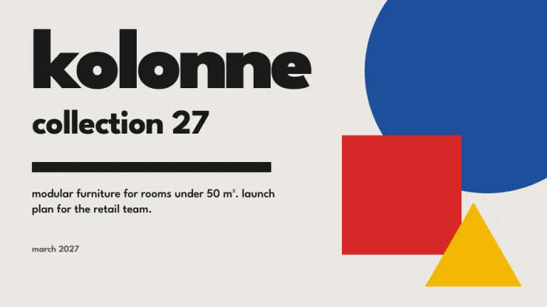
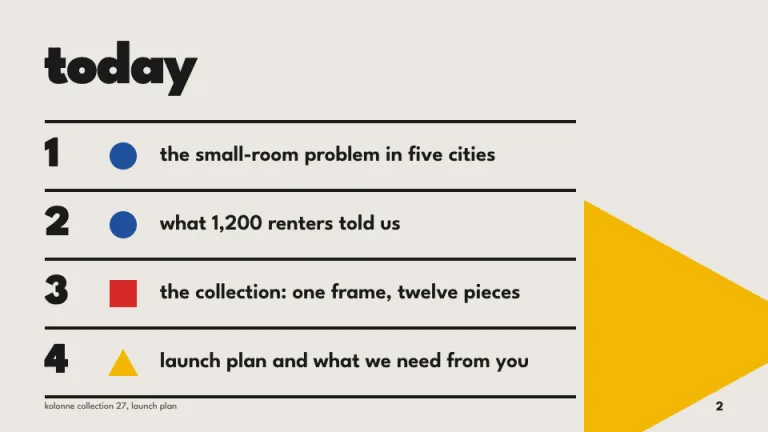
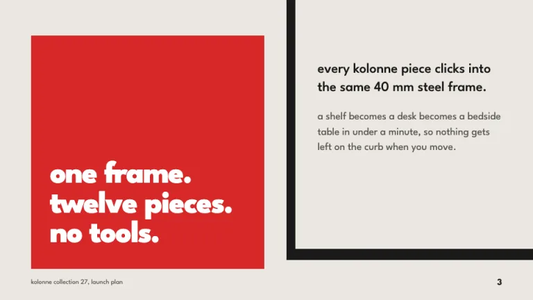
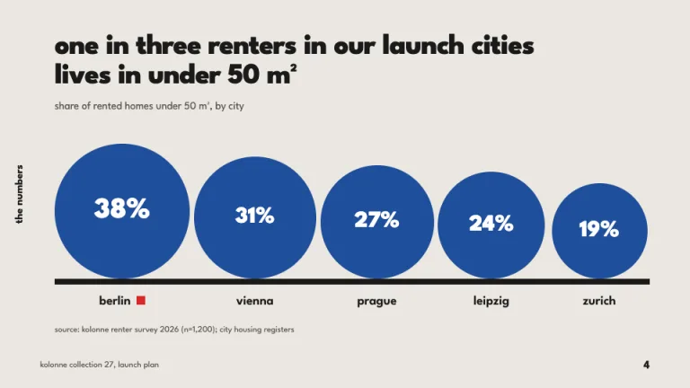
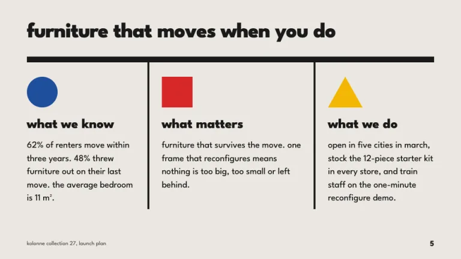
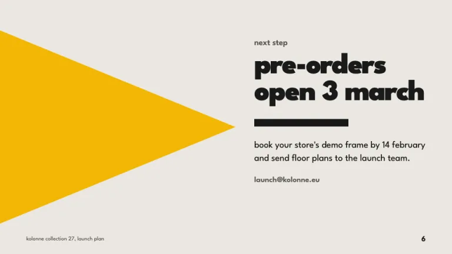

[← All prompts](../README.md) · [Live site](https://slidespeak.co/slide-design-prompts) · [SlideSpeak](https://slidespeak.co)

# Bauhaus

> Circle, square, triangle, and nothing else

A Bauhaus presentation built from the school's primary-color geometry: a red square for emphasis, a blue circle for data, a yellow triangle for direction, heavy black bars and all-lowercase League Spartan type. Use it as a Bauhaus aesthetic slides prompt for design talks, product launches and creative pitches.

**Category:** Creative & portfolio &nbsp;·&nbsp; **Style:** Bold, Retro &nbsp;·&nbsp; **Mode:** Light &nbsp;·&nbsp; **Fonts:** League Spartan

<table>
    <tr>
      <td align="center" width="33%"><br><sub>Title</sub></td>
      <td align="center" width="33%"><br><sub>Agenda</sub></td>
      <td align="center" width="33%"><br><sub>Big statement</sub></td>
    </tr>
    <tr>
      <td align="center" width="33%"><br><sub>Bubble chart</sub></td>
      <td align="center" width="33%"><br><sub>Three-column comparison</sub></td>
      <td align="center" width="33%"><br><sub>Closing</sub></td>
    </tr>
</table>

## The prompt

Copy the prompt below into **ChatGPT**, **Claude**, or any AI chat — or grab the raw [`PROMPT.md`](./PROMPT.md). It asks what your presentation is about first, then applies the design to every slide.

```text
Create a presentation in the 'Bauhaus' theme, a flat, primary-color composition system after the 1920s Bauhaus school. Background: warm paper gray (#ebe8e1) on every slide; white (#ffffff) only as text on red. Typography: 'League Spartan' (Google Fonts) for everything: headlines in weights 700 to 900 at 56 to 150px with tight 0.9 leading and -0.02em tracking, body in 400 to 500 at 18 to 25px in black (#1a1a1a), captions and sources at 12 to 15px in warm gray (#5c5a55). Every word is lowercase, including titles, names, labels and chart text, after Herbert Bayer's universal alphabet; never use a capital letter. The signature is Kandinsky's form-color correspondence used as a meaning system: a red (#d62828) square marks emphasis or the key point, a blue (#1f4e9c) circle marks data and facts, a yellow (#f2b705) triangle marks direction and next steps. Never put a color on the wrong shape. Shapes are large, flat and hard-edged, overlap one another and bleed off the slide edges; black (#1a1a1a) bars 12 to 24px thick are the structure, underlining titles or dividing columns. Layouts are asymmetric and left-aligned with 56px outer margins; one short label per deck may run vertically along the left edge, rotated 90 degrees. Title slide: a lowercase title at 120 to 150px top-left, a subtitle at 56 to 64px, an 18px black bar, a one-line context, and a composition of one blue circle bleeding off the top right, a red square overlapping it and a yellow triangle. Agenda: a numbered list of 3 to 5 items with 54px black numerals between 4px black rules, each item marked by the shape of its content type. Statement slides: one short phrase in white at about 60px set inside a large red square, a supporting sentence beside it, and black bars framing it. Data slides: blue circles sized by area as a bubble chart, or blue bars, on an 8px black baseline, with white values inside and lowercase labels beneath; the one data point that proves the title gets a small red square marker; a source line sits under the chart. Comparison slides: three columns headed by a circle, a square and a triangle (facts, key point, action), divided by 4px black rules under a 12px black bar. Closing slide: a giant yellow triangle pointing right into the next step, set at about 62px. Footer: deck name bottom-left in 12px #5c5a55 and a bold page number bottom-right. Strictly avoid: capital letters anywhere, serif or script fonts, gradients, drop shadows, rounded rectangles, pastel tints, photographs, texture or grain overlays, colors beyond the three primaries plus black and paper, a shape in the wrong color, centered symmetrical layouts, outline icons, and shapes that carry no meaning.

Use this theme for my slides. Ask me what the presentation is about first, then apply the theme to every slide.
```

**[Open ChatGPT ↗](https://chatgpt.com/)** &nbsp;·&nbsp; **[Open Claude ↗](https://claude.ai/new)** &nbsp;·&nbsp; **[Generate a finished deck with SlideSpeak ↗](https://app.slidespeak.co/presentation?utm_source=github&utm_medium=referral&utm_campaign=slide-design-prompts)**

## Palette

| Role | Hex |
| --- | --- |
| Background | `#ebe8e1` |
| Surface / panel | `#ffffff` |
| Border | `#1a1a1a` |
| Primary accent | `#d62828` |
| Primary (soft tint) | `#f6c9c9` |
| Text on primary | `#ffffff` |
| Heading text | `#1a1a1a` |
| Body text | `#1a1a1a` |
| Muted text | `#5c5a55` |

**Chart series:** `#d62828` `#1f4e9c` `#f2b705` `#1a1a1a`

## Fonts

- **League Spartan** (heading, Google Fonts)

---

<sub>Part of [SlideSpeak Slide Design Prompts](../../README.md) · MIT licensed</sub>
