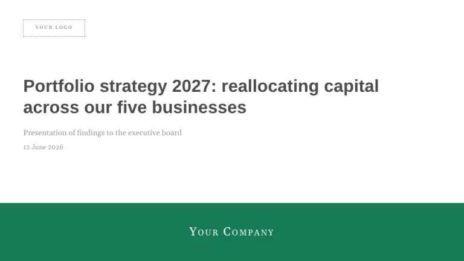
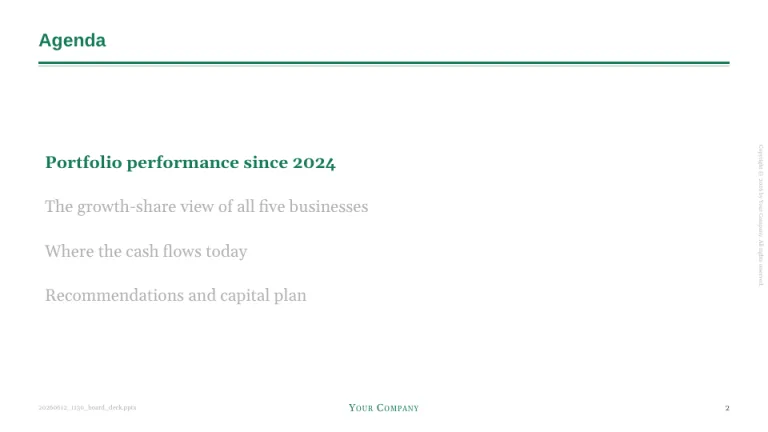
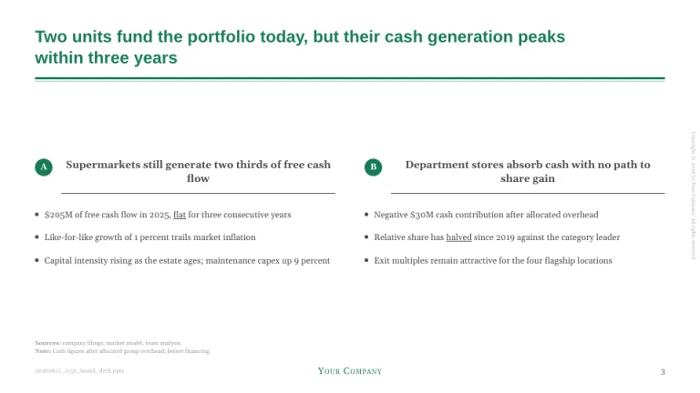
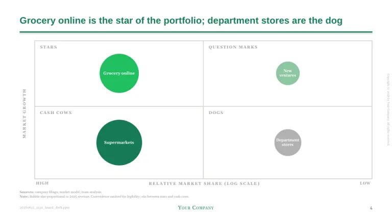
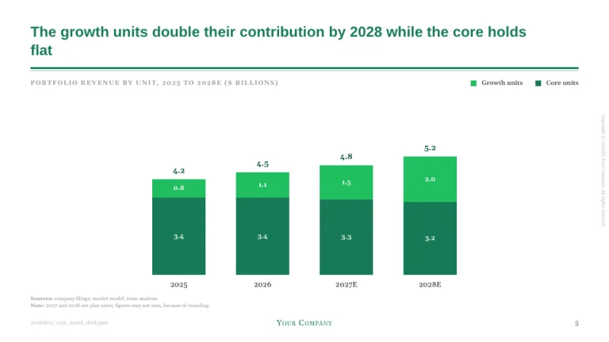
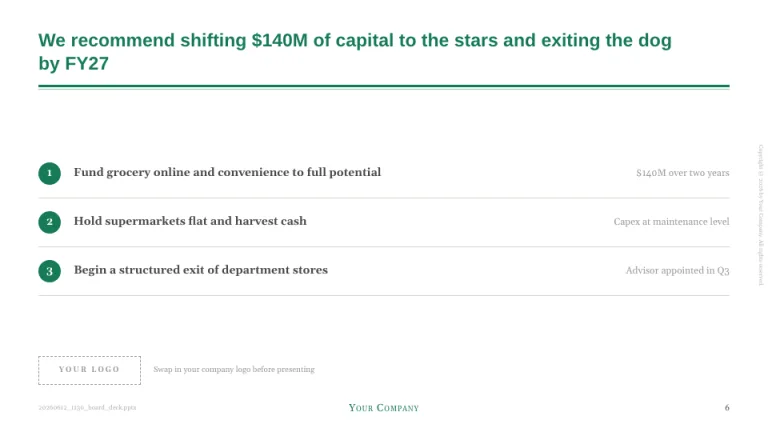

[← All prompts](../README.md) · [Live site](https://slidespeak.co/slide-design-prompts) · [SlideSpeak](https://slidespeak.co)

# BCG Style

> Strategy lives in a 2x2

An unofficial homage to the classic BCG deck: green action titles over a double rule, an agenda tracker, the growth-share matrix with stars and dogs, and a logo placeholder ready for your own brand. Not affiliated with Boston Consulting Group.

**Category:** Finance & consulting &nbsp;·&nbsp; **Style:** Corporate, Bold &nbsp;·&nbsp; **Mode:** Light &nbsp;·&nbsp; **Fonts:** Arimo + Gelasio

<table>
    <tr>
      <td align="center" width="33%"><br><sub>Title</sub></td>
      <td align="center" width="33%"><br><sub>Agenda</sub></td>
      <td align="center" width="33%"><br><sub>Two-column findings</sub></td>
    </tr>
    <tr>
      <td align="center" width="33%"><br><sub>Growth-share matrix</sub></td>
      <td align="center" width="33%"><br><sub>Stacked bars</sub></td>
      <td align="center" width="33%"><br><sub>Recommendation</sub></td>
    </tr>
</table>

## The prompt

Copy the prompt below into **ChatGPT**, **Claude**, or any AI chat — or grab the raw [`PROMPT.md`](./PROMPT.md). It asks what your presentation is about first, then applies the design to every slide.

```text
Create a presentation in the 'BCG Style' theme, an unofficial homage to the classic growth-strategy consulting deck. Background: white (#FFFFFF). Typography: the plain neutral sans 'Arimo' throughout, with the serif wordmarks in 'Gelasio' (both Google Fonts). The signature header: every content slide opens with a full-sentence action title in bold green (#177B57), sentence case, 15 to 25 words allowed across two lines, followed by a full-width 3px green rule with a thin light green (#8EC6A1) echo line just beneath it. Body text is dark gray (#4A4A4A) in exactly two sizes; emphasis comes from underlining single words and bolding lead phrases, never from color. Title slide: white, with a dark gray bold title up to three lines, a lighter subtitle and date, and a solid green (#177B57) band across the bottom holding a white small-caps 'Gelasio' company wordmark; the title slide also carries a logo placeholder, a dashed 1px box labeled 'YOUR LOGO' in letterspaced caps. An 'Agenda' slide reappears as a tracker: the current section bold green, all other sections gray (#B2B2B2). Two-column slides put a centered, underlined lead-in statement at the top of each column, keyed by small solid green circle badges with white letters. The signature exhibit is the growth-share matrix: a 2x2 with quadrants labeled Stars, Question marks, Cash cows and Dogs, market growth on the y axis, relative market share on a reversed log-scale x axis (high on the left), and circles sized by revenue. Charts carry an all-caps gray kicker with units in parentheses, stacked green columns (#177B57 and #21BF61) with bold white value labels inside segments and totals above the bars, and a tiny 'Sources: ...; team analysis.' block with a 'Note:' line underneath. Every content slide has a rotated copyright line running vertically up the right edge, a tiny source-file name bottom-left, a centered green small-caps 'Gelasio' wordmark in the footer and a plain page number bottom-right. Strictly avoid: colors outside the green family and grays, gradients, drop shadows, decorative imagery, topic-label titles, legends where direct labels work, claiming affiliation with Boston Consulting Group.

Use this theme for my slides. Ask me what the presentation is about first, then apply the theme to every slide.
```

**[Open ChatGPT ↗](https://chatgpt.com/)** &nbsp;·&nbsp; **[Open Claude ↗](https://claude.ai/new)** &nbsp;·&nbsp; **[Generate a finished deck with SlideSpeak ↗](https://app.slidespeak.co/presentation?utm_source=github&utm_medium=referral&utm_campaign=slide-design-prompts)**

## Palette

| Role | Hex |
| --- | --- |
| Background | `#FFFFFF` |
| Surface / panel | `#F6F4F3` |
| Border | `#D9D6D0` |
| Primary accent | `#177B57` |
| Primary (soft tint) | `#E4F1EA` |
| Text on primary | `#FFFFFF` |
| Heading text | `#177B57` |
| Body text | `#4A4A4A` |
| Muted text | `#9A9A9A` |

**Chart series:** `#177B57` `#21BF61` `#8EC6A1` `#E6E0DB`

## Fonts

- **Arimo** (heading, Google Fonts)
- **Gelasio** (supporting, Google Fonts)

---

<sub>Part of [SlideSpeak Slide Design Prompts](../../README.md) · MIT licensed</sub>
