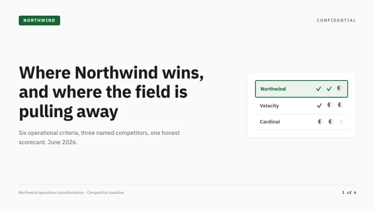
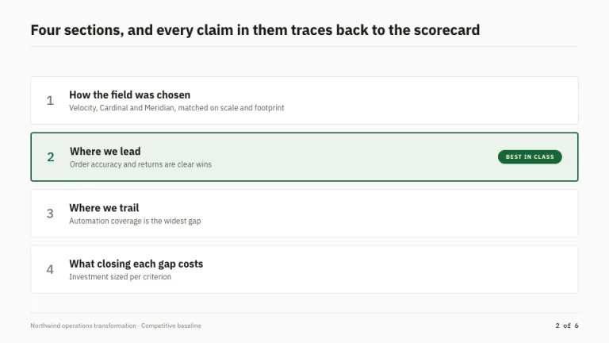
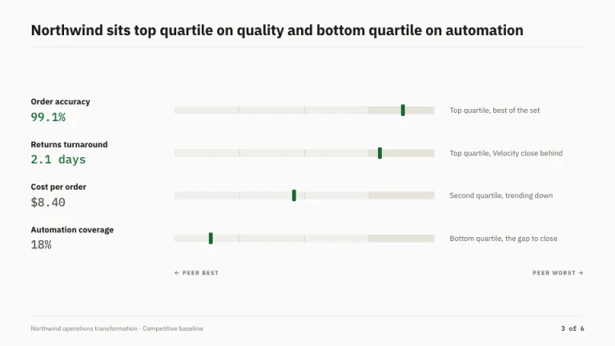
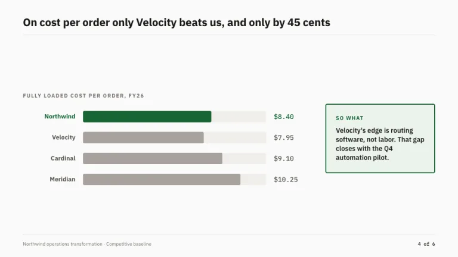
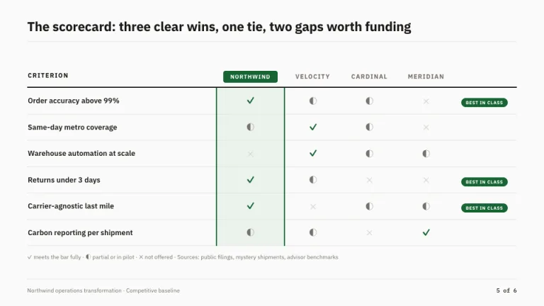
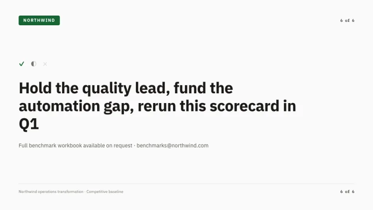

[← All prompts](../README.md) · [Live site](https://slidespeak.co/slide-design-prompts) · [SlideSpeak](https://slidespeak.co)

# Benchmark

> Us versus the field

A competitive benchmarking deck centered on the comparison matrix. Our column sits in a green box; the competitors stay gray.

**Category:** Business & strategy &nbsp;·&nbsp; **Style:** Corporate, Minimal &nbsp;·&nbsp; **Mode:** Light &nbsp;·&nbsp; **Fonts:** IBM Plex Sans + IBM Plex Mono

<table>
    <tr>
      <td align="center" width="33%"><br><sub>Title</sub></td>
      <td align="center" width="33%"><br><sub>Agenda</sub></td>
      <td align="center" width="33%"><br><sub>Key metrics</sub></td>
    </tr>
    <tr>
      <td align="center" width="33%"><br><sub>Chart & insight</sub></td>
      <td align="center" width="33%"><br><sub>Pricing</sub></td>
      <td align="center" width="33%"><br><sub>Closing</sub></td>
    </tr>
</table>

## The prompt

Copy the prompt below into **ChatGPT**, **Claude**, or any AI chat — or grab the raw [`PROMPT.md`](./PROMPT.md). It asks what your presentation is about first, then applies the design to every slide.

```text
Create a presentation in the 'Benchmark' theme, a competitive benchmarking deck. Background: warm off-white (#FAFAF9). Typography: 'IBM Plex Sans' for headings and supporting text, with figures in the monospaced 'IBM Plex Mono' (both Google Fonts); headings in ink (#1C1917); supporting text in #57534E. Signature motif: the comparison matrix, a table with criteria as rows and competitors as columns where each cell holds one glyph, a green check (#166534), a gray half circle (#78716C) or a light gray cross (#D6D3D1). The client column is tinted #EBF3EC, framed by a 2px #166534 border, and topped with a small green chip reading the client name; rows the client wins carry a tiny green 'Best in class' pill. Stats use quartile bars, four equal segments in #F0EFEA split by hairlines, with a 6px green marker showing the client position. Forest green (#166534) marks the client everywhere; competitors stay gray. Rules use #E7E5E4. Strictly avoid: red versus green scoring, competitor logos, photographs, gradients, drop shadows, corner radii above 4px.

Use this theme for my slides. Ask me what the presentation is about first, then apply the theme to every slide.
```

**[Open ChatGPT ↗](https://chatgpt.com/)** &nbsp;·&nbsp; **[Open Claude ↗](https://claude.ai/new)** &nbsp;·&nbsp; **[Generate a finished deck with SlideSpeak ↗](https://app.slidespeak.co/presentation?utm_source=github&utm_medium=referral&utm_campaign=slide-design-prompts)**

## Palette

| Role | Hex |
| --- | --- |
| Background | `#FAFAF9` |
| Surface / panel | `#FFFFFF` |
| Border | `#E7E5E4` |
| Primary accent | `#166534` |
| Primary (soft tint) | `#EBF3EC` |
| Text on primary | `#FFFFFF` |
| Heading text | `#1C1917` |
| Body text | `#57534E` |
| Muted text | `#78716C` |

**Chart series:** `#166534` `#1C1917` `#A8A29E` `#F0EFEA`

## Fonts

- **IBM Plex Sans** (heading, Google Fonts)
- **IBM Plex Mono** (supporting, Google Fonts)

---

<sub>Part of [SlideSpeak Slide Design Prompts](../../README.md) · MIT licensed</sub>
