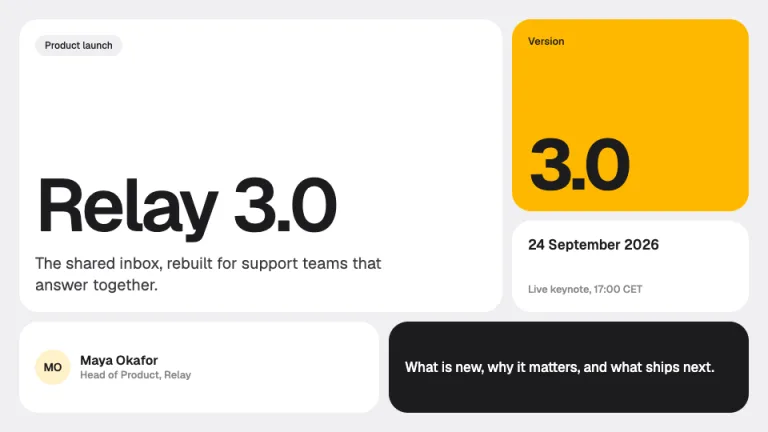
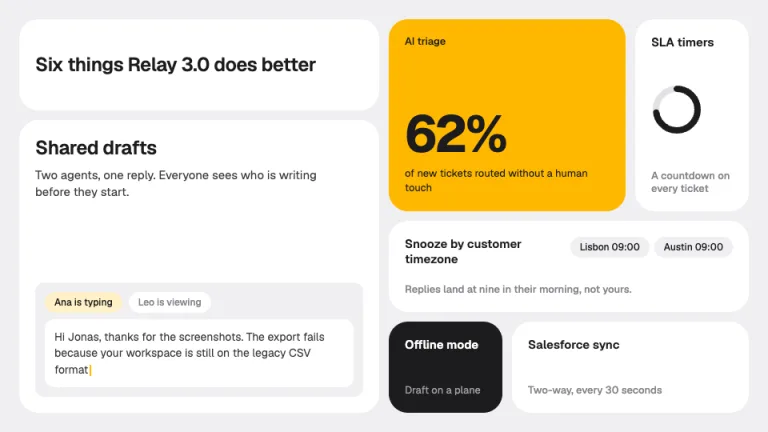
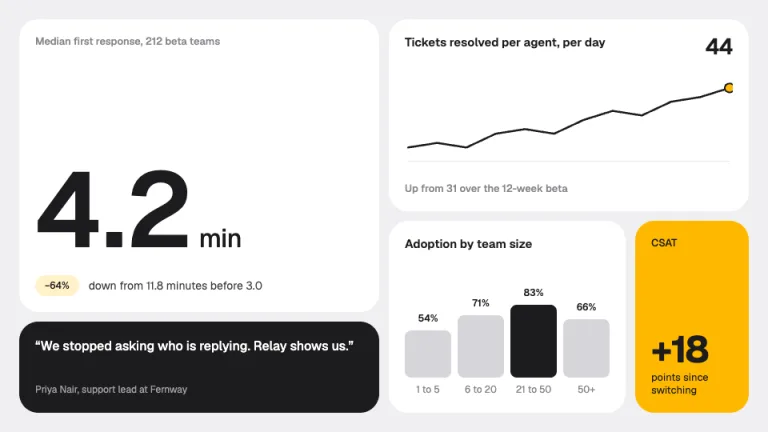
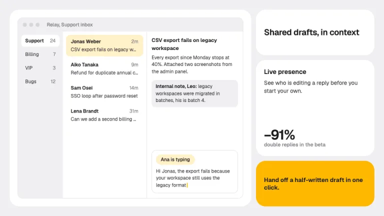
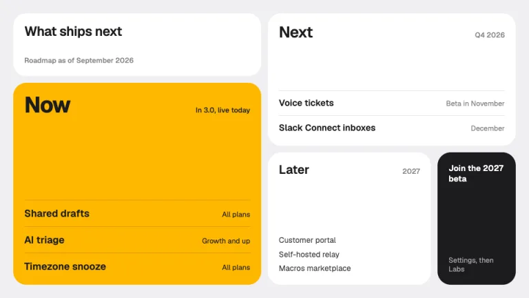
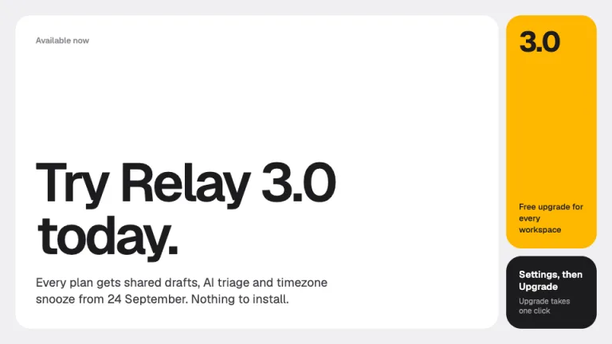

[← All prompts](../README.md) · [Live site](https://slidespeak.co/slide-design-prompts) · [SlideSpeak](https://slidespeak.co)

# Bento

> Big tiles for big news

A bento grid presentation for product launches and updates. Each slide is a grid of white tiles in mixed sizes on light gray, with one sunflower tile for the key fact, one optional ink tile and no shadows. Paste the prompt into ChatGPT or Claude to get bento slides that look like a launch page.

**Category:** Tech & product &nbsp;·&nbsp; **Style:** Minimal, Tech &nbsp;·&nbsp; **Mode:** Light &nbsp;·&nbsp; **Fonts:** Geist

<table>
    <tr>
      <td align="center" width="33%"><br><sub>Title bento</sub></td>
      <td align="center" width="33%"><br><sub>Feature grid</sub></td>
      <td align="center" width="33%"><br><sub>Metrics bento</sub></td>
    </tr>
    <tr>
      <td align="center" width="33%"><br><sub>Product mock</sub></td>
      <td align="center" width="33%"><br><sub>Roadmap bento</sub></td>
      <td align="center" width="33%"><br><sub>Closing</sub></td>
    </tr>
</table>

## The prompt

Copy the prompt below into **ChatGPT**, **Claude**, or any AI chat — or grab the raw [`PROMPT.md`](./PROMPT.md). It asks what your presentation is about first, then applies the design to every slide.

```text
Create a presentation in the 'Bento' theme, a modular tile grid in the style of product launch pages. Background: light gray #efeff1 on every slide. Typography: 'Geist' (Google Fonts) for everything; hero numbers and titles at 600 to 700 weight with tight letter spacing (-0.03em to -0.05em), tile titles 15 to 24px weight 600 in #1c1c1e, body 13 to 16px in #3a3a3f, secondary lines 12 to 13px in #86868b, nothing below 12px. The signature is the grid itself: every slide is a 6-column by 4-row grid with 12px gutters and a 24px outer margin, and tiles must vary in span. Each slide has at least one hero tile spanning 3x2, 3x3, 4x3 or 4x4, mixed with 1x1, 2x1, 1x2 and 2x2 tiles; never a row of equal cards. Radius hierarchy: tiles 24px, elements inside tiles 12px, pills fully round. Tiles are white #ffffff and separated by the gutter alone: no borders, no shadows. Exactly one tile per slide is sunflower #ffb800 with #1c1c1e text, carrying the single most important fact; at most one tile is inverted ink #1c1c1e with white text and #a1a1a6 secondary text. Each tile holds one content type only: a big stat, a sparkline, a mini bar chart, a quote, a short list, a CSS-drawn product window, or a label. The headline sits inside a tile, never floating above the grid. Title slide: a 4x3 hero tile with a small gray pill and the product name at 80 to 96px, a sunflower tile with the version number, a date tile, a presenter tile and an ink tile with the agenda line. Feature slides: one tile per feature, sized by importance, the lead feature in the hero tile with a small CSS mock of it. Metric slides: a hero stat at 110 to 140px with its unit at a quarter of the size and a #fff1c7 delta pill, a sparkline tile drawn as a 2.5px #1c1c1e line ending in a sunflower dot, a bar tile with bars in #d6d6db and the one that matters in #1c1c1e, a sunflower delta tile, an ink quote tile. Product slides: a CSS app window in a 4x4 tile with #efeff1 chrome and 1px #e2e2e6 dividers, annotations in their own tiles beside it, not arrows over it. Roadmaps: Now, Next and Later tiles that shrink as certainty drops, Now in sunflower. Closing: one 5x4 tile with the call to action at 80px plus a small ink tile with the URL. There is no footer bar or chrome outside the grid. Strictly avoid: identical tile sizes, rows of equal cards, drop shadows, borders around tiles, gradient washes, glassmorphism or blur, more than one sunflower tile per slide, icons in every tile, emoji, monospace fonts, text below 12px, centered text blocks, headlines above the grid on content slides, stock photos, device mockup frames.

Use this theme for my slides. Ask me what the presentation is about first, then apply the theme to every slide.
```

**[Open ChatGPT ↗](https://chatgpt.com/)** &nbsp;·&nbsp; **[Open Claude ↗](https://claude.ai/new)** &nbsp;·&nbsp; **[Generate a finished deck with SlideSpeak ↗](https://app.slidespeak.co/presentation?utm_source=github&utm_medium=referral&utm_campaign=slide-design-prompts)**

## Palette

| Role | Hex |
| --- | --- |
| Background | `#efeff1` |
| Surface / panel | `#ffffff` |
| Border | `#e2e2e6` |
| Primary accent | `#ffb800` |
| Primary (soft tint) | `#fff1c7` |
| Text on primary | `#1c1c1e` |
| Heading text | `#1c1c1e` |
| Body text | `#3a3a3f` |
| Muted text | `#86868b` |

**Chart series:** `#1c1c1e` `#ffb800` `#9a9aa3` `#d6d6db`

## Fonts

- **Geist** (heading, Google Fonts)

---

<sub>Part of [SlideSpeak Slide Design Prompts](../../README.md) · MIT licensed</sub>
