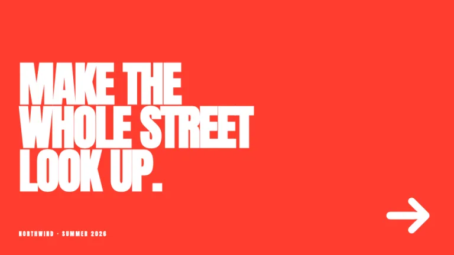
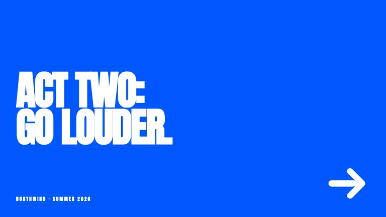
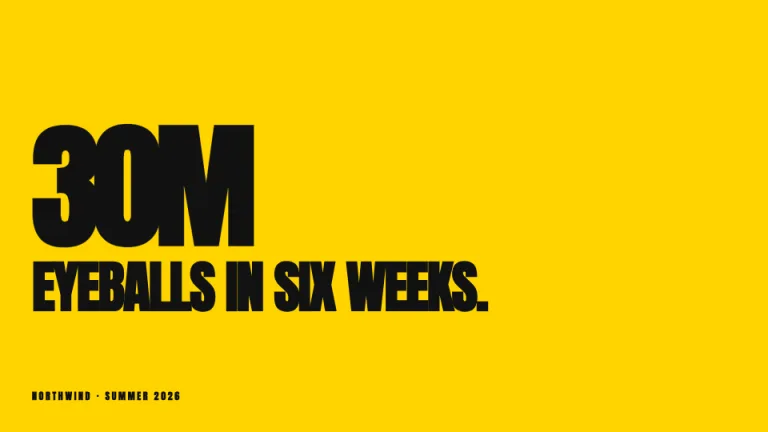
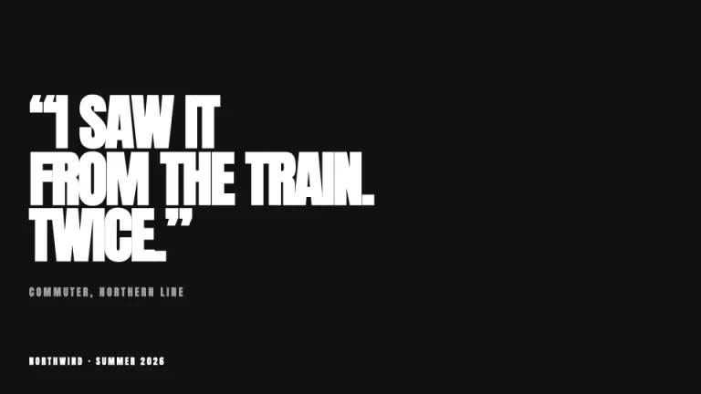
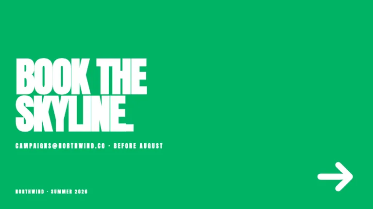

[← All prompts](../README.md) · [Live site](https://slidespeak.co/slide-design-prompts) · [SlideSpeak](https://slidespeak.co)

# Billboard

> One color, one line

Every slide is one loud solid color and one giant line of type. A tiny brand mark sits bottom-left and that is the whole design.

**Category:** Marketing & brand &nbsp;·&nbsp; **Style:** Bold, Playful &nbsp;·&nbsp; **Mode:** Dark &nbsp;·&nbsp; **Fonts:** Anton

<table>
    <tr>
      <td align="center" width="33%"><br><sub>Title</sub></td>
      <td align="center" width="33%"><br><sub>Section divider</sub></td>
      <td align="center" width="33%"><br><sub>Key metrics</sub></td>
    </tr>
    <tr>
      <td align="center" width="33%"><br><sub>Quote</sub></td>
      <td align="center" width="33%"><br><sub>Closing</sub></td>
    </tr>
</table>

## The prompt

Copy the prompt below into **ChatGPT**, **Claude**, or any AI chat — or grab the raw [`PROMPT.md`](./PROMPT.md). It asks what your presentation is about first, then applies the design to every slide.

```text
Create a presentation in the 'Billboard' theme, an outdoor ad campaign. Every slide is one full-bleed solid color, rotating in this order: red #FF3D2E, blue #0057FF, yellow #FFD400, black #111111, green #00B364. Typography: 'Anton' (a Google Font) everywhere, an extra-bold uppercase sans with a condensed feel, tight tracking of -0.03em, set between 70 and 110px so the headline fills most of the slide; white type on every color except yellow #FFD400, which takes black #111111. Copy reads like ad lines, short and declarative. Signature motifs: (1) a tiny brand line bottom-left, 12px uppercase with 0.22em tracking, reading 'NORTHWIND · SUMMER 2026'; (2) at most one extra element per slide, an oversized arrow character '→' at 120px in a corner or one huge stat at 170px; (3) nothing else on the canvas. Strictly avoid: more than one background color per slide, gradients, borders or frames, body paragraphs, charts or tables, small decorative icons.

Use this theme for my slides. Ask me what the presentation is about first, then apply the theme to every slide.
```

**[Open ChatGPT ↗](https://chatgpt.com/)** &nbsp;·&nbsp; **[Open Claude ↗](https://claude.ai/new)** &nbsp;·&nbsp; **[Generate a finished deck with SlideSpeak ↗](https://app.slidespeak.co/presentation?utm_source=github&utm_medium=referral&utm_campaign=slide-design-prompts)**

## Palette

| Role | Hex |
| --- | --- |
| Background | `#FF3D2E` |
| Surface / panel | `#0057FF` |
| Border | `#FFFFFF` |
| Primary accent | `#FFD400` |
| Primary (soft tint) | `#FFEB80` |
| Text on primary | `#111111` |
| Heading text | `#FFFFFF` |
| Body text | `#FFFFFF` |
| Muted text | `#FFD1CB` |

**Chart series:** `#FFD400` `#0057FF` `#00B364` `#111111`

## Fonts

- **Anton** (heading and body, Google Fonts)

---

<sub>Part of [SlideSpeak Slide Design Prompts](../../README.md) · MIT licensed</sub>
