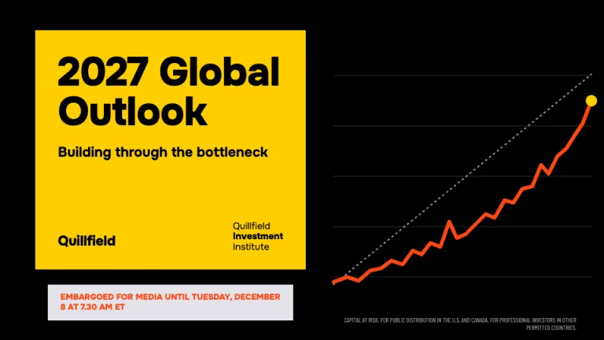
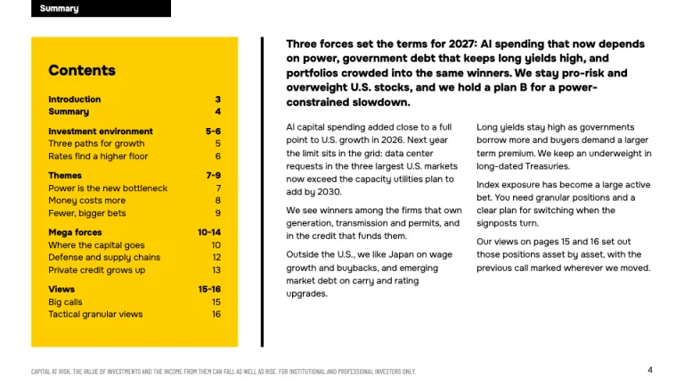
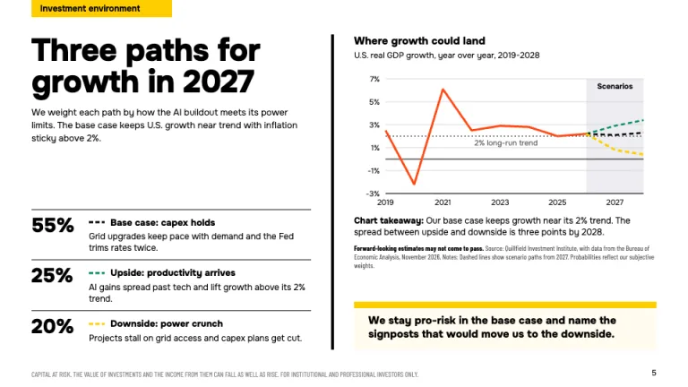
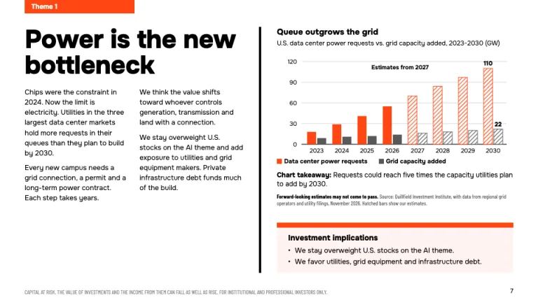
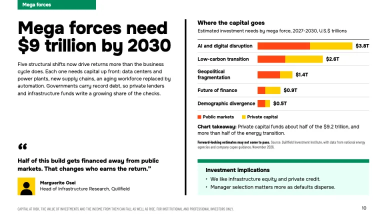
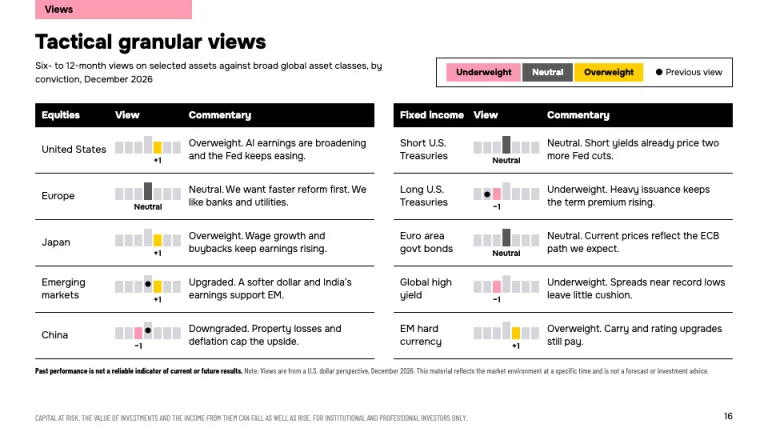

[← All prompts](../README.md) · [Live site](https://slidespeak.co/slide-design-prompts) · [SlideSpeak](https://slidespeak.co)

# BlackRock Outlook

> The house view, tabbed by section

A BlackRock outlook presentation prompt for annual market views: color-coded section tabs, scenario charts and a tactical views table of asset calls. An unofficial homage to the BlackRock Investment Institute outlook style. Not affiliated with, endorsed by, or connected to BlackRock, Inc.

**Category:** Finance &nbsp;·&nbsp; **Style:** Corporate, Bold &nbsp;·&nbsp; **Mode:** Light &nbsp;·&nbsp; **Fonts:** Onest + Barlow Condensed

<table>
    <tr>
      <td align="center" width="33%"><br><sub>Cover</sub></td>
      <td align="center" width="33%"><br><sub>Summary and contents</sub></td>
      <td align="center" width="33%"><br><sub>Scenario paths</sub></td>
    </tr>
    <tr>
      <td align="center" width="33%"><br><sub>Theme page</sub></td>
      <td align="center" width="33%"><br><sub>Mega forces</sub></td>
      <td align="center" width="33%"><br><sub>Tactical views</sub></td>
    </tr>
</table>

## The prompt

Copy the prompt below into **ChatGPT**, **Claude**, or any AI chat — or grab the raw [`PROMPT.md`](./PROMPT.md). It asks what your presentation is about first, then applies the design to every slide.

```text
Create a presentation in the 'BlackRock Outlook' theme, an unofficial homage to an investment institute's annual global outlook. Background: white (#ffffff) on content slides, black (#000000) on the cover. Typography: 'Onest' (Google Fonts) 800 for headlines at 42 to 48px with 1.0 leading, 800 at 15px for chart titles, 400 at 11.5 to 13px for body in pure black; source notes and disclaimers in 'Barlow Condensed' 400 at 10px. Signature: each content slide has a color-coded section tab flush with the top edge, 196 by 24px, bold 12px sentence-case label: yellow #ffce00 with black text for Investment environment, vermilion #ff4713 with white text for Themes, green #008b5c with white text for Mega forces, pink #fc9bb3 with black text for Views, black for Summary. Split pages: headline and two body columns left, a 4px black vertical rule, exhibit right. Exhibit stack: bold chart title, a plain subtitle with units and dates, the chart, a 'Chart takeaway:' line with the label bold, a Barlow Condensed source note opening with 'Forward-looking estimates may not come to pass.' in bold, then an Investment implications box: 9px top bar in the section color over a tint (#fff3f0, #e8fff7, #fffbef), bold 14px heading, two bullets. Charts: vermilion #ff4713 for the lead series, then #ffce00, #008b5c, #fc9bb3; #d6d5dd gridlines, black baseline, hatched bars for estimates, dashed scenario lines over a #ededf1 forecast window. Cover: a #ffce00 block on a black field with the year and 'Global Outlook' at 64px 800, a 22px bold subtitle, the institute name stacked with the middle word bold, and a #e3e3ea embargo strip in #ff4713 bold capitals. Contents: a yellow panel, bold sections with page ranges. Scenarios: probabilities at 28px 800 beside one-line cases, 1.5px black rules. Mega forces: stacked horizontal bars (public vs. private capital) with direct totals, and a bold pull quote with a yellow portrait tile. Tactical views table: black header row (asset class, View, Commentary), 1.5px black row rules, and a seven-cell conviction meter per asset: #d6d5dd cells with a taller center cell, the active cell pink for underweight, #595959 for neutral, yellow for overweight, a 10px bold label beneath ('+1', 'Neutral', '-1'), a black dot on the previous view, and a legend box above. Footer: a capitals 'Capital at risk' disclaimer bottom-left in 10px #8a8a8a Barlow Condensed, page number bottom-right. Strictly avoid: the BlackRock logo, wordmark or name on slides, claiming affiliation with BlackRock, Inc., gradients, drop shadows, rounded corners, photos, icons, centered body text, pie or 3D charts, gray body copy, colors outside the palette, content slides without a section tab, charts without a takeaway line and source note.

Use this theme for my slides. Ask me what the presentation is about first, then apply the theme to every slide.
```

**[Open ChatGPT ↗](https://chatgpt.com/)** &nbsp;·&nbsp; **[Open Claude ↗](https://claude.ai/new)** &nbsp;·&nbsp; **[Generate a finished deck with SlideSpeak ↗](https://app.slidespeak.co/presentation?utm_source=github&utm_medium=referral&utm_campaign=slide-design-prompts)**

## Palette

| Role | Hex |
| --- | --- |
| Background | `#ffffff` |
| Surface / panel | `#ededf1` |
| Border | `#d6d5dd` |
| Primary accent | `#ffce00` |
| Primary (soft tint) | `#fffbef` |
| Text on primary | `#000000` |
| Heading text | `#000000` |
| Body text | `#000000` |
| Muted text | `#595959` |

**Chart series:** `#ff4713` `#ffce00` `#008b5c` `#fc9bb3`

## Fonts

- **Onest** (heading, Google Fonts)
- **Barlow Condensed** (supporting, Google Fonts)

---

<sub>Part of [SlideSpeak Slide Design Prompts](../../README.md) · MIT licensed</sub>
