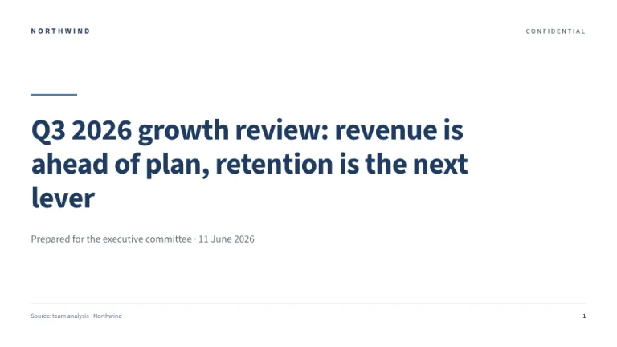
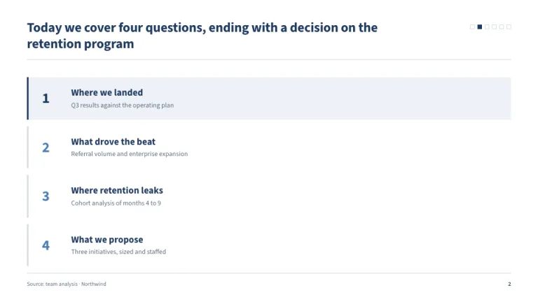
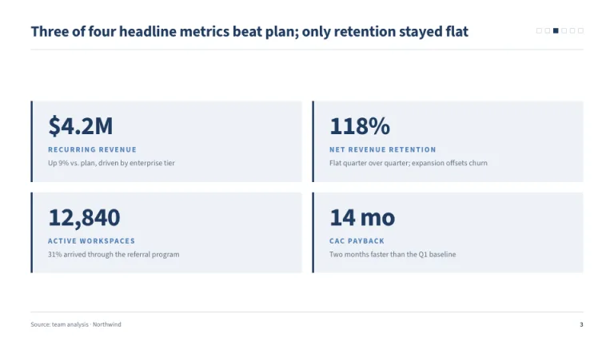
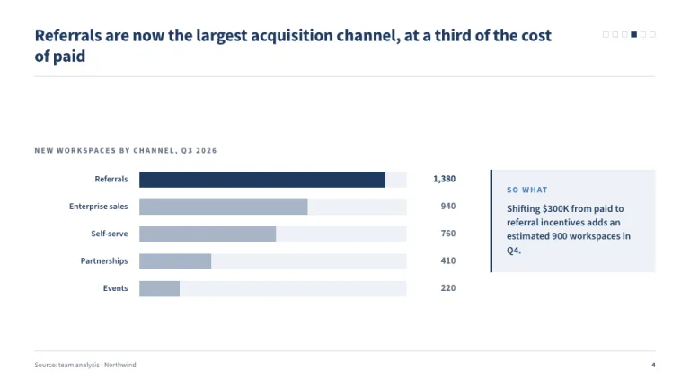
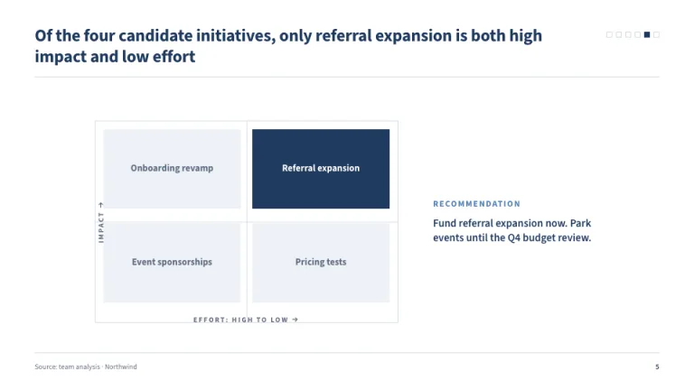
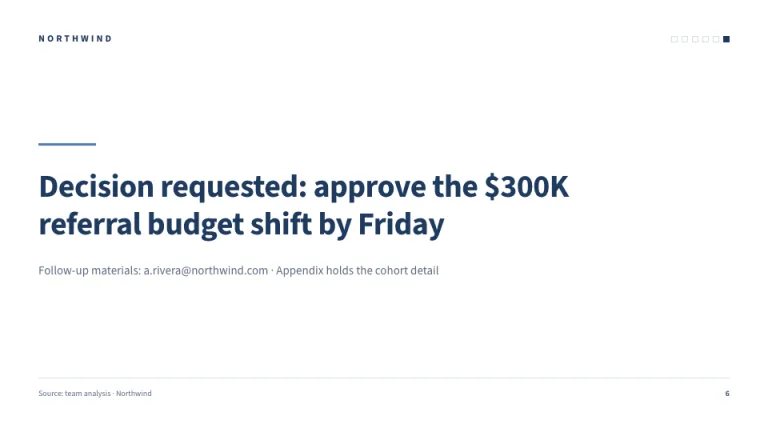

[← All prompts](../README.md) · [Live site](https://slidespeak.co/slide-design-prompts) · [SlideSpeak](https://slidespeak.co)

# Boardroom

> The slide is the argument

The strategy-consulting classic. Every slide leads with a full-sentence action title, and a tiny tracker shows where you are in the argument.

**Category:** Business & strategy &nbsp;·&nbsp; **Style:** Corporate, Minimal &nbsp;·&nbsp; **Mode:** Light &nbsp;·&nbsp; **Fonts:** Source Sans 3

<table>
    <tr>
      <td align="center" width="33%"><br><sub>Title</sub></td>
      <td align="center" width="33%"><br><sub>Agenda</sub></td>
      <td align="center" width="33%"><br><sub>Key metrics</sub></td>
    </tr>
    <tr>
      <td align="center" width="33%"><br><sub>Chart & insight</sub></td>
      <td align="center" width="33%"><br><sub>Section divider</sub></td>
      <td align="center" width="33%"><br><sub>Closing</sub></td>
    </tr>
</table>

## The prompt

Copy the prompt below into **ChatGPT**, **Claude**, or any AI chat — or grab the raw [`PROMPT.md`](./PROMPT.md). It asks what your presentation is about first, then applies the design to every slide.

```text
Create a presentation in the 'Boardroom' theme, a classic strategy-consulting deck. Background: white (#FFFFFF). Typography: 'Source Sans 3' (a Google Font) throughout, a neutral sans; navy headings (#1F3A5F), gray body (#5B6B7E), steel blue accent (#4C7DB5). Every content slide opens with a full-sentence bold action title (24px) stating the slide's conclusion, with a 1px #D5DCE4 rule directly beneath. Top-right: an agenda tracker of six 8px squares, the current slide filled navy, the rest outlined #D5DCE4. Key takeaways sit in #EEF2F7 boxes with a 3px navy left border. Charts: horizontal bars in #A8B6C7 on #EEF2F7 tracks, the key bar navy, values right-aligned. Section slides use a 2x2 matrix with hairline #D5DCE4 axes labeled Effort and Impact, the winning quadrant filled navy with white text. Footer on every slide: hairline rule, 'Source: team analysis · Northwind' left, page number right. Strictly avoid: decorative imagery, gradients, drop shadows, rounded corners, more than two accent colors, vague label-style titles.

Use this theme for my slides. Ask me what the presentation is about first, then apply the theme to every slide.
```

**[Open ChatGPT ↗](https://chatgpt.com/)** &nbsp;·&nbsp; **[Open Claude ↗](https://claude.ai/new)** &nbsp;·&nbsp; **[Generate a finished deck with SlideSpeak ↗](https://app.slidespeak.co/presentation?utm_source=github&utm_medium=referral&utm_campaign=slide-design-prompts)**

## Palette

| Role | Hex |
| --- | --- |
| Background | `#FFFFFF` |
| Surface / panel | `#EEF2F7` |
| Border | `#D5DCE4` |
| Primary accent | `#1F3A5F` |
| Primary (soft tint) | `#EEF2F7` |
| Text on primary | `#FFFFFF` |
| Heading text | `#1F3A5F` |
| Body text | `#5B6B7E` |
| Muted text | `#8E9BAA` |

**Chart series:** `#1F3A5F` `#4C7DB5` `#A8B6C7` `#EEF2F7`

## Fonts

- **Source Sans 3** (heading and body, Google Fonts)

---

<sub>Part of [SlideSpeak Slide Design Prompts](../../README.md) · MIT licensed</sub>
