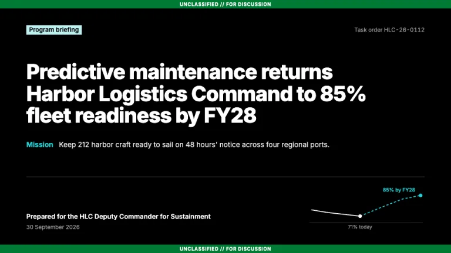
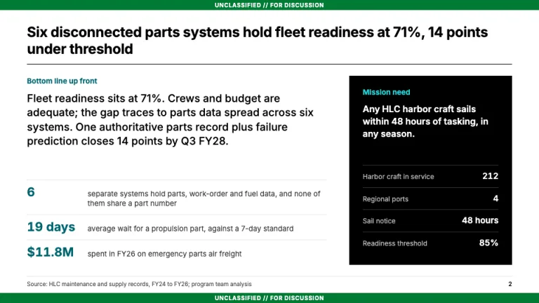
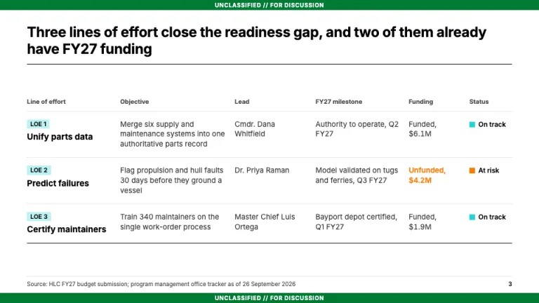
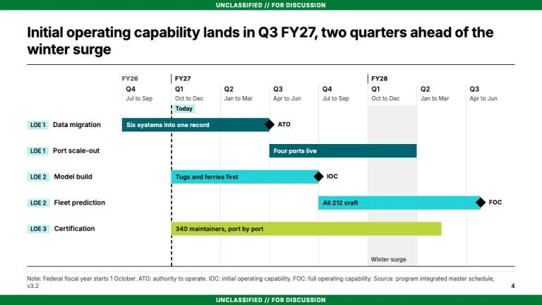
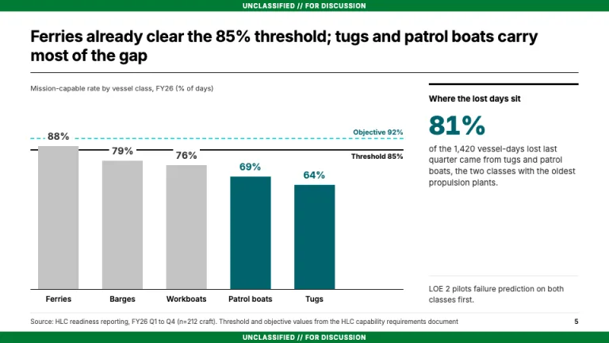
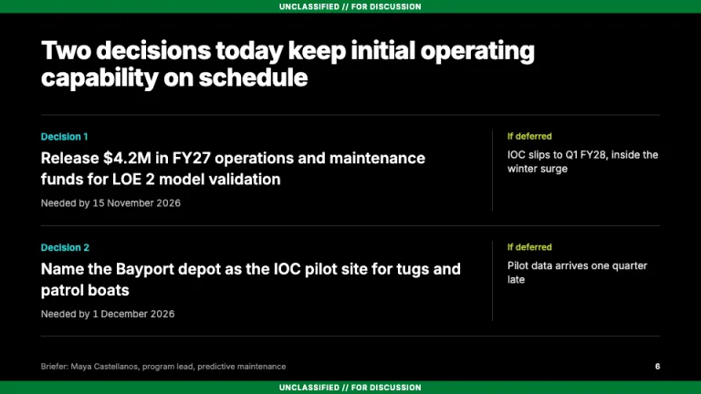

[← All prompts](../README.md) · [Live site](https://slidespeak.co/slide-design-prompts) · [SlideSpeak](https://slidespeak.co)

# Booz Allen Style

> Federal program briefings with fiscal-year timelines

A Booz Allen presentation style for government briefings: classification-style banners, a BLUF slide, lines of effort and a fiscal-year timeline. An unofficial homage to the Booz Allen Hamilton look. Not affiliated with, endorsed by, or connected to Booz Allen Hamilton.

**Category:** Consulting &nbsp;·&nbsp; **Style:** Corporate, Minimal &nbsp;·&nbsp; **Mode:** Light &nbsp;·&nbsp; **Fonts:** Inter

<table>
    <tr>
      <td align="center" width="33%"><br><sub>Title</sub></td>
      <td align="center" width="33%"><br><sub>Bottom line up front</sub></td>
      <td align="center" width="33%"><br><sub>Lines of effort</sub></td>
    </tr>
    <tr>
      <td align="center" width="33%"><br><sub>Program timeline</sub></td>
      <td align="center" width="33%"><br><sub>Threshold and objective chart</sub></td>
      <td align="center" width="33%"><br><sub>Decisions requested</sub></td>
    </tr>
</table>

## The prompt

Copy the prompt below into **ChatGPT**, **Claude**, or any AI chat — or grab the raw [`PROMPT.md`](./PROMPT.md). It asks what your presentation is about first, then applies the design to every slide.

```text
Create a presentation in the 'Booz Allen Style' theme, an unofficial homage to the government and defense consulting briefing. Classification banners: every slide, cover included, carries an 18px full-width green #007a33 bar top and bottom reading 'UNCLASSIFIED // FOR DISCUSSION', centered, 10px bold white; keep that generic text. Typography: 'Inter' (Google Fonts) throughout; cover titles 800 at 44px, action titles 700 at 24 to 26px with slight negative tracking, body 400 to 500 at 13 to 15px, tabular figures. Colors: white #ffffff content slides, pure black #000000 for titles and rules, body #333333, muted #4c4c4c, hairlines #e6e6e6, turquoise #23d2d7 as the accent on black and a chart fill, deep teal #00636d for accent text and proof series on white, lime #bad63a as third series, tag tint #bdf2f3, orange #ff7700 only for at-risk status. Content slides: a full-sentence action title stating the answer, left-aligned, two lines max, over a 1px black rule. Footer: a #e6e6e6 hairline, a 10px 'Source:' or 'Note:' line bottom-left and the page number bottom-right, above the bottom banner. Tags: short sentence-case labels in 11px Inter 600 on a square #bdf2f3 block, identifying lines of effort (LOE 1, LOE 2, LOE 3) the same way on every slide, never as decorative eyebrows. Cover: black background, a 'Program briefing' tag, the answer as the white headline, a one-line mission statement led by 'Mission' in #23d2d7, and a 'Prepared for' line and date under a #333333 rule. BLUF slide: 'Bottom line up front' in 13px bold #00636d, a three-sentence bottom line at 19px, three proof figures in #00636d, and a black mission-need panel with four key figures. Lines of effort: a table with tag, objective, named lead, milestone, funding and a 10px square status mark (#23d2d7 on track, #ff7700 at risk). Signature exhibit, the program timeline: federal fiscal-year quarters (Q1 is Oct to Dec) under FY labels, phase bars colored by line of effort (#00636d, #23d2d7, #bad63a), black diamond gates labeled ATO, IOC and FOC, a dashed black 'Today' line with a #bdf2f3 tag, and a #f0f0f0 column marking a seasonal surge. Charts: direct value labels, no gridlines, #c4c4c4 context bars, #00636d for the bars that prove the title, a solid black threshold line and a dashed #23d2d7 objective line when requirements exist. Closing slide: black, decisions requested in 21px white with a deadline each and a #bad63a 'If deferred' consequence column. Strictly avoid: Booz Allen or agency logos, wordmarks or seals, claiming affiliation with Booz Allen Hamilton, real CUI or classified markings, flags and stock photos of troops or jets, gradients, drop shadows, rounded corners, rainbow charts, topic titles like 'Background', centered body text, all-caps text outside the banners.

Use this theme for my slides. Ask me what the presentation is about first, then apply the theme to every slide.
```

**[Open ChatGPT ↗](https://chatgpt.com/)** &nbsp;·&nbsp; **[Open Claude ↗](https://claude.ai/new)** &nbsp;·&nbsp; **[Generate a finished deck with SlideSpeak ↗](https://app.slidespeak.co/presentation?utm_source=github&utm_medium=referral&utm_campaign=slide-design-prompts)**

## Palette

| Role | Hex |
| --- | --- |
| Background | `#ffffff` |
| Surface / panel | `#f0f0f0` |
| Border | `#e6e6e6` |
| Primary accent | `#23d2d7` |
| Primary (soft tint) | `#bdf2f3` |
| Text on primary | `#000000` |
| Heading text | `#000000` |
| Body text | `#333333` |
| Muted text | `#4c4c4c` |

**Chart series:** `#00636d` `#23d2d7` `#bad63a` `#c4c4c4`

## Fonts

- **Inter** (heading, Google Fonts)

---

<sub>Part of [SlideSpeak Slide Design Prompts](../../README.md) · MIT licensed</sub>
