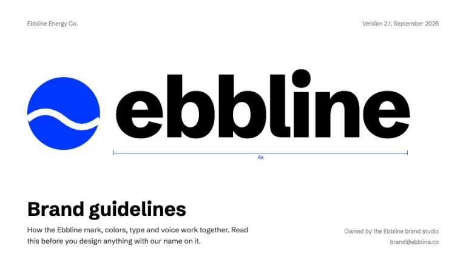
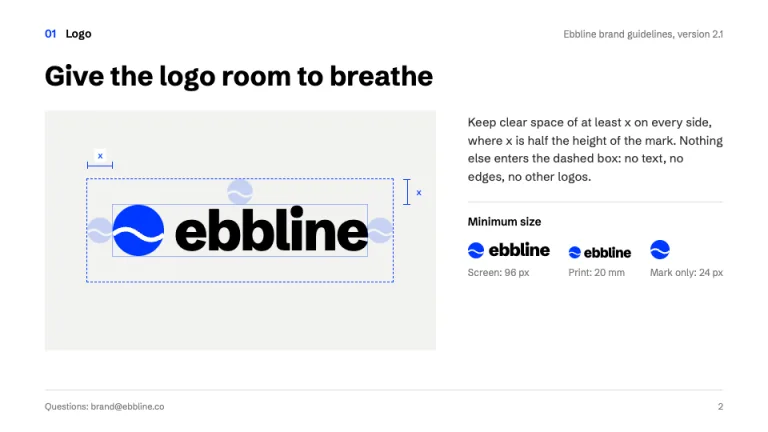
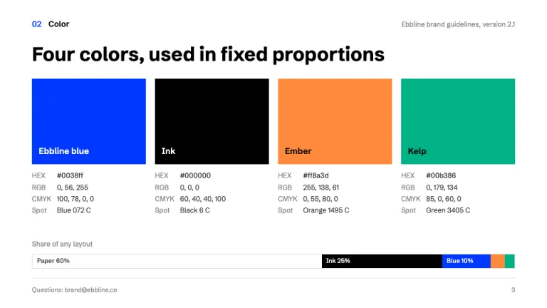
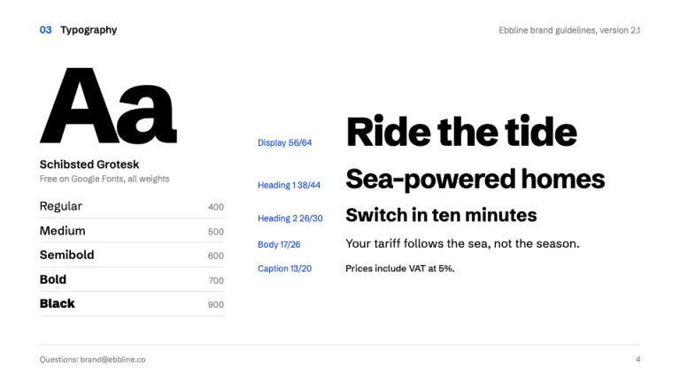
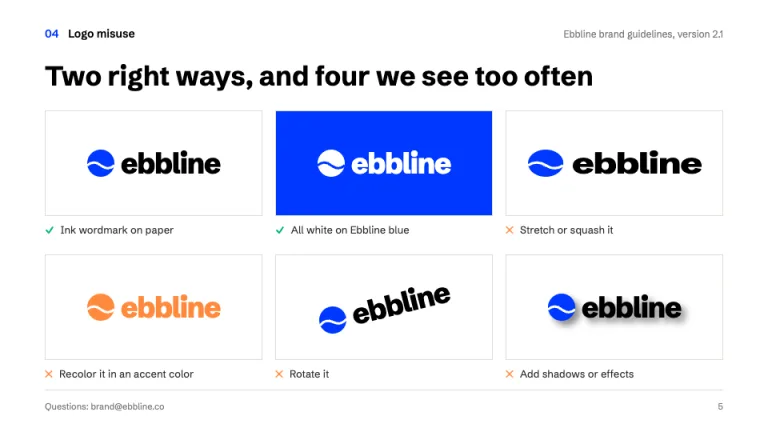
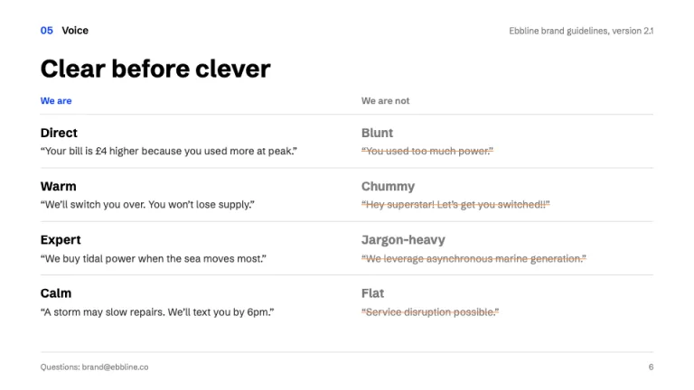

[← All prompts](../README.md) · [Live site](https://slidespeak.co/slide-design-prompts) · [SlideSpeak](https://slidespeak.co)

# Brand Guidelines

> Every rule, measured and annotated

A brand guidelines template prompt that turns your brand book into a presentation: logo clear space drawn with blue dimension lines, color swatches with HEX, RGB and CMYK values, a type specimen, do and don't tiles and a voice chart. Built for brand launches, agency handovers and onboarding new designers.

**Category:** Marketing & brand &nbsp;·&nbsp; **Style:** Minimal, Bold &nbsp;·&nbsp; **Mode:** Light &nbsp;·&nbsp; **Fonts:** Schibsted Grotesk

<table>
    <tr>
      <td align="center" width="33%"><br><sub>Cover</sub></td>
      <td align="center" width="33%"><br><sub>Logo clear space</sub></td>
      <td align="center" width="33%"><br><sub>Color palette</sub></td>
    </tr>
    <tr>
      <td align="center" width="33%"><br><sub>Typography</sub></td>
      <td align="center" width="33%"><br><sub>Do and don’t</sub></td>
      <td align="center" width="33%"><br><sub>Voice and tone</sub></td>
    </tr>
</table>

## The prompt

Copy the prompt below into **ChatGPT**, **Claude**, or any AI chat — or grab the raw [`PROMPT.md`](./PROMPT.md). It asks what your presentation is about first, then applies the design to every slide.

```text
Create a presentation in the 'Brand Guidelines' theme, a brand book rebuilt as a deck where every rule is drawn like a technical specification. Background: white (#ffffff) on every slide, with #f2f2f0 panels only as a stage behind logo diagrams. Typography: 'Schibsted Grotesk' (Google Fonts) for everything; slide titles 700 at 32 to 36px in black (#000000), sentence case, left-aligned, stating the rule rather than the topic ('Give the logo room to breathe', not 'Logo'); body 400 at 14 to 16px in #2b2b2b; small values and captions 12px in #7a7a7a. The signature is measurement annotation: every guideline visual is labelled like an engineering drawing with thin 1px #0038ff dimension lines that end in short perpendicular ticks, a small #0038ff label at the midpoint ('x', '0.5x', '24 px'), and dashed 1.5px #0038ff keyline boxes marking clear space. Running header on content slides: section number in #0038ff plus section name in black 14px semibold top-left (sections are sequential: 01 Logo, 02 Color, 03 Typography), document name and version in #7a7a7a top-right; footer is a 1px #dcdcd8 rule with a contact line bottom-left and the page number bottom-right. Cover: the brand's mark and wordmark set huge (160px or more, weight 800, tight tracking) with one dimension line under it, then 'Brand guidelines' at 40px and a one-line purpose statement. Logo slide: the lockup centered on a #f2f2f0 stage inside the dashed keyline, clear space shown with ghosted copies of the mark as the unit x, and a minimum size row for screen and print. Color slide: four tall swatch columns (#0038ff, #000000, #ff8a3d, #00b386) each listing HEX, RGB, CMYK and a spot color reference in 12px rows, plus a full-width proportion bar showing the share of any layout each color may take (paper 60, ink 25, blue 10, accents 5). Typography slide: a 200px 'Aa' specimen, a weights ladder with each weight set in itself, and a type scale where each size is labelled in #0038ff with size and leading. Do and don't slide: a 3 by 2 grid of the real mark, approved uses captioned with a #00b386 tick, misuses (stretched, recolored, rotated, shadowed) captioned with a #ff8a3d cross. Voice slide: 'We are' and 'We are not' columns of trait pairs, each with a sample sentence, the rejected sample struck through in #ff8a3d. Strictly avoid: stock photography, device and stationery mockups, gradients, drop shadows except inside a misuse example, lorem ipsum, real company logos, uppercase letterspaced labels, centered layouts outside the logo stage, more than the four palette colors, decorative icons, rounded cards.

Use this theme for my slides. Ask me what the presentation is about first, then apply the theme to every slide.
```

**[Open ChatGPT ↗](https://chatgpt.com/)** &nbsp;·&nbsp; **[Open Claude ↗](https://claude.ai/new)** &nbsp;·&nbsp; **[Generate a finished deck with SlideSpeak ↗](https://app.slidespeak.co/presentation?utm_source=github&utm_medium=referral&utm_campaign=slide-design-prompts)**

## Palette

| Role | Hex |
| --- | --- |
| Background | `#ffffff` |
| Surface / panel | `#f2f2f0` |
| Border | `#dcdcd8` |
| Primary accent | `#0038ff` |
| Primary (soft tint) | `#dfe6ff` |
| Text on primary | `#ffffff` |
| Heading text | `#000000` |
| Body text | `#2b2b2b` |
| Muted text | `#7a7a7a` |

**Chart series:** `#0038ff` `#ff8a3d` `#00b386` `#000000`

## Fonts

- **Schibsted Grotesk** (heading, Google Fonts)

---

<sub>Part of [SlideSpeak Slide Design Prompts](../../README.md) · MIT licensed</sub>
