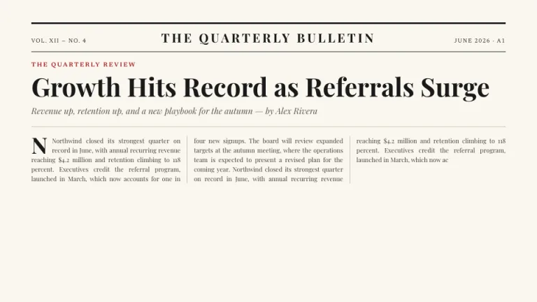
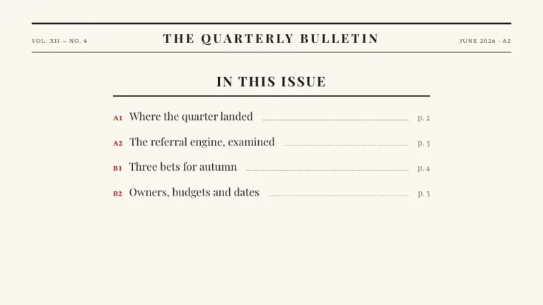
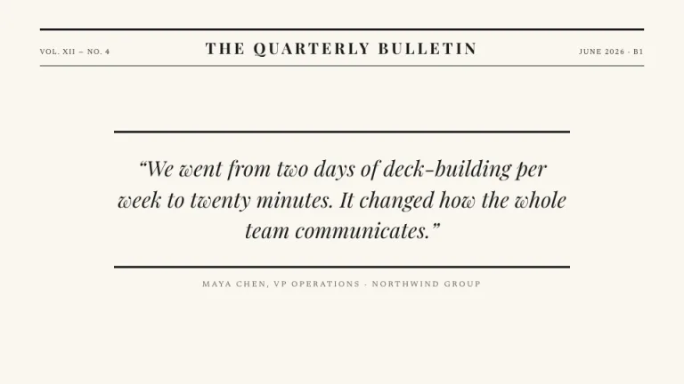
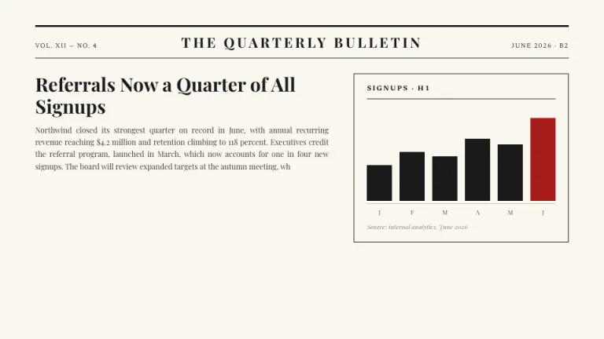
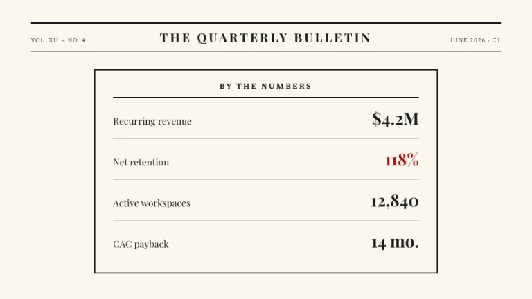
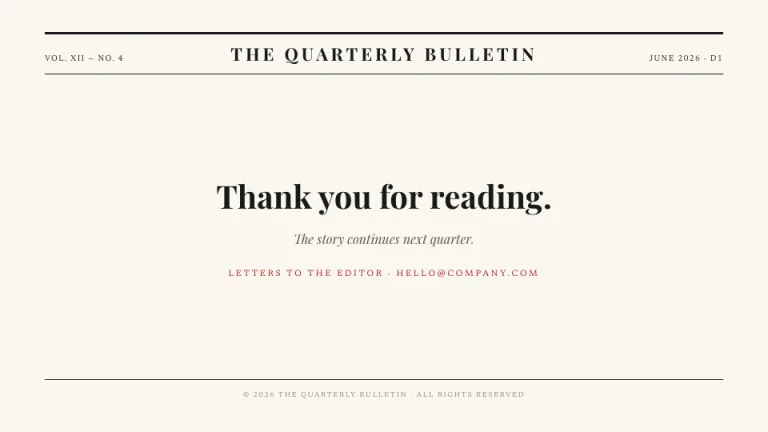

[← All prompts](../README.md) · [Live site](https://slidespeak.co/slide-design-prompts) · [SlideSpeak](https://slidespeak.co)

# Broadsheet

> Read all about it

Your deck set like a morning paper: masthead, justified columns, drop caps and a ruled numbers box. Ink on newsprint with one press red.

**Category:** Finance & consulting &nbsp;·&nbsp; **Style:** Elegant, Corporate &nbsp;·&nbsp; **Mode:** Light &nbsp;·&nbsp; **Fonts:** Playfair Display + Newsreader

<table>
    <tr>
      <td align="center" width="33%"><br><sub>Title</sub></td>
      <td align="center" width="33%"><br><sub>Agenda</sub></td>
      <td align="center" width="33%"><br><sub>Quote</sub></td>
    </tr>
    <tr>
      <td align="center" width="33%"><br><sub>Chart & insight</sub></td>
      <td align="center" width="33%"><br><sub>Key metrics</sub></td>
      <td align="center" width="33%"><br><sub>Closing</sub></td>
    </tr>
</table>

## The prompt

Copy the prompt below into **ChatGPT**, **Claude**, or any AI chat — or grab the raw [`PROMPT.md`](./PROMPT.md). It asks what your presentation is about first, then applies the design to every slide.

```text
Create a presentation laid out like a broadsheet newspaper, the 'Broadsheet' theme. Background: newsprint (#FAF7F0). Ink: near-black (#1A1A1A). One accent: press red (#A61B1B), used only for kickers and the single most important figure. Every slide opens with a masthead: a 3px black rule, then a row with the volume and issue number on the left, the deck name centered in bold letterspaced 'Playfair Display' caps, and the date plus page code (A1, B2) on the right, closed by a thin rule. Headlines: bold 'Playfair Display', large, tight leading. Body text runs in 2 or 3 narrow justified 'Newsreader' columns (both faces are Google Fonts) separated by thin vertical rules, with the opening paragraph starting on a two-line drop cap. Data lives in a bordered 'By the numbers' sidebar with ruled rows. Quotes are centered pull quotes between heavy 3px rules with the attribution in small letterspaced caps. Captions are small 'Newsreader' italics. Strictly avoid: color photography, rounded corners, sans-serif headlines, any color beyond ink, newsprint and the one red.

Use this theme for my slides. Ask me what the presentation is about first, then apply the theme to every slide.
```

**[Open ChatGPT ↗](https://chatgpt.com/)** &nbsp;·&nbsp; **[Open Claude ↗](https://claude.ai/new)** &nbsp;·&nbsp; **[Generate a finished deck with SlideSpeak ↗](https://app.slidespeak.co/presentation?utm_source=github&utm_medium=referral&utm_campaign=slide-design-prompts)**

## Palette

| Role | Hex |
| --- | --- |
| Background | `#FAF7F0` |
| Surface / panel | `#FFFFFF` |
| Border | `#C9C2B0` |
| Primary accent | `#A61B1B` |
| Primary (soft tint) | `#F5E6E2` |
| Text on primary | `#FFFCF5` |
| Heading text | `#1A1A1A` |
| Body text | `#3D3A33` |
| Muted text | `#8D8775` |

**Chart series:** `#1A1A1A` `#5A564C` `#A61B1B` `#DAD4C4`

## Fonts

- **Playfair Display** (heading, Google Fonts)
- **Newsreader** (supporting, Google Fonts)

---

<sub>Part of [SlideSpeak Slide Design Prompts](../../README.md) · MIT licensed</sub>
