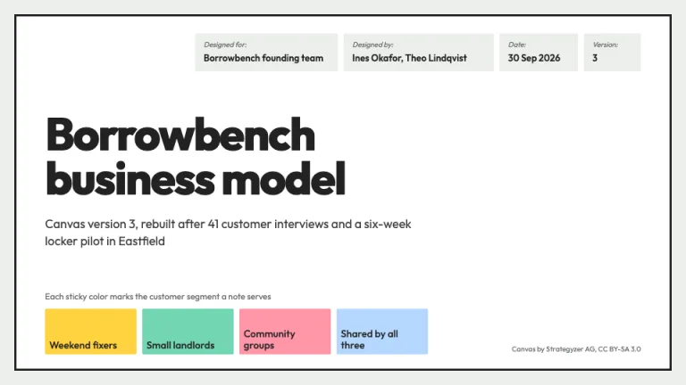
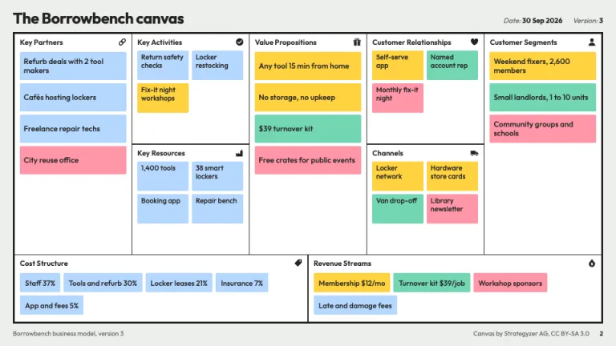
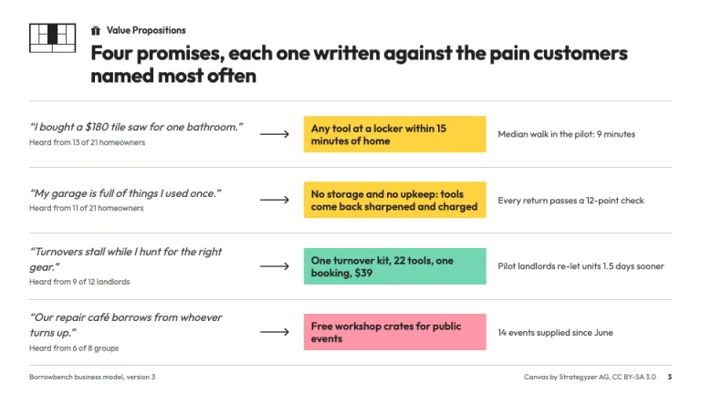
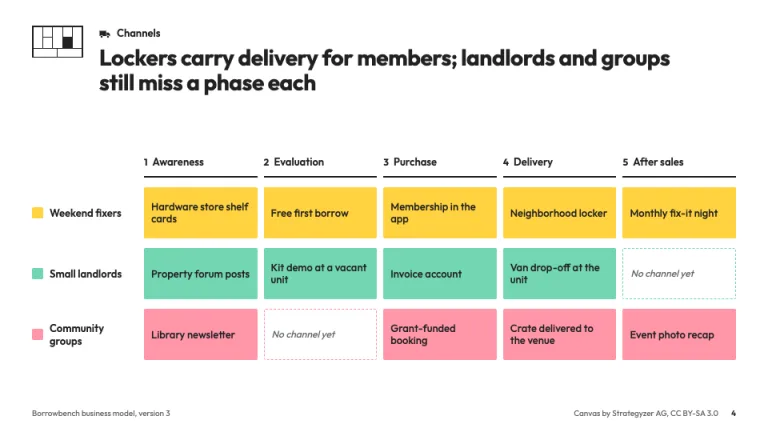
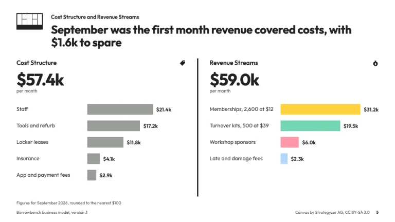
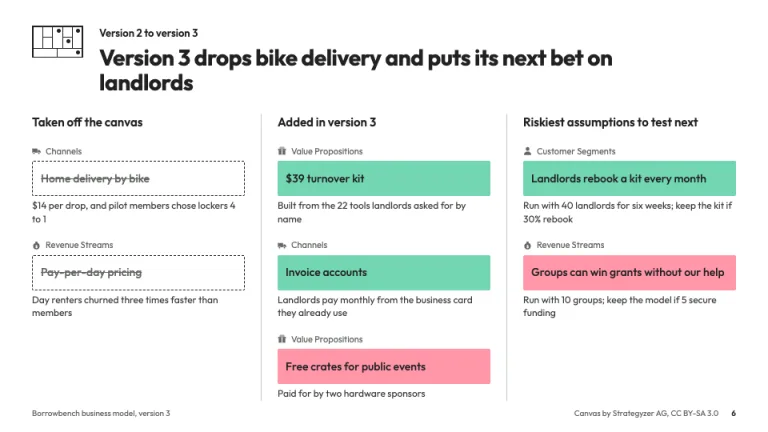

[← All prompts](../README.md) · [Live site](https://slidespeak.co/slide-design-prompts) · [SlideSpeak](https://slidespeak.co)

# Business Model Canvas

> Nine blocks, one sticky color per segment

A business model canvas template with the nine blocks in their standard layout, sticky notes colored by segment and a deep-dive slide per block. Alexander Osterwalder created the canvas, and Strategyzer AG publishes it under a CC BY-SA 3.0 license. Not affiliated with, endorsed by, or connected to Strategyzer AG.

**Category:** Business & strategy &nbsp;·&nbsp; **Style:** Minimal, Playful &nbsp;·&nbsp; **Mode:** Light &nbsp;·&nbsp; **Fonts:** Outfit

<table>
    <tr>
      <td align="center" width="33%"><br><sub>Title</sub></td>
      <td align="center" width="33%"><br><sub>The canvas</sub></td>
      <td align="center" width="33%"><br><sub>Block deep dive</sub></td>
    </tr>
    <tr>
      <td align="center" width="33%"><br><sub>Channel phases</sub></td>
      <td align="center" width="33%"><br><sub>Costs and revenue</sub></td>
      <td align="center" width="33%"><br><sub>Version changes</sub></td>
    </tr>
</table>

## The prompt

Copy the prompt below into **ChatGPT**, **Claude**, or any AI chat — or grab the raw [`PROMPT.md`](./PROMPT.md). It asks what your presentation is about first, then applies the design to every slide.

```text
Create a presentation in the 'Business Model Canvas' theme, built around the nine-block Business Model Canvas by Alexander Osterwalder and Strategyzer AG (CC BY-SA 3.0). Colors: page gray #eceeeb, content white #ffffff, ink #222222 for titles, frames, icons, body #3a3c3a, muted #646864, rules #c9cdc8. Sticky notes carry all color, one per customer segment: yellow #ffd23f, mint #72d6b3, pink #ff96a8, and pale blue #b5d8ff for notes shared by every segment. Ask me for my segments and keep one color per segment on every slide. Typography: 'Outfit' (Google Fonts) only. Titles 700 at 26 to 30px, cover title 800 at 60 to 64px, block names 600 at 11 to 15px in Title Case, body 400 at 12 to 17px, nothing under 10px. Stickies: flat, 2px radius, 10.5 to 15px weight 500 #222222 text, two to six words. Signature slide: the full canvas on #eceeeb inside a 3px #222222 frame, 1.5px ink block lines, canonical layout: Key Partners tall on the left; Key Activities over Key Resources; Value Propositions tall in the center; Customer Relationships over Channels; Customer Segments tall on the right; Cost Structure and Revenue Streams sharing the bottom. Each block shows its name top-left and a small solid ink icon top-right (chain link, check circle, factory, gift, heart, truck, person, price tag, money bag), two to five stickies. Cover: white panel in a 3px ink frame, the canvas form fields top-right as #eceeeb boxes with italic 10px labels 'Designed for:', 'Designed by:', 'Date:', 'Version:' over 13px values, a two-line title, a subline, and large stickies as the segment color key. Deep-dive slides: a 64x40px canvas locator top-left (a tiny nine-block map with the current block filled #222222), the block name and icon, then a full-sentence takeaway title. Value propositions: rows of italic customer quote with interview count, thin ink arrow, proposition as a large sticky. Channels: a grid of the five channel phases (Awareness, Evaluation, Purchase, Delivery, After sales) against segment rows; missing channels show as dashed outlines reading 'No channel yet'. Costs and revenue: a split slide, Cost Structure left with gray #9a9e99 bars, Revenue Streams right with bars in segment colors, split by a 3px ink rule, each led by a 40px bold total. Iteration: removed notes as struck-through dashed outlines, added notes as solid stickies, next tests with a pass threshold. Footer: 10px #646864, deck name and version left, 'Canvas by Strategyzer AG, CC BY-SA 3.0' and page number right. Strictly avoid: rotated or shadowed stickies, handwriting fonts, rearranging the nine blocks, sticky colors that change meaning between slides, gradients, stock photos, clipart, rounded cards over 4px, all-caps labels, Strategyzer logos or wordmarks, and implying Strategyzer endorses the deck.

Use this theme for my slides. Ask me what the presentation is about first, then apply the theme to every slide.
```

**[Open ChatGPT ↗](https://chatgpt.com/)** &nbsp;·&nbsp; **[Open Claude ↗](https://claude.ai/new)** &nbsp;·&nbsp; **[Generate a finished deck with SlideSpeak ↗](https://app.slidespeak.co/presentation?utm_source=github&utm_medium=referral&utm_campaign=slide-design-prompts)**

## Palette

| Role | Hex |
| --- | --- |
| Background | `#eceeeb` |
| Surface / panel | `#ffffff` |
| Border | `#c9cdc8` |
| Primary accent | `#222222` |
| Primary (soft tint) | `#fff2b3` |
| Text on primary | `#ffffff` |
| Heading text | `#222222` |
| Body text | `#3a3c3a` |
| Muted text | `#646864` |

**Chart series:** `#ffd23f` `#72d6b3` `#ff96a8` `#b5d8ff`

## Fonts

- **Outfit** (heading, Google Fonts)

---

<sub>Part of [SlideSpeak Slide Design Prompts](../../README.md) · MIT licensed</sub>
