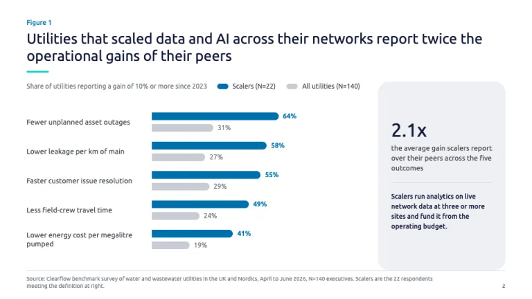
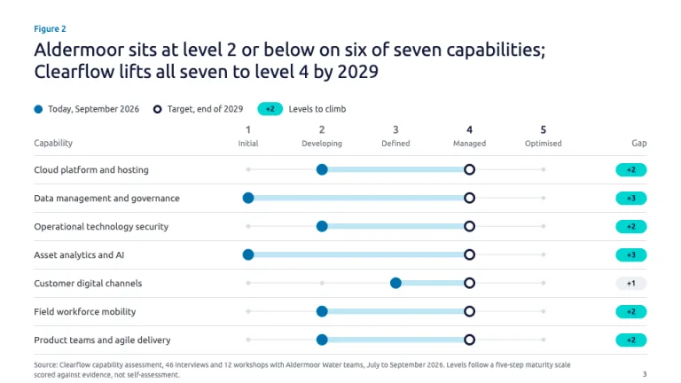
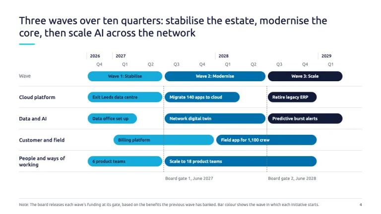
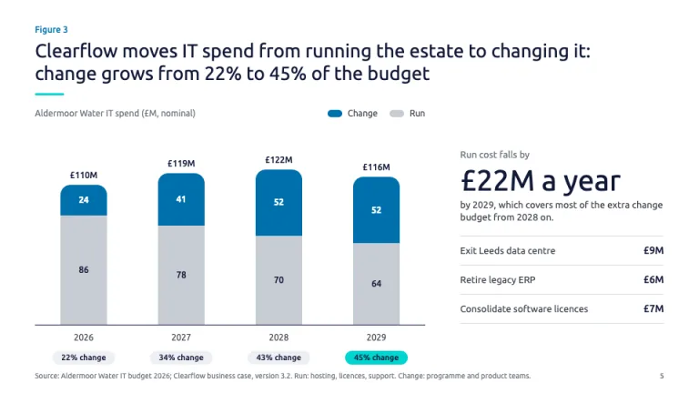
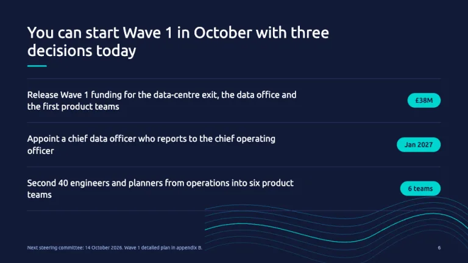

[← All prompts](../README.md) · [Live site](https://slidespeak.co/slide-design-prompts) · [SlideSpeak](https://slidespeak.co)

# Capgemini Style

> Maturity grids and roadmaps in two blues

A Capgemini presentation template for technology transformation: a capability maturity grid, a three-wave roadmap and numbered research figures. An unofficial homage to the Capgemini presentation style. Not affiliated with, endorsed by, or connected to Capgemini.

**Category:** Consulting &nbsp;·&nbsp; **Style:** Corporate, Bold &nbsp;·&nbsp; **Mode:** Light &nbsp;·&nbsp; **Fonts:** Ubuntu

<table>
    <tr>
      <td align="center" width="33%"><br><sub>Cover</sub></td>
      <td align="center" width="33%"><br><sub>Research figure</sub></td>
      <td align="center" width="33%"><br><sub>Capability maturity</sub></td>
    </tr>
    <tr>
      <td align="center" width="33%"><br><sub>Transformation roadmap</sub></td>
      <td align="center" width="33%"><br><sub>Spend shift</sub></td>
      <td align="center" width="33%"><br><sub>Board decisions</sub></td>
    </tr>
</table>

## The prompt

Copy the prompt below into **ChatGPT**, **Claude**, or any AI chat — or grab the raw [`PROMPT.md`](./PROMPT.md). It asks what your presentation is about first, then applies the design to every slide.

```text
Create a presentation in the 'Capgemini Style' theme, an unofficial homage to the technology consulting deck and research report. Content slides are white (#ffffff); the cover and closing slide are ink blue (#121a38), the cover fading to marine (#1c4076) at 135 degrees. Typography: 'Ubuntu' (Google Fonts) for everything. Content titles in Ubuntu Regular 400 at 26px; cover (44px) and closing (32px) titles in Light 300; line-height 1.15 to 1.2, sentence case. Body 13 to 16px Regular 400 in #3c414a; labels and captions 11 to 12px #6e7480; emphasis Medium 500. Color roles: Capgemini blue #0070ad marks the series that proves the title; vibrant blue #17abda is the second series; ink #121a38 for headings and the darkest series; teal #00d5d0 is the spark, used only as a fill (pills, keylines, contour strands) with ink text on top. Cloud #eff0f4 panels at 20px radius, 1px #d9dde3 hairlines, gray #c7ccd3 for peer series. The pill is the shape grammar: rounded tags, legend swatches, wave labels, roadmap bars and bar ends. Each content title is a full sentence stating the finding, two lines maximum, over a 40px by 3px rounded teal keyline. Data exhibits add a 'Figure N' label in 12px Medium #0070ad above the title, a units line in 12px #6e7480, and a 10px #6e7480 source note beside the page number. Cover: a small teal pill naming the document type, a white light title, a #8ea6d5 subtitle, and 12 to 16 thin flowing contour lines in SVG across the right half, vibrant blue at 20 to 70% opacity with two teal strands. Research figure: paired horizontal bars per outcome, leading cohort #0070ad with a bold percentage, peers #c7ccd3, plus a cloud panel defining the cohort around one light 34px number. Signature capability maturity grid: capabilities as rows, five maturity columns (1 Initial to 5 Optimised), each row a dumbbell from a solid 16px #0070ad dot (today) to a 16px ink ring (target) joined by an 8px #bfe6f4 bar, with a gap pill at the right, teal when the gap is two levels or more. Transformation roadmap: year and quarter labels across the top, wave pills that darken as the program matures (#17abda, #0070ad, #121a38), workstream swimlanes with pill bars colored by starting wave, dashed lines for board funding gates. Spend exhibit: stacked columns with 14px rounded tops, change #0070ad over run #c7ccd3, totals above, a share pill under each year. Closing: ink background, three decisions in 18px light white text split by #2e3a63 rules, each with a teal pill for the amount, date or headcount. Strictly avoid: the Capgemini spade symbol, the handwritten wordmark or any logo, claiming affiliation with Capgemini, purple or red accents, drop shadows, gradients on content slides, teal text on white, all-caps labels, stock photos, clip-art icons, topic-only titles.

Use this theme for my slides. Ask me what the presentation is about first, then apply the theme to every slide.
```

**[Open ChatGPT ↗](https://chatgpt.com/)** &nbsp;·&nbsp; **[Open Claude ↗](https://claude.ai/new)** &nbsp;·&nbsp; **[Generate a finished deck with SlideSpeak ↗](https://app.slidespeak.co/presentation?utm_source=github&utm_medium=referral&utm_campaign=slide-design-prompts)**

## Palette

| Role | Hex |
| --- | --- |
| Background | `#ffffff` |
| Surface / panel | `#eff0f4` |
| Border | `#d9dde3` |
| Primary accent | `#0070ad` |
| Primary (soft tint) | `#e0f0f8` |
| Text on primary | `#ffffff` |
| Heading text | `#121a38` |
| Body text | `#3c414a` |
| Muted text | `#6e7480` |

**Chart series:** `#0070ad` `#17abda` `#121a38` `#00d5d0`

## Fonts

- **Ubuntu** (heading, Google Fonts)

---

<sub>Part of [SlideSpeak Slide Design Prompts](../../README.md) · MIT licensed</sub>
