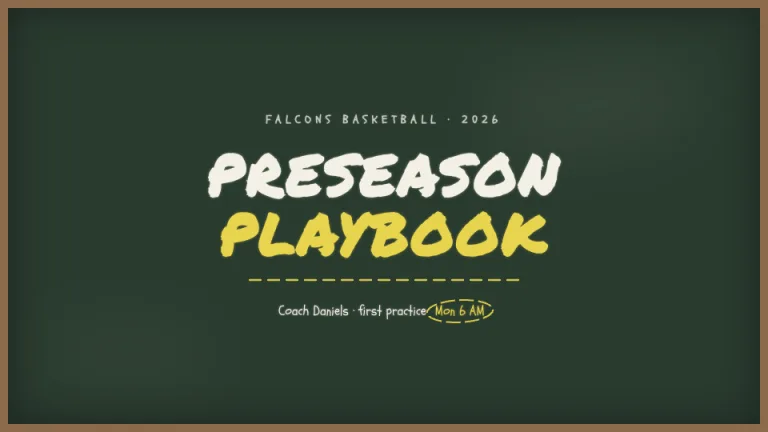
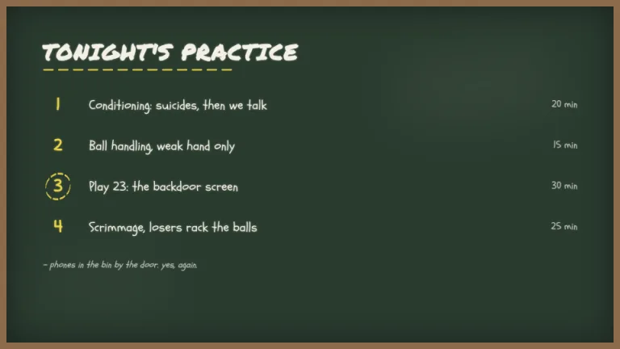
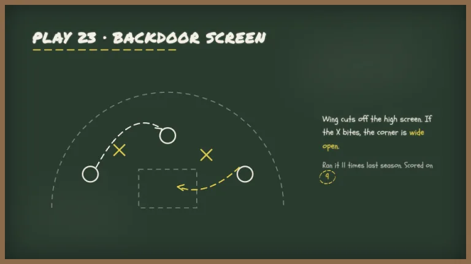
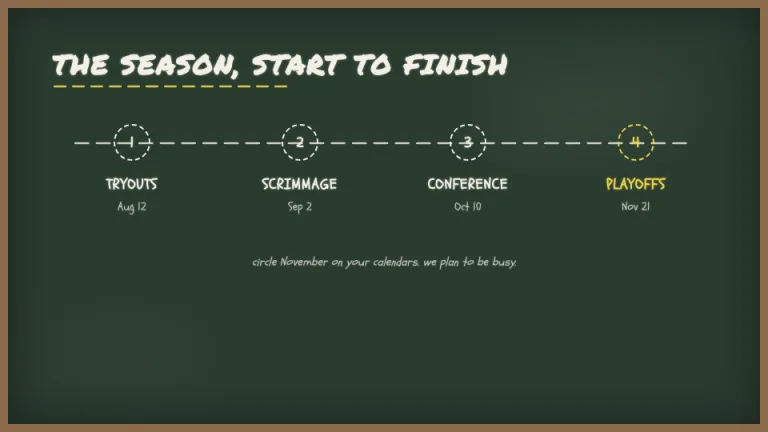
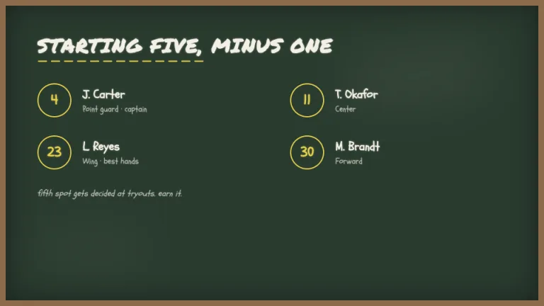
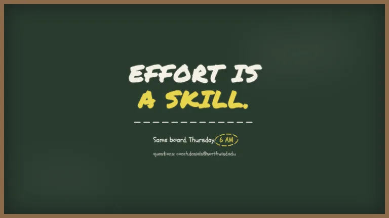

[← All prompts](../README.md) · [Live site](https://slidespeak.co/slide-design-prompts) · [SlideSpeak](https://slidespeak.co)

# Chalkboard

> Drawn up at halftime

A green chalkboard in a wood frame, written in dusty white and yellow chalk. X's and O's included.

**Category:** Education & research &nbsp;·&nbsp; **Style:** Playful, Dark &nbsp;·&nbsp; **Mode:** Dark &nbsp;·&nbsp; **Fonts:** Permanent Marker + Schoolbell

<table>
    <tr>
      <td align="center" width="33%"><br><sub>Title</sub></td>
      <td align="center" width="33%"><br><sub>Agenda</sub></td>
      <td align="center" width="33%"><br><sub>Chart & insight</sub></td>
    </tr>
    <tr>
      <td align="center" width="33%"><br><sub>Timeline</sub></td>
      <td align="center" width="33%"><br><sub>Team</sub></td>
      <td align="center" width="33%"><br><sub>Closing</sub></td>
    </tr>
</table>

## The prompt

Copy the prompt below into **ChatGPT**, **Claude**, or any AI chat — or grab the raw [`PROMPT.md`](./PROMPT.md). It asks what your presentation is about first, then applies the design to every slide.

```text
Create slides in the 'Chalkboard' theme, a coach's green chalkboard. Background: dark green #2A3B2F inside a 10px tan wood frame #8B6B4A, with a soft dark inner shadow on the board. Typography: headings in 'Permanent Marker' and body in 'Schoolbell' (both Google Fonts with a handwritten chalk feel); chalk white #F2F0E4 for body text and chalk yellow #E8D44D for emphasis, every piece of text carrying a faint 2 to 3px glow of its own color, as if dusted. Headings are large uppercase chalk white, underlined with a rough dashed yellow stroke about 300px wide. Signature motifs: dashed chalk rules everywhere instead of solid lines; a play diagram of white O's and yellow X's connected by curved dashed arrows; hand-drawn dashed yellow ellipses circling key numbers; one or two faint eraser smudges, blurred light patches at 5 to 8 percent opacity, placed off-center. Lists use chalk numerals or dashes, never bullets. Strictly avoid: pure white #FFFFFF, crisp solid borders inside the board, gradients, photography, clip-art icons, rounded UI cards.

Use this theme for my slides. Ask me what the presentation is about first, then apply the theme to every slide.
```

**[Open ChatGPT ↗](https://chatgpt.com/)** &nbsp;·&nbsp; **[Open Claude ↗](https://claude.ai/new)** &nbsp;·&nbsp; **[Generate a finished deck with SlideSpeak ↗](https://app.slidespeak.co/presentation?utm_source=github&utm_medium=referral&utm_campaign=slide-design-prompts)**

## Palette

| Role | Hex |
| --- | --- |
| Background | `#2A3B2F` |
| Surface / panel | `#324639` |
| Border | `#8B6B4A` |
| Primary accent | `#E8D44D` |
| Primary (soft tint) | `#4F523B` |
| Text on primary | `#2A3B2F` |
| Heading text | `#F2F0E4` |
| Body text | `#D9D6C3` |
| Muted text | `#9AA38F` |

**Chart series:** `#F2F0E4` `#E8D44D` `#9AA38F` `#4F5D50`

## Fonts

- **Permanent Marker** (heading, Google Fonts)
- **Schoolbell** (supporting, Google Fonts)

---

<sub>Part of [SlideSpeak Slide Design Prompts](../../README.md) · MIT licensed</sub>
