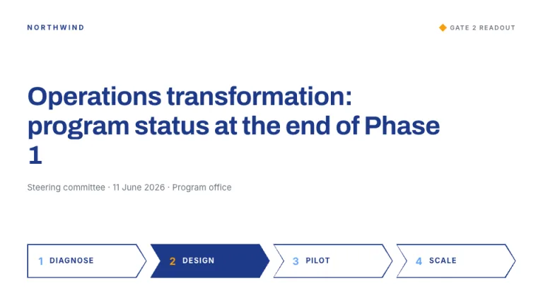
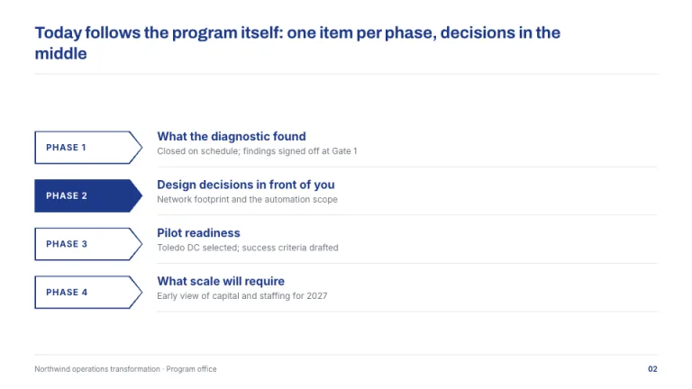
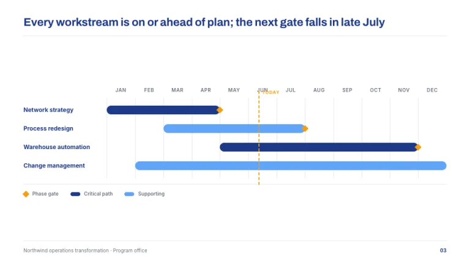
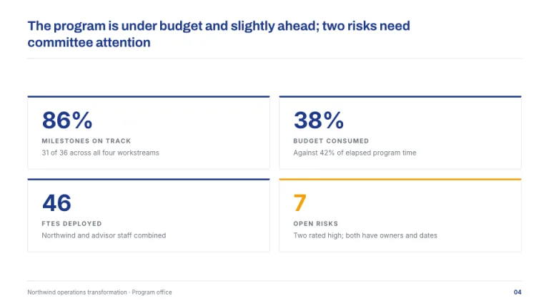
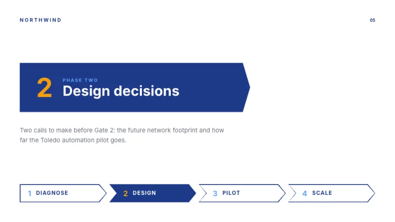
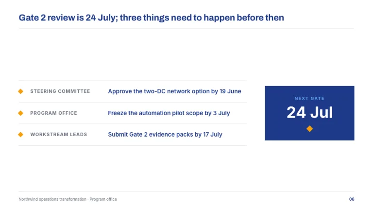

[← All prompts](../README.md) · [Live site](https://slidespeak.co/slide-design-prompts) · [SlideSpeak](https://slidespeak.co)

# Chevron

> Four phases, one direction

The program management deck. Fat chevron arrows mark the phases, a gantt strip tracks the workstreams and amber diamonds mark the gates.

**Category:** Business & strategy &nbsp;·&nbsp; **Style:** Corporate, Bold &nbsp;·&nbsp; **Mode:** Light &nbsp;·&nbsp; **Fonts:** Archivo + Inter

<table>
    <tr>
      <td align="center" width="33%"><br><sub>Title</sub></td>
      <td align="center" width="33%"><br><sub>Agenda</sub></td>
      <td align="center" width="33%"><br><sub>Timeline</sub></td>
    </tr>
    <tr>
      <td align="center" width="33%"><br><sub>Key metrics</sub></td>
      <td align="center" width="33%"><br><sub>Section divider</sub></td>
      <td align="center" width="33%"><br><sub>Closing</sub></td>
    </tr>
</table>

## The prompt

Copy the prompt below into **ChatGPT**, **Claude**, or any AI chat — or grab the raw [`PROMPT.md`](./PROMPT.md). It asks what your presentation is about first, then applies the design to every slide.

```text
Create a presentation in the 'Chevron' theme, a program management deck. Background: pure white (#FFFFFF). Typography: headlines in the sturdy grotesque 'Archivo' and body text in 'Inter' (both Google Fonts); action titles as full sentences in navy (#1E3A8A) with a hairline rule beneath; secondary text in gray (#6B7280). Signature motifs: fat chevron process arrows, a horizontal row of right pointing arrow banners 44 to 60px tall cut as clip path polygons with an 18px point, numbered Phase 1 through 4; the current phase filled navy (#1E3A8A) with white text, the others outlined 1.5px navy on white. A gantt strip with rounded full height bars per workstream in navy and sky (#60A5FA) over hairline month gridlines in #E5E7EB, crossed by one vertical dashed amber (#F59E0B) line labeled Today. Phase gates are small 10px amber diamonds, squares rotated 45 degrees. Strictly avoid: gradients, drop shadows, 3D effects, clip art, curved or swooshing arrows, amber used for anything except gates and alerts.

Use this theme for my slides. Ask me what the presentation is about first, then apply the theme to every slide.
```

**[Open ChatGPT ↗](https://chatgpt.com/)** &nbsp;·&nbsp; **[Open Claude ↗](https://claude.ai/new)** &nbsp;·&nbsp; **[Generate a finished deck with SlideSpeak ↗](https://app.slidespeak.co/presentation?utm_source=github&utm_medium=referral&utm_campaign=slide-design-prompts)**

## Palette

| Role | Hex |
| --- | --- |
| Background | `#FFFFFF` |
| Surface / panel | `#F9FAFB` |
| Border | `#E5E7EB` |
| Primary accent | `#1E3A8A` |
| Primary (soft tint) | `#DBEAFE` |
| Text on primary | `#FFFFFF` |
| Heading text | `#1E3A8A` |
| Body text | `#374151` |
| Muted text | `#6B7280` |

**Chart series:** `#1E3A8A` `#60A5FA` `#F59E0B` `#E5E7EB`

## Fonts

- **Archivo** (heading, Google Fonts)
- **Inter** (supporting, Google Fonts)

---

<sub>Part of [SlideSpeak Slide Design Prompts](../../README.md) · MIT licensed</sub>
