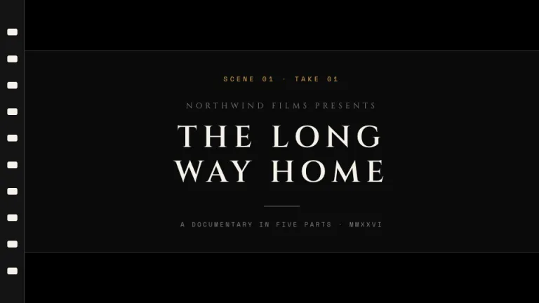
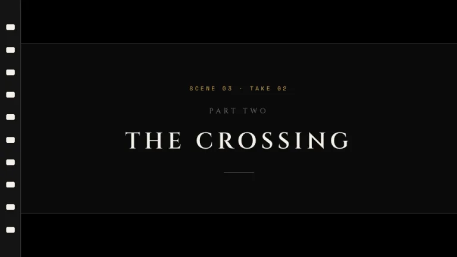
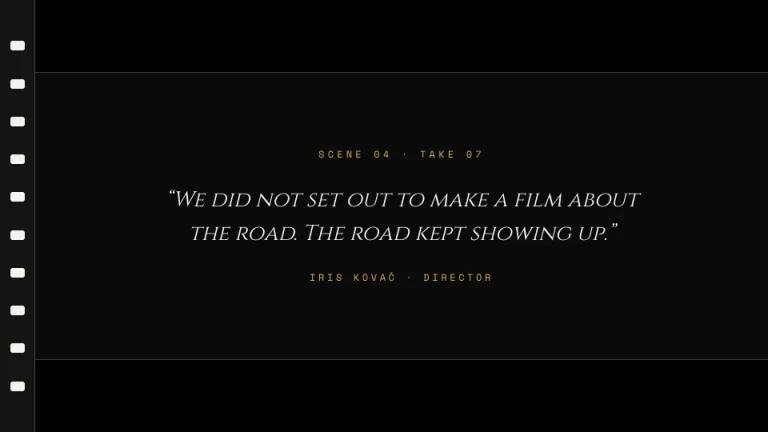
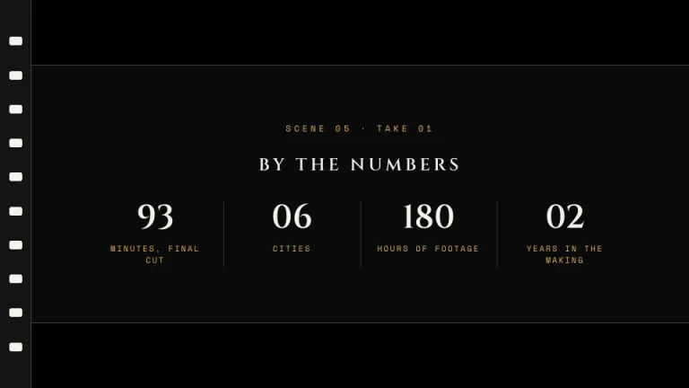
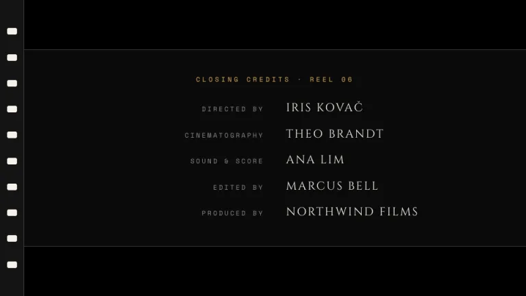
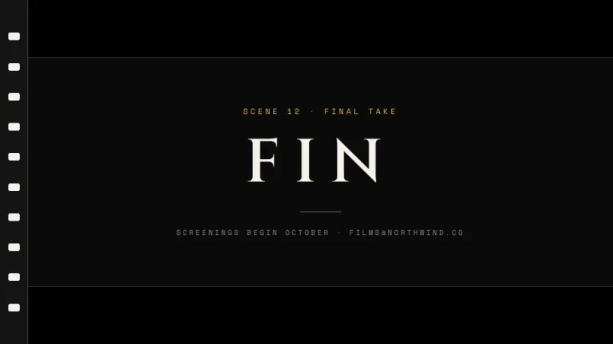

[← All prompts](../README.md) · [Live site](https://slidespeak.co/slide-design-prompts) · [SlideSpeak](https://slidespeak.co)

# Cinema

> Quiet on set

Letterbox bars frame every slide like a film still. White serif title cards in the center band, scene labels in amber mono, credits where lists would be.

**Category:** Creative & portfolio &nbsp;·&nbsp; **Style:** Elegant, Dark &nbsp;·&nbsp; **Mode:** Dark &nbsp;·&nbsp; **Fonts:** Cinzel + Space Mono

<table>
    <tr>
      <td align="center" width="33%"><br><sub>Title</sub></td>
      <td align="center" width="33%"><br><sub>Section divider</sub></td>
      <td align="center" width="33%"><br><sub>Quote</sub></td>
    </tr>
    <tr>
      <td align="center" width="33%"><br><sub>Key metrics</sub></td>
      <td align="center" width="33%"><br><sub>Team</sub></td>
      <td align="center" width="33%"><br><sub>Closing</sub></td>
    </tr>
</table>

## The prompt

Copy the prompt below into **ChatGPT**, **Claude**, or any AI chat — or grab the raw [`PROMPT.md`](./PROMPT.md). It asks what your presentation is about first, then applies the design to every slide.

```text
Create a presentation in the 'Cinema' theme, film title cards. Background: near black #0A0A0A with solid black (#000000) letterbox bars, 90px tall, across the top and bottom of every slide, separated from the center band by 1px white rules at 20% opacity. Left edge: a vertical film strip, a 44px wide dark strip (#141414) holding a full-height column of ten rounded white (#F5F2EA) sprocket holes, each 18x12px. Inside the band everything is centered: titles in the white serif 'Cinzel', uppercase, wide letter-spacing around 0.18em; above each title a clapper label in amber #E2B15C set in 'Space Mono' (both 'Cinzel' and 'Space Mono' are Google Fonts), like 'SCENE 02 · TAKE 01', tracked at 0.35em. Lists use a credits layout: role right-aligned in dim 'Space Mono', name left-aligned in white 'Cinzel', paired around a center gap. Dividers are thin white rules only. Strictly avoid: color photos, bright backgrounds, a second accent color, left-aligned title cards, rounded card containers, drop shadows.

Use this theme for my slides. Ask me what the presentation is about first, then apply the theme to every slide.
```

**[Open ChatGPT ↗](https://chatgpt.com/)** &nbsp;·&nbsp; **[Open Claude ↗](https://claude.ai/new)** &nbsp;·&nbsp; **[Generate a finished deck with SlideSpeak ↗](https://app.slidespeak.co/presentation?utm_source=github&utm_medium=referral&utm_campaign=slide-design-prompts)**

## Palette

| Role | Hex |
| --- | --- |
| Background | `#0A0A0A` |
| Surface / panel | `#141414` |
| Border | `#2A2A2A` |
| Primary accent | `#E2B15C` |
| Primary (soft tint) | `#3A2F1B` |
| Text on primary | `#0A0A0A` |
| Heading text | `#F5F2EA` |
| Body text | `#C9C4B8` |
| Muted text | `#8A867C` |

**Chart series:** `#E2B15C` `#F5F2EA` `#8A867C` `#3A3A3A`

## Fonts

- **Cinzel** (heading, Google Fonts)
- **Space Mono** (supporting, Google Fonts)

---

<sub>Part of [SlideSpeak Slide Design Prompts](../../README.md) · MIT licensed</sub>
