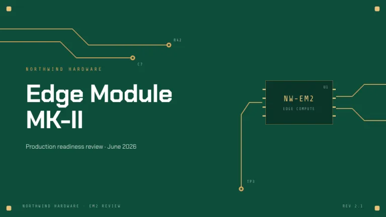
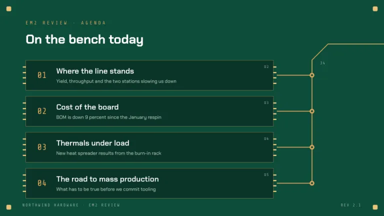
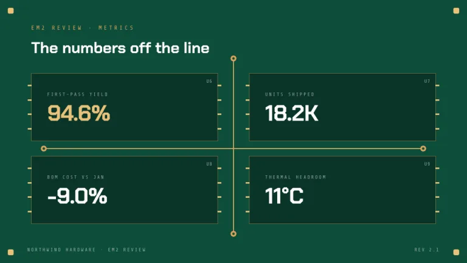
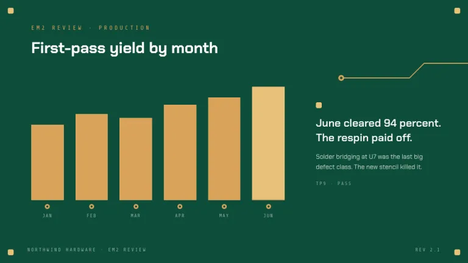
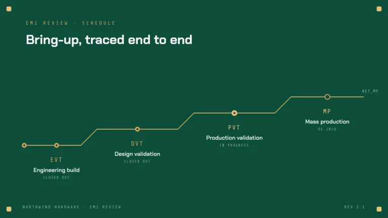
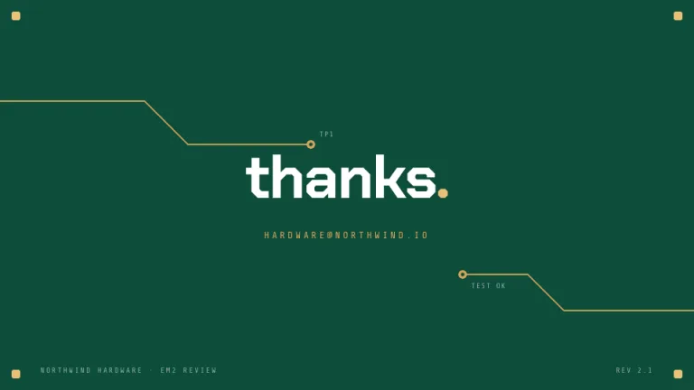

[← All prompts](../README.md) · [Live site](https://slidespeak.co/slide-design-prompts) · [SlideSpeak](https://slidespeak.co)

# Circuit

> Follow the traces

Slides laid out like a printed circuit board. Copper traces bend at 45 degrees between dark IC cards, via dots and gold pads on PCB green.

**Category:** Tech & product &nbsp;·&nbsp; **Style:** Tech, Dark &nbsp;·&nbsp; **Mode:** Dark &nbsp;·&nbsp; **Fonts:** Chakra Petch + Share Tech Mono

<table>
    <tr>
      <td align="center" width="33%"><br><sub>Title</sub></td>
      <td align="center" width="33%"><br><sub>Agenda</sub></td>
      <td align="center" width="33%"><br><sub>Key metrics</sub></td>
    </tr>
    <tr>
      <td align="center" width="33%"><br><sub>Chart & insight</sub></td>
      <td align="center" width="33%"><br><sub>Timeline</sub></td>
      <td align="center" width="33%"><br><sub>Closing</sub></td>
    </tr>
</table>

## The prompt

Copy the prompt below into **ChatGPT**, **Claude**, or any AI chat — or grab the raw [`PROMPT.md`](./PROMPT.md). It asks what your presentation is about first, then applies the design to every slide.

```text
Create a presentation in the 'Circuit' theme, styled as a printed circuit board. Background: PCB green #0E4D3A on every slide. Typography: white 'Chakra Petch' headings; every label, caption and axis in uppercase 'Share Tech Mono' like silkscreen print (both Google Fonts), white at 55 percent opacity, with copper #D9A45B for eyebrows and numbers. Signature motifs: (1) copper traces, 2px #D9A45B lines that run straight, bend at exactly 45 degrees and end in via dots, 12px copper donuts with a #0E4D3A hole; (2) IC chip cards, dark #0A3528 rectangles with a faint copper outline and four 8x3px gold pin legs in #E8C27A on each side, each marked with a reference designator like 'U1' in the top right corner; (3) 12px gold rounded-square pads #E8C27A in all four slide corners; (4) stray silkscreen labels like 'R42' and 'TP3'. Charts use copper bars with the key bar in gold #E8C27A. Strictly avoid: blue tones, gradients, drop shadows, photographs, 90 degree trace bends, rounded corners beyond 3px.

Use this theme for my slides. Ask me what the presentation is about first, then apply the theme to every slide.
```

**[Open ChatGPT ↗](https://chatgpt.com/)** &nbsp;·&nbsp; **[Open Claude ↗](https://claude.ai/new)** &nbsp;·&nbsp; **[Generate a finished deck with SlideSpeak ↗](https://app.slidespeak.co/presentation?utm_source=github&utm_medium=referral&utm_campaign=slide-design-prompts)**

## Palette

| Role | Hex |
| --- | --- |
| Background | `#0E4D3A` |
| Surface / panel | `#0A3528` |
| Border | `#2B6B55` |
| Primary accent | `#D9A45B` |
| Primary (soft tint) | `#5E4A2C` |
| Text on primary | `#0A3528` |
| Heading text | `#FFFFFF` |
| Body text | `#CFE0D4` |
| Muted text | `#8FB3A0` |

**Chart series:** `#D9A45B` `#E8C27A` `#8FB3A0` `#2B6B55`

## Fonts

- **Chakra Petch** (heading, Google Fonts)
- **Share Tech Mono** (supporting, Google Fonts)

---

<sub>Part of [SlideSpeak Slide Design Prompts](../../README.md) · MIT licensed</sub>
