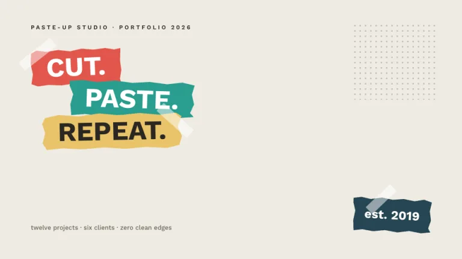
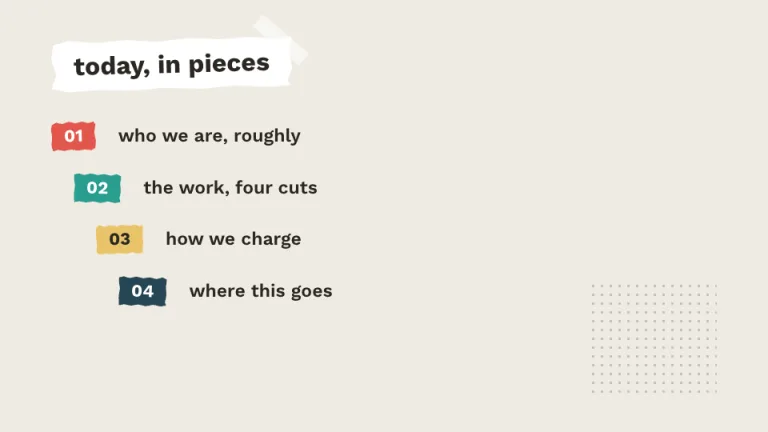
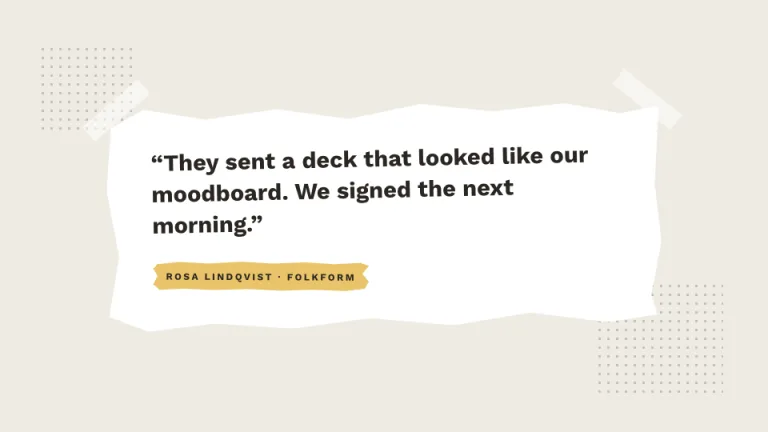
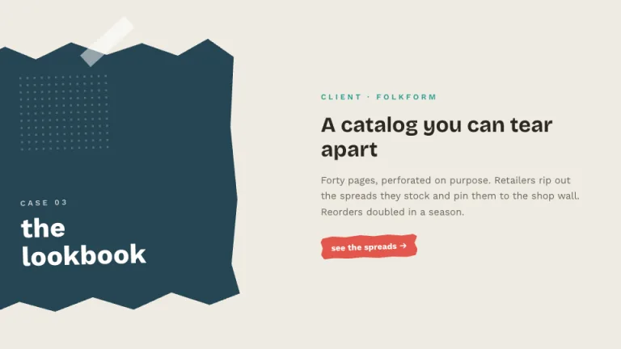
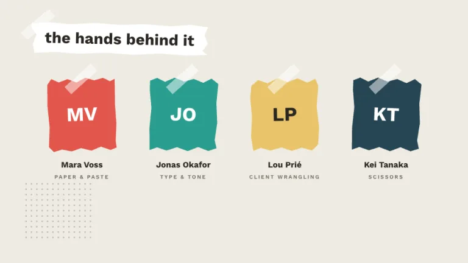
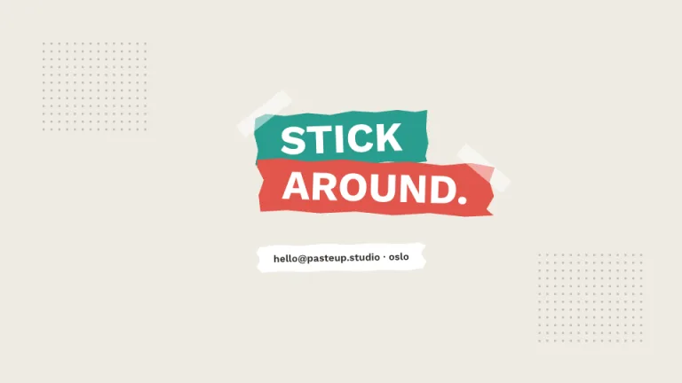

[← All prompts](../README.md) · [Live site](https://slidespeak.co/slide-design-prompts) · [SlideSpeak](https://slidespeak.co)

# Collage

> Scissors first, layout second

Headline words sit on their own crooked paper strips with torn edges, held down by translucent tape. The whole deck reads like it was assembled by hand on a studio table.

**Category:** Creative & portfolio &nbsp;·&nbsp; **Style:** Playful, Warm &nbsp;·&nbsp; **Mode:** Light &nbsp;·&nbsp; **Fonts:** Bricolage Grotesque + Work Sans

<table>
    <tr>
      <td align="center" width="33%"><br><sub>Title</sub></td>
      <td align="center" width="33%"><br><sub>Agenda</sub></td>
      <td align="center" width="33%"><br><sub>Quote</sub></td>
    </tr>
    <tr>
      <td align="center" width="33%"><br><sub>Image + text</sub></td>
      <td align="center" width="33%"><br><sub>Team</sub></td>
      <td align="center" width="33%"><br><sub>Closing</sub></td>
    </tr>
</table>

## The prompt

Copy the prompt below into **ChatGPT**, **Claude**, or any AI chat — or grab the raw [`PROMPT.md`](./PROMPT.md). It asks what your presentation is about first, then applies the design to every slide.

```text
Create a presentation in the 'Collage' theme, a cut-paper collage. Background: warm paper (#EFEBE3); ink text #2B2722. Typography: headlines in bold 'Bricolage Grotesque' with body copy in 'Work Sans' (both Google Fonts); each headline word sits on its own paper strip, rotated between -3 and 3 degrees, stacked with slight overlaps and staggered indents. Paper shapes: blocks in muted brights (red #E2574C, teal #2A9D8F, mustard #E9C46A, ink blue #264653) with torn edges drawn as jagged CSS clip-path polygons, never clean rectangles. Signature motifs: translucent white tape strips (about 84x22px, rotated near 40 degrees, 50% opacity) pinning pieces at corners; one halftone patch per slide made of small ink dots (radial-gradient, 11px grid, 22% opacity). Text on mustard is ink #2B2722, on every other color it is white. Body copy sits in ink on the paper background or on white torn sheets. Strictly avoid: gradients, drop shadows, clean rectangles for colored shapes, photographs, a fifth accent color, perfectly straight alignment.

Use this theme for my slides. Ask me what the presentation is about first, then apply the theme to every slide.
```

**[Open ChatGPT ↗](https://chatgpt.com/)** &nbsp;·&nbsp; **[Open Claude ↗](https://claude.ai/new)** &nbsp;·&nbsp; **[Generate a finished deck with SlideSpeak ↗](https://app.slidespeak.co/presentation?utm_source=github&utm_medium=referral&utm_campaign=slide-design-prompts)**

## Palette

| Role | Hex |
| --- | --- |
| Background | `#EFEBE3` |
| Surface / panel | `#FFFFFF` |
| Border | `#D8D2C6` |
| Primary accent | `#E2574C` |
| Primary (soft tint) | `#F8DCD9` |
| Text on primary | `#FFFFFF` |
| Heading text | `#2B2722` |
| Body text | `#6B6459` |
| Muted text | `#9A9386` |

**Chart series:** `#E2574C` `#2A9D8F` `#E9C46A` `#264653`

## Fonts

- **Bricolage Grotesque** (heading, Google Fonts)
- **Work Sans** (supporting, Google Fonts)

---

<sub>Part of [SlideSpeak Slide Design Prompts](../../README.md) · MIT licensed</sub>
