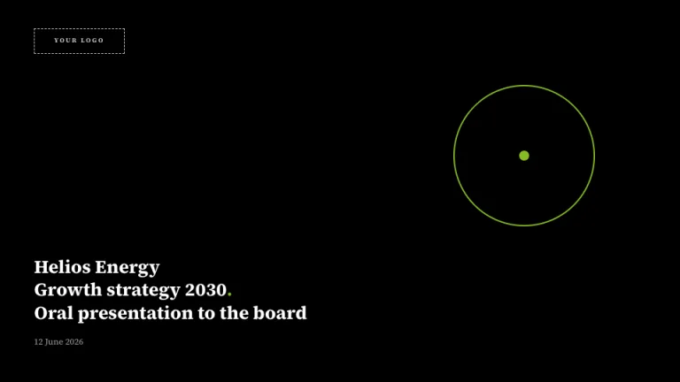
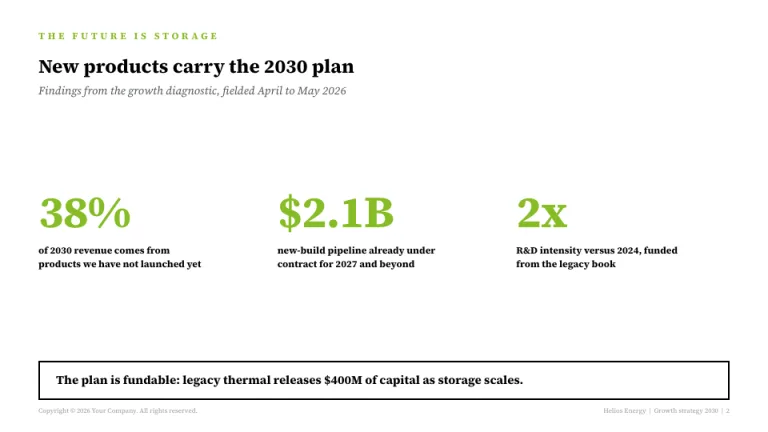
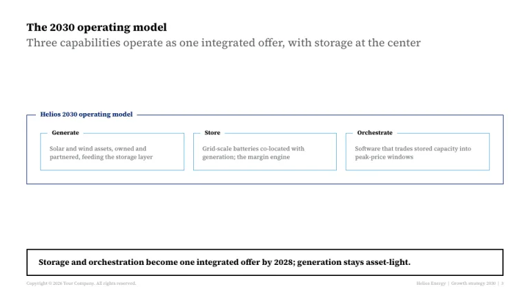
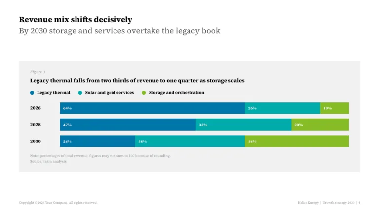
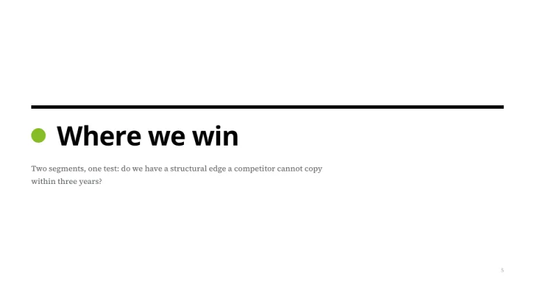
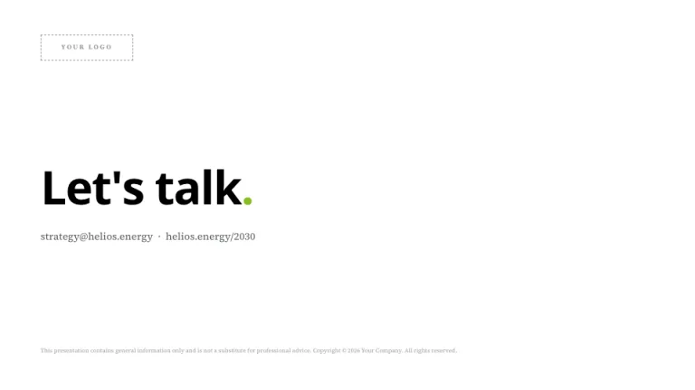

[← All prompts](../README.md) · [Live site](https://slidespeak.co/slide-design-prompts) · [SlideSpeak](https://slidespeak.co)

# Deloitte Style

> Black, white and one green dot

An unofficial homage to the Deloitte deck: a black cover with a white title block, two-tier headlines, figure cards with circle legends, bumper takeaway boxes and a logo placeholder ready for your own brand. Not affiliated with Deloitte.

**Category:** Finance & consulting &nbsp;·&nbsp; **Style:** Corporate, Bold &nbsp;·&nbsp; **Mode:** Light &nbsp;·&nbsp; **Fonts:** Open Sans + Source Serif 4

<table>
    <tr>
      <td align="center" width="33%"><br><sub>Title</sub></td>
      <td align="center" width="33%"><br><sub>Big stats</sub></td>
      <td align="center" width="33%"><br><sub>Operating model</sub></td>
    </tr>
    <tr>
      <td align="center" width="33%"><br><sub>Figure & chart</sub></td>
      <td align="center" width="33%"><br><sub>Section divider</sub></td>
      <td align="center" width="33%"><br><sub>Closing</sub></td>
    </tr>
</table>

## The prompt

Copy the prompt below into **ChatGPT**, **Claude**, or any AI chat — or grab the raw [`PROMPT.md`](./PROMPT.md). It asks what your presentation is about first, then applies the design to every slide.

```text
Create a presentation in the 'Deloitte Style' theme, an unofficial homage to the black-and-green-dot corporate deck. Background: white (#FFFFFF) for content. Typography: the clean humanist sans 'Open Sans' for headlines and body, with 'Source Serif 4' reserved for figure tags (both Google Fonts); black headlines, cool gray body (#53565A). The signature color is a single bright green (#86BC25), used as a period at the end of display headlines, as big stat numerals, as circle markers and as one chart series; the only other chart colors are cool blue (#0076A8) and teal (#00ABAB). Red, orange and yellow are banned except for functional status markers. Title slide: full-bleed black, a logo placeholder top-left (dashed 1px box labeled 'YOUR LOGO' in letterspaced caps, white on black), a thin green outline circle as the only graphic device, and a bottom-left white bold title block of three stacked lines with a small date beneath. Content slides open with a two-tier headline: a short bold black kicker line, then a full-sentence takeaway in cool gray (#53565A) at the same size. Big-stat slides use an all-caps letterspaced green section header and oversized green numerals with small bold black descriptors. Diagrams are white boxes with thin strokes, dark navy (#012169) for the outer frame and light blue (#62B5E5) for inner boxes, with bold labels breaking the top border of their frame. Charts sit on a light gray (#F0F1F1) figure card: a 'Figure 1' tag in italic 'Source Serif 4', a bold full-sentence figure title, circle legend markers, chunky stacked horizontal bars with white value labels inside segments, no gridlines or axis lines, and a 'Note: ... / Source: team analysis.' line beneath. Key slides close with a bumper: a full-width 2px black-outlined box holding one bold takeaway sentence. Footer on every content slide, in tiny gray text: 'Copyright (c) 2026 Company. All rights reserved.' bottom-left and 'Client | Engagement | page' bottom-right. Section dividers are nearly empty white pages: a thick full-width black rule, a green disc beside an oversized black heading, extreme white space. Strictly avoid: warm decorative colors, gradients, drop shadows, more than one green, dense slides, decorative imagery, claiming affiliation with Deloitte.

Use this theme for my slides. Ask me what the presentation is about first, then apply the theme to every slide.
```

**[Open ChatGPT ↗](https://chatgpt.com/)** &nbsp;·&nbsp; **[Open Claude ↗](https://claude.ai/new)** &nbsp;·&nbsp; **[Generate a finished deck with SlideSpeak ↗](https://app.slidespeak.co/presentation?utm_source=github&utm_medium=referral&utm_campaign=slide-design-prompts)**

## Palette

| Role | Hex |
| --- | --- |
| Background | `#FFFFFF` |
| Surface / panel | `#F0F1F1` |
| Border | `#D0D0CE` |
| Primary accent | `#000000` |
| Primary (soft tint) | `#F0F1F1` |
| Text on primary | `#FFFFFF` |
| Heading text | `#000000` |
| Body text | `#53565A` |
| Muted text | `#97999B` |

**Chart series:** `#0076A8` `#00ABAB` `#86BC25` `#D0D0CE`

## Fonts

- **Open Sans** (heading, Google Fonts)
- **Source Serif 4** (supporting, Google Fonts)

---

<sub>Part of [SlideSpeak Slide Design Prompts](../../README.md) · MIT licensed</sub>
