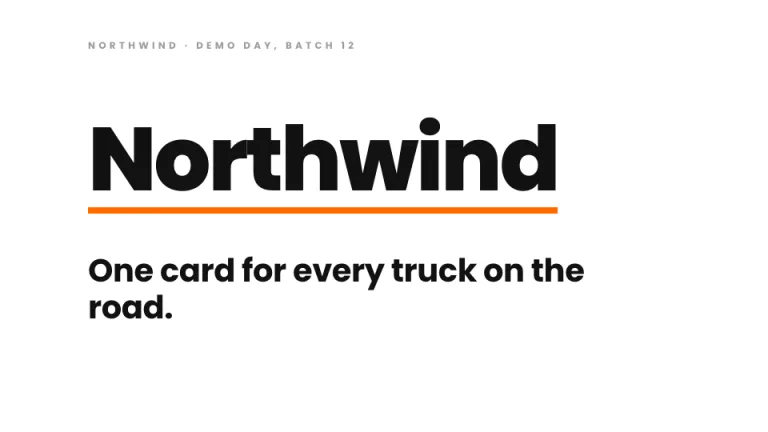
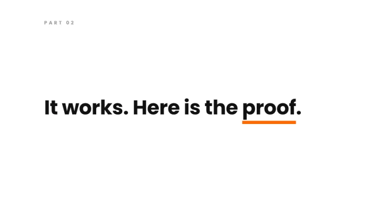
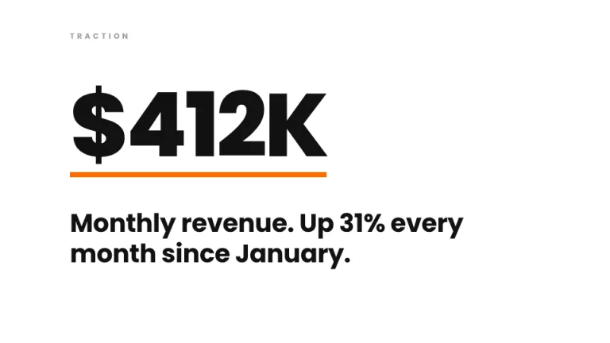
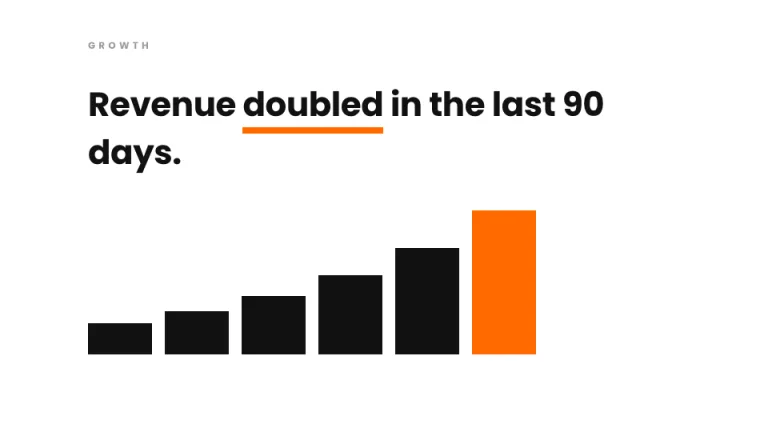
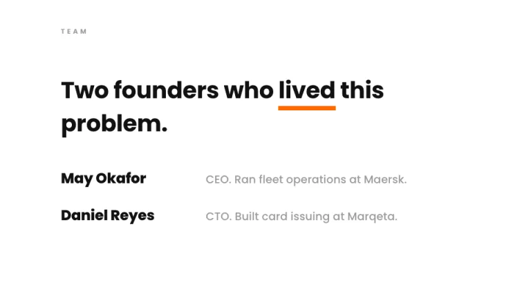
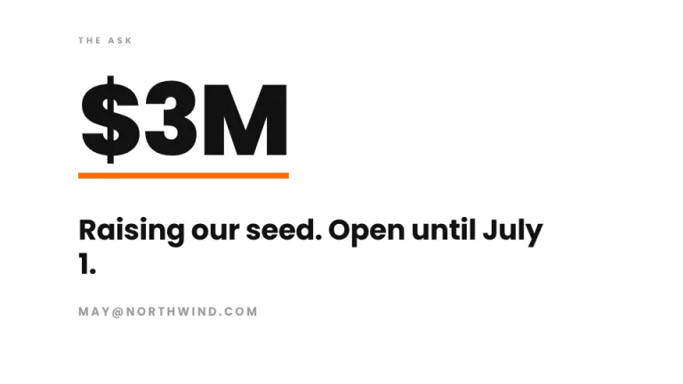

[← All prompts](../README.md) · [Live site](https://slidespeak.co/slide-design-prompts) · [SlideSpeak](https://slidespeak.co)

# Demo Day

> Three minutes, one idea per slide

The accelerator stage deck. Giant numbers, short sentences and a single orange bar under the word that matters.

**Category:** Pitch decks &nbsp;·&nbsp; **Style:** Bold, Minimal &nbsp;·&nbsp; **Mode:** Light &nbsp;·&nbsp; **Fonts:** Poppins

<table>
    <tr>
      <td align="center" width="33%"><br><sub>Title</sub></td>
      <td align="center" width="33%"><br><sub>Section divider</sub></td>
      <td align="center" width="33%"><br><sub>Key metrics</sub></td>
    </tr>
    <tr>
      <td align="center" width="33%"><br><sub>Chart & insight</sub></td>
      <td align="center" width="33%"><br><sub>Team</sub></td>
      <td align="center" width="33%"><br><sub>Closing</sub></td>
    </tr>
</table>

## The prompt

Copy the prompt below into **ChatGPT**, **Claude**, or any AI chat — or grab the raw [`PROMPT.md`](./PROMPT.md). It asks what your presentation is about first, then applies the design to every slide.

```text
Create a presentation in the 'Demo Day' theme: an accelerator pitch built for a three-minute clock. Background: pure white #FFFFFF. Text: near-black #111111 in 'Poppins' (a Google Font), the single bold geometric sans used everywhere. One accent only: orange #FF6B00. The discipline is one idea per slide, set huge. Key numbers at 130 to 150px, font-weight 800, tight letter-spacing. Supporting sentences short and declarative at 40 to 50px, two lines maximum. Under the single key word or figure on each slide, draw a thick 8px orange #FF6B00 underline bar with a 4px gap below the text. Everything is hard left-aligned against a wide 110px left margin. Top-left of every slide: a tiny 12px gray #9B9B9B uppercase label naming the slide, like TRACTION or TEAM, letter-spaced 0.35em. Charts are flat rectangles in #111111 with only the key bar in #FF6B00, no axes, gridlines or value labels. Strictly avoid: any second accent color; centered text; icons, shadows or gradients; rounded corners; bullet lists; sentences longer than ten words.

Use this theme for my slides. Ask me what the presentation is about first, then apply the theme to every slide.
```

**[Open ChatGPT ↗](https://chatgpt.com/)** &nbsp;·&nbsp; **[Open Claude ↗](https://claude.ai/new)** &nbsp;·&nbsp; **[Generate a finished deck with SlideSpeak ↗](https://app.slidespeak.co/presentation?utm_source=github&utm_medium=referral&utm_campaign=slide-design-prompts)**

## Palette

| Role | Hex |
| --- | --- |
| Background | `#FFFFFF` |
| Surface / panel | `#FAFAFA` |
| Border | `#E5E5E5` |
| Primary accent | `#FF6B00` |
| Primary (soft tint) | `#FFE8D9` |
| Text on primary | `#FFFFFF` |
| Heading text | `#111111` |
| Body text | `#444444` |
| Muted text | `#9B9B9B` |

**Chart series:** `#FF6B00` `#111111` `#9B9B9B` `#E5E5E5`

## Fonts

- **Poppins** (heading and body, Google Fonts)

---

<sub>Part of [SlideSpeak Slide Design Prompts](../../README.md) · MIT licensed</sub>
