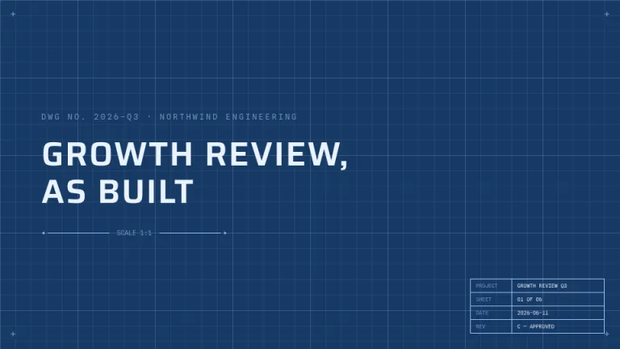
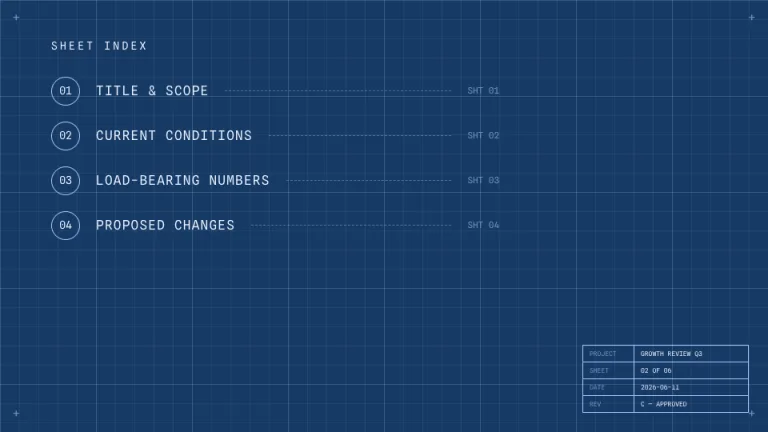
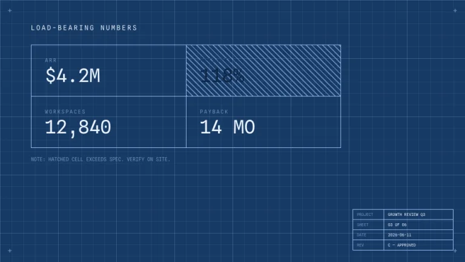
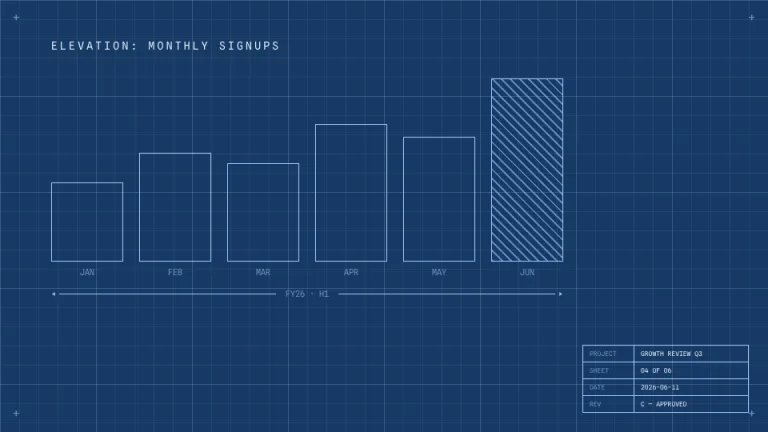
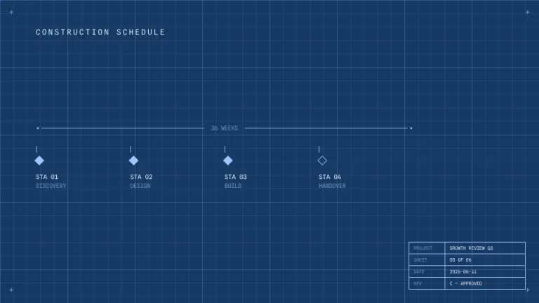
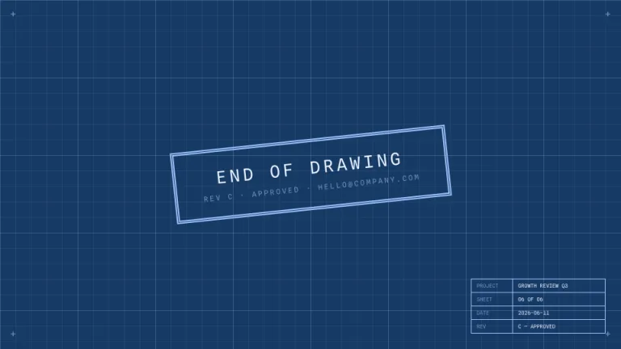

[← All prompts](../README.md) · [Live site](https://slidespeak.co/slide-design-prompts) · [SlideSpeak](https://slidespeak.co)

# Drafting Room

> Measure twice, present once

A blueprint, literally. Graph grid, dimension lines, hatched fills and a proper title block in the corner. For work that gets built.

**Category:** Tech & product &nbsp;·&nbsp; **Style:** Tech, Minimal &nbsp;·&nbsp; **Mode:** Dark &nbsp;·&nbsp; **Fonts:** Saira + Spline Sans Mono

<table>
    <tr>
      <td align="center" width="33%"><br><sub>Title</sub></td>
      <td align="center" width="33%"><br><sub>Agenda</sub></td>
      <td align="center" width="33%"><br><sub>Key metrics</sub></td>
    </tr>
    <tr>
      <td align="center" width="33%"><br><sub>Chart & insight</sub></td>
      <td align="center" width="33%"><br><sub>Timeline</sub></td>
      <td align="center" width="33%"><br><sub>Closing</sub></td>
    </tr>
</table>

## The prompt

Copy the prompt below into **ChatGPT**, **Claude**, or any AI chat — or grab the raw [`PROMPT.md`](./PROMPT.md). It asks what your presentation is about first, then applies the design to every slide.

```text
Create a presentation styled as an engineering blueprint, the 'Drafting Room' theme. Background: drafting blue (#173A66) covered edge to edge with a fine graph-paper grid (thin lines at about 6 percent white opacity every 24px, heavier lines every 120px). All linework and frames in pale blueprint white (#9FC6FF); primary text near-white (#EAF3FF) set in 'Saira'; labels in 'Spline Sans Mono' uppercase (both Google Fonts). Every slide carries two fixtures: small '+' registration marks in all four corners, and a title block table in the bottom-right with ruled rows for PROJECT, SHEET, DATE and REV. Headlines: plain uppercase with a dimension line underneath, a thin rule with arrowheads at both ends and a small measurement label in the middle. Shapes and bars are drawn as white outlines with transparent fills; the highlighted element is filled with 45-degree diagonal hatching instead of solid color. Use dashed lines for secondary or projected elements, and circled two-digit numbers for list items. Strictly avoid: solid color fills other than hatching, rounded corners, shadows, any hue outside the blue-and-white range.

Use this theme for my slides. Ask me what the presentation is about first, then apply the theme to every slide.
```

**[Open ChatGPT ↗](https://chatgpt.com/)** &nbsp;·&nbsp; **[Open Claude ↗](https://claude.ai/new)** &nbsp;·&nbsp; **[Generate a finished deck with SlideSpeak ↗](https://app.slidespeak.co/presentation?utm_source=github&utm_medium=referral&utm_campaign=slide-design-prompts)**

## Palette

| Role | Hex |
| --- | --- |
| Background | `#173A66` |
| Surface / panel | `#1D4373` |
| Border | `#9FC6FF` |
| Primary accent | `#9FC6FF` |
| Primary (soft tint) | `#244D80` |
| Text on primary | `#173A66` |
| Heading text | `#EAF3FF` |
| Body text | `#B7CFEA` |
| Muted text | `#6E93BF` |

**Chart series:** `#9FC6FF` `#6FA3E0` `#3E72AC` `#244D80`

## Fonts

- **Saira** (heading, Google Fonts)
- **Spline Sans Mono** (supporting, Google Fonts)

---

<sub>Part of [SlideSpeak Slide Design Prompts](../../README.md) · MIT licensed</sub>
