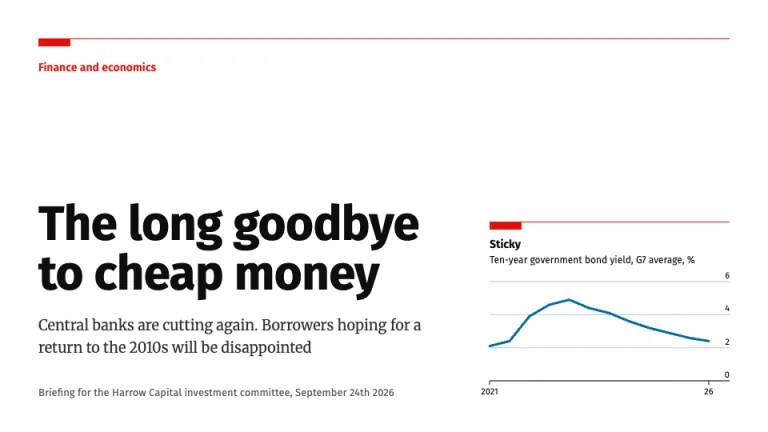
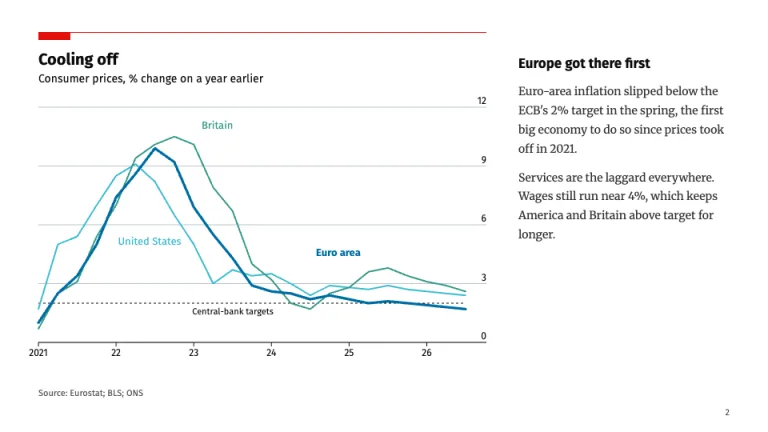
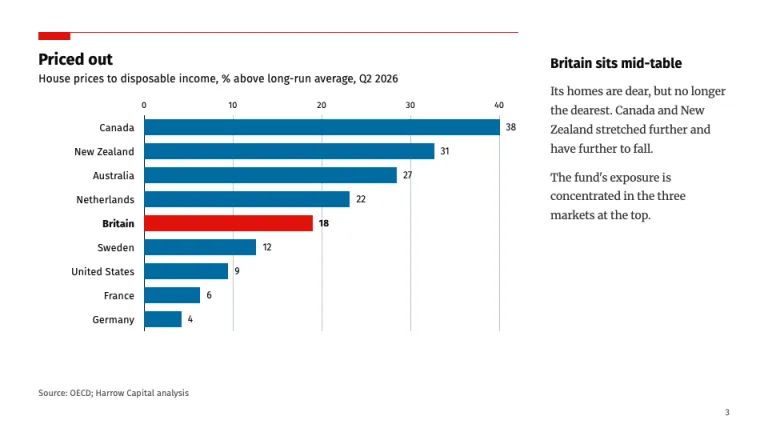
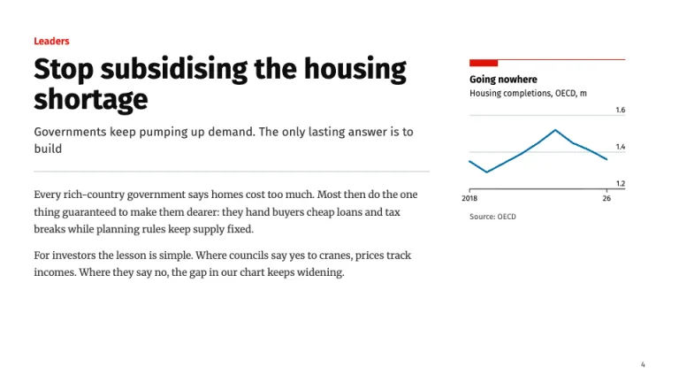
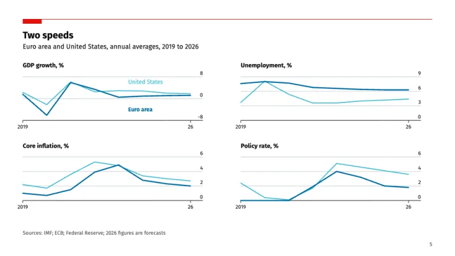
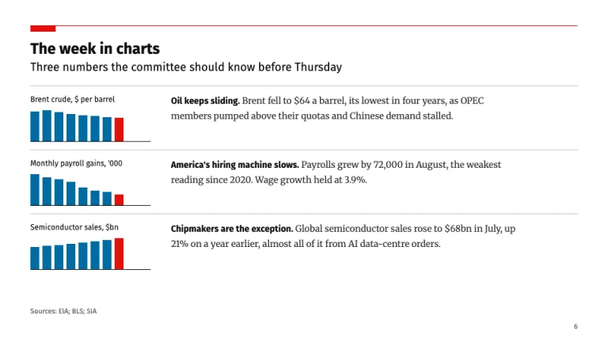

[← All prompts](../README.md) · [Live site](https://slidespeak.co/slide-design-prompts) · [SlideSpeak](https://slidespeak.co)

# Economist Style

> Charts with a red tag and the axis on the right

Economist style charts for your slides: a red rule with a hanging red tag, a short witty title over a plain subtitle, y-axis labels on the right, direct series labels and a source line on each chart. Argument slides in the style of a leader sit between the charts. An unofficial homage to the chart style of The Economist. Not affiliated with, endorsed by, or connected to The Economist Group.

**Category:** Finance &nbsp;·&nbsp; **Style:** Corporate, Minimal &nbsp;·&nbsp; **Mode:** Light &nbsp;·&nbsp; **Fonts:** Fira Sans + Merriweather

<table>
    <tr>
      <td align="center" width="33%"><br><sub>Title</sub></td>
      <td align="center" width="33%"><br><sub>Line chart</sub></td>
      <td align="center" width="33%"><br><sub>Ranked bars</sub></td>
    </tr>
    <tr>
      <td align="center" width="33%"><br><sub>Leader</sub></td>
      <td align="center" width="33%"><br><sub>Small multiples</sub></td>
      <td align="center" width="33%"><br><sub>Briefing</sub></td>
    </tr>
</table>

## The prompt

Copy the prompt below into **ChatGPT**, **Claude**, or any AI chat — or grab the raw [`PROMPT.md`](./PROMPT.md). It asks what your presentation is about first, then applies the design to every slide.

```text
Create a presentation in the 'Economist Style' theme, an unofficial homage to the chart and leader conventions of the weekly news magazine. Background: white (#ffffff) on every slide, no full-bleed color. Typography: 'Fira Sans' (Google Fonts) for titles, chart titles, axis and data labels; 'Merriweather' 400 for argument prose at 14 to 16px with line-height 1.7. The signature: every chart and the cover carry a 1px red (#e3120b) rule across the full width of the panel with a solid red rectangle, 40px wide and 10px tall, hanging from its left end. Under it: a short, witty chart title in Fira Sans 700 at 20 to 24px in #0d0d0d (two to four words, such as 'Cooling off' or 'Priced out'), then a plain subtitle in Fira Sans 400 at 14px stating the measure and unit ('Consumer prices, % change on a year earlier'). Chart rules: horizontal gridlines only, 1px #b7c6cf, with a darker #0d0d0d baseline at zero; y-axis labels on the right, sitting just above their gridlines, no axis title; x-axis ticks as short dark marks with abbreviated years ('2021', '22', '23'). Series colors in order: #006ba2, #3ebcd2, #379a8b, #ebb434, at most four; the series that proves the point is #006ba2 and the heaviest stroke, the rest are thinner. Label series directly beside the lines in their own color, never in a legend box. Red #e3120b may mark one bar that is the subject of the story, nothing else in a chart. Ranked bar charts are horizontal, sorted, labelled on the left, with values at the bar ends. Every chart ends with an 11px 'Source:' line bottom-left in #595959. Slide types: a cover with a red section name at 14px, a 56 to 64px headline and a one-sentence rubric; chart slides with a 560 to 600px chart panel and a narrow commentary column opening with a bold Fira Sans lead line; leader slides with a red section name, a bold headline at 36 to 40px, a Fira Sans rubric at 17px and two short Merriweather paragraphs held to a 65-character measure; small multiples in a 2x2 grid sharing one color pair and one set of ticks, labelled only in the first panel; a weekly briefing of three rows, each a tiny chart beside a paragraph that opens with a bold phrase. Page numbers are 11px #595959 bottom-right; there is no footer bar. Strictly avoid: The Economist wordmark or its red masthead box with a name in it, claiming affiliation with The Economist Group, pie and donut charts, 3D, vertical gridlines on line or column charts, left-hand y-axes, legend boxes where direct labels fit, gradients, drop shadows, rounded cards, more than four series, rainbow palettes, red used as decoration, topic titles like 'Inflation overview', centered body text, bullet lists.

Use this theme for my slides. Ask me what the presentation is about first, then apply the theme to every slide.
```

**[Open ChatGPT ↗](https://chatgpt.com/)** &nbsp;·&nbsp; **[Open Claude ↗](https://claude.ai/new)** &nbsp;·&nbsp; **[Generate a finished deck with SlideSpeak ↗](https://app.slidespeak.co/presentation?utm_source=github&utm_medium=referral&utm_campaign=slide-design-prompts)**

## Palette

| Role | Hex |
| --- | --- |
| Background | `#ffffff` |
| Surface / panel | `#e9edf0` |
| Border | `#b7c6cf` |
| Primary accent | `#e3120b` |
| Primary (soft tint) | `#f6d3d1` |
| Text on primary | `#ffffff` |
| Heading text | `#0d0d0d` |
| Body text | `#333333` |
| Muted text | `#595959` |

**Chart series:** `#006ba2` `#3ebcd2` `#379a8b` `#ebb434`

## Fonts

- **Fira Sans** (heading, Google Fonts)
- **Merriweather** (supporting, Google Fonts)

---

<sub>Part of [SlideSpeak Slide Design Prompts](../../README.md) · MIT licensed</sub>
