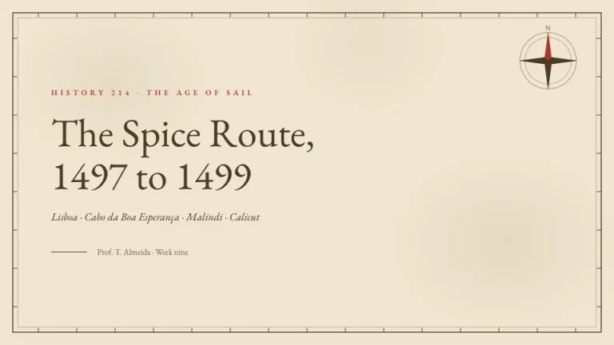
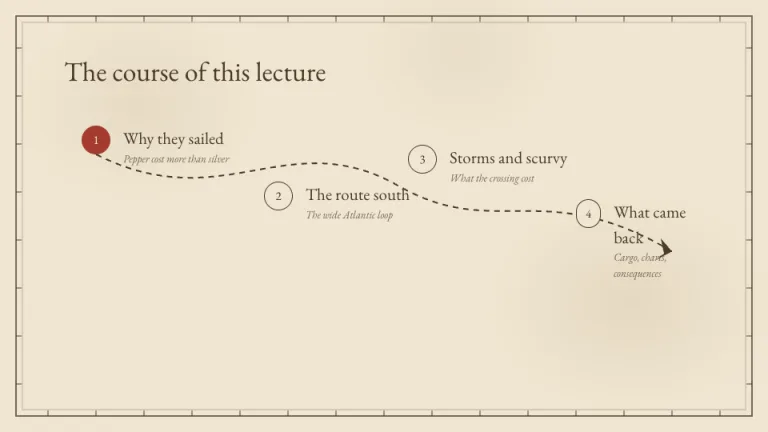
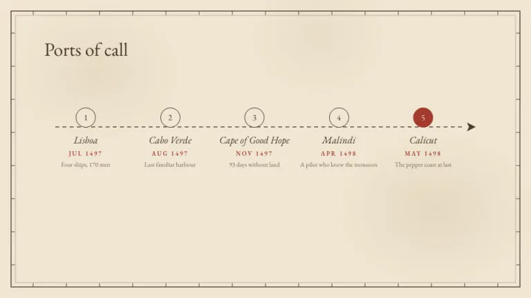
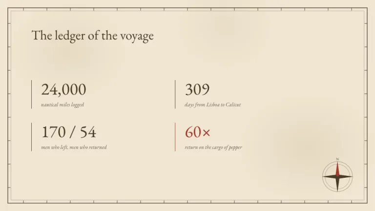
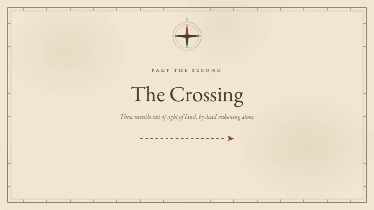

[← All prompts](../README.md) · [Live site](https://slidespeak.co/slide-design-prompts) · [SlideSpeak](https://slidespeak.co)

# Expedition

> Here be agenda items

A vintage chart for journeys and history. A dashed route with numbered ports carries the agenda while a compass rose keeps watch from the corner.

**Category:** Education & research &nbsp;·&nbsp; **Style:** Warm, Elegant &nbsp;·&nbsp; **Mode:** Light &nbsp;·&nbsp; **Fonts:** EB Garamond

<table>
    <tr>
      <td align="center" width="33%"><br><sub>Title</sub></td>
      <td align="center" width="33%"><br><sub>Agenda</sub></td>
      <td align="center" width="33%"><br><sub>Timeline</sub></td>
    </tr>
    <tr>
      <td align="center" width="33%"><br><sub>Key metrics</sub></td>
      <td align="center" width="33%"><br><sub>Section divider</sub></td>
    </tr>
</table>

## The prompt

Copy the prompt below into **ChatGPT**, **Claude**, or any AI chat — or grab the raw [`PROMPT.md`](./PROMPT.md). It asks what your presentation is about first, then applies the design to every slide.

```text
Design slides as a vintage exploration map, the 'Expedition' theme. Background: parchment #F0E6D2 with two or three faint sepia blotches, large soft radial-gradient spots near 10 percent opacity. Every slide carries a border frame: a 1.5px sepia #4A3B28 rectangle inset about 20px with a thinner inner rule, plus small latitude and longitude tick marks every 60px along all four edges. Typography: 'EB Garamond' (a Google Font) as the single face throughout; headings in sepia ink #4A3B28; place names and asides in italic 'EB Garamond'; tiny uppercase labels in wax red #A33B2E. Signature motifs: a dashed route line, 1.5px sepia with a 7 6 dash pattern ending in a solid arrowhead, connecting numbered port circles (1.5px sepia outline, the key port filled wax red #A33B2E), used for agendas and timelines; an 8-point compass rose in one corner with sepia points and the north needle in #A33B2E. Strictly avoid: photographs, drop shadows, blue water fills, modern sans-serif headlines, rounded cards, any color beyond parchment, sepia, and the single wax red.

Use this theme for my slides. Ask me what the presentation is about first, then apply the theme to every slide.
```

**[Open ChatGPT ↗](https://chatgpt.com/)** &nbsp;·&nbsp; **[Open Claude ↗](https://claude.ai/new)** &nbsp;·&nbsp; **[Generate a finished deck with SlideSpeak ↗](https://app.slidespeak.co/presentation?utm_source=github&utm_medium=referral&utm_campaign=slide-design-prompts)**

## Palette

| Role | Hex |
| --- | --- |
| Background | `#F0E6D2` |
| Surface / panel | `#F7EFDF` |
| Border | `#4A3B28` |
| Primary accent | `#A33B2E` |
| Primary (soft tint) | `#EFD6CC` |
| Text on primary | `#F0E6D2` |
| Heading text | `#4A3B28` |
| Body text | `#6B5840` |
| Muted text | `#9A8A72` |

**Chart series:** `#4A3B28` `#A33B2E` `#9A8A72` `#D8C8A8`

## Fonts

- **EB Garamond** (heading and body, Google Fonts)

---

<sub>Part of [SlideSpeak Slide Design Prompts](../../README.md) · MIT licensed</sub>
