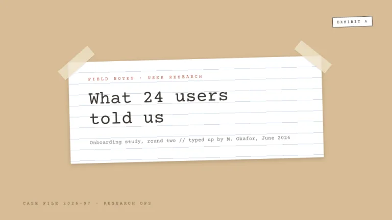
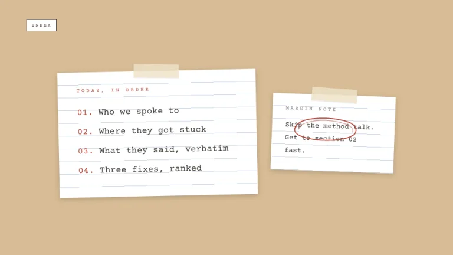
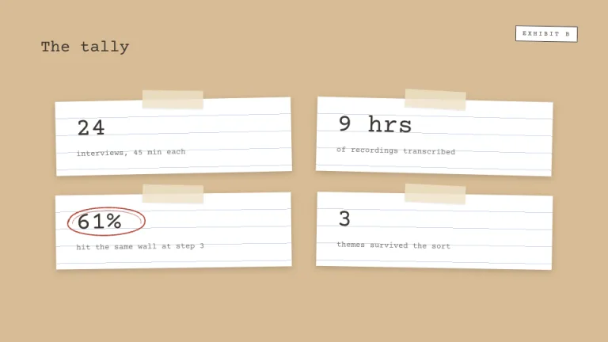
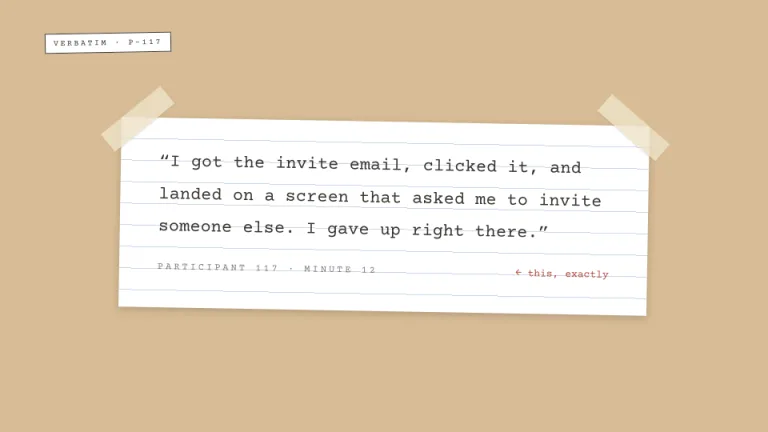
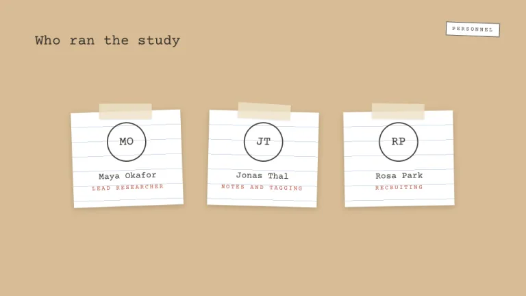
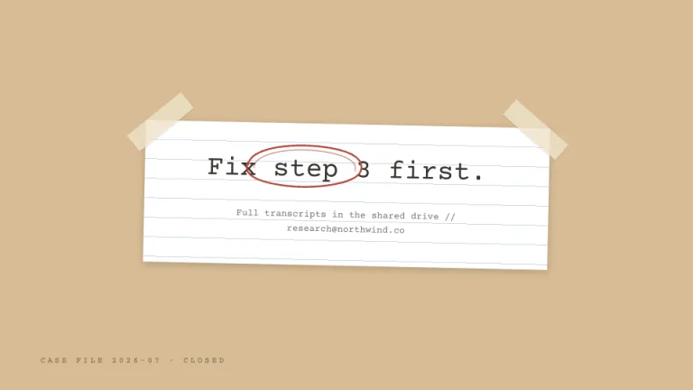

[← All prompts](../README.md) · [Live site](https://slidespeak.co/slide-design-prompts) · [SlideSpeak](https://slidespeak.co)

# Field Notes

> Taped to the folder

A research readout straight from the kraft folder. Everything sits on taped-down index cards, with red pencil circling whatever matters most.

**Category:** Education & research &nbsp;·&nbsp; **Style:** Warm, Minimal &nbsp;·&nbsp; **Mode:** Light &nbsp;·&nbsp; **Fonts:** Courier Prime

<table>
    <tr>
      <td align="center" width="33%"><br><sub>Title</sub></td>
      <td align="center" width="33%"><br><sub>Agenda</sub></td>
      <td align="center" width="33%"><br><sub>Key metrics</sub></td>
    </tr>
    <tr>
      <td align="center" width="33%"><br><sub>Quote</sub></td>
      <td align="center" width="33%"><br><sub>Team</sub></td>
      <td align="center" width="33%"><br><sub>Closing</sub></td>
    </tr>
</table>

## The prompt

Copy the prompt below into **ChatGPT**, **Claude**, or any AI chat — or grab the raw [`PROMPT.md`](./PROMPT.md). It asks what your presentation is about first, then applies the design to every slide.

```text
Design slides as a researcher's kraft folder, the 'Field Notes' theme. Background: kraft brown #D7BC94, bare. All content sits on white #FFFFFF index cards rotated between -2 and 2 degrees, each printed with faint blue ruled lines, 1px lines of rgba(125,160,199,0.4) every 27px, and a soft small shadow. Tape the cards down with masking-tape strips: semi-transparent beige rectangles about 96 by 28px in rgba(238,226,200,0.82), rotated roughly 40 degrees across top corners or laid flat at the top center. Typography: the typewriter monospace 'Courier Prime' (a Google Font) everywhere in ink #3A3530, with small uppercase labels at wide tracking. Signature marks: rough red pencil ellipses in #B5483A, drawn twice with a lighter second pass, circling the one number or phrase that matters; short red margin notes; small 'EXHIBIT A' style tags in uppercase 'Courier Prime' inside a 1.5px ink border. Strictly avoid: photographs, gradients, serif fonts, perfectly straight cards, rounded corners, any bright color beyond the single pencil red.

Use this theme for my slides. Ask me what the presentation is about first, then apply the theme to every slide.
```

**[Open ChatGPT ↗](https://chatgpt.com/)** &nbsp;·&nbsp; **[Open Claude ↗](https://claude.ai/new)** &nbsp;·&nbsp; **[Generate a finished deck with SlideSpeak ↗](https://app.slidespeak.co/presentation?utm_source=github&utm_medium=referral&utm_campaign=slide-design-prompts)**

## Palette

| Role | Hex |
| --- | --- |
| Background | `#D7BC94` |
| Surface / panel | `#FFFFFF` |
| Border | `#3A3530` |
| Primary accent | `#B5483A` |
| Primary (soft tint) | `#F3DCD8` |
| Text on primary | `#FFFFFF` |
| Heading text | `#3A3530` |
| Body text | `#5C554D` |
| Muted text | `#8A8178` |

**Chart series:** `#3A3530` `#B5483A` `#7DA0C7` `#D7BC94`

## Fonts

- **Courier Prime** (heading and body, Google Fonts)

---

<sub>Part of [SlideSpeak Slide Design Prompts](../../README.md) · MIT licensed</sub>
