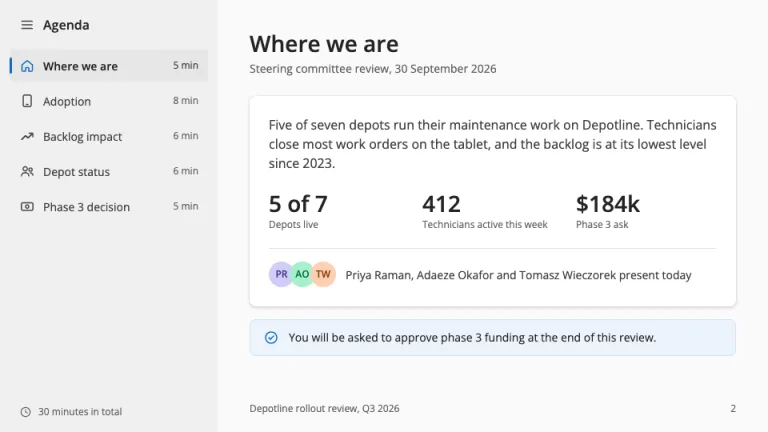
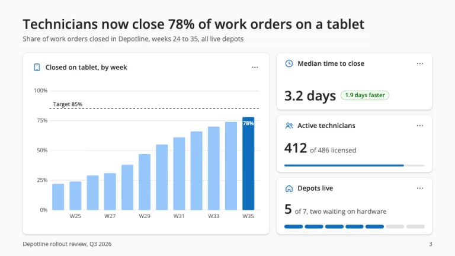
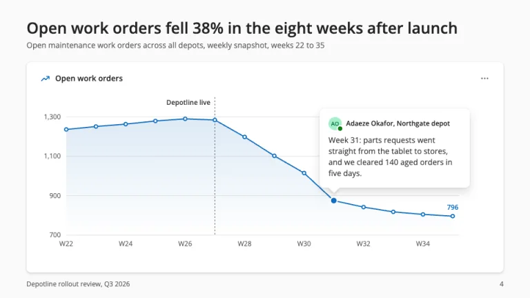
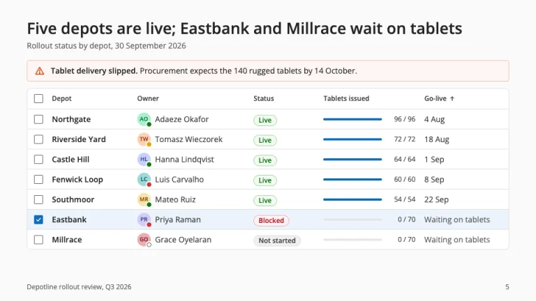
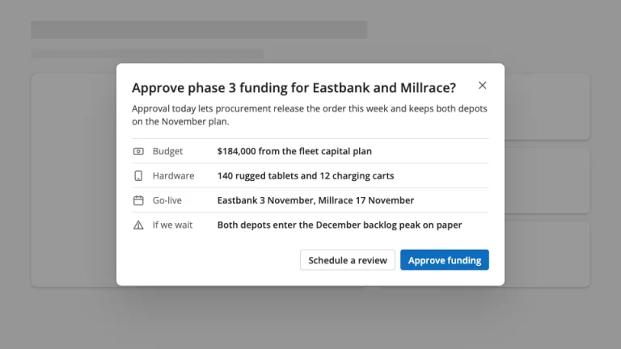

[← All prompts](../README.md) · [Live site](https://slidespeak.co/slide-design-prompts) · [SlideSpeak](https://slidespeak.co)

# Fluent Style

> Layered surfaces and Microsoft 365 data cards

A Microsoft Fluent design presentation prompt using Fluent 2: layered white surfaces, brand blue #0f6cbd and Microsoft 365-style data cards. An unofficial homage to the Fluent 2 design system. Not affiliated with, endorsed by, or connected to Microsoft Corporation.

**Category:** Tech & product &nbsp;·&nbsp; **Style:** Calm, Minimal &nbsp;·&nbsp; **Mode:** Light &nbsp;·&nbsp; **Fonts:** Open Sans

<table>
    <tr>
      <td align="center" width="33%"><br><sub>Title</sub></td>
      <td align="center" width="33%"><br><sub>Agenda</sub></td>
      <td align="center" width="33%"><br><sub>Metrics dashboard</sub></td>
    </tr>
    <tr>
      <td align="center" width="33%"><br><sub>Chart with callout</sub></td>
      <td align="center" width="33%"><br><sub>Status data grid</sub></td>
      <td align="center" width="33%"><br><sub>Decision dialog</sub></td>
    </tr>
</table>

## The prompt

Copy the prompt below into **ChatGPT**, **Claude**, or any AI chat — or grab the raw [`PROMPT.md`](./PROMPT.md). It asks what your presentation is about first, then applies the design to every slide.

```text
Create a presentation in the 'Fluent Style' theme, an unofficial homage to the public Fluent 2 design system. Canvas: neutral #fafafa on content slides, content on white (#ffffff) surfaces. Typography: 'Open Sans' (Google Fonts) as a Segoe UI stand-in, sentence case, on the Fluent type ramp: titles 28px 600 in #242424, subtitles 14px in #616161, card titles 14px 600, body 14 to 16px in #424242, captions 12px #616161, big numbers 28 to 40px 600. Spacing snaps to a 4px grid: 48px margins, 16px gaps, 16 to 24px padding. The signature is layered elevation with Fluent's two-part shadows: cards at shadow4 (0 0 2px rgba(0,0,0,0.12), 0 2px 4px rgba(0,0,0,0.14)), callouts at shadow16 (0 0 2px rgba(0,0,0,0.12), 0 8px 16px rgba(0,0,0,0.14)), dialogs at shadow64 (0 0 8px rgba(0,0,0,0.12), 0 32px 64px rgba(0,0,0,0.14)). Radii: 8px cards and dialogs, 4px buttons and nav items, pill badges, circular avatars. Brand blue #0f6cbd marks interaction and the key series; tints #ebf3fc and #cfe4fa mark selection. Icons: 20px outline glyphs, 1.5px rounded strokes, #424242, brand blue when selected. Title slide: a faint #ebf3fc to #fafafa wash, a white card at shadow28 with organization name, a 40px 600 title, 20px subtitle, #e0e0e0 divider and presenter avatar with a presence dot, beside three small surfaces stepping up in elevation. Agenda: a navigation drawer, #f0f0f0 pane of 40px icon rows, the current section with a 3px brand selection pill, #e6e6e6 fill and weight 600, minutes right-aligned. Data cards: icon, 14px 600 title and a '...' overflow button, then one number with a pill badge (success #f1faf1 fill, #0e700e text, #9fd89f border; danger #fdf3f4, #b10e1c, #eeacb2), a 4px progress bar on #e6e6e6 or a segment meter. Charts: #0f6cbd highlight, #96c6fa context, extra series teal #038387 and lavender #6656d1, 1px #e0e0e0 gridlines, 12px axis labels, a dashed target line, and a callout whose beak points at the key data point. Data grids: 36px rows, 12px 600 headers, #e0e0e0 row dividers, checkboxes, avatars with presence dots (available #107c10, busy #d13438, away #eaa300), a selected row in #ebf3fc; warning message bar #fdf6f3 with #f4bfab border and #da3b01 icon. Closing slide: the ask as a dialog over a 40% black scrim, a fact list, a primary #0f6cbd button and a white secondary with 1px #d1d1d1 border. Footer: 12px #616161 deck name left, page number right. Strictly avoid: Microsoft, Windows or Office logos and product icons, claiming affiliation with Microsoft Corporation, saturated backgrounds, gradients beyond the title wash, shadowless cards on the gray canvas, surface radii above 8px, all-caps labels, headings above weight 600, rainbow charts, stock photos, 3D effects, emoji.

Use this theme for my slides. Ask me what the presentation is about first, then apply the theme to every slide.
```

**[Open ChatGPT ↗](https://chatgpt.com/)** &nbsp;·&nbsp; **[Open Claude ↗](https://claude.ai/new)** &nbsp;·&nbsp; **[Generate a finished deck with SlideSpeak ↗](https://app.slidespeak.co/presentation?utm_source=github&utm_medium=referral&utm_campaign=slide-design-prompts)**

## Palette

| Role | Hex |
| --- | --- |
| Background | `#fafafa` |
| Surface / panel | `#ffffff` |
| Border | `#e0e0e0` |
| Primary accent | `#0f6cbd` |
| Primary (soft tint) | `#ebf3fc` |
| Text on primary | `#ffffff` |
| Heading text | `#242424` |
| Body text | `#424242` |
| Muted text | `#616161` |

**Chart series:** `#0f6cbd` `#96c6fa` `#038387` `#6656d1`

## Fonts

- **Open Sans** (heading, Google Fonts)

---

<sub>Part of [SlideSpeak Slide Design Prompts](../../README.md) · MIT licensed</sub>
