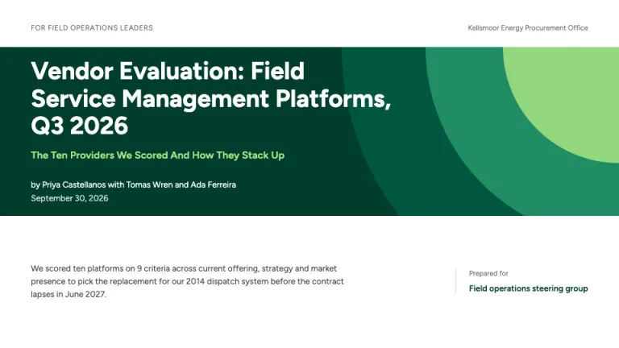
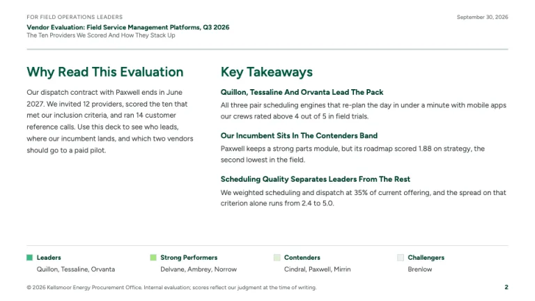
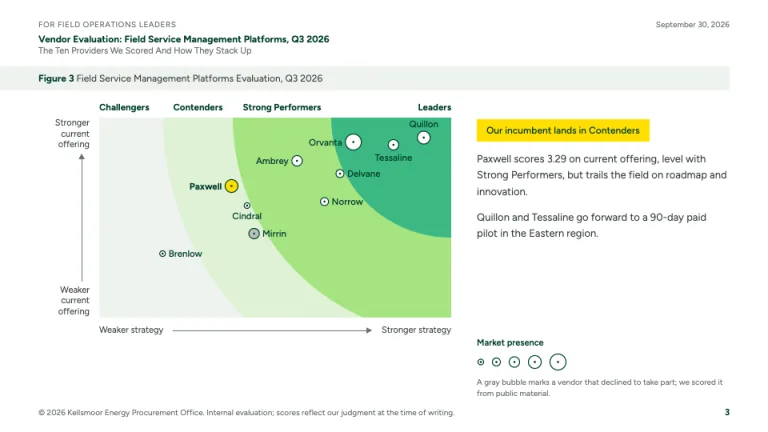
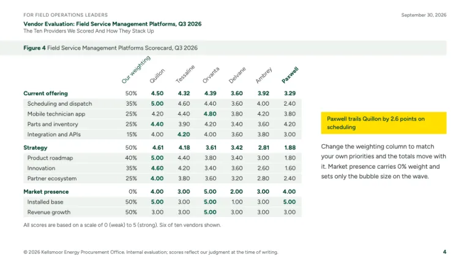
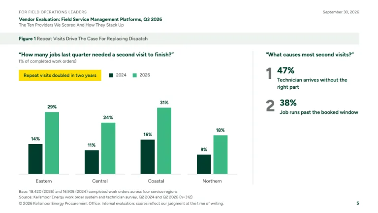
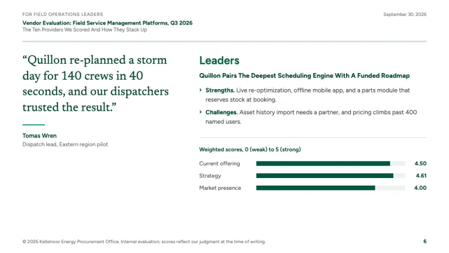

[← All prompts](../README.md) · [Live site](https://slidespeak.co/slide-design-prompts) · [SlideSpeak](https://slidespeak.co)

# Forrester Style

> Vendor rankings in green wave bands

A Forrester Wave template for vendor evaluations: green bands from Challengers to Leaders, bubbles sized by market presence and a weighted scorecard. An unofficial homage to Forrester Research report design. Forrester Wave is a trademark of Forrester Research, Inc. Not affiliated with, endorsed by, or connected to Forrester Research, Inc.

**Category:** Consulting &nbsp;·&nbsp; **Style:** Corporate, Tech &nbsp;·&nbsp; **Mode:** Light &nbsp;·&nbsp; **Fonts:** Figtree + Newsreader

<table>
    <tr>
      <td align="center" width="33%"><br><sub>Cover</sub></td>
      <td align="center" width="33%"><br><sub>Key takeaways</sub></td>
      <td align="center" width="33%"><br><sub>The Wave</sub></td>
    </tr>
    <tr>
      <td align="center" width="33%"><br><sub>Scorecard</sub></td>
      <td align="center" width="33%"><br><sub>Survey figure</sub></td>
      <td align="center" width="33%"><br><sub>Leader profile</sub></td>
    </tr>
</table>

## The prompt

Copy the prompt below into **ChatGPT**, **Claude**, or any AI chat — or grab the raw [`PROMPT.md`](./PROMPT.md). It asks what your presentation is about first, then applies the design to every slide.

```text
Create a presentation in the 'Forrester Style' theme, an unofficial homage to the analyst research report and its wave-shaped vendor evaluation. Background: white (#ffffff) on every slide. Typography: 'Figtree' (Google Fonts) for all text except quotes; slide headings 600 at 24px in green #00563F, cover title bold 38px, body 13px #3a413e, sources 10 to 11px #6b736f. Quotes use 'Newsreader' 400 at 24 to 28px in dark green #003D2D. Write headings and bold lead-ins in Title Case, capitalizing every word, such as 'Key Takeaways' and 'Quillon Leads The Pack'. Palette: green #00563F, dark green #003D2D, medium green #3BB982, bright green #A6E483, tint #dff2d4, surface #eef2ef, rules #d3dbd6, and yellow #FFDE00 once per slide at most, as a filled takeaway tag with dark green text. Running header on content slides: a small uppercase role line such as 'For field operations leaders', the bold report title, a Title Case subtitle, the date top right. Every exhibit opens with a 30px #eef2ef figure bar from the left slide edge to the right margin: bold 'Figure N', then the Title Case figure title. Signature Wave slide: a plot filled #eef2ef with quarter-circle bands radiating from its top-right corner, Leaders #3BB982, Strong Performers #A6E483, Contenders #dff2d4, the pale remainder Challengers, band names bold 12px across the top. Axes: 'Weaker/Stronger current offering' vertical, 'Weaker/Stronger strategy' horizontal, thin gray arrows. Vendors are white bubbles with a 1.2px #003D2D ring and center dot, sized by market presence in five steps with a legend; gray marks a nonparticipating vendor; the one vendor that matters to the audience is filled #FFDE00. Scorecard: vendor names rotated 45 degrees, a weighting column, bold group rows (current offering, strategy, market presence) with weighted totals, #eef2ef criterion rows, best score per row bold #00563F, and 'All scores are based on a scale of 0 (weak) to 5 (strong).' Takeaways: 'Why Read This' left, 'Key Takeaways' right with bold lead-ins. Data figures quote the survey question in bold, add a yellow tag, use #003D2D and #3BB982 bars with values on top, and end with 'Base:' and 'Source:' lines. Profiles use green chevron bullets with bold 'Strengths.' and 'Challenges.' lead-ins. Cover: a full-width #003D2D block with the bands as arcs from its top-right corner, white title, #A6E483 subtitle, byline and date. Footer: 10px copyright line bottom-left, bold page number bottom-right. Strictly avoid: Forrester logos or wordmarks, the name 'The Forrester Wave' on slides, claiming affiliation with or endorsement by Forrester, navy or blue palettes, square quadrants, yellow backgrounds, gradients, shadows, rounded cards, icons, stock photos, 3D charts, centered body text, nested bullets.

Use this theme for my slides. Ask me what the presentation is about first, then apply the theme to every slide.
```

**[Open ChatGPT ↗](https://chatgpt.com/)** &nbsp;·&nbsp; **[Open Claude ↗](https://claude.ai/new)** &nbsp;·&nbsp; **[Generate a finished deck with SlideSpeak ↗](https://app.slidespeak.co/presentation?utm_source=github&utm_medium=referral&utm_campaign=slide-design-prompts)**

## Palette

| Role | Hex |
| --- | --- |
| Background | `#ffffff` |
| Surface / panel | `#eef2ef` |
| Border | `#d3dbd6` |
| Primary accent | `#00563F` |
| Primary (soft tint) | `#dff2d4` |
| Text on primary | `#ffffff` |
| Heading text | `#003D2D` |
| Body text | `#3a413e` |
| Muted text | `#6b736f` |

**Chart series:** `#003D2D` `#3BB982` `#A6E483` `#FFDE00`

## Fonts

- **Figtree** (heading, Google Fonts)
- **Newsreader** (supporting, Google Fonts)

---

<sub>Part of [SlideSpeak Slide Design Prompts](../../README.md) · MIT licensed</sub>
