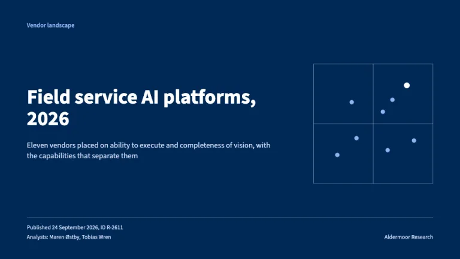
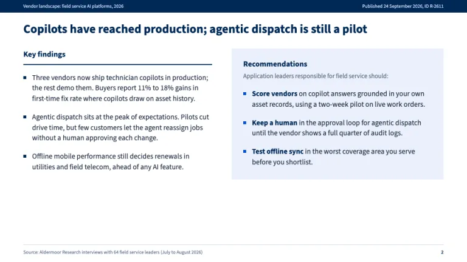
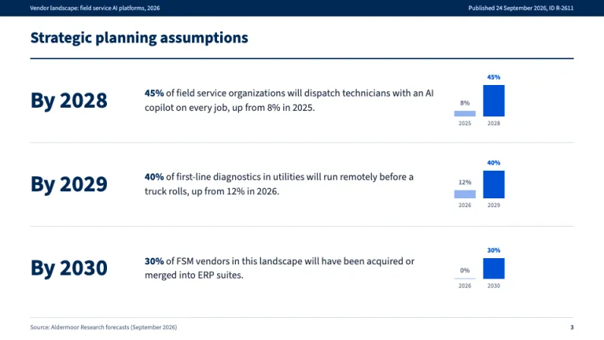
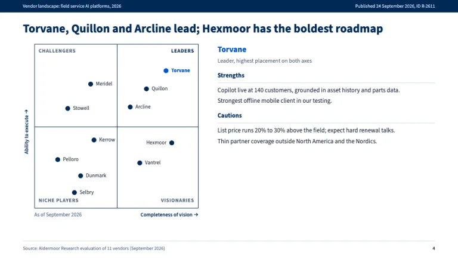
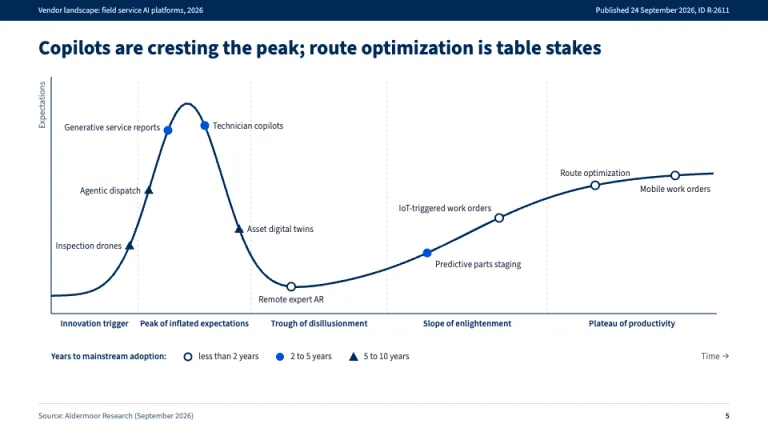
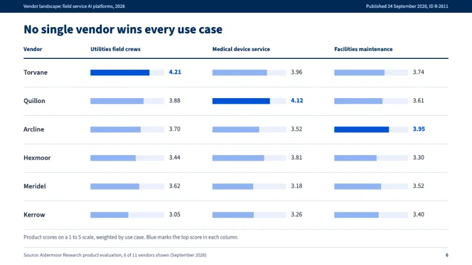

[← All prompts](../README.md) · [Live site](https://slidespeak.co/slide-design-prompts) · [SlideSpeak](https://slidespeak.co)

# Gartner Style

> Research note grammar, quadrant and curve included

Gartner style slides for analyst readouts and vendor evaluations: a magic quadrant template with execution and vision axes, a hype cycle template on one navy curve, dated planning assumptions and a research-note running header. An unofficial homage to the Gartner presentation style; Magic Quadrant and Hype Cycle are trademarks of Gartner, Inc. Not affiliated with, endorsed by, or connected to Gartner, Inc.

**Category:** Consulting &nbsp;·&nbsp; **Style:** Corporate, Tech &nbsp;·&nbsp; **Mode:** Light &nbsp;·&nbsp; **Fonts:** Source Sans 3

<table>
    <tr>
      <td align="center" width="33%"><br><sub>Cover</sub></td>
      <td align="center" width="33%"><br><sub>Key findings and recommendations</sub></td>
      <td align="center" width="33%"><br><sub>Strategic planning assumptions</sub></td>
    </tr>
    <tr>
      <td align="center" width="33%"><br><sub>Vendor quadrant</sub></td>
      <td align="center" width="33%"><br><sub>Hype cycle</sub></td>
      <td align="center" width="33%"><br><sub>Critical capabilities</sub></td>
    </tr>
</table>

## The prompt

Copy the prompt below into **ChatGPT**, **Claude**, or any AI chat — or grab the raw [`PROMPT.md`](./PROMPT.md). It asks what your presentation is about first, then applies the design to every slide.

```text
Create a presentation in the 'Gartner Style' theme, an unofficial homage to the analyst research note and its vendor exhibits. Background: white (#ffffff) on content slides, navy (#002856) on the cover. Typography: 'Source Sans 3' (Google Fonts) throughout; titles bold 24 to 26px navy #002856, body 13 to 16px #1c2a3f, notes 10 to 12px #5b6b82. Color: navy #002856 carries structure, blue #0052d6 marks the one thing to read first, sky #8fb3f2 for context bars, tint #eaf0fb for panels and bar tracks, rules 1px #d3dbe7, teal #12a19a only as a fourth chart series. Signature chrome: a 26px navy running header across the top of every content slide, the document title left and 'Published <date>, ID <code>' right, in 10px #c9d8f4. Footer: 1px #d3dbe7 rule, a 'Source:' line and a navy page number. Cover: full navy, document type in sky, a plain title in white 40 to 44px, a scope line, publish date, ID and analysts at the bottom, and a line-drawn quadrant (white at 35% opacity, sky dots) on the right. Key findings slide: findings with 6px square navy bullets on the left; a tint panel on the right titled 'Recommendations' with the line '<Role> responsible for <area> should:' and each point opening with a bold navy verb phrase. Strategic planning assumptions: dated predictions in the form 'By 2028, 45% of ... up from 8% in 2025', the year in bold navy 38px, the percentage bold in the sentence, and a from/to bar pair (sky, then blue). Signature exhibit one, the vendor quadrant: a square plot with a 1px navy frame and center cross, 'Ability to execute' up the side and 'Completeness of vision' along the bottom corner labels Challengers (top-left), Leaders (top-right), Niche players (bottom-left), Visionaries (bottom-right) in 11px bold caps, labeled navy 10px vendor dots, one in blue, 'As of <month year>' below, and a Strengths and Cautions profile beside it. Signature exhibit two, the hype cycle: one 2.5px navy curve rising to a peak, falling to a trough and climbing to a plateau, dashed dividers between five phases named under the axis (Innovation trigger, Peak of inflated expectations, Trough of disillusionment, Slope of enlightenment, Plateau of productivity), technologies on the curve coded by years to mainstream adoption: open navy ring under 2 years, blue dot 2 to 5, navy triangle 5 to 10, with a legend below. Scorecards: vendors by use case, sky bars on tint tracks, two-decimal scores, top per column in blue. Strictly avoid: the Gartner logo or wordmark, the words Magic Quadrant or Hype Cycle as slide titles, claiming affiliation with Gartner, Inc., vendor placements copied from published research, gradients, drop shadows, rounded cards, 3D charts, pie charts, stock photos, icons, centered body text and data slides without a source line.

Use this theme for my slides. Ask me what the presentation is about first, then apply the theme to every slide.
```

**[Open ChatGPT ↗](https://chatgpt.com/)** &nbsp;·&nbsp; **[Open Claude ↗](https://claude.ai/new)** &nbsp;·&nbsp; **[Generate a finished deck with SlideSpeak ↗](https://app.slidespeak.co/presentation?utm_source=github&utm_medium=referral&utm_campaign=slide-design-prompts)**

## Palette

| Role | Hex |
| --- | --- |
| Background | `#ffffff` |
| Surface / panel | `#eaf0fb` |
| Border | `#d3dbe7` |
| Primary accent | `#002856` |
| Primary (soft tint) | `#eaf0fb` |
| Text on primary | `#ffffff` |
| Heading text | `#002856` |
| Body text | `#1c2a3f` |
| Muted text | `#5b6b82` |

**Chart series:** `#0052d6` `#002856` `#8fb3f2` `#12a19a`

## Fonts

- **Source Sans 3** (heading, Google Fonts)

---

<sub>Part of [SlideSpeak Slide Design Prompts](../../README.md) · MIT licensed</sub>
