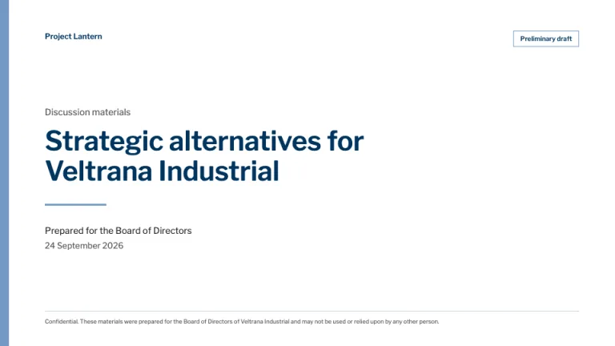
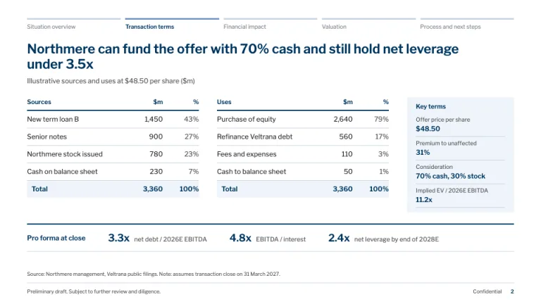
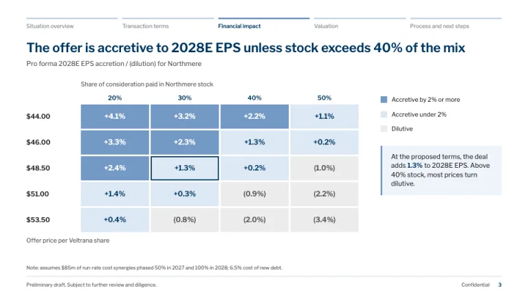
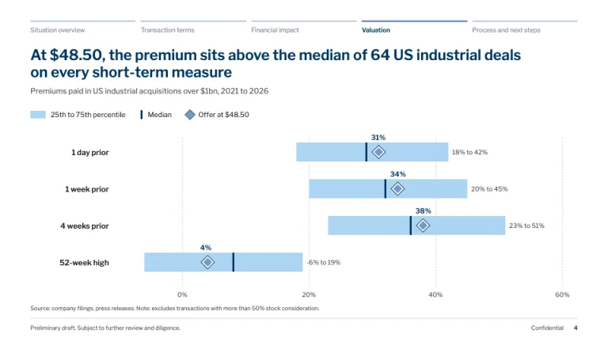
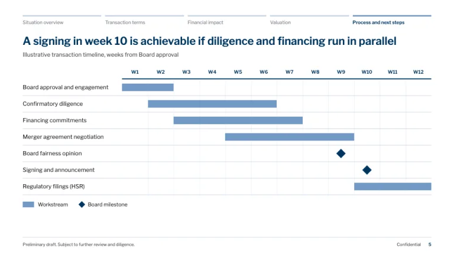
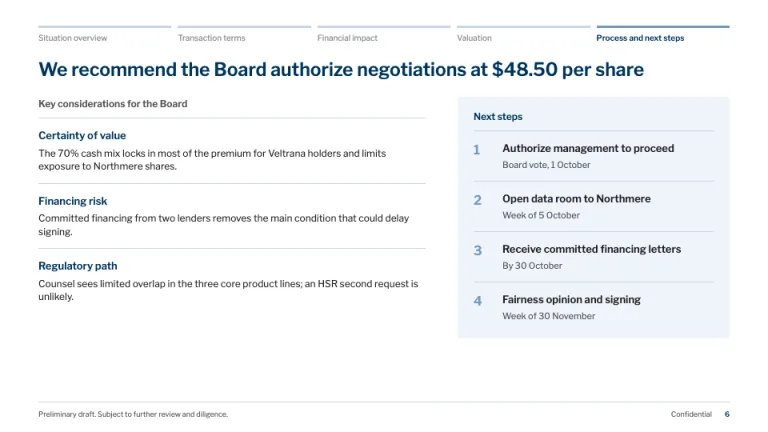

[← All prompts](../README.md) · [Live site](https://slidespeak.co/slide-design-prompts) · [SlideSpeak](https://slidespeak.co)

# Goldman Sachs Style

> The board book, in light blue and navy

A Goldman Sachs pitch book style for M&A board materials: a section tracker on every slide, sources and uses tables, an accretion and dilution grid, a premiums-paid chart and a deal timeline, in GS blue and navy on white. An unofficial homage to the Goldman Sachs presentation style. Not affiliated with, endorsed by, or connected to The Goldman Sachs Group, Inc.

**Category:** Finance &nbsp;·&nbsp; **Style:** Corporate, Elegant &nbsp;·&nbsp; **Mode:** Light &nbsp;·&nbsp; **Fonts:** Libre Franklin

<table>
    <tr>
      <td align="center" width="33%"><br><sub>Cover</sub></td>
      <td align="center" width="33%"><br><sub>Sources and uses</sub></td>
      <td align="center" width="33%"><br><sub>Accretion / dilution</sub></td>
    </tr>
    <tr>
      <td align="center" width="33%"><br><sub>Premiums paid</sub></td>
      <td align="center" width="33%"><br><sub>Process timeline</sub></td>
      <td align="center" width="33%"><br><sub>Considerations and next steps</sub></td>
    </tr>
</table>

## The prompt

Copy the prompt below into **ChatGPT**, **Claude**, or any AI chat — or grab the raw [`PROMPT.md`](./PROMPT.md). It asks what your presentation is about first, then applies the design to every slide.

```text
Create a presentation in the 'Goldman Sachs Style' theme, an unofficial homage to the bulge-bracket board book. Background: white (#ffffff) on every slide. Typography: 'Libre Franklin' (Google Fonts) throughout; titles 600 weight, body and tables 400, tabular figures for every number. Color: GS blue (#7399c6) is a fill and rule color only, never text; headings and key figures in navy (#00355f); body in near-black (#231f20); notes in gray (#58575a); light blue (#acd4f1) for ranges and secondary bars; pale tint (#eef4fa) for callout panels and total rows; rules in #c9d6e3. The signature chrome is a section tracker across the top of every content slide: the deck's five sections as equal columns, each with a 3px bar and a 10px label; the current section gets a #7399c6 bar and a navy 600 label, the rest a #c9d6e3 bar and gray label. Below it, a full-sentence action title in navy at 22 to 24px, sentence case, two lines maximum, then a 12px gray subtitle naming the exhibit and its units, such as 'Illustrative sources and uses ($m)'. Footer on every content slide: a 1px #c9d6e3 rule, 'Preliminary draft. Subject to further review and diligence.' bottom-left in 9px gray, 'Confidential' and a navy page number bottom-right; data slides add a 'Source:' or 'Note:' line above the rule. Cover: white, a 14px #7399c6 bar down the left edge, a project codename top-left, a bordered 'Preliminary draft' mark top-right, the engagement title in navy at 40 to 44px, a 96px blue rule, then 'Prepared for the Board of Directors' and the date, with a confidentiality line above the bottom rule. Signature exhibits: sources and uses as two matching tables with a 2px navy header rule, $m and % columns right-aligned, and a tinted total row that balances on both sides; an accretion / dilution sensitivity grid with offer price down the side and % stock consideration across the top, cells shaded #7399c6 for 2% or more accretion, #dce8f5 for 0 to 2%, #eceded for dilution in parentheses, and the proposed terms outlined 2px navy; a premiums-paid chart with a #acd4f1 25th to 75th percentile band, a navy median tick and the offer as a blue diamond per reference date; an illustrative timeline Gantt with week columns, #7399c6 workstream bars and navy diamond milestones. Close with key considerations on plain rules beside a tinted next-steps panel numbered only because the steps happen in order. Strictly avoid: the Goldman Sachs logo or wordmark, claiming affiliation with The Goldman Sachs Group, Inc., GS blue as text color, gold accents, dark or full-bleed color backgrounds, gradients, drop shadows, rounded cards, 3D or pie charts, legends where direct labels fit, zebra striping, centered body text, stock photos, icons, and topic titles like 'Overview'.

Use this theme for my slides. Ask me what the presentation is about first, then apply the theme to every slide.
```

**[Open ChatGPT ↗](https://chatgpt.com/)** &nbsp;·&nbsp; **[Open Claude ↗](https://claude.ai/new)** &nbsp;·&nbsp; **[Generate a finished deck with SlideSpeak ↗](https://app.slidespeak.co/presentation?utm_source=github&utm_medium=referral&utm_campaign=slide-design-prompts)**

## Palette

| Role | Hex |
| --- | --- |
| Background | `#ffffff` |
| Surface / panel | `#eef4fa` |
| Border | `#c9d6e3` |
| Primary accent | `#7399c6` |
| Primary (soft tint) | `#dce8f5` |
| Text on primary | `#ffffff` |
| Heading text | `#00355f` |
| Body text | `#231f20` |
| Muted text | `#58575a` |

**Chart series:** `#7399c6` `#00355f` `#acd4f1` `#58575a`

## Fonts

- **Libre Franklin** (heading, Google Fonts)

---

<sub>Part of [SlideSpeak Slide Design Prompts](../../README.md) · MIT licensed</sub>
