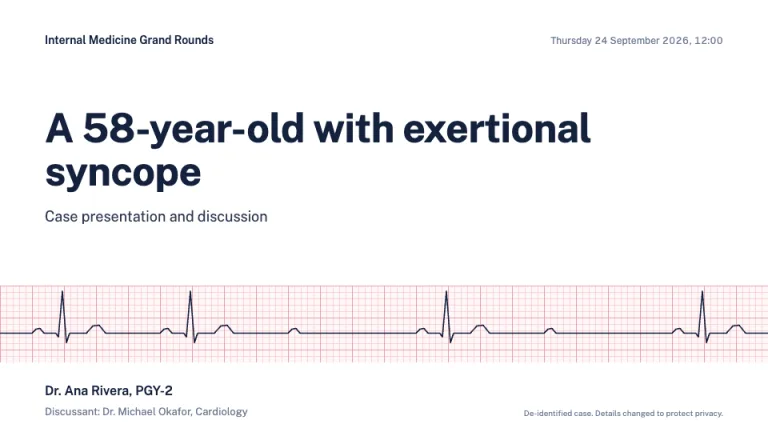
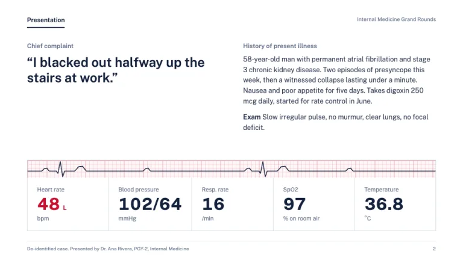
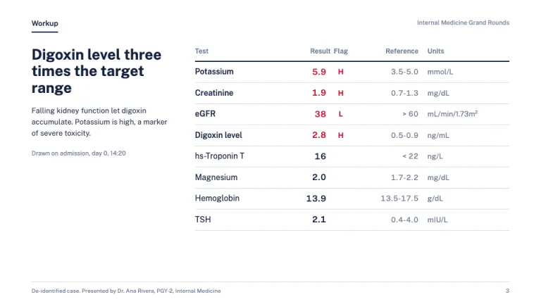
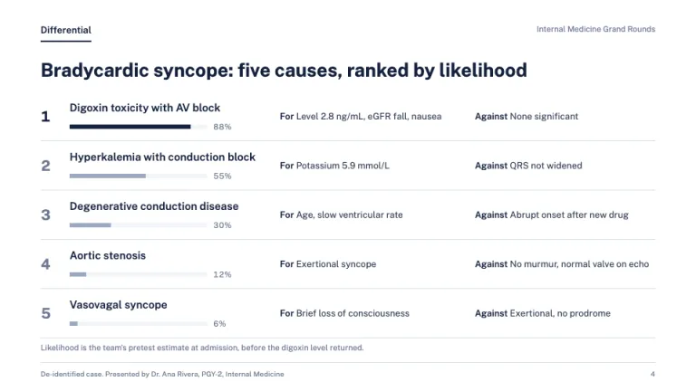
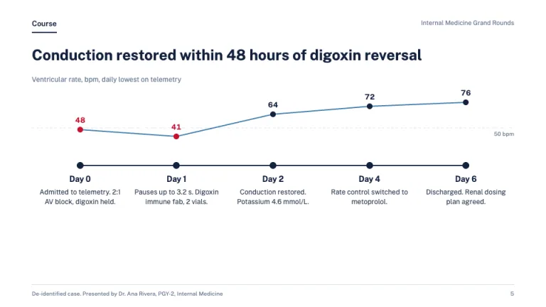
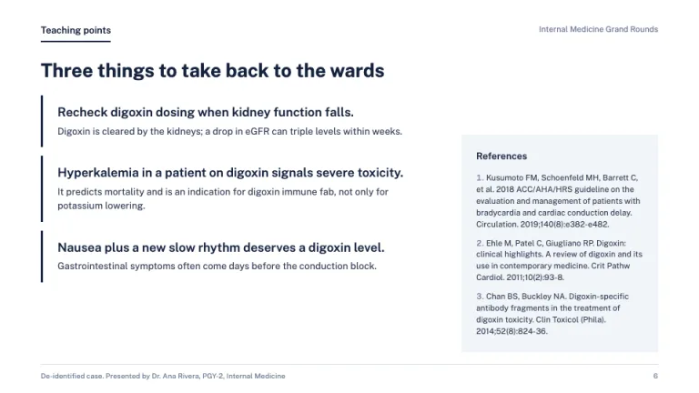

[← All prompts](../README.md) · [Live site](https://slidespeak.co/slide-design-prompts) · [SlideSpeak](https://slidespeak.co)

# Grand Rounds

> Red means abnormal, nothing else

A medical presentation template prompt for case presentations and grand rounds: ECG-paper strips, flagged lab tables, a ranked differential and a day-by-day hospital course, in navy with red reserved for abnormal findings. Built for residents, fellows and students presenting a case to a department.

**Category:** Education & research &nbsp;·&nbsp; **Style:** Calm, Corporate &nbsp;·&nbsp; **Mode:** Light &nbsp;·&nbsp; **Fonts:** Public Sans

<table>
    <tr>
      <td align="center" width="33%"><br><sub>Title</sub></td>
      <td align="center" width="33%"><br><sub>Presentation and vitals</sub></td>
      <td align="center" width="33%"><br><sub>Labs with flags</sub></td>
    </tr>
    <tr>
      <td align="center" width="33%"><br><sub>Ranked differential</sub></td>
      <td align="center" width="33%"><br><sub>Hospital course</sub></td>
      <td align="center" width="33%"><br><sub>Teaching points and references</sub></td>
    </tr>
</table>

## The prompt

Copy the prompt below into **ChatGPT**, **Claude**, or any AI chat — or grab the raw [`PROMPT.md`](./PROMPT.md). It asks what your presentation is about first, then applies the design to every slide.

```text
Create a presentation in the 'Grand Rounds' theme, a clinical case presentation in case-report order. Background: white (#ffffff) on every slide; panels in #f2f5f9; rules and table lines 1px #d5dde8. Typography: 'Public Sans' (Google Fonts) throughout, with tabular numerals (font-variant-numeric: tabular-nums) for every value. Headings bold 26 to 30px in navy #14213d, left-aligned, stating the finding, not the topic; body 13 to 15px in #2f3b52; labels, units and reference ranges 11 to 12px in #6b7890. Color rule: red #c8102e means abnormal, always. Flagged lab values, out-of-range vitals and bradycardic or tachycardic readings get red text plus an 'H' or 'L' flag; nothing else is ever red. The signature motif is an ECG-paper strip: a pale #fff7f8 band with a millimeter grid of 1px #f6d5da lines every 8px and bold 1px #eaa3ad lines every 40px, carrying a thin navy #14213d PQRST trace drawn as an SVG polyline. Use it full-bleed across the title slide and as a thin strip atop the vitals panel, never behind text. Every content slide opens with a section tab top-left naming the case step ('Presentation', 'Workup', 'Differential', 'Course', 'Teaching points') in 13px semibold navy with a 2px navy underline, sentence case, and the conference name in 11px #6b7890 top-right. Title slide: conference name and date, the case as a one-line vignette in bold 48 to 52px navy ('A 58-year-old with exertional syncope'), the ECG strip, then presenter, training level and discussant. Presentation slide: the chief complaint as a large quote in the patient's words, a short history of present illness, and a vitals panel of five values (HR, BP, RR, SpO2, temperature) in 34px bold numerals with units beneath, separated by 1px vertical rules, not cards. Labs slide: a table of test, result, flag, reference range and units with a 2px navy header rule and right-aligned results. Differential slide: a ranked list 1 to 5 with a thin likelihood bar per diagnosis (navy #14213d for the leading one, #9aa9bf for the rest) and 'For' and 'Against' findings on the same row. Course slide: a day-by-day timeline on a 2px navy axis with a #3f7cac trend line above and abnormal readings as red dots. Teaching points: three parallel lessons each with a 3px navy left rule, plus references in Vancouver style in a #f2f5f9 panel. Footer on every slide: 1px #d5dde8 rule, 'De-identified case' with presenter and service in 10px #6b7890 bottom-left, page number bottom-right. Strictly avoid: patient names, birth dates, record numbers or photos, stock photos of doctors, stethoscope or pill clipart, 3D anatomy, teal gradients, red for anything but abnormal findings, shadowed card grids, centered paragraphs, bullet walls and emoji.

Use this theme for my slides. Ask me what the presentation is about first, then apply the theme to every slide.
```

**[Open ChatGPT ↗](https://chatgpt.com/)** &nbsp;·&nbsp; **[Open Claude ↗](https://claude.ai/new)** &nbsp;·&nbsp; **[Generate a finished deck with SlideSpeak ↗](https://app.slidespeak.co/presentation?utm_source=github&utm_medium=referral&utm_campaign=slide-design-prompts)**

## Palette

| Role | Hex |
| --- | --- |
| Background | `#ffffff` |
| Surface / panel | `#f2f5f9` |
| Border | `#d5dde8` |
| Primary accent | `#c8102e` |
| Primary (soft tint) | `#fbe3e6` |
| Text on primary | `#ffffff` |
| Heading text | `#14213d` |
| Body text | `#2f3b52` |
| Muted text | `#6b7890` |

**Chart series:** `#14213d` `#c8102e` `#3f7cac` `#9aa9bf`

## Fonts

- **Public Sans** (heading, Google Fonts)

---

<sub>Part of [SlideSpeak Slide Design Prompts](../../README.md) · MIT licensed</sub>
