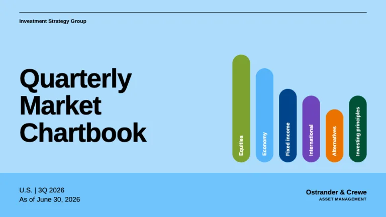
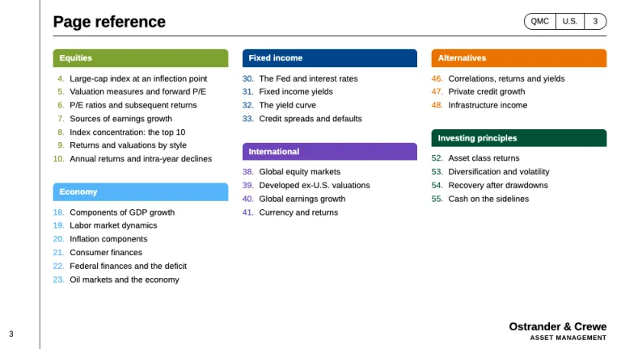
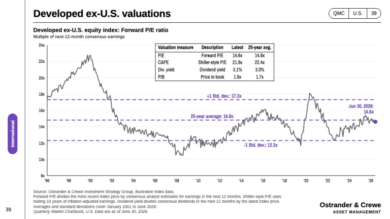
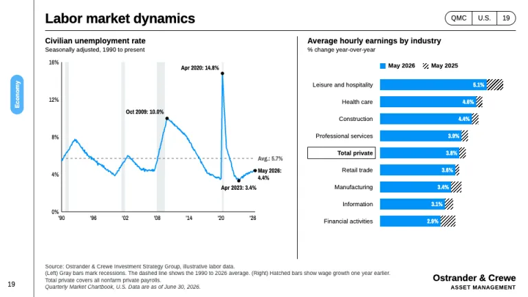
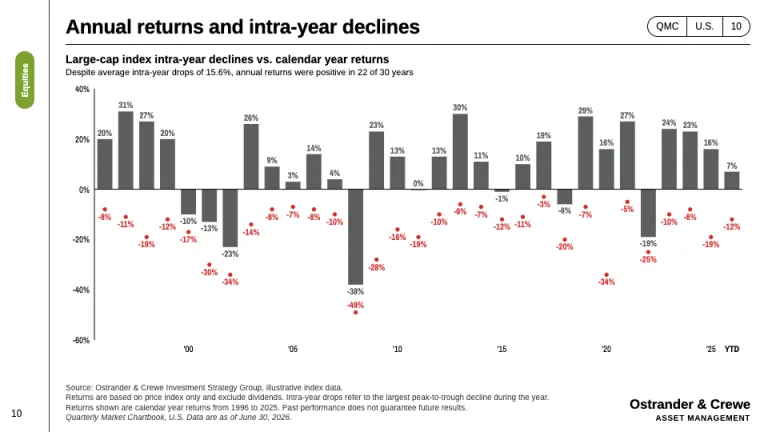
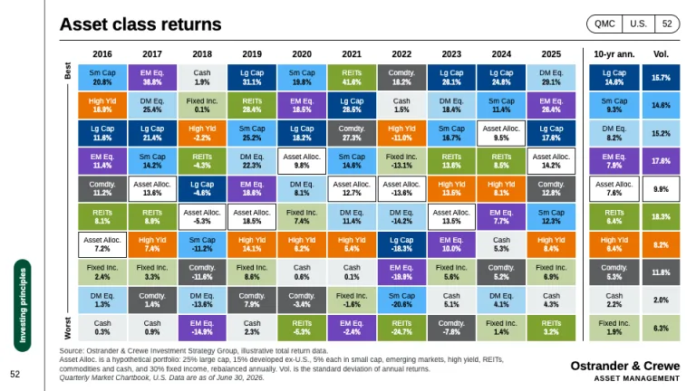

[← All prompts](../README.md) · [Live site](https://slidespeak.co/slide-design-prompts) · [SlideSpeak](https://slidespeak.co)

# Guide to the Markets

> One chart per page, footnotes included

A J.P. Morgan Guide to the Markets style prompt for quarterly chartbooks: annotated exhibits, a color-tabbed left rail, footnotes and an asset class quilt. An unofficial homage to the J.P. Morgan Asset Management Guide to the Markets format. Not affiliated with, endorsed by, or connected to JPMorgan Chase & Co.

**Category:** Finance &nbsp;·&nbsp; **Style:** Corporate, Minimal &nbsp;·&nbsp; **Mode:** Light &nbsp;·&nbsp; **Fonts:** Arimo + Archivo Narrow

<table>
    <tr>
      <td align="center" width="33%"><br><sub>Cover</sub></td>
      <td align="center" width="33%"><br><sub>Page reference</sub></td>
      <td align="center" width="33%"><br><sub>Valuation exhibit</sub></td>
    </tr>
    <tr>
      <td align="center" width="33%"><br><sub>Two-panel economy page</sub></td>
      <td align="center" width="33%"><br><sub>Returns and intra-year declines</sub></td>
      <td align="center" width="33%"><br><sub>Asset class quilt</sub></td>
    </tr>
</table>

## The prompt

Copy the prompt below into **ChatGPT**, **Claude**, or any AI chat — or grab the raw [`PROMPT.md`](./PROMPT.md). It asks what your presentation is about first, then applies the design to every slide.

```text
Create a presentation in the 'Guide to the Markets' theme, an unofficial homage to the quarterly market chartbook: one topic per page, dense annotated charts, heavy footnotes. Background: white (#ffffff) except on the cover. Typography: 'Arimo' (Google Fonts) for text, with page titles bold 24 to 26px in black (#000000) naming the topic in sentence case, exhibit titles bold 14px and unit lines 11px regular; 'Archivo Narrow' 400/700 for axis labels, data labels and table figures at 11 to 12px. The signature is the left rail: a 62px column behind a 1px #3e4143 vertical rule, holding the page number at the bottom and a vertical rounded section pill (24px wide, white 11px bold vertical text). The pill moves down the rail section by section like a book's thumb-index tabs: Equities #7da12e at the top, then Economy #54b5fa, Fixed income #00458a, International #6f44bb, Alternatives #eb7200 and Investing principles #005136 at the bottom. Header: the title left, a segmented rounded index pill right (code, region, page number) in 1px black, and a 1px black rule under both. One or two exhibits per page, split by a 1px black vertical rule. Charts: black axis lines, #e9edef gridlines or recession bands, y-axis labels on the left with units ('14x', '20%'), abbreviated years ('96, '00). Main series in gray #5c5e60 or blue #0393f9; the section color draws averages and standard-deviation lines as 2px dashed lines with bold labels; mark end points and extremes with a dot and a bold label such as 'Jun 30, 2026: 14.6x'. Summary tables float inside the plot area in a 1.5px black box. Drawdowns get red #d62b2b dots and labels. Hatched black diagonal bars show the prior period, and a Total row gets a black outline box. Cover: a pale sky #acdcfc field with a #70c4fd lower band holding region, quarter and 'As of' date, a 1px black rule at the top and a 64px bold black title. Page reference: section tabs in their colors over page-numbered lists. Asset class quilt: one column per year ranking asset classes best to worst, each class keeping one fill from the section colors plus #a4d5f3, #c1d3a2, #e9edef and #5c5e60, the allocation portfolio white with a black outline, plus annualized return and volatility columns. Footer on every content page: a dense 10px #3e4143 footnote block bottom-left ('Source:' line, definitions, then an italic 'Data are as of <date>.' line) and the publisher name in plain bold bottom-right. Strictly avoid: J.P. Morgan logos, wordmarks or the Market Insights chevron, using the 'Guide to the Markets' trademark as the deck's own title, claiming affiliation with JPMorgan Chase & Co., sentence-long action titles, big-number hero slides, gradients, drop shadows, 3D or pie charts, icons, stock photos, centered body text and any chart without a source line.

Use this theme for my slides. Ask me what the presentation is about first, then apply the theme to every slide.
```

**[Open ChatGPT ↗](https://chatgpt.com/)** &nbsp;·&nbsp; **[Open Claude ↗](https://claude.ai/new)** &nbsp;·&nbsp; **[Generate a finished deck with SlideSpeak ↗](https://app.slidespeak.co/presentation?utm_source=github&utm_medium=referral&utm_campaign=slide-design-prompts)**

## Palette

| Role | Hex |
| --- | --- |
| Background | `#ffffff` |
| Surface / panel | `#e9edef` |
| Border | `#9c9c9c` |
| Primary accent | `#0393f9` |
| Primary (soft tint) | `#acdcfc` |
| Text on primary | `#ffffff` |
| Heading text | `#000000` |
| Body text | `#3e4143` |
| Muted text | `#5c5e60` |

**Chart series:** `#5c5e60` `#0393f9` `#7da12e` `#d62b2b`

## Fonts

- **Arimo** (heading, Google Fonts)
- **Archivo Narrow** (supporting, Google Fonts)

---

<sub>Part of [SlideSpeak Slide Design Prompts](../../README.md) · MIT licensed</sub>
