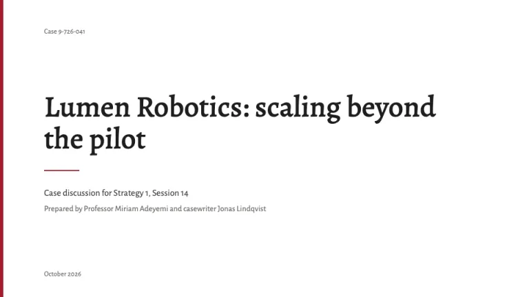
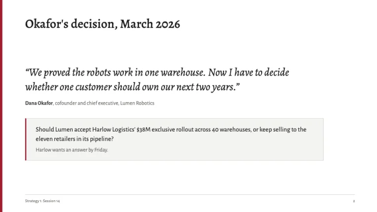
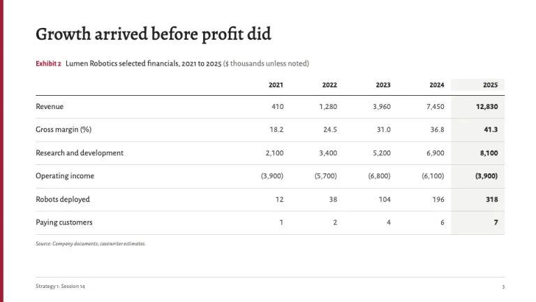
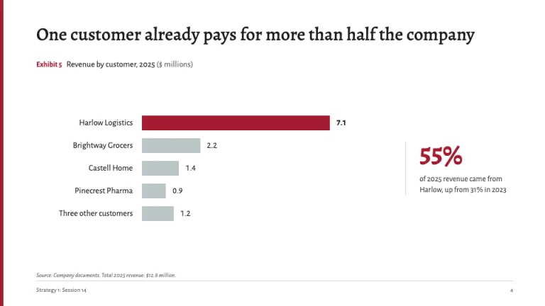
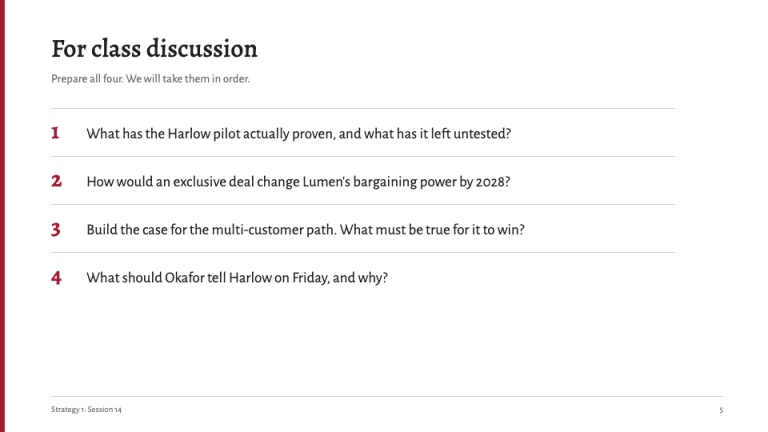
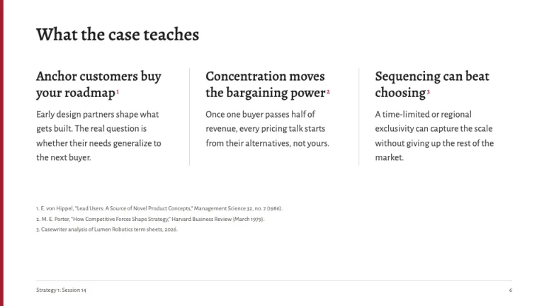

[← All prompts](../README.md) · [Live site](https://slidespeak.co/slide-design-prompts) · [SlideSpeak](https://slidespeak.co)

# Harvard Style

> The case method, one exhibit at a time

A Harvard case study presentation prompt built on the case method: a protagonist's dilemma, numbered exhibits with source notes, discussion questions and a single crimson bar on white. Use it for a class discussion, a case competition or an academic talk. An unofficial homage to the Harvard Business School case format. Not affiliated with, endorsed by, or connected to Harvard University or Harvard Business School.

**Category:** Education & research &nbsp;·&nbsp; **Style:** Elegant, Corporate &nbsp;·&nbsp; **Mode:** Light &nbsp;·&nbsp; **Fonts:** Alegreya + Alegreya Sans

<table>
    <tr>
      <td align="center" width="33%"><br><sub>Title</sub></td>
      <td align="center" width="33%"><br><sub>The dilemma</sub></td>
      <td align="center" width="33%"><br><sub>Exhibit table</sub></td>
    </tr>
    <tr>
      <td align="center" width="33%"><br><sub>Exhibit chart</sub></td>
      <td align="center" width="33%"><br><sub>Discussion questions</sub></td>
      <td align="center" width="33%"><br><sub>Takeaways</sub></td>
    </tr>
</table>

## The prompt

Copy the prompt below into **ChatGPT**, **Claude**, or any AI chat — or grab the raw [`PROMPT.md`](./PROMPT.md). It asks what your presentation is about first, then applies the design to every slide.

```text
Create a presentation in the 'Harvard Style' theme, an unofficial homage to the business school case method, where a deck is built like a written case: a protagonist, a decision, numbered exhibits and questions for class. Background: white (#ffffff) on every slide. Typography: 'Alegreya' (Google Fonts) for titles, pull quotes and large numerals, 500 to 700 weight, sentence case, 30 to 36px on content slides and 48 to 56px on the title slide; 'Alegreya Sans' for body text at 15 to 18px, table cells, chart labels and footers. Headings #1e1e1e, body #3d3d3d, muted notes #6f6a66. The signature: a 6px crimson (#a51c30) vertical bar runs the full height of the left edge on every slide, and it is the only crimson structure in the deck. Title slide: the case title as 'Company: the question it faces', a small case number such as 'Case 9-726-041' in #6f6a66, then the course, the authors and the date, all left-aligned under a 64px wide 2px crimson rule. Dilemma slide: the protagonist's words as a large Alegreya italic pull quote (26 to 30px) with name and role beneath in Alegreya Sans, then the decision question in a box with a 1px #d9d6d2 border and a 3px #a51c30 left border on #f3f3f1. Exhibits are formatted like case appendices: an 'Exhibit 3' label in Alegreya Sans 600 13px #a51c30 on the same line as the exhibit title in #1e1e1e, the unit in parentheses, and a source note beneath in 11px #6f6a66 italic, such as 'Source: Company documents; casewriter estimates.' Exhibits are numbered in order through the deck. Tables: header row in Alegreya Sans 600 over a 1.5px #1e1e1e rule, 1px #d9d6d2 row rules, right-aligned tabular numerals, losses in parentheses, the latest year column on #f3f3f1. Charts: horizontal or vertical bars with the series that matters in #a51c30 and context in #bac5c6, #8996a0 or #1e1e1e, value labels at bar ends, no gridlines or legends. Discussion questions: four numbered questions in the order the class will take them, numerals in Alegreya 700 crimson at 28px. Takeaway slide: three columns separated by 1px #d9d6d2 rules, each a short serif heading and two sentences, with superscript citation marks and footnotes in 11px #6f6a66. Footer on every content slide: a 1px #d9d6d2 rule, the course and session such as 'Strategy 1: Session 14' bottom-left and the page number bottom-right, both 11px #6f6a66. Strictly avoid: the Veritas shield or any university logo, claiming affiliation with Harvard University or Harvard Business School, crimson backgrounds or crimson washes on content slides, gradients, drop shadows, stock photos of campuses or people, decorative icons, centered body text, bullet walls, unnumbered or unsourced exhibits, rounded cards, more than one crimson highlight per chart.

Use this theme for my slides. Ask me what the presentation is about first, then apply the theme to every slide.
```

**[Open ChatGPT ↗](https://chatgpt.com/)** &nbsp;·&nbsp; **[Open Claude ↗](https://claude.ai/new)** &nbsp;·&nbsp; **[Generate a finished deck with SlideSpeak ↗](https://app.slidespeak.co/presentation?utm_source=github&utm_medium=referral&utm_campaign=slide-design-prompts)**

## Palette

| Role | Hex |
| --- | --- |
| Background | `#ffffff` |
| Surface / panel | `#f3f3f1` |
| Border | `#d9d6d2` |
| Primary accent | `#a51c30` |
| Primary (soft tint) | `#f4dde1` |
| Text on primary | `#ffffff` |
| Heading text | `#1e1e1e` |
| Body text | `#3d3d3d` |
| Muted text | `#6f6a66` |

**Chart series:** `#a51c30` `#1e1e1e` `#8996a0` `#bac5c6`

## Fonts

- **Alegreya** (heading, Google Fonts)
- **Alegreya Sans** (supporting, Google Fonts)

---

<sub>Part of [SlideSpeak Slide Design Prompts](../../README.md) · MIT licensed</sub>
