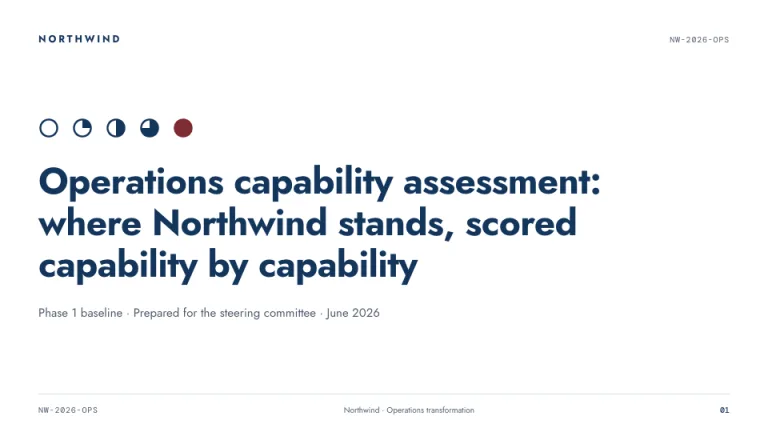
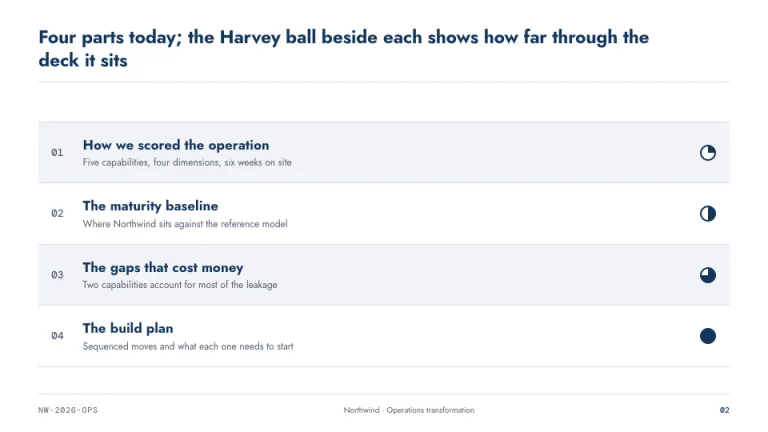
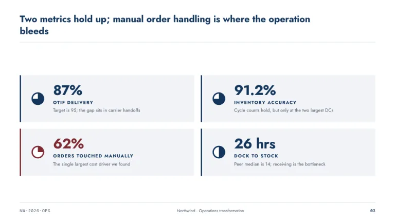
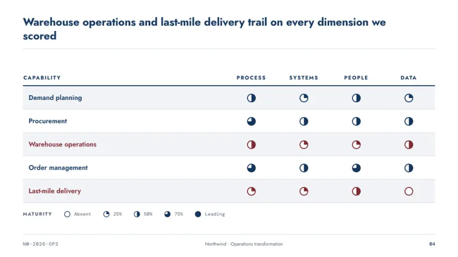
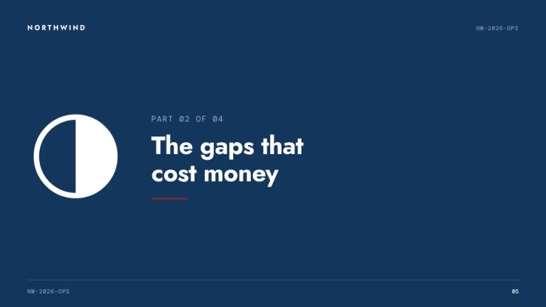
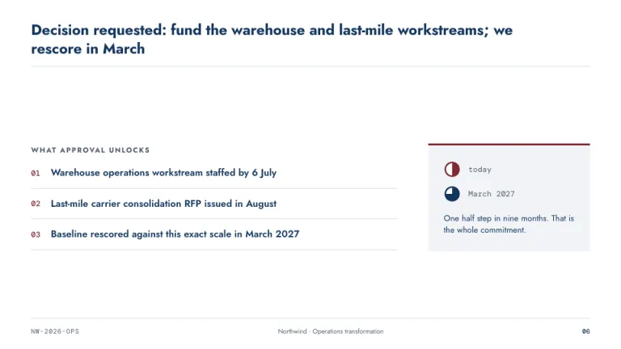

[← All prompts](../README.md) · [Live site](https://slidespeak.co/slide-design-prompts) · [SlideSpeak](https://slidespeak.co)

# Harvey

> Maturity in quarter turns

The classic consulting assessment deck, built on Harvey balls. Capabilities get scored in quarter steps, and every slide carries the engagement code in the footer.

**Category:** Business & strategy &nbsp;·&nbsp; **Style:** Corporate, Minimal &nbsp;·&nbsp; **Mode:** Light &nbsp;·&nbsp; **Fonts:** Jost + DM Mono

<table>
    <tr>
      <td align="center" width="33%"><br><sub>Title</sub></td>
      <td align="center" width="33%"><br><sub>Agenda</sub></td>
      <td align="center" width="33%"><br><sub>Key metrics</sub></td>
    </tr>
    <tr>
      <td align="center" width="33%"><br><sub>Chart & insight</sub></td>
      <td align="center" width="33%"><br><sub>Section divider</sub></td>
      <td align="center" width="33%"><br><sub>Closing</sub></td>
    </tr>
</table>

## The prompt

Copy the prompt below into **ChatGPT**, **Claude**, or any AI chat — or grab the raw [`PROMPT.md`](./PROMPT.md). It asks what your presentation is about first, then applies the design to every slide.

```text
Create a presentation in the 'Harvey' theme, a consulting maturity assessment deck built around Harvey balls. Background: pure white (#FFFFFF). Typography: the clean geometric sans 'Jost' for titles and body, with metadata in 'DM Mono' (both Google Fonts); action titles as full sentences, 23 to 25px bold in deep navy (#14365D); body in slate (#4D5B6E). Accent: consulting maroon (#7E2A33), reserved for the one weak spot or key figure per slide. Signature motif: Harvey balls, circles 14 to 34px with a 1.5px navy outline and pie wedge fills at exactly 0, 25, 50, 75 or 100 percent. Use them in assessment tables (capabilities as rows, dimensions as columns, one ball per cell), beside agenda items to show deck progress, and next to metrics. Tables use hairline rules in #D8DEE6 with alternating row fills in #F2F4F7. Every slide carries a footer with engagement code NW-2026-OPS left and a two digit page number right. Strictly avoid: gradients, drop shadows, photographs, icons other than Harvey balls, fill percentages that are not multiples of 25, more than one maroon element per slide.

Use this theme for my slides. Ask me what the presentation is about first, then apply the theme to every slide.
```

**[Open ChatGPT ↗](https://chatgpt.com/)** &nbsp;·&nbsp; **[Open Claude ↗](https://claude.ai/new)** &nbsp;·&nbsp; **[Generate a finished deck with SlideSpeak ↗](https://app.slidespeak.co/presentation?utm_source=github&utm_medium=referral&utm_campaign=slide-design-prompts)**

## Palette

| Role | Hex |
| --- | --- |
| Background | `#FFFFFF` |
| Surface / panel | `#F2F4F7` |
| Border | `#D8DEE6` |
| Primary accent | `#14365D` |
| Primary (soft tint) | `#E8EEF6` |
| Text on primary | `#FFFFFF` |
| Heading text | `#14365D` |
| Body text | `#4D5B6E` |
| Muted text | `#8A97A8` |

**Chart series:** `#14365D` `#7E2A33` `#4D5B6E` `#D8DEE6`

## Fonts

- **Jost** (heading, Google Fonts)
- **DM Mono** (supporting, Google Fonts)

---

<sub>Part of [SlideSpeak Slide Design Prompts](../../README.md) · MIT licensed</sub>
