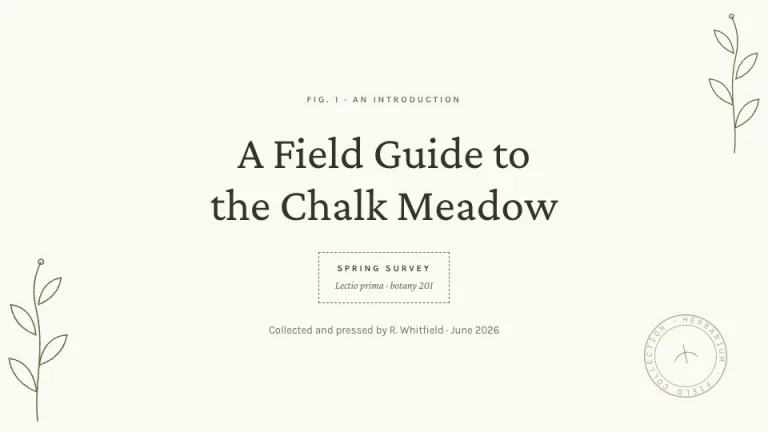
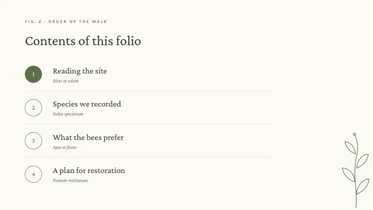
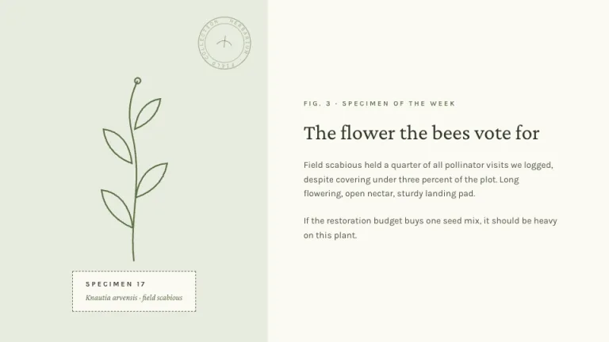
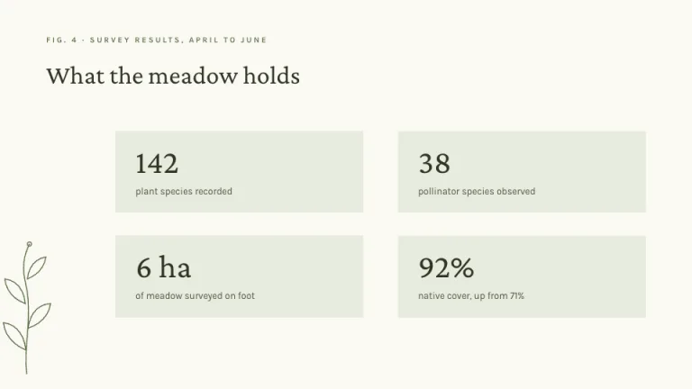
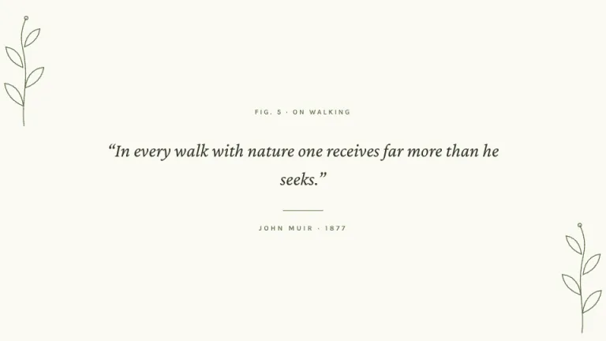
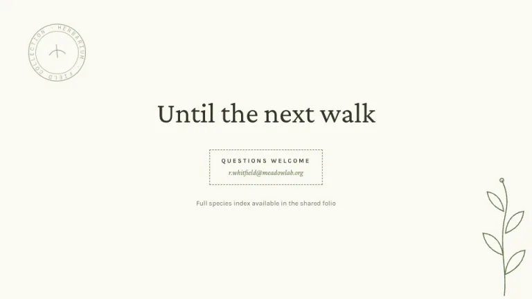

[← All prompts](../README.md) · [Live site](https://slidespeak.co/slide-design-prompts) · [SlideSpeak](https://slidespeak.co)

# Herbarium

> Pressed, labeled, filed

A botanical field guide on warm paper. Thin-line sprigs grow out of the corners and every heading gets a numbered figure caption.

**Category:** Education & research &nbsp;·&nbsp; **Style:** Calm, Elegant &nbsp;·&nbsp; **Mode:** Light &nbsp;·&nbsp; **Fonts:** Crimson Pro + Karla

<table>
    <tr>
      <td align="center" width="33%"><br><sub>Title</sub></td>
      <td align="center" width="33%"><br><sub>Agenda</sub></td>
      <td align="center" width="33%"><br><sub>Image + text</sub></td>
    </tr>
    <tr>
      <td align="center" width="33%"><br><sub>Key metrics</sub></td>
      <td align="center" width="33%"><br><sub>Quote</sub></td>
      <td align="center" width="33%"><br><sub>Closing</sub></td>
    </tr>
</table>

## The prompt

Copy the prompt below into **ChatGPT**, **Claude**, or any AI chat — or grab the raw [`PROMPT.md`](./PROMPT.md). It asks what your presentation is about first, then applies the design to every slide.

```text
Design slides as a botanical field guide, the 'Herbarium' theme. Background: warm paper white #FBF9F2. Typography: serif headings in 'Crimson Pro' and body in 'Karla' (both Google Fonts); headings in deep ink green #2F3526; body in #4C5240; above every heading a figure caption in small uppercase letters with wide tracking in leaf green #5A7048, formatted like 'Fig. 1 · Signups by month'. Signature motifs: thin-line botanical sprigs, curved stems with small leaf outlines at 1.5px stroke in #5A7048, bleeding off corners and standing beside content; specimen tags, small boxes with a 1px dashed #5A7048 border holding an uppercase label over an italic 'Crimson Pro' latin-style subtitle; one round faded stamp outline, two concentric circles with curved lettering at about 50 percent opacity, slightly rotated in a corner. Panels and stat cards fill with soft sage #E7EBDD, square corners, no borders. List markers are circles, outlined in green or filled #5A7048 for the active item. Strictly avoid: photographs, drop shadows, gradients, bright saturated colors, filled flower illustrations, rounded corners on cards.

Use this theme for my slides. Ask me what the presentation is about first, then apply the theme to every slide.
```

**[Open ChatGPT ↗](https://chatgpt.com/)** &nbsp;·&nbsp; **[Open Claude ↗](https://claude.ai/new)** &nbsp;·&nbsp; **[Generate a finished deck with SlideSpeak ↗](https://app.slidespeak.co/presentation?utm_source=github&utm_medium=referral&utm_campaign=slide-design-prompts)**

## Palette

| Role | Hex |
| --- | --- |
| Background | `#FBF9F2` |
| Surface / panel | `#FFFFFF` |
| Border | `#C9D2B8` |
| Primary accent | `#5A7048` |
| Primary (soft tint) | `#E7EBDD` |
| Text on primary | `#FFFFFF` |
| Heading text | `#2F3526` |
| Body text | `#4C5240` |
| Muted text | `#8A8F7C` |

**Chart series:** `#5A7048` `#2F3526` `#A8B58F` `#E7EBDD`

## Fonts

- **Crimson Pro** (heading, Google Fonts)
- **Karla** (supporting, Google Fonts)

---

<sub>Part of [SlideSpeak Slide Design Prompts](../../README.md) · MIT licensed</sub>
