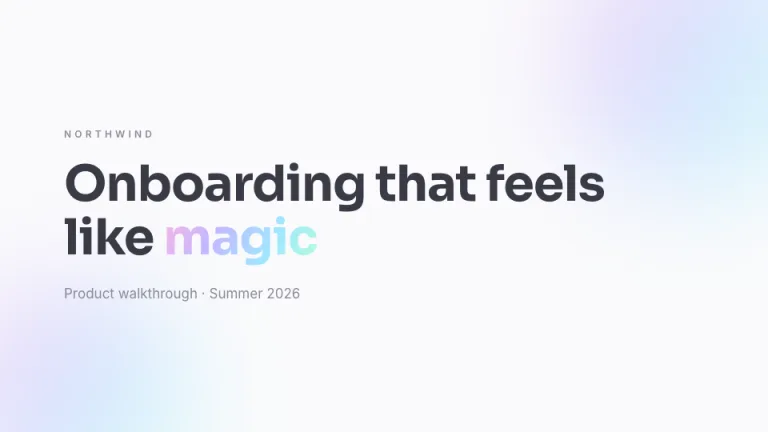
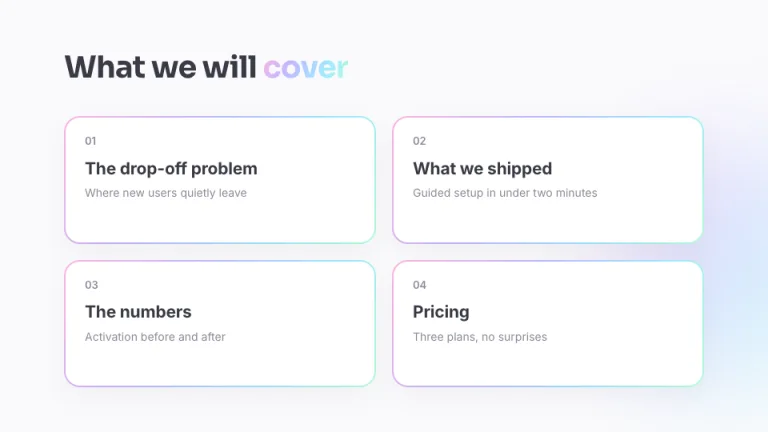
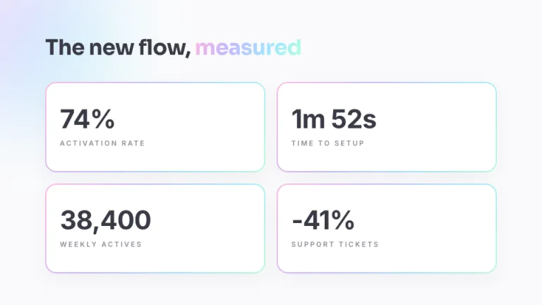
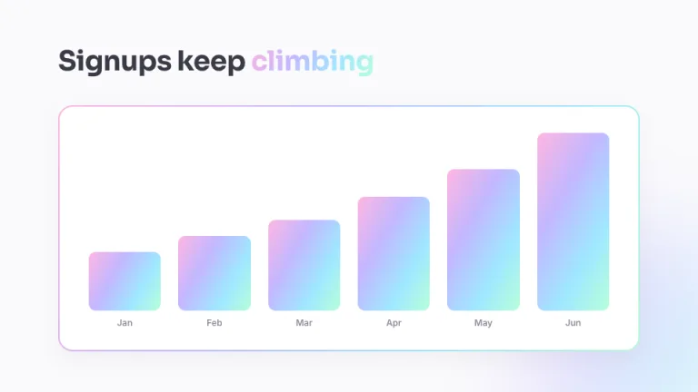
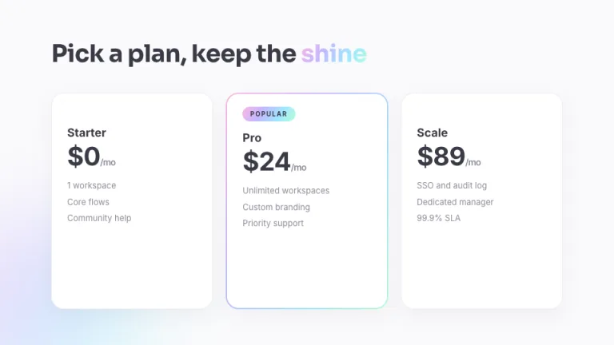

[← All prompts](../README.md) · [Live site](https://slidespeak.co/slide-design-prompts) · [SlideSpeak](https://slidespeak.co)

# Holo

> Iridescent, but disciplined

A soft white deck with one holographic gradient doing all the work. It blurs behind content, clips into one key word and traces a 2px border around cards.

**Category:** Pitch decks &nbsp;·&nbsp; **Style:** Playful, Calm &nbsp;·&nbsp; **Mode:** Light &nbsp;·&nbsp; **Fonts:** Sora + Inter

<table>
    <tr>
      <td align="center" width="33%"><br><sub>Title</sub></td>
      <td align="center" width="33%"><br><sub>Agenda</sub></td>
      <td align="center" width="33%"><br><sub>Key metrics</sub></td>
    </tr>
    <tr>
      <td align="center" width="33%"><br><sub>Chart & insight</sub></td>
      <td align="center" width="33%"><br><sub>Pricing</sub></td>
      <td align="center" width="33%"><br><sub>Closing</sub></td>
    </tr>
</table>

## The prompt

Copy the prompt below into **ChatGPT**, **Claude**, or any AI chat — or grab the raw [`PROMPT.md`](./PROMPT.md). It asks what your presentation is about first, then applies the design to every slide.

```text
Create a presentation in the 'Holo' theme: an iridescent gen-z product pitch. Background: near-white #FAFAFC. Text: slate #3A3A46 for headings and values, muted #8A8A98 for labels and notes. The signature is one holographic gradient, linear at 120deg through pink #FFB6E1, lilac #C3B7FF, sky #9FE8FF and mint #B8FFD9, used exactly three ways: large soft blobs blurred about 60px at 45 percent opacity floating behind content near slide corners; gradient text-clip on exactly one key word per headline; and 2px gradient borders on cards, built as a gradient wrapper with 2px padding around a white inner card. Cards are otherwise white with very soft shadows around 6 percent opacity. Every corner is rounded 20px, inner cards 18px, buttons fully rounded. Headlines 38 to 62px bold in 'Sora', body and labels in 'Inter' (both Google Fonts); labels 11 to 12px uppercase, letter-spaced. Chart bars are filled with the same gradient. Strictly avoid: dark backgrounds; sharp corners; more than one gradient word per slide; neon saturation; hard borders in flat colors; heavy drop shadows.

Use this theme for my slides. Ask me what the presentation is about first, then apply the theme to every slide.
```

**[Open ChatGPT ↗](https://chatgpt.com/)** &nbsp;·&nbsp; **[Open Claude ↗](https://claude.ai/new)** &nbsp;·&nbsp; **[Generate a finished deck with SlideSpeak ↗](https://app.slidespeak.co/presentation?utm_source=github&utm_medium=referral&utm_campaign=slide-design-prompts)**

## Palette

| Role | Hex |
| --- | --- |
| Background | `#FAFAFC` |
| Surface / panel | `#FFFFFF` |
| Border | `#ECECF2` |
| Primary accent | `#C3B7FF` |
| Primary (soft tint) | `#F1EEFF` |
| Text on primary | `#3A3A46` |
| Heading text | `#3A3A46` |
| Body text | `#5C5C6A` |
| Muted text | `#8A8A98` |

**Chart series:** `#FFB6E1` `#C3B7FF` `#9FE8FF` `#B8FFD9`

## Fonts

- **Sora** (heading, Google Fonts)
- **Inter** (supporting, Google Fonts)

---

<sub>Part of [SlideSpeak Slide Design Prompts](../../README.md) · MIT licensed</sub>
