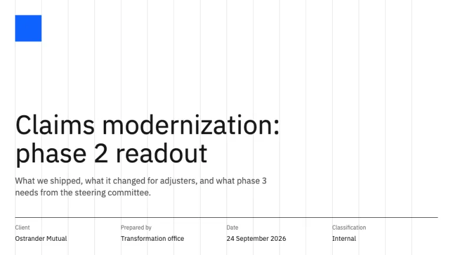
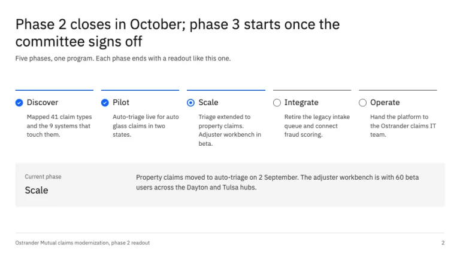
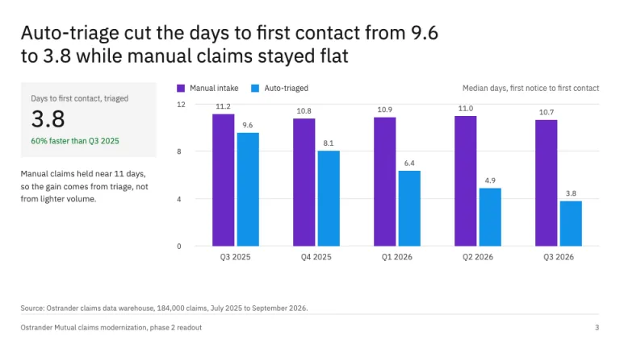
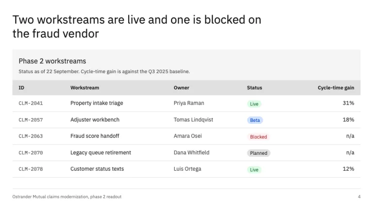
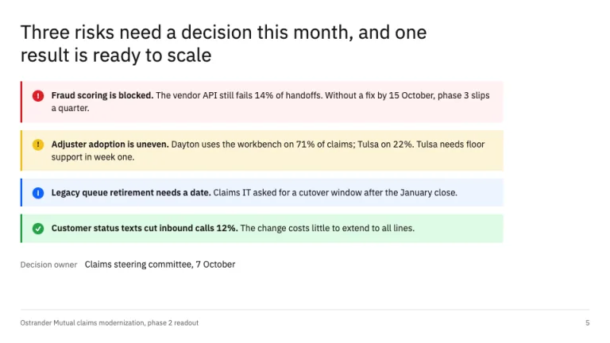
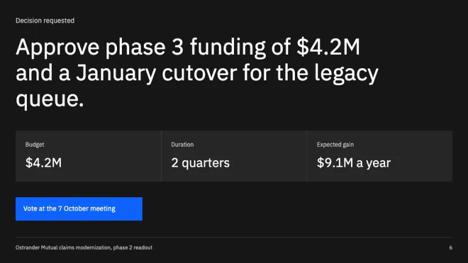

[← All prompts](../README.md) · [Live site](https://slidespeak.co/slide-design-prompts) · [SlideSpeak](https://slidespeak.co)

# IBM Style

> The Carbon design system, set as slides

An IBM presentation template prompt built on the public Carbon design system: IBM Plex Sans on the 2x grid, Blue 60 as the one accent, Carbon data tables, status tags, progress indicators and inline notifications. An unofficial homage to IBM's Carbon design language. Not affiliated with, endorsed by, or connected to International Business Machines Corporation.

**Category:** Tech & product &nbsp;·&nbsp; **Style:** Corporate, Tech &nbsp;·&nbsp; **Mode:** Light &nbsp;·&nbsp; **Fonts:** IBM Plex Sans + IBM Plex Mono

<table>
    <tr>
      <td align="center" width="33%"><br><sub>Title on the 2x grid</sub></td>
      <td align="center" width="33%"><br><sub>Progress indicator</sub></td>
      <td align="center" width="33%"><br><sub>Carbon chart</sub></td>
    </tr>
    <tr>
      <td align="center" width="33%"><br><sub>Data table with status tags</sub></td>
      <td align="center" width="33%"><br><sub>Risks as inline notifications</sub></td>
      <td align="center" width="33%"><br><sub>Decision on Gray 100</sub></td>
    </tr>
</table>

## The prompt

Copy the prompt below into **ChatGPT**, **Claude**, or any AI chat — or grab the raw [`PROMPT.md`](./PROMPT.md). It asks what your presentation is about first, then applies the design to every slide.

```text
Create a presentation in the 'IBM Style' theme, an unofficial homage to the public IBM Carbon design system. Background: white (#ffffff) on content slides; one closing or section slide may switch to the Gray 100 theme (#161616 background, #262626 tiles, #393939 dividers, white and #c6c6c6 text). Typography: 'IBM Plex Sans' (Google Fonts) for everything, weight 400 for headlines (54px on the cover, 28 to 32px on content slides), 400 to 600 for body at 13 to 18px; 'IBM Plex Mono' only for IDs, code and token names, never for labels or headings. Text colors: #161616 primary, #393939 body, #525252 secondary, #6f6f6f helper. Layout: the IBM 2x grid, 16 columns with a 32px margin; every block starts on a column line, text is left-aligned, and every corner is square except tags. On the cover, draw the 16 column lines in #e0e0e0 behind the content and put a small solid Blue 60 (#0f62fe) block top-left; below the title, a 4-column row of label/value pairs (Client, Prepared by, Date, Classification) under a 1px #161616 rule. Headlines are full-sentence takeaways. Blue 60 #0f62fe is the only interactive/accent color, with Blue 10 #edf5ff for info fills. Components to reuse: tiles (#f4f4f4 fill, no border, no shadow); a Carbon progress indicator for any real sequence (2px top bar, blue check for complete, blue ring for current, gray ring for upcoming); Carbon data tables (gray title bar with title and description, #e0e0e0 header row with 600 weight, 1px #e0e0e0 row rules, 44 to 48px rows, numbers right-aligned); pill tags for status (green #defbe6/#0e6027, blue #d0e2ff/#0043ce, red #fff1f1/#a2191f, gray #e0e0e0/#161616); inline notifications for risks (3px left border and round icon: error #da1e28 on #fff1f1, warning #f1c21b on #fcf4d6, info #0f62fe on #edf5ff, success #24a148 on #defbe6). Charts follow the Carbon categorical order: Purple 70 #6929c4, Cyan 50 #1192e8, Teal 70 #005d5d, Magenta 70 #9f1853; square legend swatches above the plot, #e0e0e0 horizontal gridlines, 12px #525252 axis labels, value labels on bars, a source line in 11px #6f6f6f. Footer: a 1px #e0e0e0 rule, the deck name bottom-left and the page number bottom-right in 11px #6f6f6f. Strictly avoid: the IBM logo or eight-bar mark, claiming affiliation with IBM, rounded cards, drop shadows, gradients, stock photos, emoji, icons in every block, centered body text, more than four chart series, bold headlines at 700, monospace headings, and decoration that is not a Carbon component.

Use this theme for my slides. Ask me what the presentation is about first, then apply the theme to every slide.
```

**[Open ChatGPT ↗](https://chatgpt.com/)** &nbsp;·&nbsp; **[Open Claude ↗](https://claude.ai/new)** &nbsp;·&nbsp; **[Generate a finished deck with SlideSpeak ↗](https://app.slidespeak.co/presentation?utm_source=github&utm_medium=referral&utm_campaign=slide-design-prompts)**

## Palette

| Role | Hex |
| --- | --- |
| Background | `#ffffff` |
| Surface / panel | `#f4f4f4` |
| Border | `#e0e0e0` |
| Primary accent | `#0f62fe` |
| Primary (soft tint) | `#edf5ff` |
| Text on primary | `#ffffff` |
| Heading text | `#161616` |
| Body text | `#393939` |
| Muted text | `#6f6f6f` |

**Chart series:** `#6929c4` `#1192e8` `#005d5d` `#9f1853`

## Fonts

- **IBM Plex Sans** (heading, Google Fonts)
- **IBM Plex Mono** (supporting, Google Fonts)

---

<sub>Part of [SlideSpeak Slide Design Prompts](../../README.md) · MIT licensed</sub>
