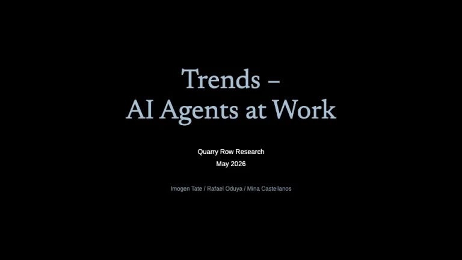
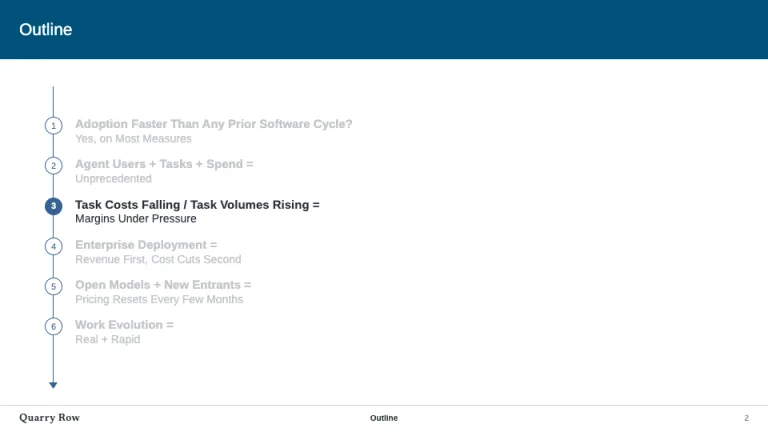
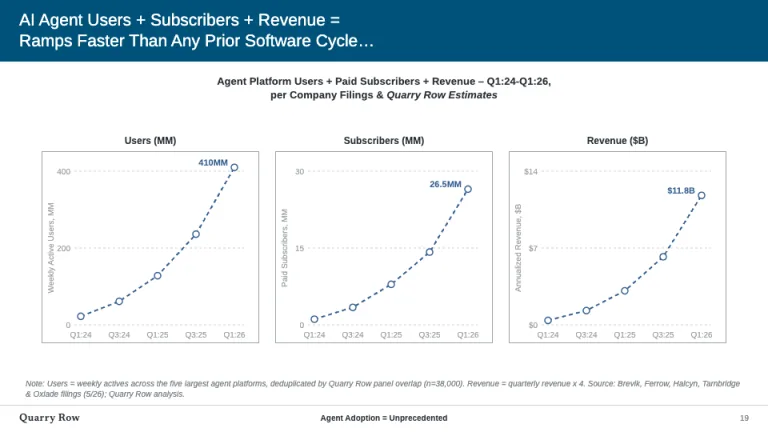
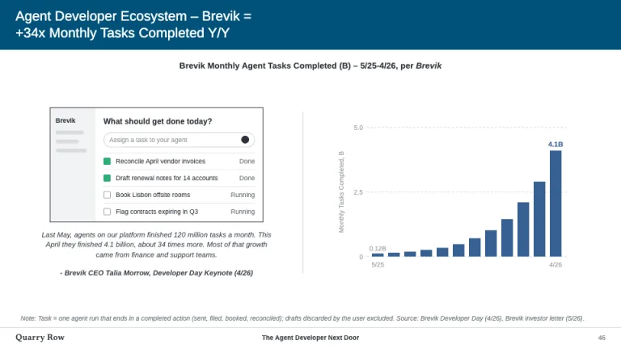
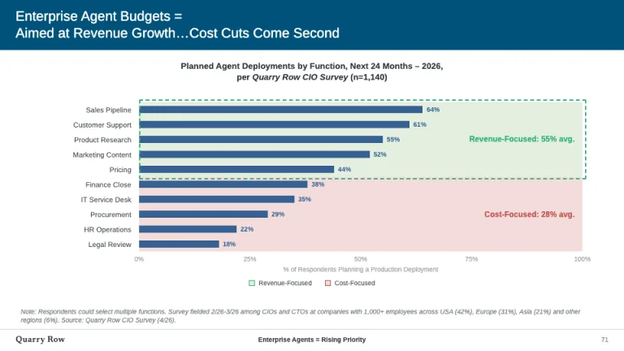
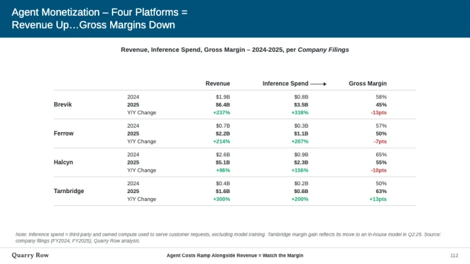

[← All prompts](../README.md) · [Live site](https://slidespeak.co/slide-design-prompts) · [SlideSpeak](https://slidespeak.co)

# Internet Trends

> Subject = takeaway titles over sourced charts

A Mary Meeker Internet Trends style prompt for dense data reports: 'Subject = Takeaway' titles in blue bands, small multiples and sourced charts. An unofficial homage to the Internet Trends and BOND report format. Not affiliated with, endorsed by, or connected to Mary Meeker or BOND.

**Category:** Business & strategy &nbsp;·&nbsp; **Style:** Minimal, Tech &nbsp;·&nbsp; **Mode:** Light &nbsp;·&nbsp; **Fonts:** Arimo + Newsreader

<table>
    <tr>
      <td align="center" width="33%"><br><sub>Cover</sub></td>
      <td align="center" width="33%"><br><sub>Outline</sub></td>
      <td align="center" width="33%"><br><sub>Small multiples</sub></td>
    </tr>
    <tr>
      <td align="center" width="33%"><br><sub>Screenshot + chart</sub></td>
      <td align="center" width="33%"><br><sub>Survey bars</sub></td>
      <td align="center" width="33%"><br><sub>Platform table</sub></td>
    </tr>
</table>

## The prompt

Copy the prompt below into **ChatGPT**, **Claude**, or any AI chat — or grab the raw [`PROMPT.md`](./PROMPT.md). It asks what your presentation is about first, then applies the design to every slide.

```text
Create a presentation in the 'Internet Trends' theme, an unofficial homage to the dense trend report format of Mary Meeker's Internet Trends and BOND reports. Background: white (#ffffff) on content slides. Typography: 'Arimo' (Google Fonts) for all titles, charts, tables and notes; 'Newsreader' 400 only for the cover title and footer name. The signature header: every content slide opens with a full-width petrol blue (#005179) band, about 74px tall, holding a white Arimo 400 title at 20 to 22px, left-aligned, in two lines: line one names the subject and ends with ' =', line two states the finding, with '+', '/', '@' and ellipses joining clauses (e.g. 'AI Agent Users + Revenue = / Ramps Faster Than Any Prior Cycle...'). Under the band, a centered bold 13px chart title in #2b3238 names metric, date range and source: 'Monthly Tasks (B) - 5/25-4/26, per Company', source in italic. Density is the point: one to three exhibits per slide, small multiples in thin #a1a4a7 bordered boxes. Primary series blue #376092; growth series green #2fae76; declines and cost callouts red #c0504d; context series pale steel #a8c0d3. Line charts use dashed 2px lines with hollow circle markers; flat bars labeled only at first and last values; gridlines 1px dashed #cfd1d2; axis text 10px #a1a4a7 with rotated y-axis titles. Cover: solid black (#000000), the report name centered in Newsreader 52 to 60px pale steel blue (#a8c0d3) as 'Trends - Topic', then publisher, date and an author slash-list in small white Arimo. Outline: six numbered circles on a thin #376092 spine with an arrowhead; current section filled blue in #2b3238 text, others ghosted to #c3c7ca. Section dividers: full-bleed #005179 with the section title in white uppercase Arimo using the same ' =' grammar. Screenshot slides: a product screen drawn as flat UI blocks in a 1px #2b3238 border, a centered italic quote with a bold italic '- Name, Title (date)' attribution below, a 1px #cfd1d2 divider, the chart on the right. Survey bars: horizontal #376092 bars across tinted row bands, pale green #e3f0e0 and pale red #f3dddc, with a dashed callout box and bold group averages. Tables: grouped sub-rows per company (prior year, current year bold, Y/Y change colored #2fae76 or #c0504d by sign). Every data slide ends with a 10px italic #7b8388 'Note: ... Source: ...' block, then a footer over a 1px #cfd1d2 rule: presenter name in Newsreader left, a bold 10px ' =' breadcrumb centered, page number right. Strictly avoid: topic-only titles without the '=' takeaway, drop shadows, gradients, rounded cards, icons or clipart, 3D charts, legends where direct labels fit, data without a source line, dark content slides, any logos or wordmarks of Mary Meeker, BOND or Kleiner Perkins, and claiming affiliation with Mary Meeker or BOND.

Use this theme for my slides. Ask me what the presentation is about first, then apply the theme to every slide.
```

**[Open ChatGPT ↗](https://chatgpt.com/)** &nbsp;·&nbsp; **[Open Claude ↗](https://claude.ai/new)** &nbsp;·&nbsp; **[Generate a finished deck with SlideSpeak ↗](https://app.slidespeak.co/presentation?utm_source=github&utm_medium=referral&utm_campaign=slide-design-prompts)**

## Palette

| Role | Hex |
| --- | --- |
| Background | `#ffffff` |
| Surface / panel | `#f1f3f4` |
| Border | `#cfd1d2` |
| Primary accent | `#005179` |
| Primary (soft tint) | `#dae5f1` |
| Text on primary | `#ffffff` |
| Heading text | `#2b3238` |
| Body text | `#3e464e` |
| Muted text | `#7b8388` |

**Chart series:** `#376092` `#2fae76` `#c0504d` `#a8c0d3`

## Fonts

- **Arimo** (heading, Google Fonts)
- **Newsreader** (supporting, Google Fonts)

---

<sub>Part of [SlideSpeak Slide Design Prompts](../../README.md) · MIT licensed</sub>
