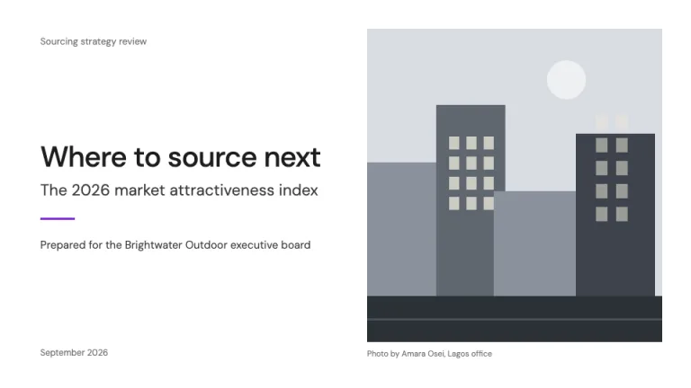
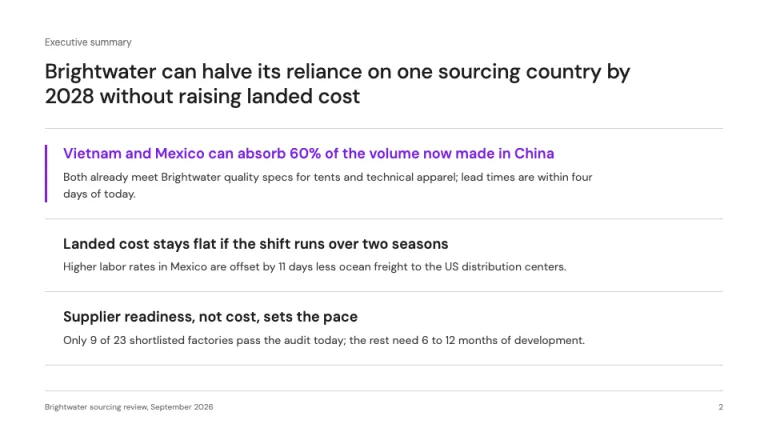
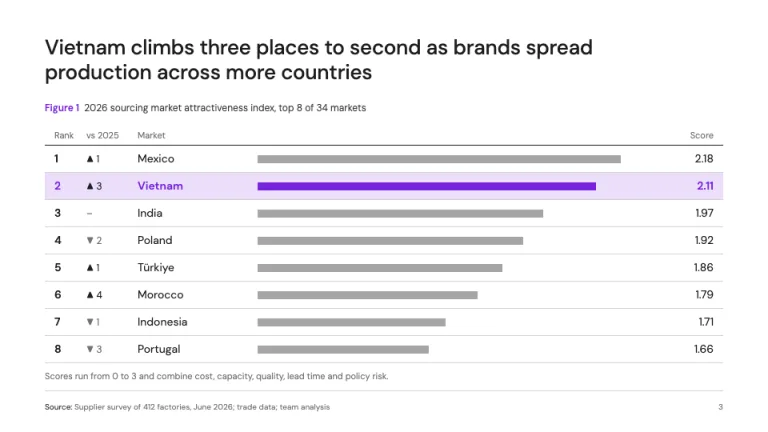
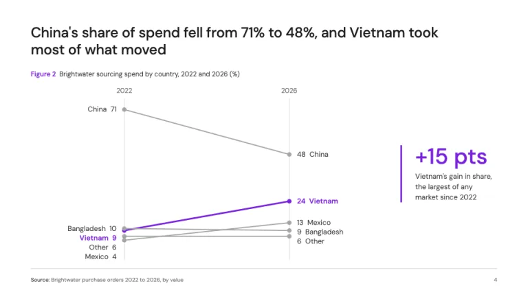
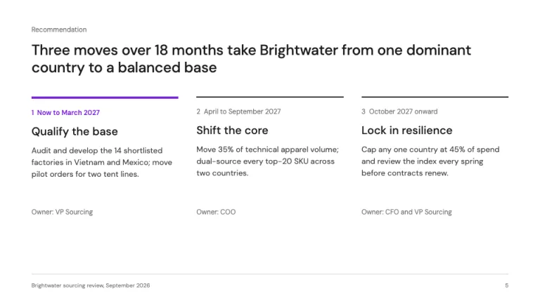
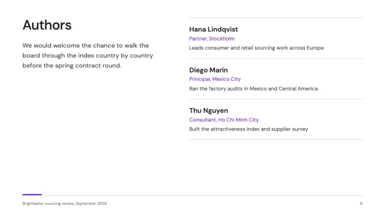

[← All prompts](../README.md) · [Live site](https://slidespeak.co/slide-design-prompts) · [SlideSpeak](https://slidespeak.co)

# Kearney Style

> White, slate and one purple row

A Kearney style presentation template prompt for consulting decks: full-sentence titles in slate, one purple highlight per slide, a ranked index exhibit with year-over-year movement, a team-photo cover and an authors page to close. An unofficial homage to the Kearney presentation style. Not affiliated with, endorsed by, or connected to A.T. Kearney, Inc.

**Category:** Consulting &nbsp;·&nbsp; **Style:** Corporate, Minimal &nbsp;·&nbsp; **Mode:** Light &nbsp;·&nbsp; **Fonts:** DM Sans

<table>
    <tr>
      <td align="center" width="33%"><br><sub>Title with photo credit</sub></td>
      <td align="center" width="33%"><br><sub>Executive summary</sub></td>
      <td align="center" width="33%"><br><sub>Ranked index</sub></td>
    </tr>
    <tr>
      <td align="center" width="33%"><br><sub>Slope chart</sub></td>
      <td align="center" width="33%"><br><sub>Roadmap</sub></td>
      <td align="center" width="33%"><br><sub>Authors</sub></td>
    </tr>
</table>

## The prompt

Copy the prompt below into **ChatGPT**, **Claude**, or any AI chat — or grab the raw [`PROMPT.md`](./PROMPT.md). It asks what your presentation is about first, then applies the design to every slide.

```text
Create a presentation in the 'Kearney Style' theme, an unofficial homage to the understated consulting deck built on white, slate and one purple accent. Background: white (#ffffff) on every slide. Typography: 'DM Sans' (Google Fonts) throughout. Titles are full-sentence takeaways in weight 500, 26 to 30px, slate (#1e1e1e) and left-aligned, two lines maximum; body 14 to 16px in #3c3c3c at line-height 1.5; small labels, sources and page numbers 10 to 12px in #737373, sentence case, never all caps. Color discipline: slate and white carry the page; purple #7823dc marks only what matters most, one element per slide (a finding, a bar, a row, a rule). Its tint #ebdefa only fills the highlighted table row. Chart series: the series that proves the title in #7823dc, everything else in #a5a5a5 or #d2d2d2, with #1e1e1e for axes and totals. Title slide: a 40px title and a 22px subtitle on the left half, a 48px by 3px purple rule, a 'Prepared for' line and date in gray; the right half holds one photograph taken by the presenting team (never stock) with an 11px gray credit beneath, such as 'Photo by Amara Osei, Lagos office', or a marked placeholder. Executive summary: three findings as rows split by 1px #d2d2d2 rules, each a semibold 18px lead sentence plus one 14px supporting line; the most important finding gets a 3px purple bar on its left and a purple lead. Signature exhibit, the ranked index: a table with columns Rank, change versus last year (a small up or down triangle and the number of places moved, or a dash), Market, a horizontal score bar in #a5a5a5, and Score with two decimals. The subject row is filled #ebdefa with purple rank, name, bar and score. Every exhibit carries a label line above it, 'Figure 1' in purple semibold 12px followed by the exhibit title and unit in #3c3c3c, and a 'Source:' line in the footer. Prefer slope charts and simple bars with direct labels. Roadmaps: three to four phases in columns, each opened by a 2px slate top rule (4px purple for the current phase), a small numbered time label, a 20px phase name, a description and an owner line at the bottom. Closing slide: an 'Authors' page with a short invitation on the left and, on the right, three rows of name (semibold), role and city (purple 13px) and one line each. Footer on every slide: a 1px #d2d2d2 rule, the source or deck name bottom-left at 10px, page number bottom-right. Strictly avoid: black or dark full-bleed covers, the greater-than chevron motif, stock photography, gradients, drop shadows, rounded cards, more than one purple element per slide, purple body text, bold 800 or 900 headlines, oversized stat callouts, all-caps labels, topic titles such as 'Market overview', legends where direct labels fit, 3D charts, pie charts, decorative icons, the Kearney wordmark or logo, and claiming affiliation with Kearney.

Use this theme for my slides. Ask me what the presentation is about first, then apply the theme to every slide.
```

**[Open ChatGPT ↗](https://chatgpt.com/)** &nbsp;·&nbsp; **[Open Claude ↗](https://claude.ai/new)** &nbsp;·&nbsp; **[Generate a finished deck with SlideSpeak ↗](https://app.slidespeak.co/presentation?utm_source=github&utm_medium=referral&utm_campaign=slide-design-prompts)**

## Palette

| Role | Hex |
| --- | --- |
| Background | `#ffffff` |
| Surface / panel | `#f2f2f2` |
| Border | `#d2d2d2` |
| Primary accent | `#7823dc` |
| Primary (soft tint) | `#ebdefa` |
| Text on primary | `#ffffff` |
| Heading text | `#1e1e1e` |
| Body text | `#3c3c3c` |
| Muted text | `#737373` |

**Chart series:** `#7823dc` `#1e1e1e` `#a5a5a5` `#d2d2d2`

## Fonts

- **DM Sans** (heading, Google Fonts)

---

<sub>Part of [SlideSpeak Slide Design Prompts](../../README.md) · MIT licensed</sub>
