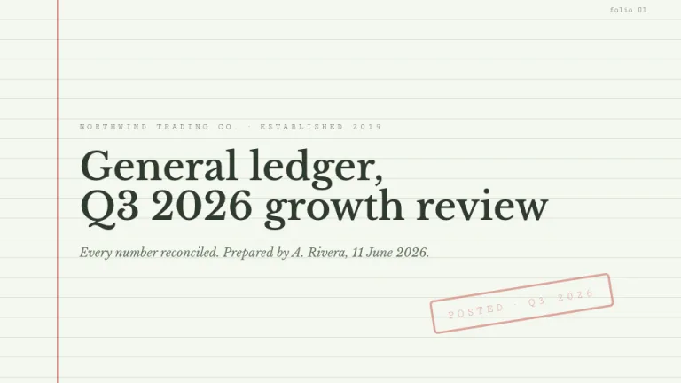
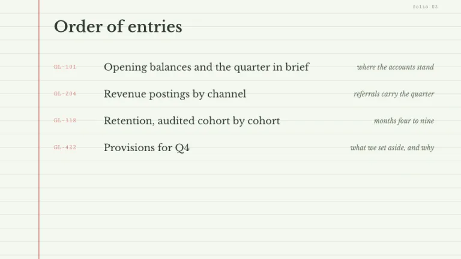
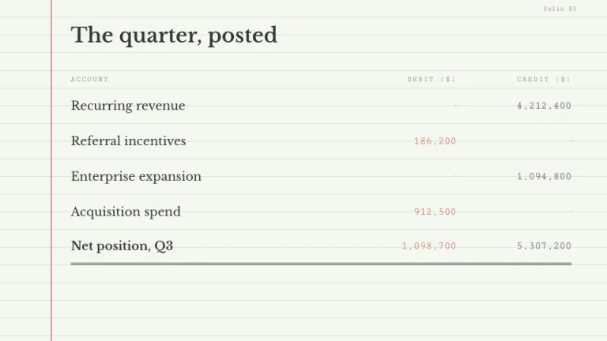
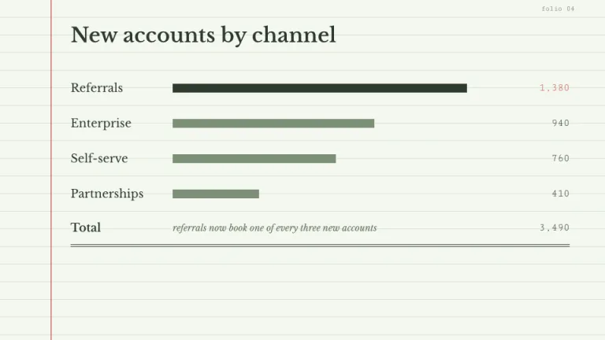
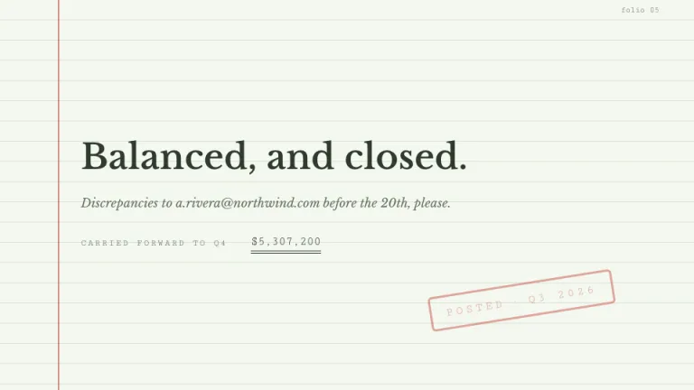

[← All prompts](../README.md) · [Live site](https://slidespeak.co/slide-design-prompts) · [SlideSpeak](https://slidespeak.co)

# Ledger

> Every number reconciled

Slides set on ruled ledger paper with a single red margin line. Totals get double underlines, just like the auditor wants.

**Category:** Finance & consulting &nbsp;·&nbsp; **Style:** Elegant, Calm &nbsp;·&nbsp; **Mode:** Light &nbsp;·&nbsp; **Fonts:** Libre Baskerville + Cutive Mono

<table>
    <tr>
      <td align="center" width="33%"><br><sub>Title</sub></td>
      <td align="center" width="33%"><br><sub>Agenda</sub></td>
      <td align="center" width="33%"><br><sub>Key metrics</sub></td>
    </tr>
    <tr>
      <td align="center" width="33%"><br><sub>Chart & insight</sub></td>
      <td align="center" width="33%"><br><sub>Closing</sub></td>
    </tr>
</table>

## The prompt

Copy the prompt below into **ChatGPT**, **Claude**, or any AI chat — or grab the raw [`PROMPT.md`](./PROMPT.md). It asks what your presentation is about first, then applies the design to every slide.

```text
Create a presentation in the 'Ledger' theme, styled as an accountant's ledger paper. Background: pale green (#F4F7F0) ruled with horizontal lines every 28px in #D9E4D2 (a repeating linear-gradient), plus exactly one vertical red margin line (#C75146, 2px, about 65% opacity) running the full slide height 80px from the left edge; all content starts to its right. Typography: serif headings in 'Libre Baskerville' and every number in the monospace 'Cutive Mono' (both Google Fonts); headings in deep green #2E3A2E with line heights snapped to the 28px ruling; supporting notes in italic 'Libre Baskerville' #5F6E5C; numbers right-aligned in columns. Tables read as ledger entries: mono reference codes in red, separate debit and credit columns, totals finished with a double underline (4px double border, #2E3A2E). One rotated outline stamp per deck reading 'POSTED · Q3 2026', 3px #C75146 border, rotated about -9 degrees, 50% opacity. Chart bars are flat rectangles in #2E3A2E and #7C8F77. Strictly avoid: gradients on content, shadows, sans-serif headings, centered numbers, decorative icons, any bright color beyond the single red.

Use this theme for my slides. Ask me what the presentation is about first, then apply the theme to every slide.
```

**[Open ChatGPT ↗](https://chatgpt.com/)** &nbsp;·&nbsp; **[Open Claude ↗](https://claude.ai/new)** &nbsp;·&nbsp; **[Generate a finished deck with SlideSpeak ↗](https://app.slidespeak.co/presentation?utm_source=github&utm_medium=referral&utm_campaign=slide-design-prompts)**

## Palette

| Role | Hex |
| --- | --- |
| Background | `#F4F7F0` |
| Surface / panel | `#FBFCF9` |
| Border | `#D9E4D2` |
| Primary accent | `#C75146` |
| Primary (soft tint) | `#F3DDD9` |
| Text on primary | `#FFFFFF` |
| Heading text | `#2E3A2E` |
| Body text | `#5F6E5C` |
| Muted text | `#8C9888` |

**Chart series:** `#2E3A2E` `#C75146` `#7C8F77` `#D9E4D2`

## Fonts

- **Libre Baskerville** (heading, Google Fonts)
- **Cutive Mono** (supporting, Google Fonts)

---

<sub>Part of [SlideSpeak Slide Design Prompts](../../README.md) · MIT licensed</sub>
