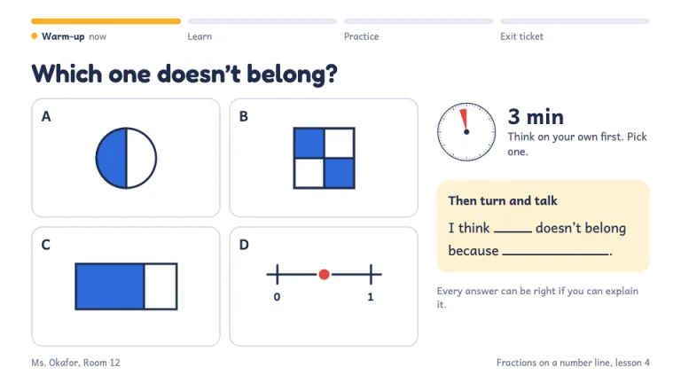
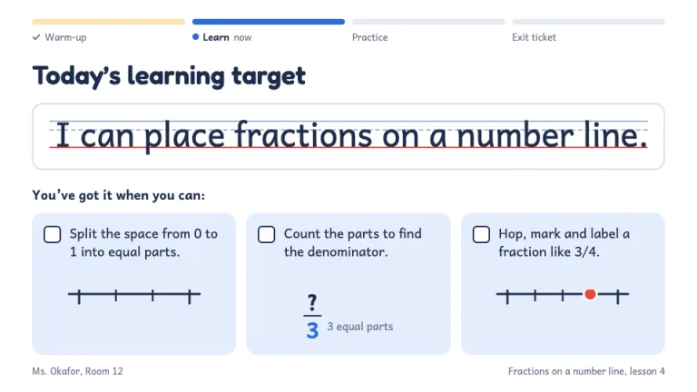
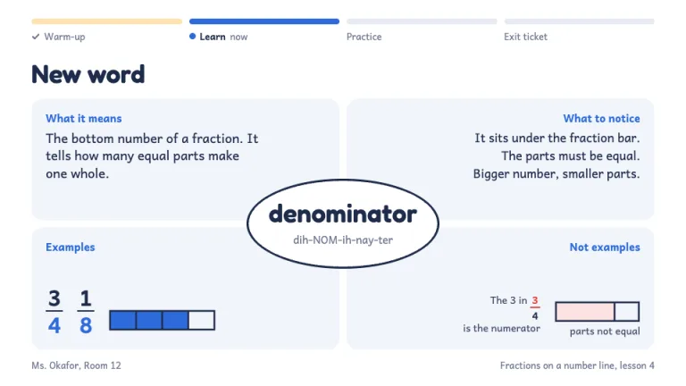
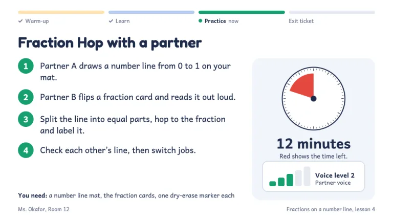
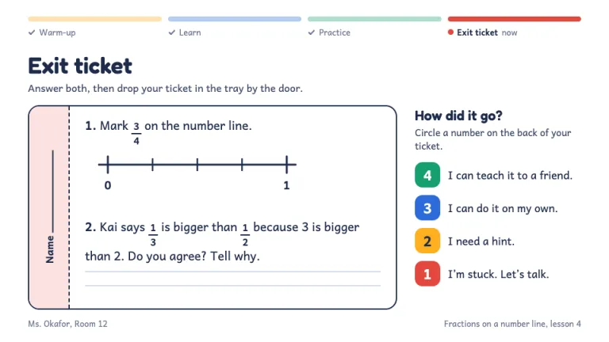

[← All prompts](../README.md) · [Live site](https://slidespeak.co/slide-design-prompts) · [SlideSpeak](https://slidespeak.co)

# Lesson Plan

> Warm-up, target, timer, exit ticket

Lesson plan slides for grades K to 5: an 'I can' target on handwriting lines, a Frayer vocabulary card, a countdown timer and a tear-off exit ticket. You get a classroom presentation for kids with a progress track in four phase colors, from warm-up to exit ticket.

**Category:** Education & research &nbsp;·&nbsp; **Style:** Playful, Warm &nbsp;·&nbsp; **Mode:** Light &nbsp;·&nbsp; **Fonts:** Fredoka + Andika

<table>
    <tr>
      <td align="center" width="33%"><br><sub>Title and today’s plan</sub></td>
      <td align="center" width="33%"><br><sub>Warm-up</sub></td>
      <td align="center" width="33%"><br><sub>Learning target</sub></td>
    </tr>
    <tr>
      <td align="center" width="33%"><br><sub>Vocabulary card</sub></td>
      <td align="center" width="33%"><br><sub>Activity with timer</sub></td>
      <td align="center" width="33%"><br><sub>Exit ticket</sub></td>
    </tr>
</table>

## The prompt

Copy the prompt below into **ChatGPT**, **Claude**, or any AI chat — or grab the raw [`PROMPT.md`](./PROMPT.md). It asks what your presentation is about first, then applies the design to every slide.

```text
Create a presentation in the 'Lesson Plan' theme, a daily lesson deck an elementary teacher projects for the class. Background: white (#ffffff); soft panels in pale blue #f1f5fb; hairline borders #d6deea. Ink navy #1e2b4a for titles and key text, #3b4763 body, #6e7891 muted. Typography: 'Fredoka' (Google Fonts) 600 for titles, 64px on the title slide and 36px on content slides; 'Andika' (Google Fonts) 400/700 for everything else, 17 to 20px, for its early-reader single-story a and g. Nothing under 13px. Four phase colors run the whole deck and mean the same thing everywhere: Warm-up marigold #ffb020 (soft #fff1d2), Learn blue #2e6bd9 (soft #e4edfc), Practice green #16a06f (soft #ddf4ea), Exit ticket red #e4483f (soft #fce3e1). Text on marigold is navy; text on the other three is white. Signature: every content slide opens with a lesson progress track across the top, four 8px rounded bars labeled Warm-up, Learn, Practice, Exit ticket. Finished phases show their color at 35 percent with a small check, the current phase is full color with a bold label and the word 'now', later phases are gray #e6ebf2. Title slide: grade, subject and date in one line, the lesson title large in Fredoka, then a drawn number line or similar subject sketch; a pale blue right panel holds 'Today's plan', a visual schedule of four cards with 2px navy borders, each with a phase-colored tab showing the minutes. Warm-up: a 'Which one doesn't belong?' grid of four lettered figures, a small visual timer and a turn-and-talk sentence stem with blanks on a marigold soft panel. Learning target: the 'I can...' statement written large in Andika on primary handwriting lines (solid top line and dashed midline in #9db4de, red baseline #e4483f), then three success criteria as empty tick boxes on blue soft panels, each with a tiny sketch. Vocabulary: a Frayer model, the word in a white oval with a 3px navy border and a pronunciation line, surrounded by four pale blue quadrants: what it means, what to notice, examples, not examples. Activity: numbered steps in green circles only when the steps happen in order; a visual countdown timer (white 60-minute face, navy ticks, red #e4483f wedge for the minutes left) with the minutes in bold, and a five-bar voice level meter. Exit ticket: a ticket with a 2.5px navy border and a dashed tear-off name stub, two short questions with answer lines, plus a 4-to-1 self-check scale in the phase colors. Footer: teacher and room bottom-left, lesson name bottom-right, 13px #6e7891. Strictly avoid: clipart, cartoon mascots, emoji, rainbow backgrounds, Comic Sans, chalkboard or lined-notebook textures, drop shadows, gradients, all-caps labels, dense paragraphs, more than one idea per slide, text under 13px, decorative numbering on lists that are not steps.

Use this theme for my slides. Ask me what the presentation is about first, then apply the theme to every slide.
```

**[Open ChatGPT ↗](https://chatgpt.com/)** &nbsp;·&nbsp; **[Open Claude ↗](https://claude.ai/new)** &nbsp;·&nbsp; **[Generate a finished deck with SlideSpeak ↗](https://app.slidespeak.co/presentation?utm_source=github&utm_medium=referral&utm_campaign=slide-design-prompts)**

## Palette

| Role | Hex |
| --- | --- |
| Background | `#ffffff` |
| Surface / panel | `#f1f5fb` |
| Border | `#d6deea` |
| Primary accent | `#2e6bd9` |
| Primary (soft tint) | `#e4edfc` |
| Text on primary | `#ffffff` |
| Heading text | `#1e2b4a` |
| Body text | `#3b4763` |
| Muted text | `#6e7891` |

**Chart series:** `#2e6bd9` `#16a06f` `#ffb020` `#e4483f`

## Fonts

- **Fredoka** (heading, Google Fonts)
- **Andika** (supporting, Google Fonts)

---

<sub>Part of [SlideSpeak Slide Design Prompts](../../README.md) · MIT licensed</sub>
