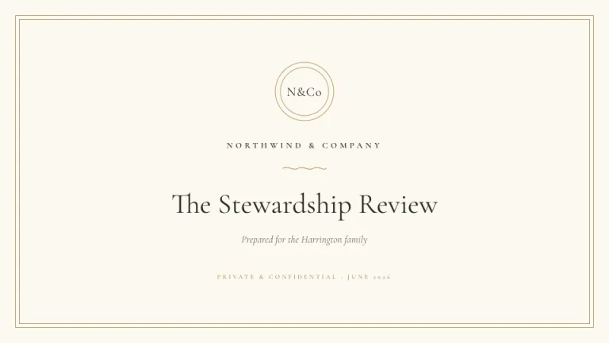
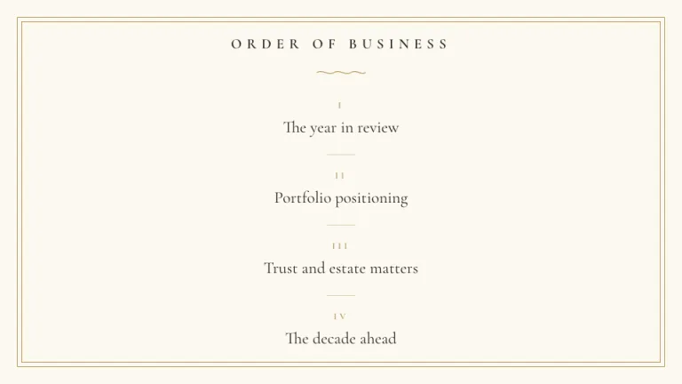
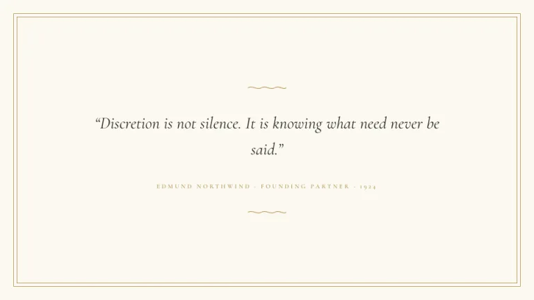
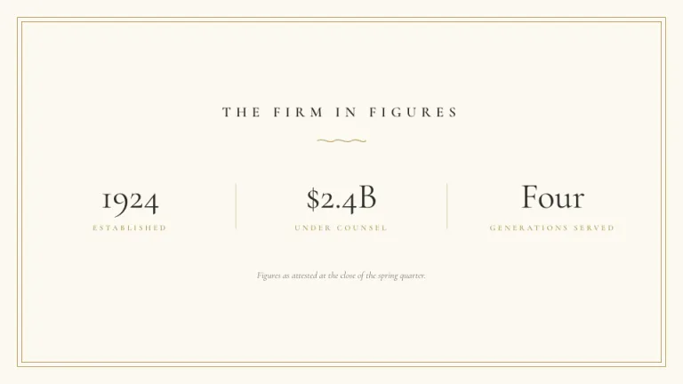
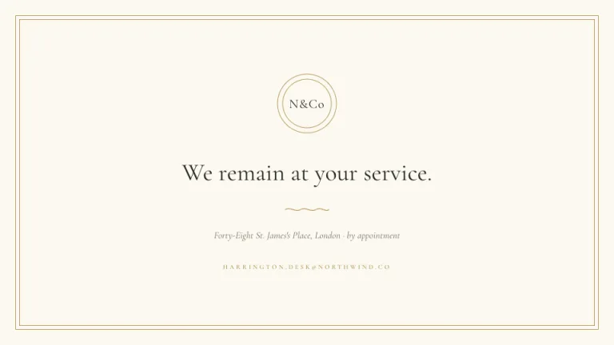

[← All prompts](../README.md) · [Live site](https://slidespeak.co/slide-design-prompts) · [SlideSpeak](https://slidespeak.co)

# Letterhead

> Engraved, not printed

Ivory stationery with a double gold hairline border and a monogram seal. Everything is centered, serif and quiet.

**Category:** Finance & consulting &nbsp;·&nbsp; **Style:** Elegant, Minimal &nbsp;·&nbsp; **Mode:** Light &nbsp;·&nbsp; **Fonts:** Cormorant Garamond

<table>
    <tr>
      <td align="center" width="33%"><br><sub>Title</sub></td>
      <td align="center" width="33%"><br><sub>Agenda</sub></td>
      <td align="center" width="33%"><br><sub>Quote</sub></td>
    </tr>
    <tr>
      <td align="center" width="33%"><br><sub>Key metrics</sub></td>
      <td align="center" width="33%"><br><sub>Closing</sub></td>
    </tr>
</table>

## The prompt

Copy the prompt below into **ChatGPT**, **Claude**, or any AI chat — or grab the raw [`PROMPT.md`](./PROMPT.md). It asks what your presentation is about first, then applies the design to every slide.

```text
Create a presentation in the 'Letterhead' theme, engraved stationery from a private firm. Background: ivory #FCF9F1 on every slide. Typography: 'Cormorant Garamond' (a Google Font) serif throughout; headers as uppercase serif with wide letterspacing of 0.35em in charcoal #2B2B28; numbers in restrained regular-weight serif; accents and attributions in gold #B49A5B. Every layout is centered and symmetric. Signature motifs: (1) a double hairline border on every slide, one 1px gold #B49A5B line inset 24px and a second 1px line inset 30px; (2) a circular monogram seal, two thin concentric gold circles about 96px wide with the serif initials 'N&Co' inside, placed top center on the title and closing slides; (3) small tilde-style flourish dividers, a thin gold wave about 70px wide, between header and content; (4) faint hairline separators in #D9CDB0. Strictly avoid: sans-serif type, bright colors, left-aligned layouts, drop shadows, photographs or icons, rules thicker than 1px.

Use this theme for my slides. Ask me what the presentation is about first, then apply the theme to every slide.
```

**[Open ChatGPT ↗](https://chatgpt.com/)** &nbsp;·&nbsp; **[Open Claude ↗](https://claude.ai/new)** &nbsp;·&nbsp; **[Generate a finished deck with SlideSpeak ↗](https://app.slidespeak.co/presentation?utm_source=github&utm_medium=referral&utm_campaign=slide-design-prompts)**

## Palette

| Role | Hex |
| --- | --- |
| Background | `#FCF9F1` |
| Surface / panel | `#FFFFFF` |
| Border | `#E3DAC2` |
| Primary accent | `#B49A5B` |
| Primary (soft tint) | `#F2EAD6` |
| Text on primary | `#FFFFFF` |
| Heading text | `#2B2B28` |
| Body text | `#55524A` |
| Muted text | `#8E897A` |

**Chart series:** `#2B2B28` `#B49A5B` `#8E897A` `#E3DAC2`

## Fonts

- **Cormorant Garamond** (heading and body, Google Fonts)

---

<sub>Part of [SlideSpeak Slide Design Prompts](../../README.md) · MIT licensed</sub>
